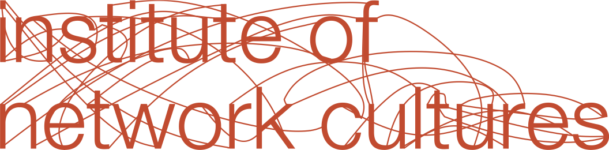

---
Pr-id: MoneyLab
P-id: INC Reader
A-id: 10
Type: article
Book-type: anthology
Anthology item: article
Item-id: unique no.
Article-title: title of the article
Article-status: accepted
Author: name(s) of author(s)
Author-email:   corresponding address
Author-bio:  about the author
Abstract:   short description of the article (100 words)
Keywords:   50 keywords for search and indexing
Rights: CC BY-NC 4.0
...

# Colophon

Heaven's Delight: On The Pleasures of Audiovisual Practices    
Edited by: Will Day  
Author: Andreas Treske  
Cover Design: Katja van Stiphout  
Production: Anielek Niemyjski   Published by the Institute of Network Cultures, Amsterdam, 2025  
ISBN 9789083520933  
  
Contact  Institute of Network Cultures Amsterdam University of Applied Sciences (HvA)   Email: [info@networkcultures.org](mailto:info@networkcultures.org)  
Web: [www.networkcultures.org](http://www.networkcultures.org/)  
Order a copy or download this publication for free at: [www.networkcultures.org/publications](http://www.networkcultures.org/publications)  
This publication is licensed under the Creative Commons Attribution NonCommerical ShareAlike 4.0 Unported (CC BY-NC-SA 4.0).  
To view a copy of this license, visit [www.creativecommons.org/licences/by-nc-sa/4.0./](http://www.creativecommons.org/licences/by-nc-sa/4.0./)

 

Dem Staub, dem beweglichen, eingezeichnet. 
Benjamin & Goethe
