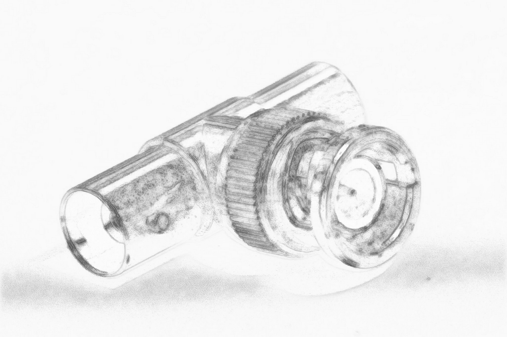

---
Pr-id: MoneyLab
P-id: INC Reader
A-id: 10
Type: article
Book-type: anthology
Anthology item: article
Item-id: unique no.
Article-title: title of the article
Article-status: accepted
Author: name(s) of author(s)
Author-email:   corresponding address
Author-bio:  about the author
Abstract:   short description of the article (100 words)
Keywords:   50 keywords for search and indexing
Rights: CC BY-NC 4.0
...

# LOG:: IN

Provide a username and a password

What am I currently working on? An approximation of where I arrived
after working with video for more than two-thirds of my life?

I thought of a personal opening.

My aim or urge is to discuss the aesthetics and practice of video today.
But I see myself only preparing a sketch, an approximation: scattering
seeds in combining notes and logs. What is the urge?

Video is not simply video. There is Reels, TikTok, platforms, streaming,
YouTube and FaceTime, Netflix, Disney, Amazon, MUBI, Gain and BlueTV,
ultra-short, limited series, one-minute Turkish vertical soap operas,
Chinese ultra shorts, scrolling feeds, camera roll, drones, social and
surveillance, Face Recognition, let alone TV and cinema. Or Video AI.

Things look at me. This is a fact. We are changing.

At the 2024 IDFA Documentary Film Festival in Amsterdam, in a
conversation on stage, the Romanian filmmaker Radu Jude pointed out that
filmmakers need to finally ‘start taking TikTok seriously. To me, TikTok
is like the beginning of cinema. It’s like Lumiére. Filmmakers are in
trouble because this is ahead of us. If you are serious about
filmmaking, you have to be serious about \[TikTok\]’.[^04_Treske_Ch1_1]

Producers face Influencers, and Influencers face creators—another
economy of video powered by algorithms, large language models and
micro-fragmentation. Videos created and edited with texts and effects to
stand out and sparkle in the audiovisual ocean, the never-ending
expanding universe, ready for monetization with ads and subscriptions,
community-forming live events and streaming, many to many, mum and dad,
and friends of friends with on-demand video analytics, privacy and
access management in a streamlined workflow.

What are we doing? Prompting. Video generators and their promoters, in
great numbers by the end of 2024, highlight ‘*a panda riding the subway,
an alien smoking a cigarette, a paper boat navigating a stormy sea, and
a golden statue winking at you*.’[^04_Treske_Ch1_2] Eye catching. Is this it?

People started to complain that the latest smartphones, like Apple’s
iPhone 16 in 2024, produce images that are far too detailed and
‘clinical’. Weren’t the early HTC and BlackBerry Curve phones better
with their ‘organic’ video quality?

The retro-analogue boom continues. Netflix tries sending out VHS tapes,
and Spotify offers audio cassettes as an alternative to streaming. Both
are soon hit by an avalanche of complaints from younger users,
unfamiliar with the concept of rewinding, who protest that the tapes
will only play once.[^04_Treske_Ch1_3]

In December 2024, it’s not just nostalgia and crystal clear imagery.
With all this video around, life itself is already a movie. We are the
main characters, the leading actors in our movies. Video culture causes
us to view ourselves in the third person. Platform strategies support a
feeling of' ‘life-as-a-movie’ for users.[^04_Treske_Ch1_4]

Being constantly observed and constantly observing others, observing
everything and anything, generates a feeling of dissociation. We are
standing outside, controlling, directing, designing, and writing the
script for our activities, documented through our endless video
productions.

Life as a theater actualized as life as a movie, begging for audiences.
Worlds are built around main characters, plots, and aura. Terminologies
are popularized on social media platforms—the fictionalization of daily
life through platform design, For-You-Pages, Algorithms, likes and
click-counting, for massive, mediocre content creation.[^04_Treske_Ch1_5]

The creator economy produces video as a mass product at incredible
speeds, making more people see a single video clip than any cultural
product of cinema ever at the classic box-office. We are beyond Andy
Warhol’s claim that everyone will be famous for 10 minutes. Seconds make
smiles for more seconds to come.

Instability.

## Rewind ;-)

I call *video* moving images and all kinds of *audiovisual* material.
*Film* is the old fashion *moving pictures*—*the photoplay*. *Moving
images* is, as terminology, paradoxically static. It implies image
definitions that very well needed to overrule if not pointed to wooden
frames and glued to walls. Stick it! Tag it!

Godard, in his early film years, left visual clues referencing art on
the walls of his films’ internal scenery—a photo here, a postcard there
in the spaces of living of his main characters. Volker Pandenburg wrote
about this in one of the best books on cinema in the 2000s.[^04_Treske_Ch1_6]

Because moving images are no longer necessarily pictures, but also
because images are more constructs of multiples, *video* remains, as a
term, dynamic; it references movement and energy. Video is online,
networked and expanded—light in movement.

•

This essay is a compilation of notes and logs—a log book. These logs are
entries in a literal sense—each is an entry point, and one can jump from
one entry to another. Logs are fragments, pieces of an assemblage. They
can be montaged to each other, *assembled*, in many different
combinations and orders.

I traverse the field of aesthetics, pointing towards a status of
instability with pleasure. The essay's text will travel many paths; some
might not seem to converge, and fragments may feel floating, but I will
try to clarify the connections as best as I can at this moment of
writing. I hope to open some doors to further in-depth investigations,
discussions and studies.

This essay’s epigraph, a line from Goethe’s poem *West-Eastern Divan,*
references a mode of writing that is more ephemeral, spontaneous,
instantaneous, inspirational, and imaginative, rather than certain
traditional theoretical or *frozen* reflections of storage media forms
marked by hierarchical orders of the literary, by defined, well-known
rhythms, academic or artistic. It aims to deliver intensity and to
preserve the fleeting aspects of the mediated things in passage.

Pictures, not letters, are drawn in the sand or dust, and with a wood
stick, generating a blurred visibility that transcends time. It is the
energy of the writing that creates an electrifying, long-distance
effect. An inscription in a place makes the passage significant.

‘Each particle of dust carries a unique vision of matter, movement,
collectivity, interaction, affect, differentiation, composition, and
infinite darkness’.[^04_Treske_Ch1_7] Dusty books on shelves, manuscripts in archives
recalling fairy tales, deserted places, attics, and dunes.[^04_Treske_Ch1_8] The house
of Gaston Bachelard,[^04_Treske_Ch1_9] the museum of Orhan Pamuk,[^04_Treske_Ch1_10] and the
predictions of Italo Calvino[^04_Treske_Ch1_11] crystalize in the invisible dream-like
sphere of imagination.

I am looking at what makes the dust move.

The German term Anschauung might convey the meaning of looking at -
looking at something. *Anschauung* or *Betrachtung* generates a
reflective environment of more depth. There is something to look at, but
not just a quick look; it is a look unfolding over time and
descriptively, from the details to the totality of the phenomenon or the
thing, but to more than the idea. Anschauung emphasizes the process of
looking towards or at the thing of interest. It is the act. It is action
and practice.

But what is it that makes the dust move? I see light.

Kazimir records with his camera and then watches his videos. He says
this is the way he sees it. The first YouTube video was Me at the
Zoo![^04_Treske_Ch1_12] That was 2005.

## Yoghurt Boxes

About forty years ago, the idea of an at-home information processing
machine grew out of a garage; so goes the legend. Apple was born and
made lots of money by selling plastic boxes, which a Turkish friend of
mine smilingly called *Yoghurt Boxes* cause of the similarity between
the Macintosh and boxes used for yoghurt in the early 80s in Turkiye.

Around this time, Yoghurt-box-time, two other guys discovered that you
could sell long rows of code, strings of ones and zeros, rather than
boxes with electronics. Microsoft's operating system for personal
computers came on a disk and gave us the ability to manipulate, at home,
all the box’s strings of ones and zeros.[^04_Treske_Ch1_13]

The machines and their operating systems got more and more complex but
also compressed, flattened, and merged with other machines and digital
tools to communicate, record, and reproduce images and sounds, movies
and television, all coded and algorithmically processed data,
culminating in the all-in-one object we call the smartphone—a companion
always with everyone and always connected. Seeing and speaking.

It is a simple piece of glass with a coated electronic back and a
battery to keep alive VIDEO to look at. The fairy tale continues with a
seeing, speaking and showing machine demanding touch, occupying
sensorial space, and canceling out.

## Online Video

With the smartphone, online video is everywhere all at once. Video
itself is ubiquitous, unquestionable and unquestioned. This much has
been noted many times before.[^04_Treske_Ch1_14] Video is elementary to all aspects of
contemporary, technology-driven life, from entertainment and
communication to education and marketing. Video is multifaceted, from
personal communication to encompassing visual storytelling, interactive
experiences, personalization, live streaming on various platforms, and
human-machine relations and interactions. Online video has spread to
virtually all communication apps, with people constantly creating and
sharing video content to prove their existence. It is an integral part
of modern communication, shaping how we interact, express ourselves, and
consume content in the smartphone era. As I wrote before in *Video
Spheres*[^04_Treske_Ch1_15] and *Video Theory*,[^04_Treske_Ch1_16] video is an un-discussable
companion of the everyday, an obvious attachment to a range of practices
not necessarily related to screening, presenting or communication. It is
essentially a relation and a relative without being named so. Rather
than a kind of object, video is an appearance. It could be a definition.
Operational. Expanded.

Video reflects the immediacy of life itself, the desire to overcome
death through memory and replay.

Of course, underlying and motivating the essay is a question: *What is
video?* The question is meant to reference the historical work of Andre
Bazin and his collection of essays *What is cinema*.[^04_Treske_Ch1_17] And yes, this
suggests, at first anyhow, that cinema is an ancestor or at least a
possible close relative of the idea and object in question.

Aren’t these moving images? The very question suggests difference: the
one, nostalgic, still about narration and storytelling, a perfect
embodiment of the image (which, in fact, is falling apart, unstable,
left in tatters after its deconstruction and tech treatment); the other,
simply everything and anything.

Video and the question *what* create a vector, which traverses various
environments and formulates a path of exploration from the moving image
as an electronic construct and signal (now built by code) towards the
embedding of simulated cinematic forms, and further still to the
multiple applications of images, or, more reflectively, towards seeing
video as the crystallization of time.

Cinema: frozen photographic images, chemically fixed crystals to be
played to build syntactical relationships, constructing narrative
conditions, embedding its ending through its conditioned form and
aesthetics—light captured to be freed.

Media in the digital world is hyper-fragmented. Ultra-short videos
dominate social media consumption. In our daily lives, we not only touch
video screens (our smartphones); the video itself touches us through our
devices.

The uniqueness of video, developing from the history of electromagnetic
signals, dismisses the distinction between analog and digital. It helps
to create the fragmented media platform structures built around us by
technology capital, our consumption, our surveilled behaviors, and
automated likes, generating subjectivity in *electric seeing*.[^04_Treske_Ch1_18]

Video can shape our beliefs and perceptions and reflect and amplify
them. As such, it has become a key battleground in debates over truth,
authenticity, and representation. Emerging technologies like AI,
blockchain, and the metaverse are simple transformative pathways to
whatever unknown. Video in expanded form has been woven and dissolved
into the very fabric of our digital lives.

## 

## Shiny Things

Early film theory saw the screen as a window to another world. Today,
the vast amount of online video creates a constantly changing *ocean* of
moving images. Traditional film theories based on cinematic referencing
may need to be revised to understand this new reality. Moving images are
not just simple pictures flowing in time to build narrative structures,
but instants and experiences, movement and duration through a signal
affecting eyes, ears, and hands.

Online video has blurred the lines, the borders between categories of
cinema, film, media, television, photography, moving and still images,
sound, and music. Massive amounts of video data exist online and are
layered in multiple chains stacked on each other, creating a complex
network of meaning, expression and experience. Machine learning and
algorithms are crucial in navigating this world in its complexity. All
of which calls for new methods of understanding.

With Geert Lovink, we wrote about the totality and power of online video
and its aesthetics and political economy, which differ significantly
from film and television.[^04_Treske_Ch1_19] Online video implies, from the moment of
recording, extreme availability, mobility, and algorithmic processing.
Images—blocks of light data—are no longer stand-alone, but are
classified, measured, rendered, tagged, and automatically processed to
optimize for *algorithmic beauty already in the basic image-making
process*.

An aesthetic appeal might arise from simple patterns—structures or
visual elements by mathematical algorithms or computational
processes—and might influence our perception of beauty, rendering a
normalization and distortion through social media and targeted
advertisements of what was ungraspable and vivic to describe before and
everyones personal preference.

DOVE’s campaign *Real Beauty in the age of AI* refers to and
acknowledges the impact of generative image algorithms on imagination
and the representation of *beauty*, presenting a guided *Prompt
Playbook*.[^04_Treske_Ch1_20]

Just as modern art finally seemed poised to escape the force of
representation, GenAI tools like Midjourney, Stable Diffusion and DALL E
in 2023 gave everyone the incredible ability to create very fast, high
quality images, expanding to an imaginary world, transporting biases,
raising ethical concerns, and foregrounding the over-sexualization of
the female body, a lack of diversity, non-inclusivity and the reflection
of narrow definitions of beauty. Either in the datasets used to train AI
models or the language used to describe influence the output, generating
an increasing problem, where women are not free anymore in their daily
preferences.

Single photographs have been abandoned with smartphones, as
computational photography combines multiple images with sensory data to
render a precise, studio-like and aesthetically appealing look. This
process is only possible if the image is converted to machine-readable
text (code), facilitating online image identification, discovery,
retrieval, misuse, exploitation, and dissemination. Smartphones have
transformed image production, where images are no longer standalone,
instant records of a lost moment, but are processed, classified, and
optimized through computational photography techniques and
*beautification*. Technology acknowledges change: a series of images, a
moment needed to define chiaroscuro, the art of light and shadow, in
order to overcome the scary frozen death of the single instant.

Online Video is neither photographic nor cinematographic, but a modular
data scan to build gestures, signals, forms of speech, moods,
temperatures, and climates. It reflects a world defined on frequency and
built out of algorithmic belief, as fragmented live video images from
drones, satellites, and cameras combine with search algorithms. This
cultural practice transcends traditional boundaries.

Online Video isn't merely passive consumption; it's a participatory
practice that allows one to express oneself and *connect*. As both
product and event on a digital algorithmic automated assembly line, it
extends automation beyond production to consumption and spectatorship.
Online Video develops bodily intimacies; people have intimate
relationships with networks and dominant platforms, with an ever-growing
ocean of data.

Still, there needs to be a theoretical toolset.

Any theoretical approach is marginal. A canonical text for this moment
remains to be written. We need a critical lens and a theoretical
framework to understand the complexities generated now and their impact
on contemporary media and life.

Online Video is an essential defining element, close to forms of life,
and should be described as a cultural practice. The participatory nature
of this practice demands a reevaluation of both the aesthetics and
political economy of video.

Video transcends space and aims to experience something representable
less as an image than a social process: an appreciation of impermanence
for its own sake. It also fosters a unique intimacy with technology—an
intimacy that necessitates critically examining online Video's role in
shaping our perception of the world.

We need a deeper understanding of Video as an operative, transformative
force, the elan vital (Bergson) of contemporary culture.[^04_Treske_Ch1_21]

We need to better recognize the multifaceted nature of Video if we are
to appreciate its cultural, technological, and societal implications.

We need to acknowledge its vitality in terms of its ability to capture
and convey the world around us, to see similarities between its creative
and dynamic energy and that which animates things and drives them
towards growth and evolution, creating complexities and expanding
self-organizing systems.

We need to acknowledge Video’s ability to captivate, surprise and convey
meaning—ephemeral, but also often pointless.

## A New Barbarism, Positive

Gene Youngblood suggests that technology allows us to create new worlds
through new languages. Online Video, with its emphasis on personal
expression and connection, has the potential to be that new language,
paving the way for a new heaven on earth. To do this, to use the
potential and the energy and overcome the generated status quo, we need
to be the barbarians knocking at the gates of Rome.

Barbarism here is not associated with destruction and violence.
Following Walter Benjamin’s notion of *positive barbarism,* it means a
renewal, a kind of cultural *starting over* or clearing away of
established traditions and norms.[^04_Treske_Ch1_22]

This is a call to action.

•

The notes and logs, or logbook-like chapters, collected here are about
theory as practice and practice as theory, video practice or audiovisual
practice, the practice of moving image signals and the practice of
sound, audio - Means simply the practice of recording and transmitting,
variations of time, at the same time or at some time, including anytime,
act and event, the instant as life itself, reproduction, replay, but
also the generation of new and non-human in togetherness, the power of
Video and the responsibility of form.

The attempt is to capture here in written form something approximating
visual-based thinking in movement, to avoid sticking with images, to
circle and spiral around them, moving from association to association,
spherically, all towards the pleasure of Video.

Fig. 1. ARTEFACT

>Obviously an artifact, i.e., man-made and not a geological relic,
round-shaped tubular, composite object (made of different components
(?)); apparent use of various metals or metal alloys (mainly
grayish-white, i.e., a possible high-tin copper alloy, lead or even
dome-plated or natural silver, if more recent vanadium-containing
iron, chromium, zinc or similar possible, digestion can only bring
about an X-ray fluorescence analysis); in addition, use of copper or
gold-containing material (pin at the end of the flange (?)). In the
inner part of the flange (?), visible corrosion residues (?).
Mechanically regularly applied, revolving lamellar pattern; whether
parts of it are movable cannot be verified on the basis of the image.

> —Dr. Thomas Zimmermann

[^04_Treske_Ch1_1]: Rafa Sales Ross. Radu Jude Discusses How Andy Warhol Film Began as
    a ‘Joke,’ Says Filmmakers Need to Be ‘Serious About TikTok’. 16
    November 2024,
    https://variety.com/2024/film/news/radu-jude-andy-warhol-tiktok-idfa-1236212109/.

[^04_Treske_Ch1_2]: Alex Kantrowitz, What Is Sora For? Commentary, The Wrap, 13
    December 2024,
    https://www.thewrap.com/what-is-sora-for-commentary/?utm.

[^04_Treske_Ch1_3]: Roland Denning, Olde Denning’s Almanak - Film & Video in 2024, 31
    December 2023,
    https://www.redsharknews.com/olde-dennings-almanak-film-video-in-2024.

[^04_Treske_Ch1_4]: Eugene Healey on TikTok,
    https://www.tiktok.com/@eugbrandstrat/video/7413940436177341704,
    accessed 12 March 2025.

[^04_Treske_Ch1_5]: Vincent Foerst, Trugbild: Die unendliche Inszenierung, 1 December
    2024,
    https://netzpolitik.org/2024/trugbild-die-unendliche-inszenierung/?via=nl
    8.12.2024, 08:19.

[^04_Treske_Ch1_6]: Volker Pantenburg, Farocki/Godard: Film as Theory, Amsterdam:
    Amsterdam University Press

    2015, DOI: https://doi.org/10.25969/mediarep/3558.

[^04_Treske_Ch1_7]: Reza Negarestani, Cyclonopedia: Complicity with Anonymous
    Materials, re.press, 2008.

[^04_Treske_Ch1_8]: Jussi Parikka, Dust and Exhaustion, The Labor of Media Materialism
    @ C-Theory (Theory beyond the codes), 4 October 2013.

[^04_Treske_Ch1_9]: Gaston Bachelard, The Poetics of Space, Boston: Beacon Press,
    1969.

[^04_Treske_Ch1_10]: Orhan Pamuk, Masumiyet Müzesi, 1. baskı ed. İstanbul: İletişim
    Yayınlar,. 2008.

[^04_Treske_Ch1_11]: C. R. Frisch and Italo Calvino, Six Memos for the Next
    Millennium, New York, 1988.

[^04_Treske_Ch1_12]: First YouTube Video -- Me at the zoo by Jawed Karim - YouTube
    Co-Founder, https://www.youtube.com/watch?v=OaGwyCSw0bo, accessed 12
    March 2025.

[^04_Treske_Ch1_13]: Neal Stephenson, In the Beginning... Was the Command Line,
    HarperCollins, 2003. P. 1.

[^04_Treske_Ch1_14]: Tom Sherman, Vernacular Video, In: Video Vortex Reader: Responses
    to YouTube, Geert Lovink and Sabine Niederer (eds.), Amsterdam:
    Institute of Network Cultures, 2008.

[^04_Treske_Ch1_15]: Andreas Treske, The Inner Life of Video Spheres, Network
    Notebooks 06, Institute of Network Cultures, Amsterdam, 2013.

[^04_Treske_Ch1_16]: Andreas Treske, Video Theory: Online Video Aesthetics or the
    Afterlife of Video. 1st ed. transcript Verlag, 2015.

[^04_Treske_Ch1_17]: Andre Bazin and Hugh Gray, What Is Cinema?: Volume I, 1st ed.
    University of California Press, 2005.

[^04_Treske_Ch1_18]: Charlotte Klink, Electric Seeing: Positions in Contemporary Video
    Art, 1st ed. transcript Verlag, 2022.

[^04_Treske_Ch1_19]: Geert Lovink and Andreas Treske (Ed.), Video Vortex Reader III:
    Inside the YouTube Decade, Institute of Network Cultures, Amsterdam,
    2020.

[^04_Treske_Ch1_20]: Beauty in the AI age. Dove.
    https://www.dove.com/us/en/stories/campaigns/keep-beauty-real.html?utm\_source=substack&utm\_medium=email,
    accessed 12 March 2025.

[^04_Treske_Ch1_21]: Barry Allen, Élan Vital, Living in Time: The Philosophy of Henri
    Bergson (New York, 2023; online edn, Oxford Academic, 18 May 2023),
    https://doi.org/10.1093/oso/9780197671610.003.0004, accessed 9
    January 2025.

[^04_Treske_Ch1_22]: Walter Benjamin, Experience and Poverty, 1933
