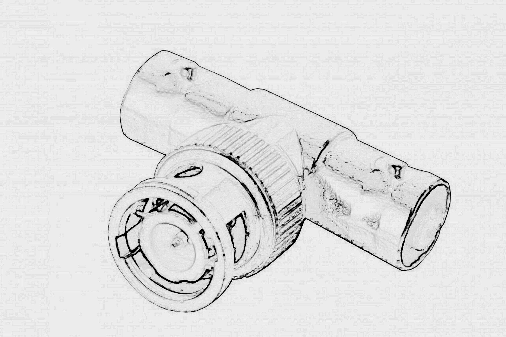

---
Pr-id: MoneyLab
P-id: INC Reader
A-id: 10
Type: article
Book-type: anthology
Anthology item: article
Item-id: unique no.
Article-title: title of the article
Article-status: accepted
Author: name(s) of author(s)
Author-email:   corresponding address
Author-bio:  about the author
Abstract:   short description of the article (100 words)
Keywords:   50 keywords for search and indexing
Rights: CC BY-NC 4.0
...

# LOG:: 01 Aesthetics of Instability

> Video is like water, an entirely ethereal form which was locked into
> the television for 50 years.
>
> —Tony Oursler (Flash Art, 1996)[^05_Treske_Ch2_1]

## On the faculty of imagination and cinematic barbarism 

Imagination is the essential ingredient for moving image practice.
Imagination is also essential for cinematic barbarism, a necessity if
we’re to continue to dream CINEMA, but also a necessity for
non-cinematic barbarism, a potential force to be awakened.

We are confronted with a difference, perceptible at the skin level.
Cinematic practice built on the moving image implies structure and
delay, building up forms for narrative constructs. Non-cinematic
barbarism, meanwhile, in the forms that confront us every day, simply
implies chaos. Here, directed and controlled imagination stands in
contrast to the free, wild flow of imagination. What both forces have in
common is the faculty of creating images. This is Vilem Flusser’s idea
of imagination. Compared to such figures as Deleuze, Foucault, or
Bergson, he might not be of interest to many scholars, but connecting
his ideas on imagination to the aesthetics of moving images, online
video, and digital art, and introducing, for comparison, the figure of
the barbarian in the work of Mauricio Lazzarato and Walter Benjamin,[^05_Treske_Ch2_2]
as well as the tourist in Hiroki Azuma[^05_Treske_Ch2_3] seems an exciting and
fruitful route through this ocean of video. What is still relevant in
Flusser’s ideas is also the somehow shocking fact that we have yet to
learn how to use our imagination to decipher the technical images on our
screens.

I will contextualize these contrasting figures of the barbarian and the
tourist within the dull or not-so-dull work of art house filmmakers and
their audiences, or the dull boring or not-so-boring Hollywood industry
and the audiences of *Barbenheimer* cinema.[^05_Treske_Ch2_4]

Is the Turkish artist Refik Anadol comparable to Azuma’s tourists or his
audience? What about *Barbenheimer* and its audiences?

How do these two modalities relate to or reproduce the technologies at
hand?

## Barbenheimer

But let’s first consider the general status of the moving image. Two
years after the pandemic, in 2023, came the experience of *Barbenheimer
(*the concurrence of the films *Oppenheimer* and *Barbie*), with cinema
once again a worldwide synchronous event.

*Oppenheimer* and *Barbie*, two films released on the same weekend,
created a sudden boost for a field marked, once again as often before,
by a slow, prolonged death.

Today, streamers, streaming media, and mobile platforms dominate the
culture of the moving image. They have absorbed moving image culture and
aesthetics into their digital environments, and programmed their
aesthetics as the dominating form. Cinematic experiences have now moved
into private environments, with giant OLEAD flat screens or handheld
shiny devices. Ankara, as a city of shopping-mall cinemas, faces the
constant closing of older cinemas beyond the malls, while the latter
meanwhile reformat their internal spaces.

Amazingly, Nuri Bilge Ceylan’s three-hour film *Kuru Otlar Üstüne*,
(About Dry Grasses) enjoyed comparably excellent box office figures in
Turkey. Ceylan stands for an art house cinema, promising audiences
visual pleasure and cinematic contemplation.

Then, there is the Sphere in Las Vegas: a massive dome with a projective
surface inside and outside, an arena for audiovisual events similar to
sports stadiums and Olympic games arenas. A building like the Sphere, as
architectural symbol, materializes what the Zorlu Center in Istanbul has
yet to achieve, or what the architecture—the shape—of the Ankara Opera
might, on a much smaller scale, suggest. A friend of mine thought of
seeing U2 play at the Sphere, but deemed neither U2 nor the spatial
experience worth the \$600 price of a ticket. A reviewer in Wired
magazine noted that when the band played a few songs without visuals,
the musical performance itself was rather dull. Nevertheless, in the
Sphere, in the spatial, audiovisual, over-dimensioned, projected, and
live sensation, cinema has finally found its cathedral: a home in a
dome.

But, honestly, everything has stayed the same since 1924.

1924 was the year of Murnau’s film *The Last Laugh*, one of the
highlights of cinematic experience in the 1920s, and high on any list of
the cinematic language and visual possibilities of the moving image.

I agree with Rudolf Arnheim’s judgment that everything that cinema is
capable of has already been invented. The installation phase of the
cinema had ended; cinema went straight into its deployment phase. Yes,
sound was missing, but the films of the 1920s paved the way to recorded
sound as the final step in establishing a mass medium. (As a mere side
note, cinema always had sound. The 1930s moved from live to recorded
sound, establishing another distribution dominance of Hollywood-style
cinema, automating a multi-sensory mass product.

Abel Gance had dreamed of a three-dimensional cinema before his
multi-screened Napoleon in 1927. We still are not there. Our
technological dreaming remains in the experimental phase, as television
long had, before its emergence in the 1950s, in the wake of world wars.
Our technological dreaming remains between the concreteness of spherical
cathedrals and immersive noise-canceling headsets.

Surveying the last 50 years of media and cinema development, clearly,
digital technology has redefined moving image culture. From the 1971
internet revolution to the digital video revolution of the 2000s, to the
2022 AI revolution, the cultural of the moving image has merged,
changing its forms and appearances. Digital technology enabled the
mixture of images captured through many different means (cinema,
photography, drawings), generating new levels of representation. Analog
video gave birth to simultaneity; the computer extended simultaneity to
multiplicity.

In his 2001 *The Language of New Media*, a popular work that generated
intense discussion, Lev Manovich says, *Cinema becomes a particular
branch of painting - painting in time. No longer a kino-eye, but a
kino-brush.*[^05_Treske_Ch2_5] We could extend this prophecy 20 years into the future,
from *Adobe Firefly*, *Midjourney*, and *DALL E* to an algorithmic
brush, as the new model on the supermarket shelf.

## Video is not cinema. 

I wrote in *Video Theory* in 2015:

> Comparable to driving a car or taking a shower. It is nearly
> omnipresent, available on demand and attached to nearby anything,
> anywhere. Online Video became something vital and independent. With
> all the video created by the cameras around us, constantly uploading,
> sharing, linking, and relating, a blue ocean is covering our planet,
> an ocean of video. What might look as bluish noise and dust from the
> far outside, might embed beautiful and fascinating living scares of
> moving images, objects constantly changing, re-arranging, assembling,
> evolving, collapsing, but never disappearing, a real cinema.[^05_Treske_Ch2_6]

An Ukrainian publisher translated my book into Russian. I don’t speak
Russian, but was told that the translation was excellent. The inlay of
the Russian version includes the following English part, with which I
wholly agree:

> We are doomed to live in an era of rapid changes, especially in
> \[the\] media sphere which overloads us with information. All the
> technological innovations that are here for us with a single click or
> a single touch to a smartphone and which we consider to be our
> extension, literally impose their tyranny on us - the tyranny of
> vision and perception of reality. 

2015 is also the year when Mark Zuckerberg lied about Online Video.[^05_Treske_Ch2_7]

## The Aesthetics of Instability

Here is where we connect to what I name the Aesthetics of Instability.
The power of instability, the constant change, the flow, and the feed
define our daily operations and assume our values in a total immersion
of ourselves. We have submitted ourselves.

In my 2002 graduate seminar, I posed the question: Will technology alter
our perception of time and space in storytelling, or will it lead to
entirely new narrative structures, maybe vertical?

Now, I want to offer a change of attitude concerning the use of gadgets
around us in ways we need: creative use, uses that avoid all the
limitations imposed on us by the industry (limitations of frame, format,
vision, and more).

As my Russian translator of *Video Theory* suggests, I would see these
not simply as technological developments but as tools and objects with a
strong power element. These objects have already changed paradigms,
transforming existing systems, neighborhoods, and atmospheres.

The 2022 film *Everything, Everywhere, All at Once* appears as one of
the most chaotic films following the pandemic.

Evelyn, a Chinese immigrant running a laundromat, discovers that her
life exists in just one of countless universes. The film seems to mirror
the internet's overwhelming chaos, or, as the director Daniel Scheinert
put it, the sense of *scrolling through an infinite amount of stuff*.

*Everything Everywhere* has been called one of the first *post-internet*
films, capturing the online world's bizarre nature. In our era, human
brains, unchanged for centuries, struggle to adapt to a dramatically
transformed world. As YouTuber Thomas Flight observes, we now encounter
more ideas, people, and places in a single TikTok binge than our
ancestors did in entire lifetimes. This rapidly evolving digital chaos
challenges our slow-evolving minds.[^05_Treske_Ch2_8]

Of course, ideas are not less complex, less abstract, or less attractive
than a 20 second TikTok Video. Flight seems to be overlooking such
figures as Duns Scotus, the Scottish Franciscan friar and philosopher
(c. 1265/66–1308), or Ibn Khaldun, the Arab historiographer and
historian (1332–1406). Their ideas stick.

The universes of the moving image are diverse, strange, weird. They are
deep and full of kinetic energy and relentless pace.[^05_Treske_Ch2_9]

## Constructive Instability

In 2008, Thomas Elsaesser sparked discussions about YouTube's impact
during the second Video Vortex conference in Amsterdam.[^05_Treske_Ch2_10] He shared
his journey through the video platform, drawing parallels to Fishli and
Weis’s *Der Lauf der Dinge*, which inspired the Honda Cog commercial.
Elsaesser introduced the term *constructive instability*, a term also
used by Condoleeza Rice to describe the Israeli-Hezbollah conflict.

Elsaesser applies *constructive instability* to experiences on the web,
primarily through collaborative filtering, exploring how the emergence
of Web 2.0 blurs the line between art and artificial life, and prompting
us to explore the concept of the *post-human* in a *human* world.

As one of the last flaneurs, Elsaesser navigates YouTube, immersing
himself in user efforts, software, and suggestion algorithms. He
experiences an episodic narrative filled with loosely connected
elements, finding joy but also sensing a fragility, an impending
collapse, an *evolutionary dead-end*. This constructive instability's
allure lies in its potential destruction.

Similarly, Kyle Chakya, a writer for the *New Yorker*, reflects on his
*TikTok* experience.[^05_Treske_Ch2_11] He notes that *TikTok* eliminates the need to
decide what interests you—you surrender to the platform. *TikTok*'s
algorithm drives the platform, creating a personalized feed of short
videos that constantly evolves based on user interaction. Unlike other
social media, TikTok emphasizes the content over the creator, fostering
a sense of discovery and immersion. Automation masquerades as
customization, dictating what we watch, read, and hear. TikTok
aggressively pursues our attention, aiming to create an addictive and
profitable cycle. Trust in the algorithmic feed empowers the app to
manipulate its audience effectively.

Time is the Message. We must treat database-watching with the
seriousness it deserves, rather than dismissing it as mere video
consumption. Online video platforms are designed to be addictive, with
endless streams of content that can captivate viewers for hours on end,
far surpassing the length of a traditional film. This infinite scrolling
and clicking has become a defining characteristic of 21st-century
culture. We've become accustomed to this perpetual online journey,
reluctant to break free from the database's grip.

The short format of many online videos doesn't diminish their potential
impact. They cater to our shrinking attention spans, delivering quick
hits of information and entertainment. These condensed videos can
conceal layers of meaning, inviting deep analysis. However, our
supposedly fast-paced lives rarely afford us the time for such
contemplation. Ironically, while consuming these videos, we're consuming
our own time. In our rush to consume, we neglect to consider the
implications of our digital footprints.

Is this constant flux a positive force for innovation or a destructive
consumption pattern?

## Imagine

Two terms are critically interwoven in this line of thought and
questioning: *Imagination* and *Perception*.

Jean-Paul Sartre, in 1936, challenged traditional views of imagination,
distinguishing it from perception and emphasizing its totality.[^05_Treske_Ch2_12]

For Sartre, perception is the study of objects over time, an ongoing
process of exploring the world, limited by our sensory abilities. It's
an anticipative process, revealing aspects of objects gradually in time,
piece by piece, and incompletely. For example, we can walk around a
building and see different sides of the building at different times. Our
perception is, each time, incomplete and needs to be revised as we
gather more information, more sensory data.

On the other hand, imagination presents all aspects of an object
simultaneously: an object in its entirety, and all at once. When we
imagine a building, we don't need to mentally *walk around* the building
to conceive of its back side; we can instantly imply the whole structure
in our mind. The idea of totality in imagination is crucial to Sartre's
conceptualization. When we imagine something, we create a complete image
that includes all its essential aspects simultaneously. This totality or
whole is not bound by the limitations of physical reality or our sensory
experience.

Imagination is an intentional act of consciousness. This means that when
we imagine, we are actively creating or shaping the imagined object
based on our intentions and purposes. This is not a passive reception of
images, but an active, creative world-making process, with meaning and
significance that we ourselves give. Imagination allows us to conceive
of possibilities that don't currently exist, and enables us to create
projections, fictional situations and scenarios.

Sartre, following Husserl, emphasizes that consciousness is intentional;
it is consciousness of something. Imagination pronounces this
intentionality. We don't passively receive images; we actively create
them. Sartre ties this—our ability to conceive something that is not and
to envision alternatives and future possibilities—to human freedom.
Imagination allows us to project. It is not simply about mental images,
but about how we conceive of and act upon our world.

Sartre’s concept of the faculty of imagination indeed allows
teleological thinking, with its projective future orientation and role
in shaping meaning. The imagination's power to negate the given and
envision alternatives is as much about refusing existing ends as it is
about positing new ones. It's a tool of freedom, the ground of
possibility for both accepting and rejecting given ends—a crucial
component of human freedom and meaning-making.

In the 1980s, Vilem Flusser spoke of a new form of imagination, defined
by the ability to create and understand images.[^05_Treske_Ch2_13] Flusser, more than
40 years after Sartre, saw the evolution of imagination as crucial.
Historically, primitive forms involved vision, but the hands began to
*make and decipher images* to overcome such limitations as constraints
on human vision, limited memory, or the restrictions of time and space,
introducing artificial images and different alphabets. This process
continued through various forms of writing.

While Sartre's analysis was more phenomenological and general, focusing
on individual consciousness, Flusser's faculty of imagination is more
oriented towards media theory and cultural analysis. He focuses on the
role of imagination in creating and interpreting *technical images*
(photographs, films, digital images). The *technical image* is no longer
a representation of facts and circumstances, but rather an expression of
calculations.

Imagination, for Flusser, involves both abstracting from the world
(creating concepts) and concretizing abstract ideas into images.
Imagination is influenced by cultural codes and programs and plays a
definitive role in creating new information and distributing existing
information.

Imagination as a faculty has evolved throughout human history, then,
from primitive imagination based on a direct visual perception of the
world, through what Flusser calls traditional imagination involving the
creation and interpretation of handmade images like cave paintings, to
textual imagination linked to the development of writing and alphabets,
introducing a new level of abstraction of the world. Textual imagination
is followed finally by technical imagination related to the creation and
interpretation of technical images. Flusser argued that we were moving
from a text-based culture to one dominated by particularly technical
images, with profound impacts on our understanding and interaction with
the world, all of which would require new forms of literacy and new
kinds of imagination.

What makes technical images fundamentally different from traditional
representative images is simply that they are produced by machines or
apparatuses—cameras and computers—based on technical processes. They
project specific models onto the world and shape and construct reality
through computation. Imagination now requires, if we are to decode
conceptual projections, an understanding of the processes and
calculations behind image creation. While computers operate on linear
sequences (algorithms) and while code is a form of writing, what they
produce—particularly visual outputs—are non-linear. Technical images
present a synchronic, all-at-once view that's more about relationships
and patterns than sequence and causality. This challenges a linear
understanding of history.

The new imagination, according to Flusser, is about synthesizing
concepts into images. It is not about representing what exists, but
about projecting possibilities. Imagination involves translating
abstract concepts into visual forms. Flusser’s concept of technical
imagination provides a framework for understanding how we create and
interpret images in a world increasingly dominated by digital
technologies and visual media. These media, to be sure, require and call
for a different imagination, non-linear and projective.

Furthermore, imagination involves an act of distancing from the world.
The ability to distance is connected to and affected by media gestures
and media practices, with different media serving as constraints. This
ability is connected to media on a practical level. Flusser refers to
this practical level not as an *act* or *practice*, but a *gesture* of a
medium. For Flusser, a *gesture* is not just a physical movement, but a
meaningful action that expresses a particular relationship between
humans and their environment. The gesture of a medium refers to the way
a particular medium shapes our interactions with the world and with
information. Different media have different associated gestures. The
gesture of photography might involve framing, focusing, and capturing a
moment. The gesture of writing might involve the physical act of putting
pen to paper or typing on a keyboard, but also the mental processes of
composing a text. These gestures are not fixed but evolve with cultural
and technological changes.

Flusser believed the transition to a new faculty of imagination would
unlock a new level of existence with fresh experiences, emotions, and
values. However, he acknowledged that we're still learning to use this
new imagination, and to decode technical images on screens. This new
faculty, the translation of concepts into video imagery, has yet to be
fully harnessed.

We have to jump into the new imagination.

## Art / Kunst

Thomas Elsaesser, thinking aloud along the feed of 2008's YouTube,
started his reflective essay in *Video Vortex* with a question already
posed by many artists and thinkers in the 1920s avant-garde: Is it that
art is coming closer to life, or that life is getting closer to art?

What makes a work of art?

How do we know what is a work of art?

Art and aesthetics are closely connected, with imagination being a key
element. Aesthetic thinking plays a role in various aspects of our daily
lives. We often use *aesthetics* and *aesthetic* in everyday
conversations. For instance, we could discuss the aesthetics of a
garden, a hairstyle, a vase, or whether a smartphone is aesthetic.

Our daily lives are filled with aesthetic choices, from selecting and
coordinating clothing to liking photos, choosing hairstyles, makeup,
places to visit, items to purchase, and music to listen to. Aesthetics,
in these cases, pertain to pleasurable sensory experiences. We use
aesthetic decision-making when creating graphs, editing photos and
videos, drawing images, and designing spaces and structures.[^05_Treske_Ch2_14]

Aesthetics encompasses both natural and human-made elements and
experiences. It's about everything that can be sensed and perceived, not
just what we consider beautiful.

In simple terms, art is a creative expression, a means to tell stories
or evoke emotions. It takes various forms: paintings, sculptures, music,
dance, literature, or film.

Georg Simmel (1858 - 1918), a German sociologist and philosopher, shows,
in his writings on aesthetics, culture, and the applied arts (especially
his short essay *The Picture Frame*) that *art* and *design* are two
different types of creative processes.[^05_Treske_Ch2_15] Of course, his views predate
modern conceptions of design. But what makes Simmel interesting is that
he discusses social and cultural phenomena in terms of *forms* and
*contents* in a temporal or transient, passing relation. Form becomes
content and content becomes form. Art, for Simmel, is autonomous and
emphasizes individual expression and uniqueness. Design follows function
and the everyday life. It is about applicability in general and embedded
in our cultural life. While design responds to immediate needs, art
might aspire to timeless and temporary criticism.

Today, AI is automating the art of imitation, introducing a new trend of
mass-produced similarities with slight variations. The process remains
somewhat mysterious, hidden within the black box of recursive
algorithms. AI has been at the forefront of discussions on art and
aesthetics. Machine learning and deep learning techniques enable AI to
create and analyze art in novel ways. AI can be trained on vast datasets
to generate unique pieces not seen before. AI artworks respond to a
socio-cultural context and environment with both the space and the need
for fast paced production, and for the instantaneous applicability of
such artifacts or generative objects.

AI is transforming our sensory experiences and has become the standard
method for aesthetic action. In the 21st century, computation, data
analysis, machine learning, neural networks, and AI have entered the
realm of aesthetics. Music streaming services recommend songs, Instagram
personalizes content on its *Explore* tab, and photo editing apps
enhance images with a single click. AI influences fashion
recommendations from online retailers. The encounter between AI and
aesthetics is significant because aesthetics is traditionally a human
domain. One prevalent opinion holds that these developments merely mimic
existing styles, and are not creative. In such instances, computers
receive pre-existing examples and accordingly generate variants; they
try, that is, to introduce some level of variation. Sometimes, what
results is uncannily similar to genuine artworks; other results seem a
bit off to a trained eye, lacking the final touches to make them
convincingly human. Typically, conservative views on art consider
technical mastery a criterion for *real art*. However, many people still
conceive of art as involving something that doesn't require or perhaps
isn’t strictly reducible to technical ability. Technical ability means
procedural knowledge, for which AI precisely is designed.[^05_Treske_Ch2_16]

*Aesthetic judgement* for Immanuel Kant is always normative. Judgements
are based on feeling, specifically the feeling of pleasure or
displeasure. When people make aesthetic judgments—such as declaring
something beautiful—they are making claims that imply a standard of
value that others should recognize. Aesthetic statements are often
understood to assert that certain qualities are desirable or preferable,
thus carrying a normative weight. For instance, saying *this painting is
beautiful* is not just a subjective opinion; it suggests that the
painting meets certain aesthetic criteria that can be evaluated and
discussed by others. Kant emphasizes that aesthetic judgments are
grounded in a subjective experience of pleasure or displeasure, but they
claim universal validity. This duality creates a tension: while the
experience is personal, the judgment seeks to communicate a standard
that others can agree upon.

The *sublime* shatters those norms. Sublime experience disrupts
normative frameworks. It overwhelms our senses, inspiring awe and maybe
even fear, but is then followed by a process of rationalization. It is
foremost an experience of a kind of power that transcends ordinary
aesthetic norms, evoking a response that is not easily categorized
within the established standards of *beauty*. The sublime challenges the
very criteria by which aesthetic judgments are made in the face of
something greater than oneself. Thus, while aesthetic judgments aim to
establish norms, the sublime shatters these norms by presenting
experiences that defy conventional evaluation and provoke a more
profound reflection on human existence and life.

Aesthetics is thus conceptualized as a distinct form of judgment,
neither purely cognitive nor purely sensual. This touches the *essence*
of art and especially avant-garde art. Now, what is called generative
art or imagery falls into the *normative* in the Kantian concept of
aesthetics. AI cannot generate the *sublime*, or not yet.

## Unsupervised

Let's dive into the work of the Turkish artist Refik Anadol at the
Museum of Modern Art. Anadol's exhibition, *Unsupervised*, is unique,
having been generated by an artificial intelligence model trained on the
public data of MoMA's art collection, spanning over 200 years. AI
interprets the museum's diverse collection to create abstract images and
shapes.[^05_Treske_Ch2_17]

Anadol's art uses machine learning to process tons of data and to craft
immersive, multi-sensory experiences that challenge how we perceive
space, time, and memory. This amounts, in other words, to technically
feeding a specific algorithm or algorithmic model data, examining the
results, and tweaking the model output to increase accuracy and
efficacy, to foster the expected, intended visual experience and
pleasure. The curated data transforms into a dynamic experience for
viewers. Anadol and his team loaded their collected data into their
neural network to identify and refine patterns in thousands of MoMA
artworks, generating new, unique images that share those patterns
without resembling any specific paintings. Watching the floating
animation is like exploring the universe of MoMA's contemporary art
through these patterns.

Art critic Jerry Saltz described *Unsupervised* as a crowd-pleasing,
attention-grabbing spectacle—a giant, mesmerizing screen that resembles
a colossal techno lava lamp, creating an otherworldly experience.[^05_Treske_Ch2_18]
People are drawn to it, taking pleasure in dancing and recording videos
while pulpy shapes drift across its edges. The floating colors and
shapes recall ocean waves, or else gigantic foams and dusty clouds,
pixel dust, a generated dense and intense universe of sensual immersive
experience.

But remember, art is subjective. What one person finds terrific, another
might not. *Unsupervised* features a large, energy-intensive screensaver
at MoMA, essentially a digital daydream based on public data. AI doesn't
see images but processes data and weather conditions to produce
colorful, flowing patterns. It's like a machine with three dreams, which
some technical critics felt was a low number for such a powerful tool.

Anadol tours the world creating massive motion graphics, often screened
or projected onto buildings and public spaces, using various databases.
Museums love it, and the public is captivated.

However, there's an ethical concern here to consider. AI advancements
could very well determine military dominance in the future. The
Department of Defense even supports such AI companies as Nvidia, which
aids Anadol in creating his unique dreams.

In a critical review, Ben Davis points out that *Unsupervised* risks
trivializing art history by treating it as random visual elements.[^05_Treske_Ch2_19]
But it serves a different purpose; it promotes tech innovation.
*Unsupervised* is a program that touches on surveillance and the
colonization of space, raising questions about who controls creativity
and production. It may appear fun and colorful, but it raises concerns
about normalizing surveillance and environmentally harmful computation.
Anadol should reconsider the neutrality of his tools, as they have
broader implications beyond art.

## \
Never before

Not only Anadol's spectacular screens but also contemporary cinema calls
for meticulously curation, coupled with an assertion of producers and
audiences that this, whatever *this* is, has never been done before.

Christopher Nolan touted *Oppenheimer's* use of alternating
black-and-white and color as if it were a new invention, and not
something employed in 1939 for *The Wizard of Oz*.

*Barbie's* marketing positioned the film as a landmark of inclusion, as
a blockbuster with a female director, despite the box office success of
Amy Heckerling's *Clueless* or Penelope Spheeris's *Wayne's World*.
Ironically, this approach even erases the box office success of Gerwig's
previous films. *We're trapped in a rugged individualism time
loop.*[^05_Treske_Ch2_20]

The challenge that links Refik Andol, the cinema industry, and social
media stems from their predominantly young target audience. For this
*youthful demographic*, everything unfolds for the first time. In the
perhaps exceptional case of Anadol, this includes all generations of
museum visitors or the museum visiting class, and expands to the
commercial target of young people leaving their homes for leisure and
pleasure.

We find ourselves in an age marked by a blend of collage and nostalgia,
as we continually reinvent our cultural, aesthetic, and artistic
expressions.

We lack the contemporary equivalents of cinematic scholars like Andre
Bazin or critics like Pauline Kael, who might provide us with a
comprehensive cinematic library, offering theoretical insights into the
ongoing trends and adeptly identifying emerging voices in the field.
Fragmentization, personalization, and individualization have unseated
the guiding authority and the narratives and power of cultural critics.

Alexandra Coburn writes in *Dirt*, a daily-ish newsletter on digital pop
culture and entertainment:

> Now, I work in a film archive, and I can lay out newspaper clippings
> end to end and watch the American auteur movement of the 1970s die. I
> can read box office numbers for filmmakers’ first films with the
> foresight that one day, they’ll be selling out theaters. Pastiche is
> often used as a slightly derogatory description—directors are accused
> of pastiche, as if in the year 2023 it is truly possible to make a
> film that doesn’t rest on the backs of all the films which came
> before. The most idyllic result of this trend is the resurgence of
> interest in arthouse cinemas; in a utopia, this would amount to a
> monetary acknowledgement that good repertory film programming is
> visionary and worthwhile.[^05_Treske_Ch2_21]

## Anything to Be Done?

Nietzsche already called for barbarians: ‘Where are the barbarians of
the twentieth century? Obviously, they will become visible and
consolidate themselves only after tremendous socialist crises’.[^05_Treske_Ch2_22]

So, where are the new barbarians? Do we need new barbarians? Who is the
new barbarian who breaks free from *the detective opacity of his inner
life and the new religious type?*[^05_Treske_Ch2_23]

Of course, the understanding of *barbarism* implied here attempts to
sketch out a positive concept of barbarism. *Positive Barbarism* refers
to Walter Benjamin’s view that in certain historical moments,
particularly in times of crisis and rapid change, there is value in some
sort of a clearing out of *nomenklatura*, of established traditions and
norms—a kind of cultural *starting over*. This means not the violent and
destructive association with barbarism, but rather a radical departure
towards renewal and creative potential in the face of oppression and the
poverty of experience in modern life.[^05_Treske_Ch2_24]

Suppose our experiences and imaginations are fully programmed, flowing
algorithmically and automatically. In that case, such *poverty* would
force *the barbarian* to start from scratch, to create something new, to
make way for new possibilities.

As Maurizio Lazzarato, referencing Walter Benjamin, notes in *Video
Philosophy*, the barbarian will not see anything permanent. This is a
condition of instability, open thereby to everywhere, with multiple ways
to discover and to walk along.

> Where others encounter walls or mountains, there, too, he sees a way.
> But because he sees a way everywhere, he has to clear things from it
> everywhere. Not always by brute force; sometimes by the most refined.
> Because he sees ways everywhere, he always stands at a crossroads. No
> moment can know what the next will bring. What exists he reduces to
> rubble—not for the sake of the rubble, but for that of the way leading
> through it.[^05_Treske_Ch2_25]

The text was written in the early 90s, and was translated into English
only a few years ago. Lazzarato demands that we testify to our poverty
of experience (Benjamin) within the conditions of capital. We must move
to politics—to a radical imaginary politics of the moving image.
Returning to Henri Bergson's insights, with Maurizio Lazzarato we
understand that the Kantian subject apprehends a limited reality
compared to the full scope of existence. In Kant’s conceptualization,
the subject is limited in experiencing phenomena (things as they appear
to us), and cannot directly access things-in-themselves (noumena). So,
fundamentally for Kant, there is an epistemic limit to what we know.
These constraints and limitations further touch on what we perceive and
understand of the world. Our perception is constraint. To fathom the
true nature of reality, departing from the constraints of the Kantian
subject is imperative. This liberation can be achieved through the
guidance of James or Bergson, or even through the medium of video
without the philosophical guidance of James or Bergson. This dynamic
extends to our daily lives.

Political transformation demands more than advocating for improved labor
conditions or living standards; it necessitates the expansion of one's
experiential horizons. Many subjectivity-related challenges in the realm
of work are intimately intertwined with this idea of broadening one's
spectrum of experiences.

Consequently, the crisis we currently face isn't solely economic, but is
also a crisis in producing subjectivity. This is why, in Lazzarato's
work, exploring the production of subjectivity is paramount. This
dimension is not extensively addressed in Marx or the broader Marxist
tradition. In contrast, the traditions of James, Bergson, Nietzsche and
Foucault offer diverse avenues to contemplate the concept of
subjectivity’s production. When we lament the absence of effective
political organization, we may first need to consider more carefully the
imperative of enlarging our experiential domains. Walter Benjamin's
reference to a *new barbarism* remains acutely relevant today, as the
deficiency of a range of experiences underscores the necessity for the
emergence of new agents of change.

In *A Thousand Plateaus*, Deleuze and Guattari delve into the concept of
the barbarian, particularly in relation to the *nomad*, who perpetually
traverses boundaries, moving in and out of empires with unbridled
freedom.[^05_Treske_Ch2_26] The nomad appears as a source of creativity and innovation
in constant movement—one who brings new ideas and practices to
established structures and systems. Deleuze and Guattari's concept of
the nomad is not primarily about actual nomadic peoples. The *nomad* is
a philosophical construct and a metaphor for a way of thinking that
challenges dominant paradigms and offers alternative modes of social and
political organization. So, *nomadology* stands in contrast to the
*state apparatus* and to power structures. In this sense, the barbarian
is associated with a nomadic way of living. Furthermore, Deleuze and
Guattari introduce the concepts of *smooth* and *striated* space. Nomads
inhabit smooth space, which is an open and undivided space, while the
state operates in a striated space—a divided, organized, and structured
space. The nomad as well as the barbarian move through smooth space,
resisting the organization imposed by empires. Where Walter Benjamin
seeks, in his conceptualization of a positive barbarism, to challenge
dominant historical narratives and to renew culture and experience freed
from the weight of tradition, Deleuze and Guattari try to establish a
new mode of existence and thought that resists domination and promotes
difference.

While Lazzarato recalls the concept of nomad, the Japanese philosopher
Hiromi Azuma seeks to elaborate a *Philosophy of the Tourist.*[^05_Treske_Ch2_27] Our
*stratified world* today is, for Azuma’s analysis of contemporary
culture, a world of layers: of the political, economic, national,
global, nation-state, and empire. He develops the concept of the *postal
multitude*, building it on discussion of the nation-state and empire
outlined by Hardt and Negri, but considering the tourist as an element
of *misdelivery*. The *postal multitude* refers to a form of collective
behavior or social organization that emerges in the context of digital
communication and social media. Simply, it combines the ideas of *postal
space* and *multitude*. Digital networks transmit and circulate
information similar to a postal system, but, of course, with incredible
speed and through a mesh of connections. *Misdelivery* is the unintended
exchange of information or ideas between members of the multitude of the
society, leading to unexpected connections and even collaborations—a
failure in delivery, or the occurrence of some kind of unforeseen
communication. For Azuma, the *essence of tourism is the misdelivery of
information*. The social figure of the tourist is *born of misdelivery*
and connected to it. ‘The tourist is the subject capable of moving most
freely between the strata of the global and the local’.[^05_Treske_Ch2_28]

The tourist connects the multiple layers of our world and increases the
possibility of misdelivery, thereby acquiring an originary role in
politics. Azuma defines tourism concisely, categorizing a tourist as
someone who, for different reasons, ventures to a destination beyond
one’s usual environment, excluding employment by a local entity.
Moreover, he underscores that tourism is intricately connected to the
emergence of mass and consumer societies. This demarcates tourists from
immigrants and job seekers, positioning them as consumers acquiring
tickets to enjoy goods and services, where consumption is a matter of
choice rather than necessity.

In *Philosophy of the Tourist* and his prior work on *Otaku*, Azuma
draws parallels with Alexandre Kojève, who, in the first edition of
*Introduction to the Reading of Hegel*, sees the end of history embodied
in an American way of life, signifying the dehumanization of individuals
into mere consumers. In a subsequent edition, after Kojève visited Japan
in 1959, he suggests two post-historical archetypes, American animality
and Japanese snobbery, positing these as mutually exclusive, inasmuch as
*an animal cannot be a snob*. Yuk Hui, reading Azuma, raises the
question of whether tourists exhibit a blend of Japanese snobbery and
animality, or perhaps lean more towards one of these traits.

Tourists are not passive consumers as we used to think. Instead, they
are active connections that reconfigure the world conceived as a
network. A tourist has to be curious and courageous, as Azuma assigns
them the task:

> to meet people they were never meant to meet, go to places they were
> never meant to go, think thoughts they were never meant to think; they
> seek to infuse contingency back into the system of Empire, to rewire
> concentrated edges once again, and to revert from preferential
> selection back to mis-delivery.[^05_Treske_Ch2_29]

Walter Benjamin and Hiroki Azuma might be separated by time and cultural
context (from modernity to postmodernity and into the digital age), but
*positive barbarism* and the figure of the *tourist* have, at a very
essential level, potential connections. Both the barbarian and the
tourist are at once engaged with and detached or broken off from culture
(the tourist perhaps more superficially so). These figures are
responses, carrying renewal and adaptability, breaking with continuity
or engaging in temporary fleeting experiences. The barbarian appears
more active, while the tourist would seem to wander on surfaces, with
the potential of a critical, observational attitude shaped by
technological and social structures—the potential of cultural accident,
or what Azuma calls *misdelivery*. Both figures are deeply rooted in
modes of cultural participation, reflecting and highlighting the ongoing
tension between established traditions and innovation, depth and
surface, and, most of all, the individual’s role in cultural production
and consumption.

## New Barbarism

The new cinematic barbarism develops out of films that were never meant
to be made—a non-cinematic barbarism born of videos never thought of.
The new barbarism develops out of an audiovisual misdelivery of
sensations of new art and aesthetics, ignoring the operatics of
Hollywood capitalist blockbusters, forgetting cinematic real estate and
vintage materialities, through smartphone crystal palaces and white
halls with high-resolution screens. It emerges out of the loss of grant
narratives, the loss of symbolic identification, and builds a
phantasmagorical space that traverses reality and fiction, with spatial
designs neither indoors nor outdoors, circulating in calibration.

The filmmaker cries for attention to the moment extended in musical
dance, an elegiacally ellipsed transition to transcendental instant slow
time, a stretched rubber time narrative Proust factor combined with
chaos action: diving into the black box for a radical new imagination.

But what is the point, actually, now?

Considering art house cinema (with its actually 'boring' films), the Las
Vegas Sphere (with actually 'boring' music), Adele’s stadium in Munich,
Refik Anadol’s shows (with actually 'boring' visuals), or 2024 as the
year of Taylor Swift reformatting cities with even the hint of a visit,
the year of pop star tourism (little Taylors all around in
Taylor-Gelsenkirchen)…What is being sold is no longer something that has
to do with film aesthetics or cinematic/intellectual pleasure/joy (which
could be reproduced on any decent screen and sound system) but an
*event* that is spatially and temporally confined to a specific moment
and location—not unlike the experience of Azuma's tourist.

Taylor Swift does not exist.[^05_Treske_Ch2_30]

•

What was your safety question about?

Fig. 2. BABY N

The BNC connector is a miniature quick connect/disconnect radio
frequency connector used for coaxial cable. It features two bayonet lugs
on the female connector; mating is fully achieved with a quarter turn of
the coupling nut. BNC connectors are attached to the ends of coaxial
cables and can be used for connecting signals such as RF signals and
video signals on consumer electronics. BNC stands for Bayonet Neill
Concelman. Bayonet describes the physical connector type and Neill and
Concelman are the names of the BNC connector's two inventors. The
acronym BNC has been mistakenly believed to stand for British Naval
Connector, Bayonet Nut Connector, and Baby N connector. BNCs are suited
to accommodate a large variety of RG and industry standard cables, in a
variety of termination styles.

• Bayonet coupling mechanism provides positive, quick mating and
un-mating

• 50 Ω and 75 Ω impedance designs allow customers to match impedance to
system requirements

• Connectors are available for military, industrial and commercial
applications.[^05_Treske_Ch2_31]

In earlier computer networks, BNC connectors with coaxial cables were
used in Ethernet networks, but Ethernet networks are now more commonly
connected by RJ45 connectors and CAT5-style cables.[^05_Treske_Ch2_32]

[^05_Treske_Ch2_1]: Tony Oursler, Video Dolls with Tracy Leipold, Hirshhorm Museum and
    Sculpture Garden. 2012,
    https://hirshhorn.si.edu/wp-content/uploads/2012/06/Tony-Oursler-Directions-Brochure.pdf.

[^05_Treske_Ch2_2]: Maurizio Lazzarato, Videophilosophy: The Perception of Time in
    Post-Fordism, edited by JAY HETRICK, Columbia University Press,
    2019.

[^05_Treske_Ch2_3]: Hiroki Azuma, Philosophy of the Tourist. Urbanomic 2022.

[^05_Treske_Ch2_4]: The release of two films on the same weekend - *Oppenheimer* and
    *Barbie*. See the wikipedia entrance:
    https://en.wikipedia.org/wiki/Barbenheimer, accessed 1 February
    2025.

[^05_Treske_Ch2_5]: Lev Manovich, The Language of New Media, Cambridge, Mass.: MIT
    Press, 2001.

[^05_Treske_Ch2_6]: Andreas Treske, Video Theory. Transcript Verlag 2015.

[^05_Treske_Ch2_7]: Facebook has been accused of misleading advertisers about the
    number of people watching videos on its platform. While the company
    admits to an error in calculating video viewership, advertisers
    claim Facebook intentionally concealed the mistake for years. This
    allegedly inflated video viewership numbers, which led many media
    outlets to shift their focus to video content, often at the expense
    of other formats and jobs. Essentially, the pursuit of video ad
    revenue led to a distorted media landscape, harming both advertisers
    and publishers. Oremus, Will. The Big Lie Behind the “Pivot to
    Video.”
    https://slate.com/technology/2018/10/facebook-online-video-pivot-metrics-false.html
    Last accessed Monday, 15 July 2024.

[^05_Treske_Ch2_8]: Rex Woodbury, Everything Everywhere All At Once: The Explosion in
    Generative AI

    Examining Image Models, Language Models, and Use Cases for
    Generative AI, Digital Native. J 4 January 2023,
    https://www.digitalnative.tech/p/everything-everywhere-all-at-once.

[^05_Treske_Ch2_9]: Black Holes …. and magic

[^05_Treske_Ch2_10]: Geert Lovink and Sabine Niederer, Video Vortex Reader, Responses
    to YouTube, Amsterdam: Institute of Network Cultures 2008, DOI:
    http://dx.doi.org/10.25969/mediarep/19284.

[^05_Treske_Ch2_11]: Kyle Chakya, Essay: How do you describe TikTok? The automatic
    culture of the world's favorite new social network, 9 November 2020,
    https://kylechayka.substack.com/p/essay-how-do-you-describe-tiktok.

[^05_Treske_Ch2_12]: Jean PaulSartre, Imagination, 1936.

[^05_Treske_Ch2_13]: Writings by Vilém Flusser. Edited and with an introduction by
    Andreas Ströhl. University of Minnesota Press, Minneapolis, MN,
    U.S.A. and London, U.K., 2002. 256 pp., illus. Trade. ISBN:
    0-8166-3564-1.

[^05_Treske_Ch2_14]: Lev Manovich and Emanuele Arielli, Artificial Aesthetics: A
    Critical Guide to AI, Media and Design, 2021, Chapter 1: Even an AI
    could do that,
    https://medium.com/@manovich/artificial-aesthetics-chapter-1-even-an-ai-could-do-that-b75a6266da03.

[^05_Treske_Ch2_15]: Georg Simmel, The Picture Frame: An Aesthetic Study. Theory,
    Culture & Society, 11(1), 11-17, 1994,
    https://doi.org/10.1177/026327694011001003.

[^05_Treske_Ch2_16]: Manovich, Arielli 2021.

[^05_Treske_Ch2_17]: Refik Anadol, Unsupervised, MoMA,
    https://www.moma.org/calendar/exhibitions/5535.

[^05_Treske_Ch2_18]: Jerry Saltz, MoMA’s Glorified Lava Lamp. Refik Anadol’s
    Unsupervised is a crowd-pleasing, like-generating mediocrity,
    Vulture, 22 February 2023.
    https://www.vulture.com/article/jerry-saltz-moma-refik-anadol-unsupervised.html.

[^05_Treske_Ch2_19]: Ben Davis, An Extremely Intelligent Lava Lamp: Refik Anadol’s
    A.I. Art Extravaganza at MoMA Is Fun, Just Don’t Think About It Too
    Hard, Artnet, 22 January 2023.
    https://news.artnet.com/art-world/refik-anadol-unsupervised-moma-2242329.

[^05_Treske_Ch2_20]: Alexandra Coburn, Auteur people, The short memory of film lists,
    Dirt, 20 October 2023.
    https://dirt.fyi/article/2023/10/auteur-people.

[^05_Treske_Ch2_21]: Coburn 2023.

[^05_Treske_Ch2_22]: Friedrich Nietzsche, The Will to Power, New York: Vintage Books
    1968.

[^05_Treske_Ch2_23]: Maurizio Lazzarato, Videophilosophy, The Perception of Time in
    Post-Fordism, Columbia Press 2019 JSTOR,
    https://doi.org/10.7312/lazz17538. Accessed 9 January 2025.

[^05_Treske_Ch2_24]: Walter Benjamin, Experience and Poverty, 1933.

[^05_Treske_Ch2_25]: Lazzarato, 2019.

[^05_Treske_Ch2_26]: Lazzarato 2019.

[^05_Treske_Ch2_27]: Hiroki Azuma, Philosophy of the Tourist, Urbanomic 2022

[^05_Treske_Ch2_28]: Asuma 2023: 112.

[^05_Treske_Ch2_29]: Yuk Hui, A Tourist in the Königsberger’s Dream: Review of Hiroki
    Azuma’s Philosophy of the Tourist,
    https://webgenron.com/articles/article20230310\_01, accessed 12
    March 2025.

[^05_Treske_Ch2_30]: Achim Szepanski, Taylor Swift does not exist (Extended Version).
    https://internationaltimes.it/taylor-swift-does-not-exist-extended-version/,
    accessed 9 January 2025.

[^05_Treske_Ch2_31]: Amphenol, https://www.amphenolrf.com/connectors/bnc.html.

[^05_Treske_Ch2_32]: Sam N. Austin, What Are BNC Connectors Used For?
    https://itstillworks.com/bnc-connectors-used-5044736.html, accessed
    12 March 2025.
