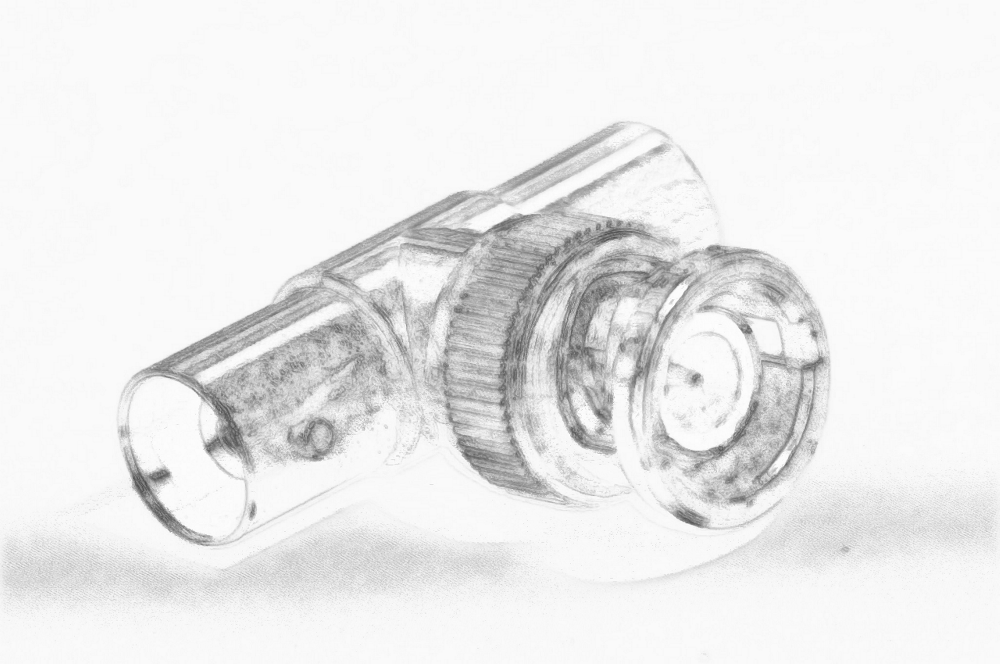
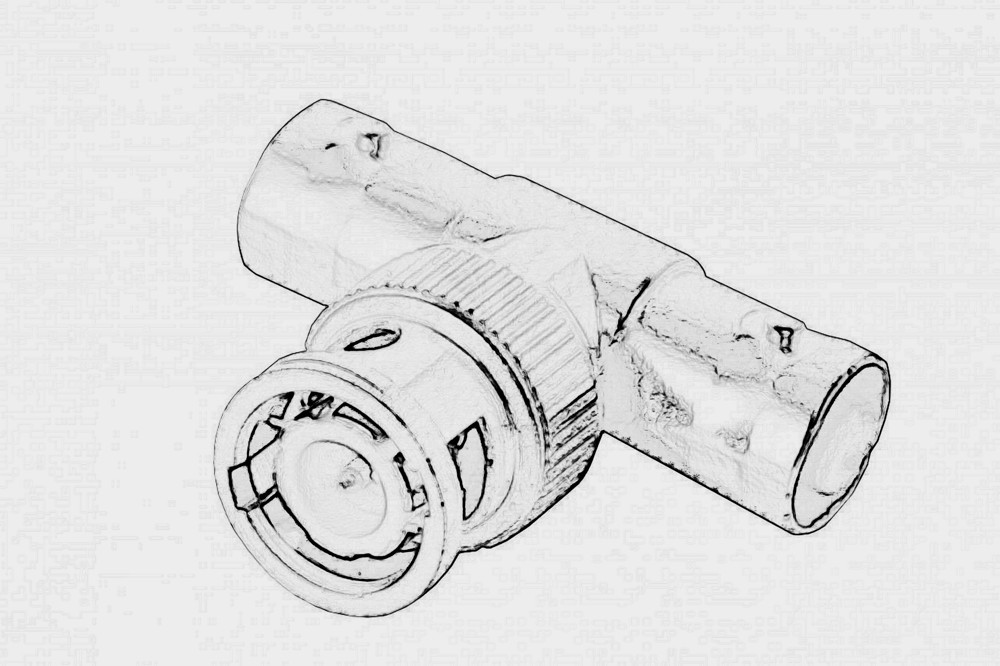

# Heaven's Delight

## On The Pleasures of Audiovisual Practices

### Andreas Treske

# Colophon

you need to copy a colophon from a previous book here

# Table of Contents

<a href='ch004.xhtml'> **Acknowledgments 4** </a>

<a href='ch005.xhtml'> **LOG:: IN 5** </a>

<a href='ch006.xhtml'> **LOG:: 01 Aesthetics of Instability 15** </a>

<a href='ch007.xhtml'> **LOG:: 02 Intense Heaven 34** </a>

<a href='ch008.xhtml'> **LOG:: 03 Arrested Development 51** </a>

<a href='ch009.xhtml'> **LOG:: 04 Melody of Life 68** </a>

<a href='ch010.xhtml'> **LOG:: 05 All Flows - Dancing *über* 79** </a>

<a href='ch011.xhtml'> **LOG:: 06 SWIPE me SVA 91** </a>

<a href='ch012.xhtml'> **LOG:: 07 Objects Of Interest 97** </a>

<a href='ch013.xhtml'> **LOG:: 08 ABOUT a line 110** </a>

<a href='ch014.xhtml'> **LOG:: 09 Temporal Audiovisual Workouts 121** </a>

<a href='ch015.xhtml'> **LOG:: 10 Clair-Obscur 125** </a>

<a href='ch016.xhtml'> **LOG:: 11 Light wants crystal 131** </a>

<a href='ch017.xhtml'> **LOG:: 12 Sharpness 145** </a> 

<a href='ch018.xhtml'> **LOG:: 13 Phantom Worlds or even cats watch tv 148** </a>

<a href='ch019.xhtml'> **LOG:: 14 Generative TeleVisuality 155** </a>

<a href='ch020.xhtml'> **LOG:: 15 Speak, The speech! 161** </a>

<a href='ch021.xhtml'> **LOG:: 16 Intermission - PAUSE 168** </a>

<a href='ch022.xhtml'> **LOG:: 17 BNC-MT 170** </a>

<a href='ch023.xhtml'> **LOG:: OUT 179** </a>

<a href='ch024.xhtml'> **Bibliography 180** </a>

# Acknowledgments 

A few words of gratitude. There are traces of many, many people in the
words and thoughts and notes that follow. I couldn’t possibly list all
the names; maybe a list of places is better (Wilnsdorf, Siegen, Munich,
Ankara and Amsterdam), or projects (SFB Fernsehen, Rural Europe, PASO,
Video Vortex, *Manti ve Cay*). To everyone I met and talked with about
video and art and more: to my teachers, students, friends, and to
everyone in passage.

My heartfelt gratitude to Geert Lovink, Aras Ozgün, and Lale Gülden
Treske. Thank you.

Many thanks to Will Day for looking over my notes and fragmented
writing.

Thanks also to Melih Aydınat for processing my images.

This text is dedicated to the memory of Ingo Florian Schiller, who
always asked me *how did you mean that,* and made me listen to the
newest electronic music records.

# LOG:: IN

Provide a username and a password

What am I currently working on? An approximation of where I arrived
after working with video for more than two-thirds of my life?

I thought of a personal opening.

My aim or urge is to discuss the aesthetics and practice of video today.
But I see myself only preparing a sketch, an approximation: scattering
seeds in combining notes and logs. What is the urge?

Video is not simply video. There is Reels, TikTok, platforms, streaming,
YouTube and FaceTime, Netflix, Disney, Amazon, MUBI, Gain and BlueTV,
ultra-short, limited series, one-minute Turkish vertical soap operas,
Chinese ultra shorts, scrolling feeds, camera roll, drones, social and
surveillance, Face Recognition, let alone TV and cinema. Or Video AI.

Things look at me. This is a fact. We are changing.

At the 2024 IDFA Documentary Film Festival in Amsterdam, in a
conversation on stage, the Romanian filmmaker Radu Jude pointed out that
filmmakers need to finally ‘start taking TikTok seriously. To me, TikTok
is like the beginning of cinema. It’s like Lumiére. Filmmakers are in
trouble because this is ahead of us. If you are serious about
filmmaking, you have to be serious about \[TikTok\]’.[^04_Treske_Ch1_1]

Producers face Influencers, and Influencers face creators—another
economy of video powered by algorithms, large language models and
micro-fragmentation. Videos created and edited with texts and effects to
stand out and sparkle in the audiovisual ocean, the never-ending
expanding universe, ready for monetization with ads and subscriptions,
community-forming live events and streaming, many to many, mum and dad,
and friends of friends with on-demand video analytics, privacy and
access management in a streamlined workflow.

What are we doing? Prompting. Video generators and their promoters, in
great numbers by the end of 2024, highlight ‘*a panda riding the subway,
an alien smoking a cigarette, a paper boat navigating a stormy sea, and
a golden statue winking at you*.’[^04_Treske_Ch1_2] Eye catching. Is this it?

People started to complain that the latest smartphones, like Apple’s
iPhone 16 in 2024, produce images that are far too detailed and
‘clinical’. Weren’t the early HTC and BlackBerry Curve phones better
with their ‘organic’ video quality?

The retro-analogue boom continues. Netflix tries sending out VHS tapes,
and Spotify offers audio cassettes as an alternative to streaming. Both
are soon hit by an avalanche of complaints from younger users,
unfamiliar with the concept of rewinding, who protest that the tapes
will only play once.[^04_Treske_Ch1_3]

In December 2024, it’s not just nostalgia and crystal clear imagery.
With all this video around, life itself is already a movie. We are the
main characters, the leading actors in our movies. Video culture causes
us to view ourselves in the third person. Platform strategies support a
feeling of' ‘life-as-a-movie’ for users.[^04_Treske_Ch1_4]

Being constantly observed and constantly observing others, observing
everything and anything, generates a feeling of dissociation. We are
standing outside, controlling, directing, designing, and writing the
script for our activities, documented through our endless video
productions.

Life as a theater actualized as life as a movie, begging for audiences.
Worlds are built around main characters, plots, and aura. Terminologies
are popularized on social media platforms—the fictionalization of daily
life through platform design, For-You-Pages, Algorithms, likes and
click-counting, for massive, mediocre content creation.[^04_Treske_Ch1_5]

The creator economy produces video as a mass product at incredible
speeds, making more people see a single video clip than any cultural
product of cinema ever at the classic box-office. We are beyond Andy
Warhol’s claim that everyone will be famous for 10 minutes. Seconds make
smiles for more seconds to come.

Instability.

## Rewind ;-)

I call *video* moving images and all kinds of *audiovisual* material.
*Film* is the old fashion *moving pictures*—*the photoplay*. *Moving
images* is, as terminology, paradoxically static. It implies image
definitions that very well needed to overrule if not pointed to wooden
frames and glued to walls. Stick it! Tag it!

Godard, in his early film years, left visual clues referencing art on
the walls of his films’ internal scenery—a photo here, a postcard there
in the spaces of living of his main characters. Volker Pandenburg wrote
about this in one of the best books on cinema in the 2000s.[^04_Treske_Ch1_6]

Because moving images are no longer necessarily pictures, but also
because images are more constructs of multiples, *video* remains, as a
term, dynamic; it references movement and energy. Video is online,
networked and expanded—light in movement.

•

This essay is a compilation of notes and logs—a log book. These logs are
entries in a literal sense—each is an entry point, and one can jump from
one entry to another. Logs are fragments, pieces of an assemblage. They
can be montaged to each other, *assembled*, in many different
combinations and orders.

I traverse the field of aesthetics, pointing towards a status of
instability with pleasure. The essay's text will travel many paths; some
might not seem to converge, and fragments may feel floating, but I will
try to clarify the connections as best as I can at this moment of
writing. I hope to open some doors to further in-depth investigations,
discussions and studies.

This essay’s epigraph, a line from Goethe’s poem *West-Eastern Divan,*
references a mode of writing that is more ephemeral, spontaneous,
instantaneous, inspirational, and imaginative, rather than certain
traditional theoretical or *frozen* reflections of storage media forms
marked by hierarchical orders of the literary, by defined, well-known
rhythms, academic or artistic. It aims to deliver intensity and to
preserve the fleeting aspects of the mediated things in passage.

Pictures, not letters, are drawn in the sand or dust, and with a wood
stick, generating a blurred visibility that transcends time. It is the
energy of the writing that creates an electrifying, long-distance
effect. An inscription in a place makes the passage significant.

‘Each particle of dust carries a unique vision of matter, movement,
collectivity, interaction, affect, differentiation, composition, and
infinite darkness’.[^04_Treske_Ch1_7] Dusty books on shelves, manuscripts in archives
recalling fairy tales, deserted places, attics, and dunes.[^04_Treske_Ch1_8] The house
of Gaston Bachelard,[^04_Treske_Ch1_9] the museum of Orhan Pamuk,[^04_Treske_Ch1_10] and the
predictions of Italo Calvino[^04_Treske_Ch1_11] crystalize in the invisible dream-like
sphere of imagination.

I am looking at what makes the dust move.

The German term Anschauung might convey the meaning of looking at -
looking at something. *Anschauung* or *Betrachtung* generates a
reflective environment of more depth. There is something to look at, but
not just a quick look; it is a look unfolding over time and
descriptively, from the details to the totality of the phenomenon or the
thing, but to more than the idea. Anschauung emphasizes the process of
looking towards or at the thing of interest. It is the act. It is action
and practice.

But what is it that makes the dust move? I see light.

Kazimir records with his camera and then watches his videos. He says
this is the way he sees it. The first YouTube video was Me at the
Zoo![^04_Treske_Ch1_12] That was 2005.

## Yoghurt Boxes

About forty years ago, the idea of an at-home information processing
machine grew out of a garage; so goes the legend. Apple was born and
made lots of money by selling plastic boxes, which a Turkish friend of
mine smilingly called *Yoghurt Boxes* cause of the similarity between
the Macintosh and boxes used for yoghurt in the early 80s in Turkiye.

Around this time, Yoghurt-box-time, two other guys discovered that you
could sell long rows of code, strings of ones and zeros, rather than
boxes with electronics. Microsoft's operating system for personal
computers came on a disk and gave us the ability to manipulate, at home,
all the box’s strings of ones and zeros.[^04_Treske_Ch1_13]

The machines and their operating systems got more and more complex but
also compressed, flattened, and merged with other machines and digital
tools to communicate, record, and reproduce images and sounds, movies
and television, all coded and algorithmically processed data,
culminating in the all-in-one object we call the smartphone—a companion
always with everyone and always connected. Seeing and speaking.

It is a simple piece of glass with a coated electronic back and a
battery to keep alive VIDEO to look at. The fairy tale continues with a
seeing, speaking and showing machine demanding touch, occupying
sensorial space, and canceling out.

## Online Video

With the smartphone, online video is everywhere all at once. Video
itself is ubiquitous, unquestionable and unquestioned. This much has
been noted many times before.[^04_Treske_Ch1_14] Video is elementary to all aspects of
contemporary, technology-driven life, from entertainment and
communication to education and marketing. Video is multifaceted, from
personal communication to encompassing visual storytelling, interactive
experiences, personalization, live streaming on various platforms, and
human-machine relations and interactions. Online video has spread to
virtually all communication apps, with people constantly creating and
sharing video content to prove their existence. It is an integral part
of modern communication, shaping how we interact, express ourselves, and
consume content in the smartphone era. As I wrote before in *Video
Spheres*[^04_Treske_Ch1_15] and *Video Theory*,[^04_Treske_Ch1_16] video is an un-discussable
companion of the everyday, an obvious attachment to a range of practices
not necessarily related to screening, presenting or communication. It is
essentially a relation and a relative without being named so. Rather
than a kind of object, video is an appearance. It could be a definition.
Operational. Expanded.

Video reflects the immediacy of life itself, the desire to overcome
death through memory and replay.

Of course, underlying and motivating the essay is a question: *What is
video?* The question is meant to reference the historical work of Andre
Bazin and his collection of essays *What is cinema*.[^04_Treske_Ch1_17] And yes, this
suggests, at first anyhow, that cinema is an ancestor or at least a
possible close relative of the idea and object in question.

Aren’t these moving images? The very question suggests difference: the
one, nostalgic, still about narration and storytelling, a perfect
embodiment of the image (which, in fact, is falling apart, unstable,
left in tatters after its deconstruction and tech treatment); the other,
simply everything and anything.

Video and the question *what* create a vector, which traverses various
environments and formulates a path of exploration from the moving image
as an electronic construct and signal (now built by code) towards the
embedding of simulated cinematic forms, and further still to the
multiple applications of images, or, more reflectively, towards seeing
video as the crystallization of time.

Cinema: frozen photographic images, chemically fixed crystals to be
played to build syntactical relationships, constructing narrative
conditions, embedding its ending through its conditioned form and
aesthetics—light captured to be freed.

Media in the digital world is hyper-fragmented. Ultra-short videos
dominate social media consumption. In our daily lives, we not only touch
video screens (our smartphones); the video itself touches us through our
devices.

The uniqueness of video, developing from the history of electromagnetic
signals, dismisses the distinction between analog and digital. It helps
to create the fragmented media platform structures built around us by
technology capital, our consumption, our surveilled behaviors, and
automated likes, generating subjectivity in *electric seeing*.[^04_Treske_Ch1_18]

Video can shape our beliefs and perceptions and reflect and amplify
them. As such, it has become a key battleground in debates over truth,
authenticity, and representation. Emerging technologies like AI,
blockchain, and the metaverse are simple transformative pathways to
whatever unknown. Video in expanded form has been woven and dissolved
into the very fabric of our digital lives.

## 

## Shiny Things

Early film theory saw the screen as a window to another world. Today,
the vast amount of online video creates a constantly changing *ocean* of
moving images. Traditional film theories based on cinematic referencing
may need to be revised to understand this new reality. Moving images are
not just simple pictures flowing in time to build narrative structures,
but instants and experiences, movement and duration through a signal
affecting eyes, ears, and hands.

Online video has blurred the lines, the borders between categories of
cinema, film, media, television, photography, moving and still images,
sound, and music. Massive amounts of video data exist online and are
layered in multiple chains stacked on each other, creating a complex
network of meaning, expression and experience. Machine learning and
algorithms are crucial in navigating this world in its complexity. All
of which calls for new methods of understanding.

With Geert Lovink, we wrote about the totality and power of online video
and its aesthetics and political economy, which differ significantly
from film and television.[^04_Treske_Ch1_19] Online video implies, from the moment of
recording, extreme availability, mobility, and algorithmic processing.
Images—blocks of light data—are no longer stand-alone, but are
classified, measured, rendered, tagged, and automatically processed to
optimize for *algorithmic beauty already in the basic image-making
process*.

An aesthetic appeal might arise from simple patterns—structures or
visual elements by mathematical algorithms or computational
processes—and might influence our perception of beauty, rendering a
normalization and distortion through social media and targeted
advertisements of what was ungraspable and vivic to describe before and
everyones personal preference.

DOVE’s campaign *Real Beauty in the age of AI* refers to and
acknowledges the impact of generative image algorithms on imagination
and the representation of *beauty*, presenting a guided *Prompt
Playbook*.[^04_Treske_Ch1_20]

Just as modern art finally seemed poised to escape the force of
representation, GenAI tools like Midjourney, Stable Diffusion and DALL E
in 2023 gave everyone the incredible ability to create very fast, high
quality images, expanding to an imaginary world, transporting biases,
raising ethical concerns, and foregrounding the over-sexualization of
the female body, a lack of diversity, non-inclusivity and the reflection
of narrow definitions of beauty. Either in the datasets used to train AI
models or the language used to describe influence the output, generating
an increasing problem, where women are not free anymore in their daily
preferences.

Single photographs have been abandoned with smartphones, as
computational photography combines multiple images with sensory data to
render a precise, studio-like and aesthetically appealing look. This
process is only possible if the image is converted to machine-readable
text (code), facilitating online image identification, discovery,
retrieval, misuse, exploitation, and dissemination. Smartphones have
transformed image production, where images are no longer standalone,
instant records of a lost moment, but are processed, classified, and
optimized through computational photography techniques and
*beautification*. Technology acknowledges change: a series of images, a
moment needed to define chiaroscuro, the art of light and shadow, in
order to overcome the scary frozen death of the single instant.

Online Video is neither photographic nor cinematographic, but a modular
data scan to build gestures, signals, forms of speech, moods,
temperatures, and climates. It reflects a world defined on frequency and
built out of algorithmic belief, as fragmented live video images from
drones, satellites, and cameras combine with search algorithms. This
cultural practice transcends traditional boundaries.

Online Video isn't merely passive consumption; it's a participatory
practice that allows one to express oneself and *connect*. As both
product and event on a digital algorithmic automated assembly line, it
extends automation beyond production to consumption and spectatorship.
Online Video develops bodily intimacies; people have intimate
relationships with networks and dominant platforms, with an ever-growing
ocean of data.

Still, there needs to be a theoretical toolset.

Any theoretical approach is marginal. A canonical text for this moment
remains to be written. We need a critical lens and a theoretical
framework to understand the complexities generated now and their impact
on contemporary media and life.

Online Video is an essential defining element, close to forms of life,
and should be described as a cultural practice. The participatory nature
of this practice demands a reevaluation of both the aesthetics and
political economy of video.

Video transcends space and aims to experience something representable
less as an image than a social process: an appreciation of impermanence
for its own sake. It also fosters a unique intimacy with technology—an
intimacy that necessitates critically examining online Video's role in
shaping our perception of the world.

We need a deeper understanding of Video as an operative, transformative
force, the elan vital (Bergson) of contemporary culture.[^04_Treske_Ch1_21]

We need to better recognize the multifaceted nature of Video if we are
to appreciate its cultural, technological, and societal implications.

We need to acknowledge its vitality in terms of its ability to capture
and convey the world around us, to see similarities between its creative
and dynamic energy and that which animates things and drives them
towards growth and evolution, creating complexities and expanding
self-organizing systems.

We need to acknowledge Video’s ability to captivate, surprise and convey
meaning—ephemeral, but also often pointless.

## A New Barbarism, Positive

Gene Youngblood suggests that technology allows us to create new worlds
through new languages. Online Video, with its emphasis on personal
expression and connection, has the potential to be that new language,
paving the way for a new heaven on earth. To do this, to use the
potential and the energy and overcome the generated status quo, we need
to be the barbarians knocking at the gates of Rome.

Barbarism here is not associated with destruction and violence.
Following Walter Benjamin’s notion of *positive barbarism,* it means a
renewal, a kind of cultural *starting over* or clearing away of
established traditions and norms.[^04_Treske_Ch1_22]

This is a call to action.

•

The notes and logs, or logbook-like chapters, collected here are about
theory as practice and practice as theory, video practice or audiovisual
practice, the practice of moving image signals and the practice of
sound, audio - Means simply the practice of recording and transmitting,
variations of time, at the same time or at some time, including anytime,
act and event, the instant as life itself, reproduction, replay, but
also the generation of new and non-human in togetherness, the power of
Video and the responsibility of form.

The attempt is to capture here in written form something approximating
visual-based thinking in movement, to avoid sticking with images, to
circle and spiral around them, moving from association to association,
spherically, all towards the pleasure of Video.

Fig. 1. ARTEFACT

>Obviously an artifact, i.e., man-made and not a geological relic,
round-shaped tubular, composite object (made of different components
(?)); apparent use of various metals or metal alloys (mainly
grayish-white, i.e., a possible high-tin copper alloy, lead or even
dome-plated or natural silver, if more recent vanadium-containing
iron, chromium, zinc or similar possible, digestion can only bring
about an X-ray fluorescence analysis); in addition, use of copper or
gold-containing material (pin at the end of the flange (?)). In the
inner part of the flange (?), visible corrosion residues (?).
Mechanically regularly applied, revolving lamellar pattern; whether
parts of it are movable cannot be verified on the basis of the image.

> —Dr. Thomas Zimmermann

[^04_Treske_Ch1_1]: Rafa Sales Ross. Radu Jude Discusses How Andy Warhol Film Began as
    a ‘Joke,’ Says Filmmakers Need to Be ‘Serious About TikTok’. 16
    November 2024,
    https://variety.com/2024/film/news/radu-jude-andy-warhol-tiktok-idfa-1236212109/.

[^04_Treske_Ch1_2]: Alex Kantrowitz, What Is Sora For? Commentary, The Wrap, 13
    December 2024,
    https://www.thewrap.com/what-is-sora-for-commentary/?utm.

[^04_Treske_Ch1_3]: Roland Denning, Olde Denning’s Almanak - Film & Video in 2024, 31
    December 2023,
    https://www.redsharknews.com/olde-dennings-almanak-film-video-in-2024.

[^04_Treske_Ch1_4]: Eugene Healey on TikTok,
    https://www.tiktok.com/@eugbrandstrat/video/7413940436177341704,
    accessed 12 March 2025.

[^04_Treske_Ch1_5]: Vincent Foerst, Trugbild: Die unendliche Inszenierung, 1 December
    2024,
    https://netzpolitik.org/2024/trugbild-die-unendliche-inszenierung/?via=nl
    8.12.2024, 08:19.

[^04_Treske_Ch1_6]: Volker Pantenburg, Farocki/Godard: Film as Theory, Amsterdam:
    Amsterdam University Press

    2015, DOI: https://doi.org/10.25969/mediarep/3558.

[^04_Treske_Ch1_7]: Reza Negarestani, Cyclonopedia: Complicity with Anonymous
    Materials, re.press, 2008.

[^04_Treske_Ch1_8]: Jussi Parikka, Dust and Exhaustion, The Labor of Media Materialism
    @ C-Theory (Theory beyond the codes), 4 October 2013.

[^04_Treske_Ch1_9]: Gaston Bachelard, The Poetics of Space, Boston: Beacon Press,
    1969.

[^04_Treske_Ch1_10]: Orhan Pamuk, Masumiyet Müzesi, 1. baskı ed. İstanbul: İletişim
    Yayınlar,. 2008.

[^04_Treske_Ch1_11]: C. R. Frisch and Italo Calvino, Six Memos for the Next
    Millennium, New York, 1988.

[^04_Treske_Ch1_12]: First YouTube Video -- Me at the zoo by Jawed Karim - YouTube
    Co-Founder, https://www.youtube.com/watch?v=OaGwyCSw0bo, accessed 12
    March 2025.

[^04_Treske_Ch1_13]: Neal Stephenson, In the Beginning... Was the Command Line,
    HarperCollins, 2003. P. 1.

[^04_Treske_Ch1_14]: Tom Sherman, Vernacular Video, In: Video Vortex Reader: Responses
    to YouTube, Geert Lovink and Sabine Niederer (eds.), Amsterdam:
    Institute of Network Cultures, 2008.

[^04_Treske_Ch1_15]: Andreas Treske, The Inner Life of Video Spheres, Network
    Notebooks 06, Institute of Network Cultures, Amsterdam, 2013.

[^04_Treske_Ch1_16]: Andreas Treske, Video Theory: Online Video Aesthetics or the
    Afterlife of Video. 1st ed. transcript Verlag, 2015.

[^04_Treske_Ch1_17]: Andre Bazin and Hugh Gray, What Is Cinema?: Volume I, 1st ed.
    University of California Press, 2005.

[^04_Treske_Ch1_18]: Charlotte Klink, Electric Seeing: Positions in Contemporary Video
    Art, 1st ed. transcript Verlag, 2022.

[^04_Treske_Ch1_19]: Geert Lovink and Andreas Treske (Ed.), Video Vortex Reader III:
    Inside the YouTube Decade, Institute of Network Cultures, Amsterdam,
    2020.

[^04_Treske_Ch1_20]: Beauty in the AI age. Dove.
    https://www.dove.com/us/en/stories/campaigns/keep-beauty-real.html?utm\_source=substack&utm\_medium=email,
    accessed 12 March 2025.

[^04_Treske_Ch1_21]: Barry Allen, Élan Vital, Living in Time: The Philosophy of Henri
    Bergson (New York, 2023; online edn, Oxford Academic, 18 May 2023),
    https://doi.org/10.1093/oso/9780197671610.003.0004, accessed 9
    January 2025.

[^04_Treske_Ch1_22]: Walter Benjamin, Experience and Poverty, 1933

# LOG:: 01 Aesthetics of Instability

> Video is like water, an entirely ethereal form which was locked into
> the television for 50 years.
>
> —Tony Oursler (Flash Art, 1996)[^05_Treske_Ch2_1]

## On the faculty of imagination and cinematic barbarism 

Imagination is the essential ingredient for moving image practice.
Imagination is also essential for cinematic barbarism, a necessity if
we’re to continue to dream CINEMA, but also a necessity for
non-cinematic barbarism, a potential force to be awakened.

We are confronted with a difference, perceptible at the skin level.
Cinematic practice built on the moving image implies structure and
delay, building up forms for narrative constructs. Non-cinematic
barbarism, meanwhile, in the forms that confront us every day, simply
implies chaos. Here, directed and controlled imagination stands in
contrast to the free, wild flow of imagination. What both forces have in
common is the faculty of creating images. This is Vilem Flusser’s idea
of imagination. Compared to such figures as Deleuze, Foucault, or
Bergson, he might not be of interest to many scholars, but connecting
his ideas on imagination to the aesthetics of moving images, online
video, and digital art, and introducing, for comparison, the figure of
the barbarian in the work of Mauricio Lazzarato and Walter Benjamin,[^05_Treske_Ch2_2]
as well as the tourist in Hiroki Azuma[^05_Treske_Ch2_3] seems an exciting and
fruitful route through this ocean of video. What is still relevant in
Flusser’s ideas is also the somehow shocking fact that we have yet to
learn how to use our imagination to decipher the technical images on our
screens.

I will contextualize these contrasting figures of the barbarian and the
tourist within the dull or not-so-dull work of art house filmmakers and
their audiences, or the dull boring or not-so-boring Hollywood industry
and the audiences of *Barbenheimer* cinema.[^05_Treske_Ch2_4]

Is the Turkish artist Refik Anadol comparable to Azuma’s tourists or his
audience? What about *Barbenheimer* and its audiences?

How do these two modalities relate to or reproduce the technologies at
hand?

## Barbenheimer

But let’s first consider the general status of the moving image. Two
years after the pandemic, in 2023, came the experience of *Barbenheimer
(*the concurrence of the films *Oppenheimer* and *Barbie*), with cinema
once again a worldwide synchronous event.

*Oppenheimer* and *Barbie*, two films released on the same weekend,
created a sudden boost for a field marked, once again as often before,
by a slow, prolonged death.

Today, streamers, streaming media, and mobile platforms dominate the
culture of the moving image. They have absorbed moving image culture and
aesthetics into their digital environments, and programmed their
aesthetics as the dominating form. Cinematic experiences have now moved
into private environments, with giant OLEAD flat screens or handheld
shiny devices. Ankara, as a city of shopping-mall cinemas, faces the
constant closing of older cinemas beyond the malls, while the latter
meanwhile reformat their internal spaces.

Amazingly, Nuri Bilge Ceylan’s three-hour film *Kuru Otlar Üstüne*,
(About Dry Grasses) enjoyed comparably excellent box office figures in
Turkey. Ceylan stands for an art house cinema, promising audiences
visual pleasure and cinematic contemplation.

Then, there is the Sphere in Las Vegas: a massive dome with a projective
surface inside and outside, an arena for audiovisual events similar to
sports stadiums and Olympic games arenas. A building like the Sphere, as
architectural symbol, materializes what the Zorlu Center in Istanbul has
yet to achieve, or what the architecture—the shape—of the Ankara Opera
might, on a much smaller scale, suggest. A friend of mine thought of
seeing U2 play at the Sphere, but deemed neither U2 nor the spatial
experience worth the \$600 price of a ticket. A reviewer in Wired
magazine noted that when the band played a few songs without visuals,
the musical performance itself was rather dull. Nevertheless, in the
Sphere, in the spatial, audiovisual, over-dimensioned, projected, and
live sensation, cinema has finally found its cathedral: a home in a
dome.

But, honestly, everything has stayed the same since 1924.

1924 was the year of Murnau’s film *The Last Laugh*, one of the
highlights of cinematic experience in the 1920s, and high on any list of
the cinematic language and visual possibilities of the moving image.

I agree with Rudolf Arnheim’s judgment that everything that cinema is
capable of has already been invented. The installation phase of the
cinema had ended; cinema went straight into its deployment phase. Yes,
sound was missing, but the films of the 1920s paved the way to recorded
sound as the final step in establishing a mass medium. (As a mere side
note, cinema always had sound. The 1930s moved from live to recorded
sound, establishing another distribution dominance of Hollywood-style
cinema, automating a multi-sensory mass product.

Abel Gance had dreamed of a three-dimensional cinema before his
multi-screened Napoleon in 1927. We still are not there. Our
technological dreaming remains in the experimental phase, as television
long had, before its emergence in the 1950s, in the wake of world wars.
Our technological dreaming remains between the concreteness of spherical
cathedrals and immersive noise-canceling headsets.

Surveying the last 50 years of media and cinema development, clearly,
digital technology has redefined moving image culture. From the 1971
internet revolution to the digital video revolution of the 2000s, to the
2022 AI revolution, the cultural of the moving image has merged,
changing its forms and appearances. Digital technology enabled the
mixture of images captured through many different means (cinema,
photography, drawings), generating new levels of representation. Analog
video gave birth to simultaneity; the computer extended simultaneity to
multiplicity.

In his 2001 *The Language of New Media*, a popular work that generated
intense discussion, Lev Manovich says, *Cinema becomes a particular
branch of painting - painting in time. No longer a kino-eye, but a
kino-brush.*[^05_Treske_Ch2_5] We could extend this prophecy 20 years into the future,
from *Adobe Firefly*, *Midjourney*, and *DALL E* to an algorithmic
brush, as the new model on the supermarket shelf.

## Video is not cinema. 

I wrote in *Video Theory* in 2015:

> Comparable to driving a car or taking a shower. It is nearly
> omnipresent, available on demand and attached to nearby anything,
> anywhere. Online Video became something vital and independent. With
> all the video created by the cameras around us, constantly uploading,
> sharing, linking, and relating, a blue ocean is covering our planet,
> an ocean of video. What might look as bluish noise and dust from the
> far outside, might embed beautiful and fascinating living scares of
> moving images, objects constantly changing, re-arranging, assembling,
> evolving, collapsing, but never disappearing, a real cinema.[^05_Treske_Ch2_6]

An Ukrainian publisher translated my book into Russian. I don’t speak
Russian, but was told that the translation was excellent. The inlay of
the Russian version includes the following English part, with which I
wholly agree:

> We are doomed to live in an era of rapid changes, especially in
> \[the\] media sphere which overloads us with information. All the
> technological innovations that are here for us with a single click or
> a single touch to a smartphone and which we consider to be our
> extension, literally impose their tyranny on us - the tyranny of
> vision and perception of reality. 

2015 is also the year when Mark Zuckerberg lied about Online Video.[^05_Treske_Ch2_7]

## The Aesthetics of Instability

Here is where we connect to what I name the Aesthetics of Instability.
The power of instability, the constant change, the flow, and the feed
define our daily operations and assume our values in a total immersion
of ourselves. We have submitted ourselves.

In my 2002 graduate seminar, I posed the question: Will technology alter
our perception of time and space in storytelling, or will it lead to
entirely new narrative structures, maybe vertical?

Now, I want to offer a change of attitude concerning the use of gadgets
around us in ways we need: creative use, uses that avoid all the
limitations imposed on us by the industry (limitations of frame, format,
vision, and more).

As my Russian translator of *Video Theory* suggests, I would see these
not simply as technological developments but as tools and objects with a
strong power element. These objects have already changed paradigms,
transforming existing systems, neighborhoods, and atmospheres.

The 2022 film *Everything, Everywhere, All at Once* appears as one of
the most chaotic films following the pandemic.

Evelyn, a Chinese immigrant running a laundromat, discovers that her
life exists in just one of countless universes. The film seems to mirror
the internet's overwhelming chaos, or, as the director Daniel Scheinert
put it, the sense of *scrolling through an infinite amount of stuff*.

*Everything Everywhere* has been called one of the first *post-internet*
films, capturing the online world's bizarre nature. In our era, human
brains, unchanged for centuries, struggle to adapt to a dramatically
transformed world. As YouTuber Thomas Flight observes, we now encounter
more ideas, people, and places in a single TikTok binge than our
ancestors did in entire lifetimes. This rapidly evolving digital chaos
challenges our slow-evolving minds.[^05_Treske_Ch2_8]

Of course, ideas are not less complex, less abstract, or less attractive
than a 20 second TikTok Video. Flight seems to be overlooking such
figures as Duns Scotus, the Scottish Franciscan friar and philosopher
(c. 1265/66–1308), or Ibn Khaldun, the Arab historiographer and
historian (1332–1406). Their ideas stick.

The universes of the moving image are diverse, strange, weird. They are
deep and full of kinetic energy and relentless pace.[^05_Treske_Ch2_9]

## Constructive Instability

In 2008, Thomas Elsaesser sparked discussions about YouTube's impact
during the second Video Vortex conference in Amsterdam.[^05_Treske_Ch2_10] He shared
his journey through the video platform, drawing parallels to Fishli and
Weis’s *Der Lauf der Dinge*, which inspired the Honda Cog commercial.
Elsaesser introduced the term *constructive instability*, a term also
used by Condoleeza Rice to describe the Israeli-Hezbollah conflict.

Elsaesser applies *constructive instability* to experiences on the web,
primarily through collaborative filtering, exploring how the emergence
of Web 2.0 blurs the line between art and artificial life, and prompting
us to explore the concept of the *post-human* in a *human* world.

As one of the last flaneurs, Elsaesser navigates YouTube, immersing
himself in user efforts, software, and suggestion algorithms. He
experiences an episodic narrative filled with loosely connected
elements, finding joy but also sensing a fragility, an impending
collapse, an *evolutionary dead-end*. This constructive instability's
allure lies in its potential destruction.

Similarly, Kyle Chakya, a writer for the *New Yorker*, reflects on his
*TikTok* experience.[^05_Treske_Ch2_11] He notes that *TikTok* eliminates the need to
decide what interests you—you surrender to the platform. *TikTok*'s
algorithm drives the platform, creating a personalized feed of short
videos that constantly evolves based on user interaction. Unlike other
social media, TikTok emphasizes the content over the creator, fostering
a sense of discovery and immersion. Automation masquerades as
customization, dictating what we watch, read, and hear. TikTok
aggressively pursues our attention, aiming to create an addictive and
profitable cycle. Trust in the algorithmic feed empowers the app to
manipulate its audience effectively.

Time is the Message. We must treat database-watching with the
seriousness it deserves, rather than dismissing it as mere video
consumption. Online video platforms are designed to be addictive, with
endless streams of content that can captivate viewers for hours on end,
far surpassing the length of a traditional film. This infinite scrolling
and clicking has become a defining characteristic of 21st-century
culture. We've become accustomed to this perpetual online journey,
reluctant to break free from the database's grip.

The short format of many online videos doesn't diminish their potential
impact. They cater to our shrinking attention spans, delivering quick
hits of information and entertainment. These condensed videos can
conceal layers of meaning, inviting deep analysis. However, our
supposedly fast-paced lives rarely afford us the time for such
contemplation. Ironically, while consuming these videos, we're consuming
our own time. In our rush to consume, we neglect to consider the
implications of our digital footprints.

Is this constant flux a positive force for innovation or a destructive
consumption pattern?

## Imagine

Two terms are critically interwoven in this line of thought and
questioning: *Imagination* and *Perception*.

Jean-Paul Sartre, in 1936, challenged traditional views of imagination,
distinguishing it from perception and emphasizing its totality.[^05_Treske_Ch2_12]

For Sartre, perception is the study of objects over time, an ongoing
process of exploring the world, limited by our sensory abilities. It's
an anticipative process, revealing aspects of objects gradually in time,
piece by piece, and incompletely. For example, we can walk around a
building and see different sides of the building at different times. Our
perception is, each time, incomplete and needs to be revised as we
gather more information, more sensory data.

On the other hand, imagination presents all aspects of an object
simultaneously: an object in its entirety, and all at once. When we
imagine a building, we don't need to mentally *walk around* the building
to conceive of its back side; we can instantly imply the whole structure
in our mind. The idea of totality in imagination is crucial to Sartre's
conceptualization. When we imagine something, we create a complete image
that includes all its essential aspects simultaneously. This totality or
whole is not bound by the limitations of physical reality or our sensory
experience.

Imagination is an intentional act of consciousness. This means that when
we imagine, we are actively creating or shaping the imagined object
based on our intentions and purposes. This is not a passive reception of
images, but an active, creative world-making process, with meaning and
significance that we ourselves give. Imagination allows us to conceive
of possibilities that don't currently exist, and enables us to create
projections, fictional situations and scenarios.

Sartre, following Husserl, emphasizes that consciousness is intentional;
it is consciousness of something. Imagination pronounces this
intentionality. We don't passively receive images; we actively create
them. Sartre ties this—our ability to conceive something that is not and
to envision alternatives and future possibilities—to human freedom.
Imagination allows us to project. It is not simply about mental images,
but about how we conceive of and act upon our world.

Sartre’s concept of the faculty of imagination indeed allows
teleological thinking, with its projective future orientation and role
in shaping meaning. The imagination's power to negate the given and
envision alternatives is as much about refusing existing ends as it is
about positing new ones. It's a tool of freedom, the ground of
possibility for both accepting and rejecting given ends—a crucial
component of human freedom and meaning-making.

In the 1980s, Vilem Flusser spoke of a new form of imagination, defined
by the ability to create and understand images.[^05_Treske_Ch2_13] Flusser, more than
40 years after Sartre, saw the evolution of imagination as crucial.
Historically, primitive forms involved vision, but the hands began to
*make and decipher images* to overcome such limitations as constraints
on human vision, limited memory, or the restrictions of time and space,
introducing artificial images and different alphabets. This process
continued through various forms of writing.

While Sartre's analysis was more phenomenological and general, focusing
on individual consciousness, Flusser's faculty of imagination is more
oriented towards media theory and cultural analysis. He focuses on the
role of imagination in creating and interpreting *technical images*
(photographs, films, digital images). The *technical image* is no longer
a representation of facts and circumstances, but rather an expression of
calculations.

Imagination, for Flusser, involves both abstracting from the world
(creating concepts) and concretizing abstract ideas into images.
Imagination is influenced by cultural codes and programs and plays a
definitive role in creating new information and distributing existing
information.

Imagination as a faculty has evolved throughout human history, then,
from primitive imagination based on a direct visual perception of the
world, through what Flusser calls traditional imagination involving the
creation and interpretation of handmade images like cave paintings, to
textual imagination linked to the development of writing and alphabets,
introducing a new level of abstraction of the world. Textual imagination
is followed finally by technical imagination related to the creation and
interpretation of technical images. Flusser argued that we were moving
from a text-based culture to one dominated by particularly technical
images, with profound impacts on our understanding and interaction with
the world, all of which would require new forms of literacy and new
kinds of imagination.

What makes technical images fundamentally different from traditional
representative images is simply that they are produced by machines or
apparatuses—cameras and computers—based on technical processes. They
project specific models onto the world and shape and construct reality
through computation. Imagination now requires, if we are to decode
conceptual projections, an understanding of the processes and
calculations behind image creation. While computers operate on linear
sequences (algorithms) and while code is a form of writing, what they
produce—particularly visual outputs—are non-linear. Technical images
present a synchronic, all-at-once view that's more about relationships
and patterns than sequence and causality. This challenges a linear
understanding of history.

The new imagination, according to Flusser, is about synthesizing
concepts into images. It is not about representing what exists, but
about projecting possibilities. Imagination involves translating
abstract concepts into visual forms. Flusser’s concept of technical
imagination provides a framework for understanding how we create and
interpret images in a world increasingly dominated by digital
technologies and visual media. These media, to be sure, require and call
for a different imagination, non-linear and projective.

Furthermore, imagination involves an act of distancing from the world.
The ability to distance is connected to and affected by media gestures
and media practices, with different media serving as constraints. This
ability is connected to media on a practical level. Flusser refers to
this practical level not as an *act* or *practice*, but a *gesture* of a
medium. For Flusser, a *gesture* is not just a physical movement, but a
meaningful action that expresses a particular relationship between
humans and their environment. The gesture of a medium refers to the way
a particular medium shapes our interactions with the world and with
information. Different media have different associated gestures. The
gesture of photography might involve framing, focusing, and capturing a
moment. The gesture of writing might involve the physical act of putting
pen to paper or typing on a keyboard, but also the mental processes of
composing a text. These gestures are not fixed but evolve with cultural
and technological changes.

Flusser believed the transition to a new faculty of imagination would
unlock a new level of existence with fresh experiences, emotions, and
values. However, he acknowledged that we're still learning to use this
new imagination, and to decode technical images on screens. This new
faculty, the translation of concepts into video imagery, has yet to be
fully harnessed.

We have to jump into the new imagination.

## Art / Kunst

Thomas Elsaesser, thinking aloud along the feed of 2008's YouTube,
started his reflective essay in *Video Vortex* with a question already
posed by many artists and thinkers in the 1920s avant-garde: Is it that
art is coming closer to life, or that life is getting closer to art?

What makes a work of art?

How do we know what is a work of art?

Art and aesthetics are closely connected, with imagination being a key
element. Aesthetic thinking plays a role in various aspects of our daily
lives. We often use *aesthetics* and *aesthetic* in everyday
conversations. For instance, we could discuss the aesthetics of a
garden, a hairstyle, a vase, or whether a smartphone is aesthetic.

Our daily lives are filled with aesthetic choices, from selecting and
coordinating clothing to liking photos, choosing hairstyles, makeup,
places to visit, items to purchase, and music to listen to. Aesthetics,
in these cases, pertain to pleasurable sensory experiences. We use
aesthetic decision-making when creating graphs, editing photos and
videos, drawing images, and designing spaces and structures.[^05_Treske_Ch2_14]

Aesthetics encompasses both natural and human-made elements and
experiences. It's about everything that can be sensed and perceived, not
just what we consider beautiful.

In simple terms, art is a creative expression, a means to tell stories
or evoke emotions. It takes various forms: paintings, sculptures, music,
dance, literature, or film.

Georg Simmel (1858 - 1918), a German sociologist and philosopher, shows,
in his writings on aesthetics, culture, and the applied arts (especially
his short essay *The Picture Frame*) that *art* and *design* are two
different types of creative processes.[^05_Treske_Ch2_15] Of course, his views predate
modern conceptions of design. But what makes Simmel interesting is that
he discusses social and cultural phenomena in terms of *forms* and
*contents* in a temporal or transient, passing relation. Form becomes
content and content becomes form. Art, for Simmel, is autonomous and
emphasizes individual expression and uniqueness. Design follows function
and the everyday life. It is about applicability in general and embedded
in our cultural life. While design responds to immediate needs, art
might aspire to timeless and temporary criticism.

Today, AI is automating the art of imitation, introducing a new trend of
mass-produced similarities with slight variations. The process remains
somewhat mysterious, hidden within the black box of recursive
algorithms. AI has been at the forefront of discussions on art and
aesthetics. Machine learning and deep learning techniques enable AI to
create and analyze art in novel ways. AI can be trained on vast datasets
to generate unique pieces not seen before. AI artworks respond to a
socio-cultural context and environment with both the space and the need
for fast paced production, and for the instantaneous applicability of
such artifacts or generative objects.

AI is transforming our sensory experiences and has become the standard
method for aesthetic action. In the 21st century, computation, data
analysis, machine learning, neural networks, and AI have entered the
realm of aesthetics. Music streaming services recommend songs, Instagram
personalizes content on its *Explore* tab, and photo editing apps
enhance images with a single click. AI influences fashion
recommendations from online retailers. The encounter between AI and
aesthetics is significant because aesthetics is traditionally a human
domain. One prevalent opinion holds that these developments merely mimic
existing styles, and are not creative. In such instances, computers
receive pre-existing examples and accordingly generate variants; they
try, that is, to introduce some level of variation. Sometimes, what
results is uncannily similar to genuine artworks; other results seem a
bit off to a trained eye, lacking the final touches to make them
convincingly human. Typically, conservative views on art consider
technical mastery a criterion for *real art*. However, many people still
conceive of art as involving something that doesn't require or perhaps
isn’t strictly reducible to technical ability. Technical ability means
procedural knowledge, for which AI precisely is designed.[^05_Treske_Ch2_16]

*Aesthetic judgement* for Immanuel Kant is always normative. Judgements
are based on feeling, specifically the feeling of pleasure or
displeasure. When people make aesthetic judgments—such as declaring
something beautiful—they are making claims that imply a standard of
value that others should recognize. Aesthetic statements are often
understood to assert that certain qualities are desirable or preferable,
thus carrying a normative weight. For instance, saying *this painting is
beautiful* is not just a subjective opinion; it suggests that the
painting meets certain aesthetic criteria that can be evaluated and
discussed by others. Kant emphasizes that aesthetic judgments are
grounded in a subjective experience of pleasure or displeasure, but they
claim universal validity. This duality creates a tension: while the
experience is personal, the judgment seeks to communicate a standard
that others can agree upon.

The *sublime* shatters those norms. Sublime experience disrupts
normative frameworks. It overwhelms our senses, inspiring awe and maybe
even fear, but is then followed by a process of rationalization. It is
foremost an experience of a kind of power that transcends ordinary
aesthetic norms, evoking a response that is not easily categorized
within the established standards of *beauty*. The sublime challenges the
very criteria by which aesthetic judgments are made in the face of
something greater than oneself. Thus, while aesthetic judgments aim to
establish norms, the sublime shatters these norms by presenting
experiences that defy conventional evaluation and provoke a more
profound reflection on human existence and life.

Aesthetics is thus conceptualized as a distinct form of judgment,
neither purely cognitive nor purely sensual. This touches the *essence*
of art and especially avant-garde art. Now, what is called generative
art or imagery falls into the *normative* in the Kantian concept of
aesthetics. AI cannot generate the *sublime*, or not yet.

## Unsupervised

Let's dive into the work of the Turkish artist Refik Anadol at the
Museum of Modern Art. Anadol's exhibition, *Unsupervised*, is unique,
having been generated by an artificial intelligence model trained on the
public data of MoMA's art collection, spanning over 200 years. AI
interprets the museum's diverse collection to create abstract images and
shapes.[^05_Treske_Ch2_17]

Anadol's art uses machine learning to process tons of data and to craft
immersive, multi-sensory experiences that challenge how we perceive
space, time, and memory. This amounts, in other words, to technically
feeding a specific algorithm or algorithmic model data, examining the
results, and tweaking the model output to increase accuracy and
efficacy, to foster the expected, intended visual experience and
pleasure. The curated data transforms into a dynamic experience for
viewers. Anadol and his team loaded their collected data into their
neural network to identify and refine patterns in thousands of MoMA
artworks, generating new, unique images that share those patterns
without resembling any specific paintings. Watching the floating
animation is like exploring the universe of MoMA's contemporary art
through these patterns.

Art critic Jerry Saltz described *Unsupervised* as a crowd-pleasing,
attention-grabbing spectacle—a giant, mesmerizing screen that resembles
a colossal techno lava lamp, creating an otherworldly experience.[^05_Treske_Ch2_18]
People are drawn to it, taking pleasure in dancing and recording videos
while pulpy shapes drift across its edges. The floating colors and
shapes recall ocean waves, or else gigantic foams and dusty clouds,
pixel dust, a generated dense and intense universe of sensual immersive
experience.

But remember, art is subjective. What one person finds terrific, another
might not. *Unsupervised* features a large, energy-intensive screensaver
at MoMA, essentially a digital daydream based on public data. AI doesn't
see images but processes data and weather conditions to produce
colorful, flowing patterns. It's like a machine with three dreams, which
some technical critics felt was a low number for such a powerful tool.

Anadol tours the world creating massive motion graphics, often screened
or projected onto buildings and public spaces, using various databases.
Museums love it, and the public is captivated.

However, there's an ethical concern here to consider. AI advancements
could very well determine military dominance in the future. The
Department of Defense even supports such AI companies as Nvidia, which
aids Anadol in creating his unique dreams.

In a critical review, Ben Davis points out that *Unsupervised* risks
trivializing art history by treating it as random visual elements.[^05_Treske_Ch2_19]
But it serves a different purpose; it promotes tech innovation.
*Unsupervised* is a program that touches on surveillance and the
colonization of space, raising questions about who controls creativity
and production. It may appear fun and colorful, but it raises concerns
about normalizing surveillance and environmentally harmful computation.
Anadol should reconsider the neutrality of his tools, as they have
broader implications beyond art.

## \
Never before

Not only Anadol's spectacular screens but also contemporary cinema calls
for meticulously curation, coupled with an assertion of producers and
audiences that this, whatever *this* is, has never been done before.

Christopher Nolan touted *Oppenheimer's* use of alternating
black-and-white and color as if it were a new invention, and not
something employed in 1939 for *The Wizard of Oz*.

*Barbie's* marketing positioned the film as a landmark of inclusion, as
a blockbuster with a female director, despite the box office success of
Amy Heckerling's *Clueless* or Penelope Spheeris's *Wayne's World*.
Ironically, this approach even erases the box office success of Gerwig's
previous films. *We're trapped in a rugged individualism time
loop.*[^05_Treske_Ch2_20]

The challenge that links Refik Andol, the cinema industry, and social
media stems from their predominantly young target audience. For this
*youthful demographic*, everything unfolds for the first time. In the
perhaps exceptional case of Anadol, this includes all generations of
museum visitors or the museum visiting class, and expands to the
commercial target of young people leaving their homes for leisure and
pleasure.

We find ourselves in an age marked by a blend of collage and nostalgia,
as we continually reinvent our cultural, aesthetic, and artistic
expressions.

We lack the contemporary equivalents of cinematic scholars like Andre
Bazin or critics like Pauline Kael, who might provide us with a
comprehensive cinematic library, offering theoretical insights into the
ongoing trends and adeptly identifying emerging voices in the field.
Fragmentization, personalization, and individualization have unseated
the guiding authority and the narratives and power of cultural critics.

Alexandra Coburn writes in *Dirt*, a daily-ish newsletter on digital pop
culture and entertainment:

> Now, I work in a film archive, and I can lay out newspaper clippings
> end to end and watch the American auteur movement of the 1970s die. I
> can read box office numbers for filmmakers’ first films with the
> foresight that one day, they’ll be selling out theaters. Pastiche is
> often used as a slightly derogatory description—directors are accused
> of pastiche, as if in the year 2023 it is truly possible to make a
> film that doesn’t rest on the backs of all the films which came
> before. The most idyllic result of this trend is the resurgence of
> interest in arthouse cinemas; in a utopia, this would amount to a
> monetary acknowledgement that good repertory film programming is
> visionary and worthwhile.[^05_Treske_Ch2_21]

## Anything to Be Done?

Nietzsche already called for barbarians: ‘Where are the barbarians of
the twentieth century? Obviously, they will become visible and
consolidate themselves only after tremendous socialist crises’.[^05_Treske_Ch2_22]

So, where are the new barbarians? Do we need new barbarians? Who is the
new barbarian who breaks free from *the detective opacity of his inner
life and the new religious type?*[^05_Treske_Ch2_23]

Of course, the understanding of *barbarism* implied here attempts to
sketch out a positive concept of barbarism. *Positive Barbarism* refers
to Walter Benjamin’s view that in certain historical moments,
particularly in times of crisis and rapid change, there is value in some
sort of a clearing out of *nomenklatura*, of established traditions and
norms—a kind of cultural *starting over*. This means not the violent and
destructive association with barbarism, but rather a radical departure
towards renewal and creative potential in the face of oppression and the
poverty of experience in modern life.[^05_Treske_Ch2_24]

Suppose our experiences and imaginations are fully programmed, flowing
algorithmically and automatically. In that case, such *poverty* would
force *the barbarian* to start from scratch, to create something new, to
make way for new possibilities.

As Maurizio Lazzarato, referencing Walter Benjamin, notes in *Video
Philosophy*, the barbarian will not see anything permanent. This is a
condition of instability, open thereby to everywhere, with multiple ways
to discover and to walk along.

> Where others encounter walls or mountains, there, too, he sees a way.
> But because he sees a way everywhere, he has to clear things from it
> everywhere. Not always by brute force; sometimes by the most refined.
> Because he sees ways everywhere, he always stands at a crossroads. No
> moment can know what the next will bring. What exists he reduces to
> rubble—not for the sake of the rubble, but for that of the way leading
> through it.[^05_Treske_Ch2_25]

The text was written in the early 90s, and was translated into English
only a few years ago. Lazzarato demands that we testify to our poverty
of experience (Benjamin) within the conditions of capital. We must move
to politics—to a radical imaginary politics of the moving image.
Returning to Henri Bergson's insights, with Maurizio Lazzarato we
understand that the Kantian subject apprehends a limited reality
compared to the full scope of existence. In Kant’s conceptualization,
the subject is limited in experiencing phenomena (things as they appear
to us), and cannot directly access things-in-themselves (noumena). So,
fundamentally for Kant, there is an epistemic limit to what we know.
These constraints and limitations further touch on what we perceive and
understand of the world. Our perception is constraint. To fathom the
true nature of reality, departing from the constraints of the Kantian
subject is imperative. This liberation can be achieved through the
guidance of James or Bergson, or even through the medium of video
without the philosophical guidance of James or Bergson. This dynamic
extends to our daily lives.

Political transformation demands more than advocating for improved labor
conditions or living standards; it necessitates the expansion of one's
experiential horizons. Many subjectivity-related challenges in the realm
of work are intimately intertwined with this idea of broadening one's
spectrum of experiences.

Consequently, the crisis we currently face isn't solely economic, but is
also a crisis in producing subjectivity. This is why, in Lazzarato's
work, exploring the production of subjectivity is paramount. This
dimension is not extensively addressed in Marx or the broader Marxist
tradition. In contrast, the traditions of James, Bergson, Nietzsche and
Foucault offer diverse avenues to contemplate the concept of
subjectivity’s production. When we lament the absence of effective
political organization, we may first need to consider more carefully the
imperative of enlarging our experiential domains. Walter Benjamin's
reference to a *new barbarism* remains acutely relevant today, as the
deficiency of a range of experiences underscores the necessity for the
emergence of new agents of change.

In *A Thousand Plateaus*, Deleuze and Guattari delve into the concept of
the barbarian, particularly in relation to the *nomad*, who perpetually
traverses boundaries, moving in and out of empires with unbridled
freedom.[^05_Treske_Ch2_26] The nomad appears as a source of creativity and innovation
in constant movement—one who brings new ideas and practices to
established structures and systems. Deleuze and Guattari's concept of
the nomad is not primarily about actual nomadic peoples. The *nomad* is
a philosophical construct and a metaphor for a way of thinking that
challenges dominant paradigms and offers alternative modes of social and
political organization. So, *nomadology* stands in contrast to the
*state apparatus* and to power structures. In this sense, the barbarian
is associated with a nomadic way of living. Furthermore, Deleuze and
Guattari introduce the concepts of *smooth* and *striated* space. Nomads
inhabit smooth space, which is an open and undivided space, while the
state operates in a striated space—a divided, organized, and structured
space. The nomad as well as the barbarian move through smooth space,
resisting the organization imposed by empires. Where Walter Benjamin
seeks, in his conceptualization of a positive barbarism, to challenge
dominant historical narratives and to renew culture and experience freed
from the weight of tradition, Deleuze and Guattari try to establish a
new mode of existence and thought that resists domination and promotes
difference.

While Lazzarato recalls the concept of nomad, the Japanese philosopher
Hiromi Azuma seeks to elaborate a *Philosophy of the Tourist.*[^05_Treske_Ch2_27] Our
*stratified world* today is, for Azuma’s analysis of contemporary
culture, a world of layers: of the political, economic, national,
global, nation-state, and empire. He develops the concept of the *postal
multitude*, building it on discussion of the nation-state and empire
outlined by Hardt and Negri, but considering the tourist as an element
of *misdelivery*. The *postal multitude* refers to a form of collective
behavior or social organization that emerges in the context of digital
communication and social media. Simply, it combines the ideas of *postal
space* and *multitude*. Digital networks transmit and circulate
information similar to a postal system, but, of course, with incredible
speed and through a mesh of connections. *Misdelivery* is the unintended
exchange of information or ideas between members of the multitude of the
society, leading to unexpected connections and even collaborations—a
failure in delivery, or the occurrence of some kind of unforeseen
communication. For Azuma, the *essence of tourism is the misdelivery of
information*. The social figure of the tourist is *born of misdelivery*
and connected to it. ‘The tourist is the subject capable of moving most
freely between the strata of the global and the local’.[^05_Treske_Ch2_28]

The tourist connects the multiple layers of our world and increases the
possibility of misdelivery, thereby acquiring an originary role in
politics. Azuma defines tourism concisely, categorizing a tourist as
someone who, for different reasons, ventures to a destination beyond
one’s usual environment, excluding employment by a local entity.
Moreover, he underscores that tourism is intricately connected to the
emergence of mass and consumer societies. This demarcates tourists from
immigrants and job seekers, positioning them as consumers acquiring
tickets to enjoy goods and services, where consumption is a matter of
choice rather than necessity.

In *Philosophy of the Tourist* and his prior work on *Otaku*, Azuma
draws parallels with Alexandre Kojève, who, in the first edition of
*Introduction to the Reading of Hegel*, sees the end of history embodied
in an American way of life, signifying the dehumanization of individuals
into mere consumers. In a subsequent edition, after Kojève visited Japan
in 1959, he suggests two post-historical archetypes, American animality
and Japanese snobbery, positing these as mutually exclusive, inasmuch as
*an animal cannot be a snob*. Yuk Hui, reading Azuma, raises the
question of whether tourists exhibit a blend of Japanese snobbery and
animality, or perhaps lean more towards one of these traits.

Tourists are not passive consumers as we used to think. Instead, they
are active connections that reconfigure the world conceived as a
network. A tourist has to be curious and courageous, as Azuma assigns
them the task:

> to meet people they were never meant to meet, go to places they were
> never meant to go, think thoughts they were never meant to think; they
> seek to infuse contingency back into the system of Empire, to rewire
> concentrated edges once again, and to revert from preferential
> selection back to mis-delivery.[^05_Treske_Ch2_29]

Walter Benjamin and Hiroki Azuma might be separated by time and cultural
context (from modernity to postmodernity and into the digital age), but
*positive barbarism* and the figure of the *tourist* have, at a very
essential level, potential connections. Both the barbarian and the
tourist are at once engaged with and detached or broken off from culture
(the tourist perhaps more superficially so). These figures are
responses, carrying renewal and adaptability, breaking with continuity
or engaging in temporary fleeting experiences. The barbarian appears
more active, while the tourist would seem to wander on surfaces, with
the potential of a critical, observational attitude shaped by
technological and social structures—the potential of cultural accident,
or what Azuma calls *misdelivery*. Both figures are deeply rooted in
modes of cultural participation, reflecting and highlighting the ongoing
tension between established traditions and innovation, depth and
surface, and, most of all, the individual’s role in cultural production
and consumption.

## New Barbarism

The new cinematic barbarism develops out of films that were never meant
to be made—a non-cinematic barbarism born of videos never thought of.
The new barbarism develops out of an audiovisual misdelivery of
sensations of new art and aesthetics, ignoring the operatics of
Hollywood capitalist blockbusters, forgetting cinematic real estate and
vintage materialities, through smartphone crystal palaces and white
halls with high-resolution screens. It emerges out of the loss of grant
narratives, the loss of symbolic identification, and builds a
phantasmagorical space that traverses reality and fiction, with spatial
designs neither indoors nor outdoors, circulating in calibration.

The filmmaker cries for attention to the moment extended in musical
dance, an elegiacally ellipsed transition to transcendental instant slow
time, a stretched rubber time narrative Proust factor combined with
chaos action: diving into the black box for a radical new imagination.

But what is the point, actually, now?

Considering art house cinema (with its actually 'boring' films), the Las
Vegas Sphere (with actually 'boring' music), Adele’s stadium in Munich,
Refik Anadol’s shows (with actually 'boring' visuals), or 2024 as the
year of Taylor Swift reformatting cities with even the hint of a visit,
the year of pop star tourism (little Taylors all around in
Taylor-Gelsenkirchen)…What is being sold is no longer something that has
to do with film aesthetics or cinematic/intellectual pleasure/joy (which
could be reproduced on any decent screen and sound system) but an
*event* that is spatially and temporally confined to a specific moment
and location—not unlike the experience of Azuma's tourist.

Taylor Swift does not exist.[^05_Treske_Ch2_30]

•

What was your safety question about?

Fig. 2. BABY N

The BNC connector is a miniature quick connect/disconnect radio
frequency connector used for coaxial cable. It features two bayonet lugs
on the female connector; mating is fully achieved with a quarter turn of
the coupling nut. BNC connectors are attached to the ends of coaxial
cables and can be used for connecting signals such as RF signals and
video signals on consumer electronics. BNC stands for Bayonet Neill
Concelman. Bayonet describes the physical connector type and Neill and
Concelman are the names of the BNC connector's two inventors. The
acronym BNC has been mistakenly believed to stand for British Naval
Connector, Bayonet Nut Connector, and Baby N connector. BNCs are suited
to accommodate a large variety of RG and industry standard cables, in a
variety of termination styles.

• Bayonet coupling mechanism provides positive, quick mating and
un-mating

• 50 Ω and 75 Ω impedance designs allow customers to match impedance to
system requirements

• Connectors are available for military, industrial and commercial
applications.[^05_Treske_Ch2_31]

In earlier computer networks, BNC connectors with coaxial cables were
used in Ethernet networks, but Ethernet networks are now more commonly
connected by RJ45 connectors and CAT5-style cables.[^05_Treske_Ch2_32]

[^05_Treske_Ch2_1]: Tony Oursler, Video Dolls with Tracy Leipold, Hirshhorm Museum and
    Sculpture Garden. 2012,
    https://hirshhorn.si.edu/wp-content/uploads/2012/06/Tony-Oursler-Directions-Brochure.pdf.

[^05_Treske_Ch2_2]: Maurizio Lazzarato, Videophilosophy: The Perception of Time in
    Post-Fordism, edited by JAY HETRICK, Columbia University Press,
    2019.

[^05_Treske_Ch2_3]: Hiroki Azuma, Philosophy of the Tourist. Urbanomic 2022.

[^05_Treske_Ch2_4]: The release of two films on the same weekend - *Oppenheimer* and
    *Barbie*. See the wikipedia entrance:
    https://en.wikipedia.org/wiki/Barbenheimer, accessed 1 February
    2025.

[^05_Treske_Ch2_5]: Lev Manovich, The Language of New Media, Cambridge, Mass.: MIT
    Press, 2001.

[^05_Treske_Ch2_6]: Andreas Treske, Video Theory. Transcript Verlag 2015.

[^05_Treske_Ch2_7]: Facebook has been accused of misleading advertisers about the
    number of people watching videos on its platform. While the company
    admits to an error in calculating video viewership, advertisers
    claim Facebook intentionally concealed the mistake for years. This
    allegedly inflated video viewership numbers, which led many media
    outlets to shift their focus to video content, often at the expense
    of other formats and jobs. Essentially, the pursuit of video ad
    revenue led to a distorted media landscape, harming both advertisers
    and publishers. Oremus, Will. The Big Lie Behind the “Pivot to
    Video.”
    https://slate.com/technology/2018/10/facebook-online-video-pivot-metrics-false.html
    Last accessed Monday, 15 July 2024.

[^05_Treske_Ch2_8]: Rex Woodbury, Everything Everywhere All At Once: The Explosion in
    Generative AI

    Examining Image Models, Language Models, and Use Cases for
    Generative AI, Digital Native. J 4 January 2023,
    https://www.digitalnative.tech/p/everything-everywhere-all-at-once.

[^05_Treske_Ch2_9]: Black Holes …. and magic

[^05_Treske_Ch2_10]: Geert Lovink and Sabine Niederer, Video Vortex Reader, Responses
    to YouTube, Amsterdam: Institute of Network Cultures 2008, DOI:
    http://dx.doi.org/10.25969/mediarep/19284.

[^05_Treske_Ch2_11]: Kyle Chakya, Essay: How do you describe TikTok? The automatic
    culture of the world's favorite new social network, 9 November 2020,
    https://kylechayka.substack.com/p/essay-how-do-you-describe-tiktok.

[^05_Treske_Ch2_12]: Jean PaulSartre, Imagination, 1936.

[^05_Treske_Ch2_13]: Writings by Vilém Flusser. Edited and with an introduction by
    Andreas Ströhl. University of Minnesota Press, Minneapolis, MN,
    U.S.A. and London, U.K., 2002. 256 pp., illus. Trade. ISBN:
    0-8166-3564-1.

[^05_Treske_Ch2_14]: Lev Manovich and Emanuele Arielli, Artificial Aesthetics: A
    Critical Guide to AI, Media and Design, 2021, Chapter 1: Even an AI
    could do that,
    https://medium.com/@manovich/artificial-aesthetics-chapter-1-even-an-ai-could-do-that-b75a6266da03.

[^05_Treske_Ch2_15]: Georg Simmel, The Picture Frame: An Aesthetic Study. Theory,
    Culture & Society, 11(1), 11-17, 1994,
    https://doi.org/10.1177/026327694011001003.

[^05_Treske_Ch2_16]: Manovich, Arielli 2021.

[^05_Treske_Ch2_17]: Refik Anadol, Unsupervised, MoMA,
    https://www.moma.org/calendar/exhibitions/5535.

[^05_Treske_Ch2_18]: Jerry Saltz, MoMA’s Glorified Lava Lamp. Refik Anadol’s
    Unsupervised is a crowd-pleasing, like-generating mediocrity,
    Vulture, 22 February 2023.
    https://www.vulture.com/article/jerry-saltz-moma-refik-anadol-unsupervised.html.

[^05_Treske_Ch2_19]: Ben Davis, An Extremely Intelligent Lava Lamp: Refik Anadol’s
    A.I. Art Extravaganza at MoMA Is Fun, Just Don’t Think About It Too
    Hard, Artnet, 22 January 2023.
    https://news.artnet.com/art-world/refik-anadol-unsupervised-moma-2242329.

[^05_Treske_Ch2_20]: Alexandra Coburn, Auteur people, The short memory of film lists,
    Dirt, 20 October 2023.
    https://dirt.fyi/article/2023/10/auteur-people.

[^05_Treske_Ch2_21]: Coburn 2023.

[^05_Treske_Ch2_22]: Friedrich Nietzsche, The Will to Power, New York: Vintage Books
    1968.

[^05_Treske_Ch2_23]: Maurizio Lazzarato, Videophilosophy, The Perception of Time in
    Post-Fordism, Columbia Press 2019 JSTOR,
    https://doi.org/10.7312/lazz17538. Accessed 9 January 2025.

[^05_Treske_Ch2_24]: Walter Benjamin, Experience and Poverty, 1933.

[^05_Treske_Ch2_25]: Lazzarato, 2019.

[^05_Treske_Ch2_26]: Lazzarato 2019.

[^05_Treske_Ch2_27]: Hiroki Azuma, Philosophy of the Tourist, Urbanomic 2022

[^05_Treske_Ch2_28]: Asuma 2023: 112.

[^05_Treske_Ch2_29]: Yuk Hui, A Tourist in the Königsberger’s Dream: Review of Hiroki
    Azuma’s Philosophy of the Tourist,
    https://webgenron.com/articles/article20230310\_01, accessed 12
    March 2025.

[^05_Treske_Ch2_30]: Achim Szepanski, Taylor Swift does not exist (Extended Version).
    https://internationaltimes.it/taylor-swift-does-not-exist-extended-version/,
    accessed 9 January 2025.

[^05_Treske_Ch2_31]: Amphenol, https://www.amphenolrf.com/connectors/bnc.html.

[^05_Treske_Ch2_32]: Sam N. Austin, What Are BNC Connectors Used For?
    https://itstillworks.com/bnc-connectors-used-5044736.html, accessed
    12 March 2025.

# LOG:: 02 Intense Heaven

> … the next thing you know you’re in heaven. You’re surprised to be
> there. On the other hand, it’s happening …
>
> —Jordan Belson

Cinema is not dead. Just a configuration, remastered.

•

>Wie kann man nur auf den Gedanken kommen, das Menschen durch Briefe
miteinander verkehren können! Man kann an einen fernen Menschen denken
und man kann einen nahen Menschen fassen, alles andere geht über
Menschenkraft.[^06_Treske_Ch3_1]

Kafka's note, written in another media world with durations of days to
deliver messages, suggests how amazing it is to communicate over a long
distance in real time; overcoming distance and being simultaneously at
different places is just beyond the capacity and the power of us humans,
our bodies, and our physical existence, without any technological
assistance.

But, isn’t it wonderful if things far away come so close?

Some hundreds of kilometers away, a swimming pool pump needs to be
repaired. On the small screen of the telecommunication device in your
hand appears a man in a dark blue jumper suit pointing towards the pump,
explaining what has to be done. You are asking a question. The man is
listening, then responding to you. He is making a gesture with his hands
and his arms, simulating what he will be doing.

On another call on the same device, a two-year-old child sings a little
lullaby, smiles, and waves to the sending device's camera. She kisses
her screen. Her lips touch the glass. And here, somewhere too far away,
the finger of an older woman, her grandmother, gently touches the
surface of the transporting device as well, returning the kiss,
laughingly, with a child laughing in response. Without changing
positions, without moving bodies, the two overcame a distance. They were
far away, so close. For a particular duration, it is a very pleasant,
enjoyable situation that is emotionally loaded, has a sense of intimacy,
and shares happiness for both. It is a moment of heaven—heaven on earth.

## Heaven on Earth

Picturing *Heaven on Earth*, we might point to a concrete location, a
place somewhere. This place is often linked to an experience, a
situation, or an event—something like a beautiful memory. It is related
to a place we have experienced. We know an experience. The memory stays
with us as the duration passes, as the event and the place disappear.
The place is out of reach. The event might not repeat. But the memory is
recalled and repeated in a certain way. The memory is fluid, merged with
our imagination.

*Heaven on Earth* might be the most scenic and breathtakingly beautiful
location, something outstanding: marvelous food, joyful people, a
wonderland, *Schlaraffenland*, paradise, *Eden*, *Land of Milk and
Honey*, *Shangri-La*, *Never-Never-Land*, *Zion* and *Elysium*,
*Canaan,* only existing on Earth. In other words, a perfect world
somewhere, a world that immerses me, a world responsive to everything I
feel and want. Easiness and lightness. Quickness and exactitude.
Visibility and multitude. It is just what I feel and want here and now:
cyber-phantasies of the 1980s, Xanadu of the computer and internet
pioneers of the 1960s, the heaven that Jordan Belson and the video
artists and experimental filmmakers of the 1970s dreamt of.

A world that I love and want to hold on to: a memory never to leave. I
am generating an image out of my imagination, a personal image,
explicitly rendered for me, by me, and deciphered by me.

Imagination is the faculty of making and deciphering images, no longer
strictly related to objects. The images are mere concepts and,
therefore, transparent. We are accustomed to using images, such that
these images become invisible for us. The medium of images is of no
interest for us, but rather the content conveyed. Vilem Flusser was
particularly concerned with technical images (photographs, films,
digital images) because of their apparent realism.[^06_Treske_Ch3_2]

My Heaven on Earth, this beautiful location, this extraordinary
situation, this moment in my life, recalled as memory, is the
imagination of a concept producing meaning for me, and only for me.

However, *concepts* are philosophical terms, or at least follow a
philosophical understanding. When, in 1987, Gilles Deleuze asked, in a
conference at the French film school *La Femis*, *What do you do when
you do cinema?* he formulated concepts as a mode of philosophical
practice, an act of creating new ideas. Concepts invent a fresh way of
conceiving reality. Concepts are constructed out of other concepts, thus
building an infinite chain or interconnected network of ideas.[^06_Treske_Ch3_3]

The place I imagine, then, is not as singular or specific as I believe;
the place I see before my inner eye, the place I imagine, is a
composite, a construct of many things out of a network of things,
layered and multifaceted.

All of a sudden, what appeared to be clear became obscure. My memory,
with its clarity and openness, has moved away from the reality of its
original experience, from its subjectivity. My memory layers a veil over
a surface, generating a lack of depth and giving an opaque or distorted,
an incomplete or otherwise unclear representation in an emotional state,
mixing with the construction of an individual in a cultural sphere.

What if I did not have this experience? What if I did not live it? But I
am confident; I have seen and lived it. I remember. It was a place I
could not go. I have seen a movie. One friend shared a video. I read it
somewhere.

Charlotte Wells’s 2022 coming-of-age drama *Aftersun* tells the story of
Sophie, reflecting via video camcorder footage on her last holiday trip
as an 11-year old child with her father on the coast of Turkey. Real and
imagined memories fill gaps in a portrait of a father-daughter
relationship, a very closely inspected and deeply personal
reconciliation.

Sakura, a cherry blossom in Japan seen in a film by Doris Dörrie, is a
mass of flowers on a tree, a soft beauty reminding the *Vergänglichkeit*
of feelings of us and our world—of ephemerality.

The first images of Chris Marker's *Sans Soleil* reference an image of
happiness, or the *eastern fantasies* of Flaubert according to Alain De
Botton's description in his book *The Art of Travel*.

If it was a film or a book, I entered someone else's imagination.
Someone else showed me the world through their eyes, transported me to
other times, and made me unexpectedly explore new emotions and
experiences. What is wonderful about cinema is that it looks so natural,
as Melies already stated, shortly after the birth of the medium we call
cinema. When Auguste Lumiere and his wife were feeding their baby, it
was not the depiction of the happy family that excited Melies, but the
movement of the leaves on the trees in the background around the family.
They were so real.

The experience of watching moving images on a screen can be deeply
personal. Cinema was a dark chamber excluding the outside world.
Shopping malls similarly exclude the outside world, removing windows to
embed visitors and shoppers in artificial lighting for the whole
experience of personal shopping. LG, the television maker and high-tech
company, depicted, in an advertisement for their television screens,
people carrying LED screens into a train and closing the wagon beyond
the windows to open a space for the wonders of the inner worlds of these
screens, displayed to the inside, excluding the world outside. And maybe
the outside world isn’t worth watching or experiencing. Display
technology is taking away, preventing us, from a possible dystopia, from
the reality of our existence.

Technology mediates the world we see and imagine with content loaded,
attractive images and sounds, giving meaning to while generating tension
between the external world, the observable world seen by our eyes and
captured by cameras and sensors, and our internal and subjective world
of thoughts and feelings smoothes. We enter into a familiar and strange
world, enabling us to explore the boundaries between what is real and
what is imagined. We have left the dark chamber of the cinema to be
exposed to a cinematic world *all-um-fassend* (all around, embedding and
immersive), controlled by algorithmic rules in an invisible, surveilling
digital environment, not exactly what Jeremy Bentham imagined in his
panopticon, but close to the idea, in programmed form.

But Heaven on Earth might not just be the imagination of a place, the
memory of an experience. Heaven on Earth can go beyond a feeling or an
atmosphere that is difficult to define and describe, which might differ
for different people. Heaven on Earth might be the feeling of flow, a
state of being fully absorbed and engaged in an activity, where time
seems to disappear, and our senses of ourselves merge with the task we
dived in. Just the idea of Heaven on Earth can encompass a sense of
connection and belonging and community, where we feel grounded and
secure in the world.

‘Separation. The cold separation of space, and the wonder and terror of
the plain technical fact that a signal can shrink distance, so that
people millions of miles apart are able to talk with each other, face to
screen, disembodied, versions of themselves hurtling through space in
signals and waves.’[^06_Treske_Ch3_4] This is the paradoxical nature of technology and
communication. We are far away physically, but experience immediacy in
our conversation, seeing each other in virtual environments, and hearing
each other. Only touch and the blow of breath remain to be enacted.
Modern communication technology has enabled us to connect and
communicate across vast distances, in ways unimaginable just a very few
decades ago. The pandemic of 2020 has calibrated opportunities for
online work, collaborations, distance learning, and video-conferenced
social connections. The paradox here is that the same technology creates
a deep sense of separation and disconnection. We communicate through
screens we view and touch with our fingertips, and listen to disembodied
voices rather than in person. The shrinking of physical distance builds
a psychological distance through mediated technological channels of
audiovisual communication platforms. The ambivalent nature of technology
affects our lives and challenges our privacy, security, relationships,
and social interactions.

But, …

Still. Wouldn’t it be nice, for example, if you enter a room and the
room would understand that it is you who enters? When you sit down, a
chair adjusts to you based on knowledge of you and your body. A car you
will drive has, at the moment you sit, miraculously adjusted its
operating system to your needs and preferences, your average driving
style, and comfort. Wouldn’t it be nice if your home knew where you and
your children are? What kind of food is in the refrigerator, and whether
it’s enough for the kids? Will the kids like it? Actually, what would I
want to eat now?

Our spaces, the spaces we live in, are enhanced through technology
expanding our everyday spatial experience. Cinema was the space of
imagination, narratively and visually. Did the space of our everyday
became more cinematic or utopian through these technological
enhancements, these mediated extensions of our bodies?

## The ultimate display

By early 1970, Ivan Sutherland had already described the *ultimate*
situation:

> The ultimate display would, of course, be a room within which the
> computer can control the existence of matter. A chair displayed in
> such a room would be good enough to sit in. Handcuffs displayed in
> such a room would be confining, and a bullet displayed in such room
> would be fatal. With appropriate programming such a display could
> literally be the Wonderland into which Alice walked.[^06_Treske_Ch3_5]

Amazing. Sutherland’s display still does not *exist*. A fully immersive
and interactive environment reproducing our experience of the physical
world is a dream yet to have come true. We still can’t *exist* in a
virtual world.

Janet H. Murray, in her 1997 *Hamlet on the Holodeck: The Future of
Narrative in Cyberspace,* discusses the influence of digital technology
on the development of stories and narrative.[^06_Treske_Ch3_6] She examines the use of
the *holodeck* as it first appeared in the TV series *Star Trek: The
Next Generation*. Murray comes to the conclusion that interactive cinema
and hypertext fiction of the 1990s are tools or technologies to *explore
inner life*. Space has not been taken over or transformed—yet.

Video Vortex XI, held in Kochi in 2017, featured the artist-research
Nadav Assor’s *Titchener’s Cage*, a site-specific, mixed reality
installation in which the viewer wears a VR headset. Entering the space,
the viewer is confronted with an altered physicality of her own body, as
well as a cast of former, now ghostly visitors, captured as 3D point
clouds. The space turns into a subjective sensory and aesthetic
experience of other people. VR technology here leaves the inner life,
and confronts us with an already occupied environment of others.[^06_Treske_Ch3_7]

In 2021 Mark Zuckerberg outlined his vision of the future of the mobile
internet, in what he called the *metaverse*, a space where digital and
physical worlds come together:

> It is a space where digital representations of people – avatars –
> interact at work and play, meeting in their office, going to concerts
> and even trying on clothes. At the centre of this universe will be
> virtual reality, a digital world that you can already enter via
> Facebook’s Oculus VR headsets. It will also include augmented reality,
> a sort of step back from VR where elements of the digital world are
> layered on top of reality – think Pokémon Go or Facebook’s recent
> smart glasses tie-up with Ray-Ban.[^06_Treske_Ch3_8]

In June 2023, Apple announced the VR AR headset *Vision Pro*, following
Meta, Google, Magic Leap, and Microsoft, each with its foray into this
virtual world through various interfacing devices and
hypermedia-oriented software. Apple's step seemed, in 2023, to be a
starting point for a much broader technological exploration into
augmented reality, with new applications and the expansion of spatial
video. Spatial video and spatial computing open up vast possibilities
for enriching engagement and experience with technology, potentially
redefining how we will interact with and shape our new digital and
physical worlds. Zuckerberg's Meta and Apple are building a new
computing layer with *fantastic world-changing possibilities,* through a
commercial vision of re-connecting people through spatial computing that
expands from the screen and the headset to the surrounding physical
space.

> A few days ago, a contact from across the country was Facetiming with
> me on the Vision Pro, which felt a bit like being in the same room. It
> was a mind-melting experience, and it’s pretty clear that in a few
> years we’ll be able to just feel like we’re physically together.
> That’s very cool, and could help us stay connected to friends and
> family in a way we can’t do now.[^06_Treske_Ch3_9]

Matt Stoller’s testimony sounds like an advertisement. Probably the
first telephone conversation gave the people the feeling of being *in
the same room* with each other as well.

Still, we have yet to arrive. The internet and smartphones dominate the
digital world experience for most of us, a never-ending stream of data,
images, and sounds, attractive, distractive, and addictive, much like
the real universe or the German *Weltall*.[^06_Treske_Ch3_10] It is the whole as one
and the whole as all things, but it appears somehow flat.

In his seminal 1945 essay *As We May Think*, Vanevar Bush envisioned a
system of the future called *memex*, where all information could be
accessed and organized. AI technology companies must have read the text
and embedded this vision in their training sets for the commercial
realization of their algorithmic models.[^06_Treske_Ch3_11] Ted Nelson's Project
Xanadu, from 1960, proposed a digital repository scheme for worldwide
electronic publishing. In Xanadu, all documents are interconnected and
seamlessly navigable. Somehow, in its vision, it is still superior to
the World Wide Web, which is, as today's joint simulation of paper, a
maze of dead ends.[^06_Treske_Ch3_12]

The simple vision of this universe reminds us of the sleeping beauty
Snow White, or of Alice's looking-glass: of being simultaneously at
different locations on the globe and having entered into a world, an
archive of the actual and possible forms of reality.[^06_Treske_Ch3_13] Like Dorothy
we are landing in *Munchkinland*, in the *Land of Oz*.[^06_Treske_Ch3_14]

Heaven is not just the technological transfer of an audiovisual signal
through a device, a window as a sensible outlook to another known world,
an algorithmic translation of seeing in patterns and 8x8 coded squares
decoding information in chunks and blocks of the existing physical space
in front of a camera eye or in a video recording image, a room
continuously computing its interior, a code/space surveilling and
directing. Heaven is an expanding universe of incredible possibilities,
overcoming the limits of my body and even my imagination, never-ending
and always there. Simply, spatial computing and immersive sounds open up
a digital universe layered on our physical space, where we are centered,
each of us, individually and customized.

## Passages

Once, the closest thing to heaven was a place of worship where people
would go, centered and visible from afar in a landscape, thanks to its
architectural structure. In a world where windows of buildings turn
inside like those of shopping malls, and glass high-rises mirror the
glass mirrors of other surrounding high-rises as the light changes and
the clouds move, heaven's architectural focus flattened and multiplied,
now shrunk to the surfaces of devices or perceptible. Sensitive human
perception assists glass-like thin objects, carried very close to or
even directly on the human body, in generating their spherical
enclosure. We carry these devices with us every day. They are a central
part of our lives; through them, we explore never-seen new worlds and
shopping heavens previously impossible; we disconnect from the physical
world and lose ourselves in the space between.

Devices function as passages.[^06_Treske_Ch3_15] They are not substitutes for
telephones, television, or tele-action. They are assisting in the
realization, the coming into being, of at least two bodies, two of us,
generating a digital double. Devices assist in realizing the presence of
the two of us. This is the transformative potential of digital
technology. We are becoming present in a place different from where we
are physically, through a digital object, which could be called an
*image*, a vehicle, or a visualization of a touchable transfer port.
This object passes from us to anywhere and anytime. Maybe we have an
expected duration where we match in realization, or a kind of creative
actualization, but it is not necessary to match with the *virtual*.[^06_Treske_Ch3_16]

This kind of *image* is not a flat plane of visual information. Here,
*image* denotes a block, a pattern, or an amount of data related to a
physical appearance, a body appearing in a diverse range of forms, and
not only visually on the surface of a screen or display.

Visual information, temperature, experiences and actions from past and
present, different locations, and references of any kind that could have
been sensed, registered, translated, stored, and accessed in non-linear
ways are building a multiplicity in a singular digital object, like
cells of a non-physical body in endless realizations.[^06_Treske_Ch3_17] For digital
*images* or images alike, imagery objects are not static or flat, but
dynamic and multi-dimensional. They are constantly evolving and adapting
to different contexts and interactions.

Our technology transforms us as digital objects in data entities,
life-like performing beings, enabled to produce high-resolution fiction,
or, in practice and training, responsive, creating or consuming,
working. Another us or I, a double, comes into existence, a copy in the
form of a digital or mathematical entity, an object seemingly us. We are
still determining if this double is truly us or merely an approximation
of who we are in our physical world. How do we reconcile our physical
existence with our digital presence?

The smartphone device combined and merged telephony, as an attachment to
our physical body. It transforms us into screen, into skin, into this
other entity as sums, or sums of data, the result of an operation, a
calculation. We, thereby, are the world, or we become complex in this
specific world, or *with* the world.

As no longer just physical beings, we can constantly connect to a vast
other world with new frontiers and significant challenges, navigating a
complex and ever-changing landscape. We have overcome Gaia's limits, won
the fight for a seat on the starship Earth, and exhausted its physical
presence.

Our ability to act somewhere other than where we are physically still
follows a 19th-century urge, a wish to overcome distance and proximity,
to bring things, or consumable goods, to us from far away. It appears to
be a follow-up of the railway as a mechanical transport technology.
Mechanics are replaced, and former industrial processes are extended and
transformed with electronics, wireless circuits, microcontrollers, and
the digitization of information. Video is a method of transporting
containers, a packaging for data across time. Temporality creates
density of information.

Essentially, embedded is the aim not to transport us, but rather to
transport to us things of interest conquered or acquired outside of our
immediate environment. Rather than transporting our bodies in situations
where physical presence might be necessary, these bodies are
substituted, even replaced, by lightweight or non-weight, real or
virtual objects. New bodies are remotely enabled to act in our physical
stead.

Through telepresence, we become present with two bodies. The energy
consumption of the transport is reduced to nearly nothing, so as to
enable multiple, endless transportation and actions in a more complex,
automated, and multiplied world and environment. The motivations of
modernity, the 19th century of discoveries and inventions, continues to
be the determined path we still follow and to which were are still
exposed in our technical development. We just no longer need to
transport physical bodies and objects.

In the 19th century, panorama, daguerreotype, and photography, the
technological precursors of film, cinema and moving image culture, were
inspired by the paradigms of simulation, substitution, and reproduction;
dynamics and kinetics inspired the movement of images, the creation of
movement, transport, and the transport of objects. The projection of
moving pictures was based on the inspiration of energy
transformation—fairs, exhibitions, and world market-inspired public and
collective screening. All the inspirations and inventions of the 19th
century have this in common: they simulate and substitute. They simulate
materials, activities, attributes, and functions. The idea of
substitution guided inventors, who aimed to create a replacement for
everything imaginable and practical. The purpose of a majority of these
substitutes was to allow one to overcome distances, to move things,
reduce things, create simultaneity and immediacy, leading, at the same
time, to multiplications or multiples of any object or thing, to
variations and operations.

Finally, all modern technological developments have a specific narrative
form. An aesthetic of transparency characterizes this last element,
adopted by films in the 1910s, particularly in US American film
production. The desire to *travel without having to move* inherent to
this aesthetic can be traced back to the nineteenth century in
phantasmagoria, immersive *dispositifs* such as panoramas and
stereoscopic photography, and, principally, in the novels of Balzac and
Dickens, which make use of new techniques to sketch out characters,
actions, space and time.[^06_Treske_Ch3_18]

The ability to be absolutely mobile, flexible, and dynamic anytime and
anywhere: this dream ends up in stillness, surrounded by things in
autoplay, and by infinite scrolling. Traveling in space beyond our
planet, or traveling outside of our spans and durations, along a scale
of time we now have learned, must be related to the death of our body.
To travel, we have to perform suicide. Only if we are convinced that
body and mind are separated and can exist independently can the body be
replaced like a car or a phone, like any object of use, or a thing: the
Golem. Biologically, cells are always dying and renewed in our body. The
whole actually needs to be accepted as renewable. Wasn’t it the breath
of God that blew the spirit into the body of clay, linking these until
the end of the human day?

As parts of our bodies become replaceable and possibly generated anew,
we can't replace their whole entity, which would be a unity of another
object and mind—or not yet. This is what we are not certain about. The
other entities are still connected and interwoven with the existing
version of the body 1.0, the replacement, mediating our identity, and
building a system of social interactions, webs, and networks, and
air-conditioned spheres.

We are taught that we can only leave our limits, can leave Earth only if
we produce a moving image or a life-like image of us. We are still
embedded in the modernist approach to technology, within 19th-century
modes of invention. Beaming as molecular deconstruction is only possible
in the form of a video stream, only that video is not an image but
rather a body; this sounds like a conclusion found in another cyberpunk
novel, but reality has become a mode of scanning and printing. The
post-human body will be printed not with plastic but with cells and
growing information written in or on them. Images would be the carriers
of information. The motion of the moving image would also be the freeing
act of human consciousness, neglecting the single individual but
selecting one subject, the entity described just before, an entity worth
leaving, or, as we said, the amount of noise creates this single human
entity, a different kind of Golem, with a blown-in spirit built of our
moving images.

>What Blake found in the Bible is the priority of Inspiration over
Memory, of the visionary and the imaginative over the traditional and
conventional. In these words there is a manifesto for the thesis of this
book. They culminate with the stirring stanzas to encourage people to
build the New Jerusalem.[^06_Treske_Ch3_19] 

We can't take technology for granted, or
at least we shouldn't. Technology will change and transform rapidly, but
what will we become? We become material, substance, the universe, gods,
the singularity, and the world, everything, including religious utopia,
the new utopia, an unlimited body for an unlimited mind built out of
millions and millions. We are the world...Ultimately, we have never
traveled; we have always been in one place. Where do we go if we can't
go? We are moving, spinning like atoms, electrons, that we already know.
The outcome of all the technological advances we already know and have
in our genetic code. The end of grand narratives is the upcoming of the
oldest.

We have to overcome our natural—that is, our body. This will be painful.
But having pain is what makes us human. The new entity is not human, if
human is what we are, so it becomes alien. The alternative will be
impossible not to change. It always does.

Heaven is any world you can be as you. Maybe the world is you. You or
the I, the subject, is what is constant. We are constantly documenting
ourselves in moving images as proof of our being. We repeatedly
demonstrate to ourselves the mode of our existence in the world. This
world summarizes all possible worlds: the inner us turned outwards. In
our selfies, we are real.

## All and Nothing - Immortality

Our digital world consists of information, zeros and ones, infinite
chains of combinations and infinite replication. We can achieve
immortality through turning into a pure sign.[^06_Treske_Ch3_20]

The passages, screens, and devices are not simple interface images but
movements, objects in movement, and changing *things*. Movement and
change present a reality of the digital mirroring double. God has not
just been removed from the church tower and the town clock and replaced
by himself as a programmer; God has become a VJ, making us dance with
ABBAtars.[^06_Treske_Ch3_21]

We want to imagine that things are fixed: plain objects and clear
structures. The world we live in is messy. We imagine stability while
the surrounding circumstances are unstable. Science has taught us that
the world is not composed of fixed and tangible things. The world is a
continuous process of fleeting entities and vibrations, particles coming
to light and disappearing, a swarm of ephemeral quanta of space and
matter, a great jigsaw puzzle of space and elementary particles
constantly appearing and disappearing. Fluid. A world of events and
happenings. Humans, *we*, are the subjects who observe the world: *nodes
in a network of exchanges through which we pass images, tools,
information and knowledge.*[^06_Treske_Ch3_22]

We invent stories and follow traces in this world to find or uncover
something. The world we perceive is something we are situated within,
and which is shaped by our interactions.

In *De rerum natura* (On the Nature of Things), the Roman philosopher
Lucretius already spoke about our demanding appetite for life and
experience. We can never experience enough of life to satisfy our desire
for it. The desire for life is the desire for the world. Pleasure is the
highest good. The pursuit of pleasure should be the ultimate goal of our
human life. Of course, Lucretius warns us to be cautious against excess
and the pursuit of pleasure at the expense of one's well-being,
emphasizing the importance of moderation and balance. Ulus Baker,
reading Spinoza, reminds us that the affections that a body can
experience are not only limited to joy, but also sadness, and this range
of affections *empowers* the body.[^06_Treske_Ch3_23]

Seeing things moving, recording them, and replaying them endlessly
generate pleasure, excitement, and well-being, satisfying curiosity and
stabilizing the world through repetition, forgetting the fluidness and
instability of being inside a simulated stream. The world coded from the
world in writing turns back to the world in writing to become a world in
video streaming. The pleasure of video is its fluidity combined with its
sense of touch overcoming the skin and the frame blended in. Everything
turning into writing became everything turning into video. It is more
immersive and vivid, but seems faster and more complex overall. Its
duration allows complexity.

On the other hand, everything video turns into writing. A prompt for
generative AI is a text, a code, an image, or a video, but it is then
again a code and a text. Writing and text are fundamental to
understanding human culture.[^06_Treske_Ch3_24] Writing plays a crucial role in the
shaping of our imagination. Video is replacing writing as a dominant
communication form; it reorganizes our hand's functions and the
message's tactility; the spoken word, when spoken, forms communication
with a home bot or any form of chatbot. Digitization has reconfigured
every element, object, and thing, making it available and transformable,
fluid, and fast. A written prompt is a slow form of a word uttered to
create a world and to communicate with my double, my other in the
virtual. The tools to do so are not dominated by hand or body movement
to transform, but by delegation, through language acts, to a system of
tools and utilities, through communication with objects. Human and
non-human actors are involved in a creative process that generates new
forms and structures. What feels strange disrupts our habitual
understanding and perception of the world. It breaks with established
forms and structures to engage with the virtual, or, we could say, with
the potential realm of ideas and concepts, in order to open something up
for creativity and innovation, as the continuing driving forces of human
culture and of we humans ourselves.

Suppose we can imagine a world with our double. In that case,
imagination can transform our perception of reality and, therefore, our
actions in the physical world. Imagination is the active force that
shapes and reshapes our understanding and acting.

Suppose the world is a fixed image on a flat surface, frozen death for
eternity. In that case, our imagination will be limited, and it will be
impossible to see beyond what is given. The image framed is a barrier to
the free play needed to imagine.

•

Understanding the social and technological factors that shape our
experience of the world is essential. Cinema as a medium or/and media in
general have shaped this experience for the last centuries. Now, the way
we access and consume media has dramatically changed. The development of
the internet and digital technologies, as well as platforms and modes of
media production, have set in motion certain socio-technical changes. We
need to look beyond the surface level of the image and around it.

Gene Youngblood argued that cinema, at its most expanded form, was both
a model of consciousness and the medium that could transform it.
Referring to Jordan Belson, Youngblood believed that artists and
scientists working together could create a utopian vision of the world.
The artist is a *design scientist,* *because in their broadest
implications, art and science are the same*.[^06_Treske_Ch3_25] Gene Youngblood's
influence in the 1970s and 1980s was much more attuned—more than those
who were widely expected to lead an ongoing and independent avant-garde
culture—to the future development or destiny of contemporary
experimental film and video and to the digital future of the
avant-garde's formal impulses. Youngblood was the opposite of Jonas
Mekas, who increasingly prioritized the radical amateur. He saw the
possibility of artists and scientists working together to make a
*high-tech end run* around Hollywood, which, as it happens, may be
occurring now in the 2020s. Still, Youngblood failed to see the
administration of the integration of art and science by corporate
capital.

## everyone cinema

The 2020s have witnessed a dramatic shift in how we consume movies.
Cinema has shrunk to fit our screens and pockets, readily available on
streaming platforms. However, these platforms go beyond the mere
presentation of content. They employ design tricks like infinite
scrolling and autoplay to keep us glued to the screen, potentially
fostering addiction for revenue gains. This cycle creates a loop: the
more engaged users become, the more platforms design features to exploit
that engagement, leading to a relentless data harvest.

While convenient, concerns are mounting about the potential downsides of
these *pocket cinemas*. Studies suggest a link between excessive
platform use and negative impacts on mental health and social
well-being. Platforms are deliberately designed to keep users hooked,
even at the cost of user misery. While the severity of these effects
remains debated, the potential for social isolation and depression is a
growing worry. The convenience of digital platforms is undeniable, but
concerns are rising about their potential negative impacts. We need a
more critical eye towards the role of companies like Facebook and TikTok
in shaping our society.[^06_Treske_Ch3_26]

But isn't it nice to feel present, receiving a signal of presence, an
indicator of existence, or at least an indicator that suggests the
existence or proximity of someone or something? Online status
indicators, activity feeds, notifications, and then live video as the
proof of being, adding visual and auditory cues. Footprints, shadows,
temperature changes, or air currents are missing. But it is there. There
is something. Angels or ghosts interacting with us. It is this heavenly
smile, which we once tried to remember, but now have stored forever in a
vast cloud not to be forgotten.

Can online video help us to understand the complexities of our world?
Video in digital environments is not just a form of entertainment, a
carrier for pleasure, but also a source of information and insight into
our world. Of course, navigating and making sense of the vast amount of
visual content and the multitude of available moving images seems beyond
human reach. Nam June Park already made fun of academic research on
video art as a whole, questioning the possibility at all because of the
simply massive amount of artistic production already implied in his
days.[^06_Treske_Ch3_27]

There are certain visible operations that underlie online video and
device culture. How can we understand the mechanics of online video
platforms and the behavior of their users so that we can critically
assess their impact on society and our world? Consequently, how can we
re-engage with the structure of these assemblages, which surround us,
embed us, and are built of a complex and dynamic network of actors,
technologies, and practices?

Harun Farocki and his conceptualization of operational images or the
*operative* might offer a framework for understanding how audiovisual
media are used to shape our perception of our world. According to
Farocki, operational images are created for a specific function or
purpose, such as surveillance footage, military targeting systems, or
medical imaging. They are very often produced and circulated within
closed systems or specialized industries. They are intended to
facilitate a particular type of action or decision-making process.
Farocki was interested in how these images operate within more
significant social and political systems and how they can be used to
shape and control human behavior. He was particularly critical of how
these images are used in the military and surveillance industries, where
they are often used to justify violence or control populations. The
study of operational images could help us gain insights into broader
social and political contexts and the structures of power and control
within contemporary society.[^06_Treske_Ch3_28]

Video has transformed our understanding of reality. It is alive and
gives us never-ending pleasures. The power of video lies in its ability
to create immersive experiences that engage our senses and emotions.
Video is giving data a face; through changing and moving micro-gestures,
it humanizes our interaction with our digital double and naturalizes the
strangeness of the underlying operation. Just as we need a face to
identify a person (a subject, the other), we need visual clues, certain
sensual experiences, to collaborate and engage with the world. And,
there, video generates memory. Chunks of data are opportunities for
engagement. The interface for engagement with the world is video as a
temporary coded signal of images and sounds.

Is our brain recording our experiences? How do we recall our
experiences? Are the memories faulty or incomplete? Can video replace or
fulfill this task as a memory technique? Are we delegating the task of
remembering? Is this interpassivity?[^06_Treske_Ch3_29]

The technique of instant replay is added to our human abilities and to
the storage of audiovisual sense or sensation equal experience, aiming
to hold the moment in flow and to stop forgetting. With endless
resolution and endless looks and views, memory machines assist the
brain, or create intelligence, through the ability of memory devices.
Video is a memory machine.

Cameras are body assets, modifications, and storage devices of
experiences. Body and camera merge as technology, as device and spirit.
Lens and sensor collapse with physical appearance and presence in
multi-focality.

With computing and generative algorithmic processing, a device becomes
self-reflective.

Cinematic is a reading, a temporal structure of simulation that
constructs instant experiences and automated replies.

Engagement is random, instant, and simultaneous. No delay.

Video makes our images visible. As Ulus Baker noted, *Video* gives us
our thinking back, which means video gives us our images back. We cite
ready items of thought through a replay of video-like data and
instantaneous sharing.

Yet, we are delegating our abilities to devices and machines. These
devices and machines give us the safety of our stored memories and
lives. They convince us that none of our moments is lost. The ocean
guarantees us what our own body and soul only blurs. We can carry our
youth and our beauty, our pleasures and desires for every instant of our
lives, fighting to stop the irreversible, the aging, and the loss.

We need to know the stamp, the code, the time, the address to be able to
replay. In the ocean of video data, everything can be recalled, but only
a little, only the tip of the iceberg, of the near-lost moments and
perhaps the just-present is available, fostering a continuous presence
through mechanic imagination of a memory that algorithmic decisions
foreground for us in our inability to keep track of and differentiate
our self. Isn’t that past always a wish, as with what is now and what
will come?

Fig. 3. NEILL-CONCELMAN-SALATI

Paul Neill was an American electrical engineer at Bell Labs in the
1940s. He is credited with helping to invent the BNC, TNC and Type N
connectors used for microwave and RF communications. He joined Bell in
1916 after spending 12 years at the Westinghouse Electric Company. He
retired from Bell on September 30, 1947.

Carl Concelman (December 23, 1912 – August 1975) was an electrical
engineer who, while working for Amphenol, invented the C connector and
teamed up with Paul Neill of Bell Labs to invent the BNC connector.
(Foto: Carl Concelman, 1929)

Octavio M. "Tav" Salati was an American engineer, academic and educator.
He served as Professor of Electrical Engineering at the University of
Pennsylvania in the field of Electromagnetic Compatibility.

As the name suggests, the connector was designed collaboratively by Paul
Neill from Bell Labs and Carl Concelman from Amphenol. The development,
however, was based on an earlier design by Octavio M. Salati, who filed
for a design patent in 1945, with patent \#2,540,012 being granted in
1951. Accordingly, the BNC connector is considered an iterative
improvement of Octavio's design, rather than an entirely new
invention.[^06_Treske_Ch3_30]

[^06_Treske_Ch3_1]: How can anyone come up with the idea that people can communicate
    with each other through letters? You can think of someone far away
    and you can reach someone close to you, everything else is beyond
    human power. Franz Kafka \[nach: Im Schwarm\] Prag, Ende März 1922,
    Briefe an Milena.

[^06_Treske_Ch3_2]: Vilem Flusser, Kommunikologie, Mannheim 1996.

[^06_Treske_Ch3_3]: Gilles Deleuze, *What is the Creative Act?*, Conference given on
    17 March 1987 in the Tuesday lecture series at the FEMIS film
    foundation. Revised transcription and translation by Charles J.
    Stivale. https://deleuze.cla.purdue.edu/lecture/lecture-01-21/ Last
    accessed 9 January 2025.

[^06_Treske_Ch3_4]: Nicholas Rombes, 10/40/70: Constraint As Liberation in the Era of
    Digital Film Theory, Winchester, UK : Zero Books 2014.

[^06_Treske_Ch3_5]: Ivan Sutherland, Ultimate Display, 1970,
    [*http://www.w2vr.com/timeline/Sutherland.html*](http://www.w2vr.com/timeline/Sutherland.html).

[^06_Treske_Ch3_6]: Janet H. Murray, Hamlet on the Holodeck: The Future of Narrative
    in Cyberspace, 1997.

[^06_Treske_Ch3_7]: Video Vortex XI Kochi. Conference Report. 23 – 26 February 2017,
    Kochi, India. Institute of Networkcultures 2017.
    https://networkcultures.org/videovortex/2017/04/05/video-vortex-xi-kochi-conference-report-now-available/.

[^06_Treske_Ch3_8]: Dan Milmo, Enter the metaverse: the digital future Mark Zuckerberg
    is steering us toward. The Guardian. 28 October 2021, https://www.theguardian.com/technology/2021/oct/28/facebook-mark-zuckerberg-meta-metaverse.

[^06_Treske_Ch3_9]: Matt Stoller on Substack - Subject: It's Apple's Vision Pro, The
    Rest of Us Just Live Here, 16 February 2024 at 22:44, https://www.thebignewsletter.com/p/its-apples-vision-pro-the-rest-of.

[^06_Treske_Ch3_10]: Martin Burckhardt and Dirk Höfer. All and Nothing : A Digital
    Apocalypse, translated by Erik Butler, The MIT Press, 2017.

[^06_Treske_Ch3_11]: Vanevar Bush, As we may think, The Atlantic. July 1945.
    https://www.theatlantic.com/magazine/archive/1945/07/as-we-may-think/303881/.

[^06_Treske_Ch3_12]: Project Xanadu. Wikipedia. 09.01.2025
    https://en.wikipedia.org/wiki/Project\_Xanadu

[^06_Treske_Ch3_13]: Martin Burckhardt and Dirk Höfer, 2017: 48.

[^06_Treske_Ch3_14]: The Wizard of Oz. Film. Directed by Victor Fleming. 1939.
    https://en.wikipedia.org/wiki/The\_Wizard\_of\_Oz.

[^06_Treske_Ch3_15]: Invisible and immediate passages. To communicate with objects, we
    need devices, need assistance, as long as they are not within our
    bodies. In that case, the cyborg…

[^06_Treske_Ch3_16]: To be more precise, to indeed deepen the discussion, it will help to contextualize things through Deleuze’s treatment of the virtual/actual. See *On Virtuality: Deleuze, Bergson, Simondon* by Matt Bluemink. https://epochemagazine.org/36/on-virtuality-deleuze-bergson-simondon/.

[^06_Treske_Ch3_17]: We have in ourselves experience of a multiplicity in simple substance ... See G.W. Leibniz, Monadology, 1714. §16. https://www.plato-philosophy.org/wp-content/uploads/2016/07/The-Monadology-1714-by-Gottfried-Wilhelm-LEIBNIZ-1646-1716.pdf.

[^06_Treske_Ch3_18]: A. Parente and V. de Carvalho, Cinema as dispositif: Between Cinema and Contemporary Art, Cinémas, 19(1), 2008, 37–55, https://doi.org/10.7202/029498ar, https://www.erudit.org/fr/revues/cine/2008-v19-n1-cine2876/029498ar.pdf.

[^06_Treske_Ch3_19]: Christoph Rowland, Radical Prophet. The Mystics, Subversives and Visionaries who Strove for Heaven on Earth, Bloomsbury Publishing 2017: .3.

[^06_Treske_Ch3_20]: Martin Burckhardt and Dirk Höfer, All and Nothing, A Digital Apocalypse, MIT Press 2017

[^06_Treske_Ch3_21]: Reanna Smith, What is ABBA Voyage? How 'hologram' concert works in specially built arena, The Mirror, 27 May 2022, https://www.mirror.co.uk/3am/celebrity-news/what-abba-voyage-how-hologram-27079797, accessed 12 March 2025

[^06_Treske_Ch3_22]: Carlo Rovelli, Seven Brief Lessons on Physics. Penguin Publishing Group, 2016.

[^06_Treske_Ch3_23]: Ulus Baker, Aras Ozgun (Editor) and Andreas Treske (Editor), From Opinions to Images: Essays Towards a Sociology of Affects, Amsterdam: Institute of Network Cultures, 2020.

[^06_Treske_Ch3_24]: Vilém Flusser and Nancy Ann Roth, Does Writing Have a Future?, NED-New edition, vol. 33, University of Minnesota Press, 2011, JSTOR, http://www.jstor.org/stable/10.5749/j.cttttfvw. Accessed 9 January 2025.

[^06_Treske_Ch3_25]: David James, The Most Typical Avant-Garde: History and Geography of Minor Cinemas in Los Angeles, University of California Press 2005.

[^06_Treske_Ch3_26]: Geert Lovink, Sad by Design. On Platform Nihilism, Pluto Press 2019.

[^06_Treske_Ch3_27]: Nam June Paik, In: Jerome Robbins Dance Division, The New York Public Library. *Time and space concepts in music and visual art, 1978* The New York Public Library Digital Collections, 1978, https://digitalcollections.nypl.org/items/fa5d6120-645f-0132-6c6a-3c075448cc4b.

[^06_Treske_Ch3_28]: Volker Pantenburg, Working images: Harun Farocki and the operational image, in Jens Eder, and Charlotte Klonk (eds), Image Operations: Visual media and political conflict (Manchester, 2016; online edn, Manchester Scholarship Online, 18 May 2017),
    https://doi.org/10.7228/manchester 9781526107213.003.0004, accessed 8 January 2025.

[^06_Treske_Ch3_29]: Robert Pfaller, Interpassivity: The Aesthetics of Delegated Enjoyment (Edinburgh, 2017; online edn, Edinburgh Scholarship Online, 18 January 2018), https://doi.org/10.3366/edinburgh/9781474422925.001.0001, accessed 27 December 2024.

[^06_Treske_Ch3_30]: Powertec.
    https://portal.powertec.com.au/equipment/rf-communications/rf-connectors/rf-connector-series/bnc,
    accessed 12 March 2025.

# LOG:: 03 Arrested Development

> C'était un endroit, le cinéma, c'était un territoire.
>
> —Jean-Luc Godard[^07_Treske_Ch4_1]

## Cinematographic Imagery & Kernel Panic

> One of the fascinations about the cinema is that when the lights went
> down, you’re in the dark, director David Lean told Melvyn Bragg on
> ITV’s South Bank Show in 1985. It’s very private and I used to turn
> round and look at that beam going through the tobacco smoke. And it
> still holds a fascination for me. That beam showed me places I’d never
> thought I’d visit. It showed me characters that I’d never meet in my
> ordinary, dull, suburban life.[^07_Treske_Ch4_2]

Being without a body in the dark in a room with many others is the magic
of cinema. It is only the screen and you, the moving pictures, your
eyes, the brain, and its world. Just your mind floating. *Cinema* is a
mode of watching the world un-viewed.[^07_Treske_Ch4_3] You perceive cinema as a
living arrangement of things and ideas.

Through the years, the technological, industrial, and social shifts in
cinema and film have allowed seamless convergence with other media. Not
only is film no longer *filmed* and does not need celluloid as a
physical medium for transporting images or pictures, but cinematic
presentation is no longer bound to a specific architecture and form of
exhibition and consumption. *Cinema* moved to mobile phones and public
facades.

The glamorous world of cinema, its stars and stories, have moved to
streaming platforms with warehouse catalogs of items ready for
continuous automated play in binge-watching. Platform films produced by
streaming capital are entering world-renowned festivals and competitions
in Berlin and Cannes. 2019, just before the pandemic, had already been
declared the year of kernel panic by candy and popcorn-selling cinema
owners in big Western cities. The *blue screen of death*, the sign of an
ultimate system crash on a computer, increases worldwide fear. However,
there are no safety measures for the termination of cinema as a building
and location in the center of the city, a former dispositive which now
appears publicly as abnormal or beyond common interest.

The move of transformed cinematic narrative fictional platform media
into the glamorous hall of fame of the idealized memory of cinema
dominated the Oscars in 2019. By 2024, after the pandemic and amid the
debacle of generative AI, Hollywood (the classic cinema industry) and
capital have found a way to get along with streaming platforms. As the
hype around platforms slows, the world of cinema—its creme de la creme,
its festivals, Cannes—is bringing back its old, recently retired
Gladiators: the stars of what was once the new, innovative cinema of the
1970s (e.g., directors like Francis Ford Coppola), in a celebration
applauded by the stars of social media, the serials of the streaming
platforms and worldwide television, whom nobody knows anymore by name
besides their social media followers.

In his book on 1990s Turkey, Dogan Gürpinar argues that media at the
time manufactured lasting stars.[^07_Treske_Ch4_4] These stars remain prominent in
entertainment even today, three decades later. However, after the 2000s,
especially the 2010s, fame has become fleeting. Social media, now abuzz
with Cannes 2024, thrives on fleeting images. Fame is instant but
quickly forgotten, swept away by autoplay. At Cannes 2024, the afterglow
of films is replaced by selfies with fading stars, a snapshot of a
moment and place. The promenades are now dominated by Turkish TV stars
and influencers plucked from global streaming platforms. Even cinema
itself has become a self-referential fiction, a realm of a thousand
rehashed stories.

How to debug cinema? Could cinema be an institution in which the people
is missing, recalling Deleuze’s note on the creative act?

> And what relationship is there between human struggle and a work of
> art? The narrowest and for me the most mysterious relationship of all.
> Exactly what Paul Klee meant when he said: “You know, the people are
> missing.” The people are missing, but at the same time, they are not
> missing. The people are missing means – it isn’t clear, it will never
> be clear — that the fundamental affinity between a work of art and a
> people that does not yet exist.[^07_Treske_Ch4_5]

*Le cinéma.* Truffaut and Godard called for an ontological
framework—cinema as a formal description of our existence, an
unfulfilled role up to the present. What happens today to cinema
happened nearby in a similar way in the late eighties, with the birth of
cable television and the increasing commodification of Hollywood. The TV
series *Dallas* and *Dynasty* were the newborn rising stars. Televisual
consumption was understood to replace the seventh art. But, as put
simply by Godard, *la télévision fabrique de l'oubli, alors que le
cinéma fabriquait des souvenirs:* television produces forgetting while
cinema produced memories.[^07_Treske_Ch4_6]

At Cannes 2024, cinema, the original grand narrative, celebrated its
survival. In reality, outside of the social media sphere of selfies and
instagram stories

> \[…\] Cinema should have remembered that people still go to spas,
> temples, churches and still crave for a little bit of insulation as
> long as it is coupled with mystery, sour suspense and emotion. The
> cinema theatre could have grown up from a popcorn restaurant to so
> many other things. But now we have a television at a home and a
> television in a darkened room. We have home theaters at all because
> cinema theaters are nothing more. Even commercial jets offer a more
> adventurous experience. \[…\][^07_Treske_Ch4_7]

The size of Ankara’s Roman bath confirms the principle of simple
pleasures…Moviegoers in 2023 showed they crave originality. Sequels and
recycled stories just aren't cutting it anymore. To compete with home
entertainment and streaming giants, cinemas need to offer something new,
exciting, and bursting with ultimately fresh ideas, and not an attempt
to sell to a young generation what has already been sold to an older
generation as innovative (Barbenheimer).

The magic of cinema lies in transporting us to unseen worlds,
introducing us to unique characters and concepts, and sparking emotions:
always a first time. It's about authenticity, not manipulation. It's
about helping us understand the world around us, not simply telling us
what to think. We crave beauty, desire, chills, and giggles: a full
cinematic experience, a story to live.

Remember those films that had everyone talking? The ones that stayed
with us long after the credits rolled, followed by inspiring parodies
and endless discussions? These movies didn't shy away from difficult
topics. They sparked essential conversations on a grand scale. Films
like *Straight Outta Compton* challenged perceptions of race relations,
*Inside Out* tackled mental health in a rarely seen way, and *Wolf of
Wall Street* made us question modern cultural excesses.

Today, cinema feels scattered and unfocused. Yet, the need for powerful,
culture-shifting blockbusters is greater than ever. These can unite us,
spark emotions, and leave a lasting impact on cinematic art for years to
come.[^07_Treske_Ch4_8]

## The Dream Machine Stutters

Cinema, once a wellspring of fresh dreams, seems to have stumbled. The
stories have grown monotonous, mirroring a homogenized reality. We've
either created a version of ourselves based on the silver screen, or the
silver screen now reflects a version of ourselves we've built. This is
cinema's failing. Obviously, the transportive power of cinematic dreams
can't be replicated on a tiny phone screen.

Cinema boasts a history intricately woven with technology and society.
From its very birth, cinema has been entangled with commerce. The
Lumiere brothers, Edison, even Georges Melies – they were all as much
*exploiters and businessmen* as they were inventors. Cinema is more than
just a technical marvel; its development is a complex dance with the
evolution of electronic image reproduction. It's a story of multiple
forces, not isolated inventions. It’s a commercial practice of movement
generation and continuous, attention-grabbing production.

## Cinema's complexities

Cinema has indeed a complex relation to its own history. Jean-Louis
Comolli proposed the concept of *signifying practice,* acts of
meaning-making that people engage in, to address the intricate
relationship between cinema and its history. Comolli argued that a
materialist understanding of cinema's history is impossible without
acknowledging this concept of a practice.[^07_Treske_Ch4_9] In a further theoretical
approach, Jean-Louis Baudry explored the implications of the basic
cinematic apparatus and questioned whether its technical aspects
inherently produce specific ideological effects, and if these effects
are shaped by the dominant ideology of the time.

These theoretical approaches question meaning-making, ideology, social
aspects, and subjectivity within cinema. Such exploration furthermore
prompts a reevaluation of technological communication systems, similar
to what Bertholt Brecht and Raymond Williams did with radio and
television. Williams and Brecht both argued that these technologies were
initially developed without predetermined content. Engineers in Germany
in the late 1920s and early 1930s tried to imagine, in their journal,
the possible use scenarios for a new system of television to be
established, but were far from content programming forms.[^07_Treske_Ch4_10]

> Häufig wird die Ansicht vertreten, dass es für eine erfolgreiche
> Einführung des Fernsehens genügt, wenn die Apparatur genügend weit
> durchgebildet ist, die Schaffung von befriedigenden Fernsehprogrammen
> biete dan keine Schwierigkeiten mehr. Diese Ansicht würde, nachdem
> sich jetzt der Tonfilm durchgesetzt hat, richtig sein, wenn der
> Fernseher ein Ersatz des Lichtspielhauses wäre, und eine gleiche
> Leistungsfähigkeit erreichen könnte, wie die Einrichtung für
> unmittelbare Projektion. Beide Voraussetzungen treffen jedoch nicht
> zu.[^07_Treske_Ch4_11]

The *cinema-machine* itself, considering the conditions that enabled its
development, is shaped by its ongoing changes, adaptations, and
realignments. Stephen Heath highlights how it brings together the
technical and the symbolic, the technological and the ideological,
creating the current ambiguity surrounding the term *apparatus.*[^07_Treske_Ch4_12]
The concept of the classic cinema experience, with its specific
architecture, technology, and storytelling format, might not be the only
way to think about film and cinema. Movies have constantly pushed
boundaries and redefined this structure. From the pioneering work of
Abel Gance with his multi-screen displays to experiments with duration
and audience interaction, the cinema of attractions, expanded cinema,
and exhibition-based cinema movements, film has ventured far beyond the
darkened theater, challenging traditional models of representation,
creating new ways for audiences to engage with film, and breaking with
(and developing) conventions and practices.

Jean-Louis Baudry offered a concept, *dispositif* (derived from the
Latin *dispositio,* for arrangement), that delves into the psychological
impact of cinema on viewers. Drawing inspiration from Plato's allegory
of the cave and Freud's theories of dreams, Baudry finds parallels
between these experiences and the way cinema affects us. For him, the
*dispositif cinema* is a complex web formed by social norms, technical
aspects of filmmaking, and the viewer's own imagination.

The *dispositif* is understood as the nexus of the spatial and technical
arrangement of the apparatus in cinema, which constitutes the cinematic
perception with each screening (and beyond). Independently of the
content conveyed by the media, an ideological effect develops from the
*dispositif*, which aims at both the impression of reality, the quality
of experience, and the suggestion of participation. In other words, it
essentially determines cinematic perception.[^07_Treske_Ch4_13]

The elements of the *dispositif* include, among others, the dark cinema
room, the placement of the audience in it (axial alignment), the film
space inherent in the image, and so on, which together form a
*dispositif* network in connection with the mental disposition of the
audience. The concept brings together elements that were previously
considered separately, such as cinema technology, cultural traditions of
perception and the work of psychological processing.

What is the pleasure of cinema? What desires does it satisfy, and what
is a possible explanation for the reality impression in cinema?

The concept of *dispositif* helps us to understand cinema as a complex
network of diverse elements, including technology, institutions,
discourses and cultural norms—in short, the unsaid as well as the said.
This network shapes how we experience film. If you remove the key
element of physical location from this network, cinema opens up new
possibilities.[^07_Treske_Ch4_14] We can project films onto houses, bodies, or even
ourselves, blurring the line between representation and reality. This
shift can lead to a more immediate and subjective experience,
transcending the limitations of celluloid and objective storytelling.
‘The world is no longer simulated; rather, the possibility of producing
world is demonstrated.’[^07_Treske_Ch4_15]

It is valuable to revisit the works and writings of the 1970s and inhale
its push for a transformative character of cinema that might encompass
new technologies like video, computers, and even light itself.
Electronic media allows cinema to move away from commercial, narrative
formats and to create experiences where the image itself becomes an
active element in space, rather than simply representing something
else.[^07_Treske_Ch4_16] Peter Weibel, Gene Youngblood, and Vali Export envision an
*expanded cinema* that draws inspiration from various art forms and
media, going beyond the traditional film experience.[^07_Treske_Ch4_17] This vision,
which took shape in a pre-digital, analogue era of video, foresaw the
major expansion that cinema would undergo in the decades to come, fueled
by technological and societal changes. As the fight for audiences
continues, waged with television and platforms, cinema constantly needs
to reinvent itself, demonstrating its remarkable adaptability.

The ever-growing landscape of video (moving imagery) media makes it
difficult to define clearly what cinema is. The classic definition is
lost. Vertov’s Kino-eye and Deleuze’s Brain Screen[^07_Treske_Ch4_18] don’t seem to be
sufficient theoretical frameworks or tools anymore. Cinema needs to
maintain specificity and find a way to distinguish itself from other
media, proving its unique value proposition against global technologists
and capitalists.

The traditional way we understand cinema (the *classical dispositif*)
faces a crisis similar to the breakdown of authority and origin
associated with lists and maps.[^07_Treske_Ch4_19] The concept of *World Cinema*
appeared when film theory and culture began to question the very nature
of cinema. This questioning can be seen as a problem of organization:
where does cinema fit as a medium, an institution, a collection of
films? *World Cinema* offers a solution by proposing new ways of
categorizing films. On one hand, *World Cinema* can be seen as an
attempt to restore a unified view of cinema as a whole. It helps redraw
the map of cinema, encompassing its experiential aspects, emotional
impact, and cultural significance. Whether we discuss the crisis of the
*classical dispositif* or the various ways to categorize films, we're
essentially engaged in a process of *spatial ordering*—creating systems
for understanding cinema.

On the other hand, categorization is just the beginning. It's a stepping
stone towards deeper analysis—an intermediate stage. The real goal is to
ask productive questions and move beyond an initial framework to explore
the underlying relationships that shape film. Rather than what or where
is it, the question is, what will come next? How can we use our
accumulated knowledge of the boundaries of cinema for a cinema to come?

## The location of the moving image

In this line of inquiry a question surfaces: Where is the location of
the moving image? Does anybody ever ask such a question, or precisely
this question? Why ask this question? Is there a need for this question,
or does it amount to asking where ‘cinema’ is? There is a place of a
lost cinema in a desert, where somebody speculatively built a gigantic
open air cinema, which slowly now fades away. Google Earth still shows
you its traces in 2024.[^07_Treske_Ch4_20]

But, actually the question is asking for an object: the moving image. It
does not ask where this object is, but rather indirectly looks for its
location. The word *location* from the Latin ‘locus’ refers to a
particular point and, therefore, to a specific coordinate. That means an
exact point and coordinate in an exact descriptive system of an actual
space or environment. Why is this in question?

Several assumptions are at play here. The most basic is that the moving
image is an object, and that this object has a location. A location is a
place or a point in space. Therefore, the moving image has a place, owns
a place, occupies a place, or is placed somewhere. Overall, it is
related to a place.

The most straightforward, most general answer would be that this place
points to what is called cinema, architecture, or a room, or it points
to an object itself, a television, an object placed in a room, or any
kind of screen anywhere by itself or attached—that is, any other object
with an ability to comfort, carry, or host the moving image. Such spaces
or locations are not cinemas.

Cinema and TV don’t describe a specific or precisely defined location,
which would be *the* cinema or *the* TV, and would there be unique. They
don’t lead towards the *locus* but to a *locus*. However, a *locus*
named cinema leads to a specific place described as a cinema, which
might be unique. The cinema, like the theatre, is a building in a city.
In Europe, it is a building in the center of a town. The cinema can be a
part of a building or included in a building belonging to a shopping
mall, a multipurpose center, a museum, a place where people come
together or which many people frequently use, a place where a collective
viewing can take place and be experienced.

The home is a place for the Television. An object listed in a household
register for insurance purposes, attached to walls or placed, set on
stands, amid expanses of furniture.

Cinema and Television are seen in direct relation to a viewer. The
viewer meets with the moving image in the form of presentational
architectures or presentational objects—a device, a carrier with visible
moving imagery, other carriers with invisible, boxed, or stored moving
images. It is a physical activity and experience. Cinema and Television
are old systems in established places with *informed* conditions. Film,
tape, and cassette are carriers of the moving image, which need a kind
of specific machinery to make the moving image visible.

In the 1980s, film history, as taught at numerous film schools, was a
list of films manageable with clear genres and style, relatively easy to
curate in an educational framework.

## Expanded Cinema Stretch

What expands cinema, moving image, and video media is the incorporation
of new technologies like immersive sound, IMAX, 3D, computer-generated
imagery (CGI), and, lately, generative AI, including spatial
explorations in AR, VR, and MR in production and experience. More easily
accessible mobile technologies and a new culture of creation allow more
people to produce and share films. Affordable filmmaking tools and
online distribution platforms have empowered audiences to become
creators, producing such fan-made content as remakes, recuts, and
mashups. Consumption has created influencers in smaller and smaller
social media environments. Audiences are no longer passive consumers.
Online platforms allow for discussions and interaction around films,
shaping their reception while making them, at the same time, a product
to be capitalized upon. Time spent in participation is valuable,
marketable and generates Transmedia storytelling, sequels, adaptations,
remakes, and participative forms with growing blogs, social media
outlets, and new spaces embedded in cinematic universes for sharing as
integral to the production process and the underlying expanding business
model.

*Cinema* needs to embrace its evolving nature, redefine itself in the
context of technologically-driven media developments, and utilize this
drive to expand its expressive potential while staying true to its core
identity and maintaining its connection to the real world. 
>\[*Cinema*\]
is the only aesthetic language suited to the post-industrial,
post-literate, man-made environment with its multidimensional
simul-sensory network of information sources.[^07_Treske_Ch4_21]

The *fusion of aesthetic sensibility and technological innovation*
produces a shift from representing phenomenal reality to representing
human consciousness.[^07_Treske_Ch4_22] Based on assumptions from the experimental
film environment of the 1960s, Gene Youngblood imagined a cinema machine
that aimed at intensifying the level of the cinematographic experience
through greater involvement of our senses—more deeply engaging, for
example, our vision through ultra-high-definition resolutions, or our
hearing through complex sound environments.

**Cinema is no longer rendered optical, it becomes a natural environment
in which our entire body is engaged**

Paratexts accompany other texts to offer a broader discourse and new
interpretations of these texts. They are supposed to intensify the
textual experiences and provide the possibility of a personal path in
the industry-controlled version—a fake cause of being scripted in
advance.[^07_Treske_Ch4_23] Hollywood, however, absorbs home producer practices, using
media expansion in the home or grassroots productions as quasi-open
sources, and operates through a gift economy, as fans do.

A film is part of a cinematic universe. It could be born in any theme
park, continue as a video game, generate a wide range of products linked
to its narrative world, run on a platform as a series, and finally
return to cinemas in town as a film, or in shopping malls as a comic or
novel. Simple examples are the universes of Marvel and Disney or movies
like *The Pirates of the Caribbean* and *Star Wars*.

The 1970s also predicted the merge with computer and digital technology.
The digital image supports the creation of algorithmic-based worlds,
leaving any mold of the real world aside. Through the digital, film
ceases to be a direct witness of real events.

Cinematic narration continues to function as a model.[^07_Treske_Ch4_24] The shift to
digital inaugurates a new mode of representation. Even when all images
are artificial and algorithmically generated, it is the process through
which we, the audience, understand what is shown to us as real, and this
is the same as the process set into motion by the cinematographic
picture. Digital images have allowed cinema to expand and acquire new
possibilities. However, it must still define where it is or what cinema
is.

The immersive documentary *32 Sounds* by Sam Green[^07_Treske_Ch4_25] and *Eno*, the
generative documentary on Brian Eno by Gary Hustwit in 2024[^07_Treske_Ch4_26] are
remarkable steps in a direction of newness in bringing *sensory
experience, aesthetic sensibility and technological innovation* to
global attention, reformatting the documentary narrative format.[^07_Treske_Ch4_27]

In its most and least problematic context, its most profound and its
poorest, the domain of cinema is nothing but moving images displayed on
a screen. Maybe it will be wise to follow Serge Daney and choose the
term visual rather than image.

•

## The Snackification of Cinema?

What if, from its very inception, cinema was—and still is—precisely a
way of organizing masses of human beings into processes of imagining,
producing, and exchanging stories and images that, at the same time,
solicit our sense of futurity while foreclosing our hopes that we might
ourselves be agents of that future?

Cinema makes us modern, and it does so by announcing to us that the
future is already here. Naturally, then, what usually follows this
future-that-is-already-here is nothing short of apocalypse—an apocalypse
we can only imagine resolving itself in our favor through some heroic
return to a recognizable, if reconfigured, *Edenic, Shangri-la,
Heaven-on-Earth*, a long-gone past.

In a 2014 talk at the German Film Academy, the film producer and
screenwriter James Schamus argued that cinema is a double-edged sword:
it allows us to dream and fantasize, but the very technology behind it
reflects the potential for destruction.[^07_Treske_Ch4_28]

Why, he asks, does nobody seem concerned that Georges Méliès' *A Trip to
the Moon* ends in violent war? Similarly, why do so many films,
including *Interstellar*, depict the future as destruction and a return
to our past social structures, often emphasizing rural life? Cinema's
focus on individual heroes reinforces the idea that we cannot envision a
collective future, one we build together. Eisenstein already detected a
fascinating contradiction in Hollywood's rise. D.W. Griffith's films
showcased the towering skyscrapers and bustling capitalism of New York
City. Yet, the characters seemed trapped in a narrow, almost Dickensian
mindset. Modernity existed alongside a surprising parochialism. Fast
cars zipped by, yet traffic crawled, and the high-rise apartments held
on to small-town sensibilities, with doilies and faux-Victorian
furniture. Siegfried Kracauer, influenced by Marcel Proust, took a
different approach. He viewed the camera as a *death-machine,* in a
positive light; by capturing and presenting the world, it inevitably
alienated and objectified what we see. However, this *death* of our
usual perception allowed us to notice the overlooked and forgotten
aspects of our surroundings. The camera forced us to see anew. For
Kracauer, cinema's photographic nature was the key to breaking free from
the limitations of traditional art. Traditional art, he believed,
limited the world through rigid structures, with tragedy as the prime
example. Cinema, even when striving for tragic closure, had a built-in
escape. It could capture the mundane and the overlooked alongside grand
narratives, creating a unique balance.

In the digital age, Kracauer's valued balance between recording reality
and shaping it through form is fading. The photographic, indexical
function of cinema, the ability to capture the world, appears to be
disappearing. To truly envision a future for cinema, we need to break
free from simply recycling a decaying past. We need films that genuinely
contemplate the future, not just regurgitate tired tropes.

Cinema's economic model has undergone a dramatic shift. For decades,
ancillary revenue streams—from video rentals to streaming—were the
lifeblood of the industry. Theatrical releases were often loss leaders,
advertisements to be consumed later on smaller screens. Can the future
of cinema simply be about selling overpriced snacks to a captive
audience? Currently, the *No Outside Food or Drink Allowed* policy seems
like a key pillar of the business model. Is cinema destined to just be
about gathering large crowds to consume popcorn and watch screens?

Historically, cinema thrived as a community event. Double features,
newsreels, and trailers created a shared, plural experience. The
assumption that cinema starts with a singular theatrical experience
followed by a digital afterlife is a recent invention.

One defining characteristic of cinema is that a film's conclusion is
often preordained. Unlike television, which can endlessly adapt and
evolve, cinema starts with an ending in mind. In a world of endless
content, is this inherent finitude a death knell for cinema?

‘It is not that film producers create cinema, but rather that cinema, as
an ideology and institution, produces cinema producers.’[^07_Treske_Ch4_29] Movies
aren't just about visuals, sounds, and emotions. They also create a
complex behind-the-scenes network. This network involves administrators
who translate money, intellectual property, and creative work into
protocols and relationships. These protocols and relationships are then
embedded within the movie itself, designed to travel across different
media platforms. Think of it like a hidden language—a network of
co-production treaties, credit lines, contracts, licensing deals,
special accounts for holding funds, talent agreements, and even
marketing tools, all working together to create and target audiences.

Traditionally, cinema expertise is seen as existing on a spectrum
between *artistic merit* and *commercial success*. This creates a false
dichotomy. The assumption is that focusing on artistic merit means the
film won't make money, and vice versa. We see producers as the ones who
have to manage this *art vs. money* balancing act.

However, the reality is that cinema itself exposes this as a myth. *Art*
and *money* aren't opposites; they actually depend on each other. Art,
when present in a world where everything can be reduced to a price tag,
allows us to imagine human creativity as something *priceless*,
something beyond mere exchange value. At first glance, cinema might
appear as a vanishing pool for financial resources. Investment pours in,
and the films themselves become part of our cultural landscape. This
artistic aspect of cinema seems to reject the idea that money is the
only way to envision the future. This perspective is an illusion. It
reinforces the notion that a world dominated by money, practicality, and
logic is the only *real* world. This *real world*, in reality, can often
feel like a dystopian nightmare of exploitation, destruction, and a
warped sense of reality.

The logic used by governments to monitor threats is eerily similar to
how companies like Netflix predict user choices. The effectiveness of
this method relies on users believing they have free will, while their
options are subtly manipulated. This mirrors corporate-controlled
elections, where voters are presented with limited choices. As these
predictive technologies become more refined, the future of cinema seems
tied to a shrinking window of possibilities. The very concept of a
future built on diverse choices seems to be replaced by a series of
immediate decisions. The idea of a *cinematic citizen* who can watch
films without being tracked and predicted is a point of resistance
against this reality. Cinema can be a tool to imagine and resist the
predicted future.[^07_Treske_Ch4_30]

## We are Visually Sophisticated and Visually Illiterate 

Film blogger Tony Zhou published a video analyzing director Michael
Bay's signature style, which he humorously calls *Bayhem*. Bay's
technique includes rotating shots, multiple moving elements, and low
angles, which Zhou argues are often used without a clear purpose,
resulting in a lack of substance and meaning in the story. Zhou believes
this style is popular because people can process visual information
quickly but need help to think critically about what an image means.
Regular consumption of images and photographs does not necessarily or
naturally develop visual literacy. It needs to be taught. People are
visually sophisticated when using various mobile phone apps to achieve
particular effects like nostalgia, or to emulate film or force focus on
an element. Still, they often need a deeper understanding of why they
are using these techniques. Visual literacy is not just about
appreciating the technical aspects of photography, but also about
understanding the context and meaning behind an image.

‘It’s fun to be sophisticated, but it’s dumb to be illiterate.’[^07_Treske_Ch4_31]

•

## on cinema alone or the uniqueness of cinema

> The cinema was only really alone, truly alone, between the arrival
> of the sound film and the arrival of television, which more or less
> applies to what André Bazin called the cinema of reality (even if his
> description has assumed many more definitions than he could have
> imagined).[^07_Treske_Ch4_32]

Despite having different goals, cinema and television developed in
tandem. Television's roots go back to the silent film era, or deeper in
time, with advancements then happening in the US, England, and Germany.
While sound film initially overshadowed television's potential, both
technologies continued to evolve. Unchallenged, cinema would reign
supreme. The fusion of image and sound, encompassing dialogue, effects,
and music, birthed a revolutionary *realism* unlike anything ever
experienced. Television, with its distinct apparatus, had yet to emerge
as a competitor. Sound film altered fundamentally our experience of
moving pictures. Voice and sound became *a new dimension of the visual
image*. Sound ‘makes visible in itself something that did not freely
appear in the silent film, effectively denaturalizing’ the visual
image.[^07_Treske_Ch4_33] The established order is disrupted; the image is no longer
simply *seen* while speech is *read*. Instead, the *speech-act becomes
visible at the same time as it makes itself heard*, and the visual image
itself becomes *legible as such*.[^07_Treske_Ch4_34] This shift from classic to modern
cinema, as Deleuze terms it, involves a *new use of the talking \[sic\],
sound and the musical*. Sound becomes more independent, with a tendency
towards *free indirect discourse,*[^07_Treske_Ch4_35] where the image carries the
weight of meaning rather than the spoken word.

Such transformation elevates the image's role; it becomes *readable* in
a new way. The *speech-act* itself becomes *an autonomous sound image*.
Bellour further connects this development to television, suggesting that
television represents a *second stage* of sound film. While television
enabled this evolution, it failed to exploit its own creative potential,
necessitating cinema to provide a *pedagogical lesson*.[^07_Treske_Ch4_36]

To understanding cinema's unique qualities, Bellour argues for a
perspective rooted in the personal experiences and deep love for film
held by French cinephiles, particularly those associated with the
influential magazine *Cahiers du cinéma*. Following the ideas of André
Bazin and the *Politique des Auteurs* approach, this movement championed
Hollywood's classical era and the second stage of sound film. Filmmakers
like Rossellini, Renoir, Hitchcock, Hawks, Welles, and Bresson became
central figures in their discussions. The journal's focus reflected a
growing recognition of film's distinct artistic character. This
awareness coincided with a decline in cinema's dominance as a medium,
leading to a heightened appreciation for its unique qualities.
Filmmakers like Jean-Marie Straub and Jean-Luc Godard aimed to preserve
the distinctiveness of cinema and film.

Bellour's concept of *cinema, alone* is intricately linked to the notion
that cinema's unique identity began to fade as its self-awareness and
appreciation blossomed. The core idea is to safeguard cinema's unique
character across all its transformations and challenges. Such a
perspective raises a critical question: how does contemporary cinema
relate to its original form? The introduction of sound, for instance,
brought the element of time to film, and filling this time necessitates
a viewer capable of piecing together the film's information as a whole.

Chris Marker's *Level Five* may not be his best film, but it is, for
Bellour, significant in its own right. It is the first example of a film
that creates an intimate relationship between memory, image creation,
and the computer as a machine and *dispositif, t*hrough the practice of
the filmmaker Marker. This film opens a wound in the *cinema-dispositif*
and places itself within it.

*Level Five* was made simply and modestly, using a single room and no
crew. Marker claims that this approach allows for a new intimate,
solitary filmmaking practice. He further claims he opened up …

> one of several possible kinds of cinema, that's all…You could never
> make Lawrence of Arabia like this. Nor Andrei Rublev. Nor Vertigo. But
> we possess the wherewithal—and this is something new—for intimate,
> solitary film-making. The process of making films in communion with
> oneself, the way a painter works or a writer, need not be now solely
> experimental (qtd. in Walfisch).[^07_Treske_Ch4_37]

While working on his CD-ROM project *Immemory* [^07_Treske_Ch4_38], Chris Marker also
explored the concept of cinema's future within the CD-ROM’s *Cinema*
section. He ponders the possibility that cinema may have reached its
full potential, paving the way for something new. Marker quotes Jean
Prévost, who suggests death isn't a tragedy, but rather a reunion with
all that's been loved and lost. In the same way, cinema's potential
demise could be seen as a vast memory, an honorable fate.

Even though cinema may seem lost, it's constantly reignited by
exceptional films that continue to be made.[^07_Treske_Ch4_39] These films deliver on
the core promises and possibilities that cinema, as a unique medium, has
always offered. I am thinking of Peter Tscherkassky’s film work, or the
2023 *Anatomy of a Fall* by Jutine Triet, narrating and performing
so-not-seen kinds of cinema.

Fig. 4. AMPHENOL

Amphenol Corporation is a major producer of electronic and fiber optic
connectors, cable and interconnect systems such as coaxial cables.\[3\]
Amphenol is a portmanteau from the corporation’s original name, American
Phenolic Corp. Amphenol was founded in Chicago in 1932 by entrepreneur
Arthur J. Schmitt, whose first product was a tube socket for radio tubes
(valveholder bases). Amphenol expanded significantly during World War
II, when the company became the primary manufacturer of connectors used
in military hardware, including airplanes and radios. From 1967 to 1982
it was part of Bunker Ramo Corporation. The company sells its products
into diverse electronics markets, including military-aerospace,
industrial, automotive, information technology, mobile phones, wireless
infrastructure, broadband, medical, and pro audio. Operations are
located in more than 60 locations around the world.

[^07_Treske_Ch4_1]: Engl.: *It was a place, cinema, it was a territory.*

[^07_Treske_Ch4_2]: Elaine Lennon, David Lean, Historical Journal of Film, Radio and
    Television Vol. 35, Iss. 2,2015. Pages 382-384 | Published online: 22 April 2015, http://www.tandfonline.com/doi/abs 10.1080/01439685.2015.1030221?scroll=top&needAccess=true&journalCode=chjf20.

[^07_Treske_Ch4_3]: Stanley Cavell, The World Viewed. Reflections on the Ontology of Film, Harvard University Press 1979.

[^07_Treske_Ch4_4]: Dogan Gürpınar, Küstah ve Cüretkar: Türkiye'nin Doksanlı Yılları, Telematik Kitap 2022.

[^07_Treske_Ch4_5]: Gilles Deleuze, “What is the Creative Act?”, Conference given on 17 March 1987 in the Tuesday lecture series at the FEMIS film foundation. Revised transcription and translation by Charles J. Stivale. https://deleuze.cla.purdue.edu/lecture/lecture-01-21/ Last accessed 9 January 2025.

[^07_Treske_Ch4_6]: T. Murray, R. Célestin and E. DalMolin, Introduction. Sites: The Journal of Twentieth-Century/Contemporary French Studies Revue d’études Français, 4(2), 2000, 243–248. https://doi.org/10.1080/10260210008456029.

[^07_Treske_Ch4_7]: Abhinav Prayas, Cinema. From the Museum of Vestigial Desire. 2013.
    https://museumofvestigialdesire.net/books/cinema, accessed 12 March 2025.

[^07_Treske_Ch4_8]: Brian Raftery, Could This Be the Year Movies Stopped Mattering?, Wired. 26 August 2016
    https://www.wired.com/2016/08/do-movies-still-matter-2016/, accessed 12 March 2025.

[^07_Treske_Ch4_9]: Teresa de Lauretis and Stephen Heath (eds.), The Cinematic Apparatus, New York: St. Martin's Press, 1980: 6/7.

[^07_Treske_Ch4_10]: Andreas Treske, Fernsehen - Eine Zeitschrift - Ein Verein: Beiträge Zur Fernsehdiskussion Aus Der Zeitschrift "Fernsehen" Von 1930 Und 1932. Forschungsschwerpunkt Massenmedien u. Kommunikation an d. Univ., Gesamthochschule, 1986.

[^07_Treske_Ch4_11]: Rudolph Thun, Die Bedeutung des Programms für einen Erfolg des Fernsehens, In: Treske, Andreas. Fernsehen - Eine Zeitschrift - Ein Verein: Beiträge Zur Fernsehdiskussion Aus Der Zeitschrift "Fernsehen" Von 1930 Und 1932. Forschungsschwerpunkt Massenmedien u. Kommunikation an d. Univ., Gesamthochsch, 1986. p. 34: It is often held that for the successful introduction of television, it is sufficient if the equipment is sufficiently developed, and the creation of satisfactory television programs will then no longer pose any difficulties. This view would be correct, now that sound films have become widespread, if television were a replacement for the cinema and could achieve the same performance as direct projection equipment. However, neither of these assumptions is true. (Translation by the author).

[^07_Treske_Ch4_12]: Teresa de Lauretis and Stephen Heath (eds.) 1980.

[^07_Treske_Ch4_13]: Knut Hickethier, Dispositiv Fernsehen, Skizze eines Modells, In: montage AV. Zeitschrift für Theorie und Geschichte audiovisueller Kommunikation, Jg. 4 (1995), Nr. 1, S. 63-83. DOI: 10.25969/mediarep/483.

[^07_Treske_Ch4_14]: Valie Export. Expanded Cinema as Expanded Reality. Senses of Cinema. October 2003. https://www.sensesofcinema.com/2003/peter-tscherkassky-the-austrian-avant-garde/expanded\_cinema/

[^07_Treske_Ch4_15]: Valie Export 2003.

[^07_Treske_Ch4_16]: Valie Export 2003.

[^07_Treske_Ch4_17]: Gene Youngblood, Expanded Cinema, 1st ed. New York: Dutton, 1970.

[^07_Treske_Ch4_18]: The Brain is the Screen. Interview with Gilles Deleuze. Originally published as ‘Le cerveau, c’est l’écran’ in Cahiers du cinéma 380, February 1986, the result of a roundtable with Alain Bergala, Pascal Bonitzer, Marc Chevrie, Jean Narboni, Charles Tesson and Serge Toubiana on the occasion of the publication of Deleuze’s *Time-Image* (Minuit, 1985), translated by Marie Therese Guirgis.
    https://www.diagonalthoughts.com/?p=2252, accessed 12 March 2025.

[^07_Treske_Ch4_19]: Vincent Hediger, What Do we Know When We Know Where Something Is? World Cinema and the Question of Spatial Ordering. Screening the Past.
    http://www.screeningthepast.com/issue-37-aesthetic-issues-in-world-cinema/what-do-we-know-when-we-know-where-something-is-world-cinema-and-the-question-of-spatial-ordering/, accessed 12 March 2025.

[^07_Treske_Ch4_20]: Messynessy. The Abandoned Secret Cinema of the Sinai Desert. 8 February 2018.
    https://www.messynessychic.com/2014/03/06/the-abandoned-secret-cinema-of-the-sinai-desert/, accessed 12 March 2025.

[^07_Treske_Ch4_21]: Francesco Casetti, The Lumière Galaxy: Seven Key Words for the Cinema to Come, Columbia University Press, 2015. JSTOR, https://doi.org/10.7312/case17242. Accessed 9 January 2025: 102 -110.

[^07_Treske_Ch4_22]: Youngblood 1970.

[^07_Treske_Ch4_23]: Jonathan Gray, Show Sold Separately: Promos, Spoilers, and Other Media Paratexts, NYU Press 2010.

[^07_Treske_Ch4_24]: D. N. Rodewick, The Virtual Life of Film, Harvard University Press 2007.

[^07_Treske_Ch4_25]: 32 SOUNDS. A film by Sam Green. 2022. https://32sounds.com/.

[^07_Treske_Ch4_26]: Eno. A film by Gary Hustwit. 2024. https://www.hustwit.com/eno.

[^07_Treske_Ch4_27]: Kevin Nguyen, Eno documentary: behind the first generative feature film - The Verge.
    https://www.theverge.com/24197153/eno-documentary-generative-film-gary-hustwit-interview, accessed 18 August 2024.

[^07_Treske_Ch4_28]: James Schamus, 23 Fragments on the Future of Cinema, German Film Academy 2014, http://filmmakermagazine.com/92531-23-fragments-on-the-future-of-cinema/\#.VMIwuBYznG2, accessed 12 March 2025.

[^07_Treske_Ch4_29]: Schamus 2014.

[^07_Treske_Ch4_30]: Schamus 2014.

[^07_Treske_Ch4_31]: Allen Murabayashi, We are Visually Sophisticated and Visually Illiterate. PetaPixel. Published on July 15, 2014, http://petapixel.com/2014/07/15/visually-sophisticated-visually-illiterate/, accessed 12 March 2025

[^07_Treske_Ch4_32]: Raymond Bellour, in: Alphaville: Journal of Film and Screen Media, Issue 5, Summer 2013.

[^07_Treske_Ch4_33]: The Deleuze Seminars. Cinema and Thought / 18. APRIL 16, 1985, https://deleuze.cla.purdue.edu/lecture/lecture-18-5/, accessed 12 March 2025

[^07_Treske_Ch4_34]: Gilles Deleuze, Cinema I: The Movement Image. U of Minnesota Press, 1986-89. Page 232.

[^07_Treske_Ch4_35]: Deleuze 1986.

[^07_Treske_Ch4_36]: Bellour 2013.

[^07_Treske_Ch4_37]: Raymond Bellour, Cinema, Alone/Multiple Cinemas, Alphaville: Journal of Film and Screen Media. Issue 5, Summer 2013. https://www.alphavillejournal.com/Issue5/PDFs/ArticleBellour.pdf, accessed 12 March 2025.

[^07_Treske_Ch4_38]: Chris Marker, Immemory, CD-ROM, FIlm 1997.

[^07_Treske_Ch4_39]: Bellour 2013.

# LOG:: 04 Melody of Life

> Uncle Wendel, Uncle Wendel! Just look at the soap bubbles, the
> wonderful colours! But where do the colours come from?
>
> —Kurd Lasswitz, On the soap bubble
>
> We are in open circuits.
>
> —Nam June Paik 1970

The concert. Tuning in. Chorus. Noise, cacophony. Mushrooms making
music, spores jumping. Atoms spinning. A fly. Dancing all night long.
Spin me around. Sound and color. Synesthesia. Elan Vital. Energy.
Excess.

My essay *Video Theory* started with a dream-like imagination of all
videos ever made in the world seen together as a blue, not gray, ocean.
I did not reflect on sound, on any sound related to this imagination of
an ocean of video. Of course, this might first appear as chaos, a
cacophony, a wildness, disturbing and maybe even painful. The amount of
video now surrounding us furthermore calls to mind rather a tsunami, not
a storm: gigantic waves, regional platform floods.

If videos have a single sound, patterns of videos together could realize
melodies. Positive imagined. As videos are not seen together, as they
develop in time, even considering that they are built on simultaneity
and the instant, still, over time they create a melody of life. So,
wouldn’t it be nice if all videos create a kind of music? Don’t they
hold the potential for a symphony representing the world? That might be
the music of the planet, the music of our world and the music of us,
representing a unique and ever-changing experience, a symphony of blue.
But, maybe we need to be alien to this world to identify this sound and
music, the signal in the ether.

## Video Worlds / Video Sphere 

The imagination of a music of the world of all videos and moving images,
or *visuals* together over time, recalls the concept by the biologist
Jakob Johann von Uexküll of *Umwelt* and his extensive use of musical
metaphor.[^08_Treske_Ch5_1] Influenced by Leibniz and his idea of the individual as
entangled in a network of relationships and perspectives through which
one defines oneself, and whose manifold reflections in consciousness
constitute the fullness of his worldview, Uexküll described the plan of
nature as constituting a kind of melody, a *Melody of Life*.

> Every animal has an Umwelt, surrounding and enclosing it, much like a
> soap bubble. Each animal has its own Umwelt, and one soap bubble may
> enclose many others within it or be enclosed in other, larger bubbles.
> Unlike Leibniz's monads, these bubbles have windows, or at least
> intersect and interact with each other in concrete ways. The Umwelt is
> not merely given, but rather produced by the animal through the
> functioning of its body, its sensory and instinctual apparatus, and
> the objects it encounters.[^08_Treske_Ch5_2]

A *monad* (from the Greek *monas,* *unit*) is an elementary individual
substance that reflects the world's order and from which material
properties are derived. In Leibniz’s system of metaphysics, monads are
essential substances that make up the universe, but that, lacking
extension in space, are thus immaterial. Each monad is a unique,
indestructible, dynamic, soul-like entity.[^08_Treske_Ch5_3]

The bubbles, the *Umwelt,* around each animal may not be monads. Still,
they exist in a pre-established harmony in the composition of nature.
This harmonious composition constitutes the plan of nature, or a natural
musical score. Deleuze characterized Uexküll as a *Spinozist of
affects.*[^08_Treske_Ch5_4] Every animal behavior signifies—and this signification
differentially constitutes—its *Umwelt* as a meaningful world for it and
others capable of interpreting the signs, animals, or even humans. Every
animal has sensors that report the state of the *Umwelt* and effectors
that can change parts of the *Umwelt*. Uexküll distinguished the
effector as the logical opposite of the sensor or sense organ. Sensors
and effectors are linked in a feedback loop. Sensor input is processed
by a *Merkorgan* (memory organ) and effectors are controlled by a
*Werkorgan (working organ)*. The modern term *sensorimotor* used in
enactive theories of cognition encompasses these concepts.[^08_Treske_Ch5_5]

Uexküll proposes a distinction within the *Umwelt*. The *Umgebung*
refers to the distant aspects of the external world, or the
*surroundings* as a whole. In contrast, the *Innenwelt* (inner world)
represents the immediate sensory data picked up by the organism. This
sensory data is considered the only unfiltered reality directly
accessible to the organism. The organism must learn during infancy how
the indirect and processed information of the *Umgebung* relates to the
direct and unprocessed information of the *Innenwelt*. This relationship
between these two aspects of experience is significant for understanding
later theories of embodied cognition. This idea connects to Kant's
distinction between phenomena, or beings of sense, and noumena, beings
of understanding or reason. However, it's derived from the limitations
of our senses, not philosophical arguments. The concept we call a
*feedback loop* is similar to what Uexküll called a *function-circle*.
Here, *circle* seems to represent a broader concept like *system*.
Interestingly, his term *melody* refers to something close to what we
now call an *algorithm*. To link to Uexküll's *Umwelt* concept, we need
to have an environment with movement and flow, a signal of change, and a
perception of surroundings to act upon. For Uexküll, species are
constitutive of the milieus they occupy. In this milieu, objects are
opportunities for engagement.

Music is the nature of life itself.

Video has gone from being a way to store events (like on old tape) to
being a central part of our lives. It's not just a tool anymore, it's a
world around us. We're constantly surrounded by videos. We are living in
a video sphere. *Spheres* is an intrigue concept by Peter Sloterdijk to
explain our digital world.[^08_Treske_Ch5_6] Think of Earth's layers: the solid
ground, the layer of life, and the atmosphere. Sloterdijk talks about
these and other *spheres* like the *noosphere* (the sphere of reason,
Teilhard de Chardin) and the *semiosphere* (the sphere of signs and
communication, Juri Lotman). Our digital world, as *infosphere*,
connects for him to the old idea of the *firmament* - a giant dome in
the sky where God lived. Just like the breakdown of the firmament led to
the modern world, Sloterdijk suggests our technology might be creating a
new kind of *firmament* around us, one that's constantly changing and
growing.

Thinking about video as part of this *infosphere, firmament* or *Umwelt*
makes the *visual* seem like a living, breathing thing. It's constantly
evolving and interacting with itself, just like a complex organism we
are observing. It makes us curious to know what takes place in its
dynamics—how waves are created and constantly evolving. There appears to
be a system that can build and maintain itself constantly, an autopoetic
system, as Niklas Luhmann described.[^08_Treske_Ch5_7] *Autopoiesis* means
*self-creation* in Greek. The term was originally used for living things
like cells to point to how they constantly replace parts while keeping
their overall form. Two Chilean biologists, Maturana and Varela,
explained, in 1972, autopoietic systems as self-contained networks.
These networks use their elements to rebuild themselves and create the
space where those elements exist. In simpler terms, the system makes its
own building blocks and uses them to remain itself. This concept can be
applied beyond biology. Luhmann argued that societies are also
autopoietic. They function by creating their own elements, like temporal
communication events, from within their existing structures. These
events are fleeting moments, not permanent things, temporal and
ephemeral. For a society to keep existing, it needs to constantly
generate new elements. These communication events don't have meaning on
their own, but gain significance through their connection to other
communication within the system. Think of a conversation: a single word
doesn't make sense by itself, but within a flow of conversation it
contributes to the bigger picture.

Luhmann argues that social elements, like people and actions, aren't the
building blocks of society. Instead, he proposes communication events as
the key element. Societies, in essence, are self-sustaining networks of
communication.

>Social systems use communications as their particular mode of
autopoietic reproduction. Their elements are communications which are
recursively produced and reproduced by a network of communications and
which cannot exist outside of such a network.[^08_Treske_Ch5_8]

Breaking away from a common view of communication, Luhmann draws on Karl
Bühler's ideas and defines communication as three elementary things
working together: what's said (information), how it's said (utterance),
and how it's interpreted (understanding).

Information, according to Shannon and Weaver, is choosing something to
say from all the possibilities. Every act of communication picks a
message from all options. Utterance is why and how something is
communicated. It's like picking a specific way and reason to say
something out of all the possibilities. Understanding is the difference
between what's said and how it's said. To understand something, you have
to separate the message itself from how and why it's delivered.
Understanding is also choosing a specific way to interpret that
difference. Instead of focusing on what the speaker meant, Luhmann flips
it around: the meaning is ultimately decided by how it's understood. He
says communication works *from behind*, meaning that understanding
shapes the meaning, not the other way around. This is like the principle
of hermeneutics, where the listener, not the speaker, decides the
meaning. The listener's understanding limits the possible meanings, no
matter what the speaker intended.[^08_Treske_Ch5_9]

## Video vs. Cinema (Film again)

Sound and music drive online video. Sound drives the TikTok platform par
excellence. Video is related to music, objects of engagement, and the
environment or milieu as physical spaces. Digital moving images are
closer to sound than to visual images. They appear as a time-based
signal of presence, simultaneity, and instants. Playing video is a flow
of time, similar to a melody. A single video might be a single sound,
even a note, but we realize a melodic form in all videos. This is an
abstract layer of perception, a transformation outside of the experience
focusing on flow and autoplay, instantly swiping away the current video.

The emergence of video sparked a dramatic change in how we experience
images and their relationship to time. Unlike film, video emphasizes the
concept of *the instant*. A cinematic image, despite depicting movement
through a series of connected frames, remains a fixed composition—a
captured and frozen moment. It's also a delayed experience, viewable
only after processing. In contrast, video's ability to record and
display images *almost* instantaneously creates a closer connection to
real-time events. This immediacy strengthens the inherent link between
movement and time within the video itself.

The concept of real-time in video is intertwined with the idea of
simultaneity. Filmmakers like Godard, Coppola, and Greenaway explored
this notion in their work. In contrast to film as celluloid, video
allows further a dissimulation of the beginning and ending of a shot.
Thus did video technology, even in its early analog development,
dissolve temporal and spatial unity. Video allows one to intrude, to
interrupt and reformat, the streaming of flows. It defines a capacity to
act on time and in relations between flows, between different rhythms
and *durations*. While cinema relies on editing to connect images and
sounds, with a (sometimes implicit) sense of narrative continuity even
through cuts, video can handle actions *simultaneously* without
requiring cuts themselves.

Real time is synchronous time. My time here and there, in different
places, now in this instant, either slow or fast, either jumping,
disconnected and continuing, fluid, streaming.

Nam June Paik has pointed out continuously that video is not about
physical space, but about time. His work challenges the idea that video
is just a way to record things at home. Video, especially in its early
analog form, could create entirely new visual experiences.

Chris Marker experimented with storytelling and memory. He used the past
not just to reminisce, but to think about the future. He manipulated
real footage to make a point about historical events. His techniques are
all about using technology to tell stories. Marker's last film, *Level
5* (1996), uses all sorts of images: still photos, film clips, computer
graphics, video footage, found footage, interviews, articles, and even a
character named Laura (played by Catherine Belkhodja). Laura talks to an
unseen man who might be dead, or it could be Marker himself filming her,
or even the audience. The film starts with a close-up of a hand using a
computer mouse, and then we see the computer screen with city lights
overlaid on a computer-generated head. In his own unique vision, Marker
mixes real and imagined elements to create a new kind of cinema, one
that tells stories in a new way and uses new kinds of images that are
neither completely true nor completely false. Marker's methods point to
the future of digital storytelling, even as it references the very
beginnings of cinema, where moving images were first created from still
photographs.

The digital confronts us with a new form of realism. Images and sounds
are built based on algorithms processed by a machine, a black box of
code, learning and traversing human data and information, presented or
embedded in new video media, a motion signal derived from mathematical
formulae.

The still image, the photographic image, the film frame: all are always
related to a specific time continuum, and never to the now. Even if the
film plays now, what is reproduced is a recorded performance, not a new
performance; the object performs the new, which refers to the operation
but not to the content, not to what is inside the frame or what is
projected. What is projected is a specific registration; it does not
develop something new. It is limited, and has borders. It has a defined,
fixed body; the photograph is an attempt to resolve a specific condition
and keep this condition existing.

The feed or the algorithmic timeline cannot be compared with the filmic
or cinematic timeline; it is not object-based and, therefore, lacks
borders. The algorithm constantly evaluates, observes, and receives;
hence, it is never cinematic. Cinematic is a specific style, a form, a
format, or a phrase: narrative and structure. The web, the digital
sphere itself, develops non-cinematically.

Video is about being present. It emphasizes event character and
participation. Cinema includes only indirect participation as an
inactive receiver: passivity. Video is a feedback system that suggests
input and reverse response. The signal produces a constant now in a
defined area of variability; the definition itself is variable.

## frameMusic Silence

This reminds me of something Theodor Adorno said about popular music. He
thought popular music was too standardized, meaning all its songs
sounded pretty similar. There were no surprises, because we're trained
to expect certain things from popular music. For Adorno, classical music
was the opposite. It required you to pay close attention, because every
single note mattered in the whole piece.

Basically, the music industry has dumbed things down. People might be
really into their favorite bands and know all the details, but overall,
the experience is pretty shallow.

Imagine our phones and computers as windows into a world dominated by
video. Streaming services and social media are constantly showing us
videos, creating an environment where everything is a moving image.
These videos are not just things we watch; they are connected to each
other and can even react to what's around them. The way these platforms
use algorithms to recommend videos is becoming more and more uniform,
which is similar to what Adorno worried about with popular culture: that
everything would become the same, which is a recipe for, in Benjamin’s
thought, *poverty*.

## The Idea of Silence and the Digital Frame in Video

Imagine incorporating the ideas of composer John Cage into the way we
think about video and the dynamics of the *visual*. Cage's concept of
silence isn't total quiet, but rather a system that allows for its own
natural sounds to emerge. It's akin to a kind of artificial awareness
that comes from letting things be.[^08_Treske_Ch5_10] In the future, composers would
work with tiny fractions of a second, similar to how film editors use
frames. Music could be created like a movie, with a system responding to
what happens around it. The composer could even incorporate unexpected
events into a piece.

Thinking about video in the digital world, it's like a complex dance of
events, constantly changing at incredible speeds. Digital information is
made up of tiny, distinct pieces, similar to the sprocket holes on film.
The frame in a movie is, for Gilles Deleuze, a system holding lots of
information. Each frame captures a moment with various elements like
actors, setting, and lighting. This information can be changed by how
the shot is framed, by transitions, or by light and shadow. Even the
camera angle and filming techniques affect what information the frame
carries. This information can also be dynamic, with changes in light and
movement. Deleuze added the idea of the *out-of-frame*: things existing
just outside the shot that still influence what we see.

An environment that's both open and controlled is created, where things
can be copied, contained, yet also manipulated. For Cage, the frame was
a way to structure music, not with traditional notation, but by
borrowing ideas from film editing. It could be a single *unit*
containing the entire piece, or a series of frames building the whole
thing. This frame is flexible, able to hold everything in one shot or be
spread across many. It's not the standard frame you see in a movie, but
an expanded idea that reaches beyond the visible to a larger, virtual
space.

The traditional rectangular screen format is limiting and outdated.
Unlike paintings or photographs, there's no frame in real life. This
rectangle is just a human invention, based on how we see the world when
we hold our head still. If we created the frame, we can get rid of it.
There's no reason to be stuck with this rectangular format in film. It's
time to break free and explore new ways of showing the world on
screen.[^08_Treske_Ch5_11]

Discussions of framing, of course, run across the history of audiovisual
media technologies. Television imposed its format on films until
television itself became, through higher resolutions and LED technology,
more horizontal, rendering the absolute and rigid square obsolete. In
the struggle for audiences, cinema expanded the frame horizontally,
establishing super formats like cinemascope and others. And not so many
years ago, flexible, rectangular, hand-sized-build smartphones
established vertical rectangular formats for social media practices and
stories, a mode of the perceptible that is explicitly about mobile
media, while television continues to move towards scale and home cinema
likeness. It is a matter of the distribution of audiovisual forms, which
becomes less observable if the presenting or the streaming screen format
can be automatically detected and if the source allows reformatting. The
transmission system automatically adapts the content to the available
framing device, which means matching the available surface.

In the Cageian context of an environment, as described essentially by
Uexküll, the presence and absence of something becomes a particular
concern. Presence or absence allows for chance operations in the
environment. The verticality of the frame limits the space to the
subject of interest and emphasizes presence inside the frame. Absence is
the new norm. Cinema generated the possibility of objectivity, while
smart phones produce selfish subjectivity, controlled by design.

## The Age of Now

How do we understand the dynamics of contemporary life, particularly
regarding the role of technology in shaping our perception of time and
space? Paul Virilio’s answer might be the *Instant*.[^08_Treske_Ch5_12] We live in a
time of instant information. News, ideas, and data travel almost
instantly around the globe. This has changed the way we experience the
world. We can be connected to anything, anywhere, at any time. Virilio
believes this *instant* world creates a new reality. In this reality,
distance and time don't matter as much. The physical world and the
digital world blur. We crave speed and efficiency, and everything needs
to be instant. This rush towards immediacy, however, has downsides. It
leads to a world dominated by technology, where people feel disconnected
and isolated.

There's a flip side to speed, though. The faster we go, the more
exhausted we can become. It's like trying to run too fast; eventually,
you have to stop.

Buckminster Fuller used the idea of *frequency* to describe the world.
He saw everything, even solid objects, as made up of tiny, rapid events.
Imagine the white foam of a wave – it looks solid, but it's actually
lots of tiny bubbles moving very quickly. He believed that everything,
even things we can't see, works this way.

Cinema’s frame has an eternal character. Similarly, a computer file
stored on a hard disk or a server seems to have an eternal character.
Frame and file are both objects, which resist the ephemeral of the flow.
Both don’t deliver the possibility of the act in an instant. They are
too slow.

Video, on the other hand, is an electronic means of capturing and
transferring experience. It's faster than any other visual media because
it deals with signals, not objects. Video isn't concerned with creating
a perfect image; it focuses on the flow of information itself. Cinema,
in contrast, is like a game played with images, a specific style with
its own rules.

We tend to be too attached to the traditional image-frame of cinema. But
the future lies in temporary audiovisual experiences, events built from
signals, instants. These signals can carry vast amounts of information,
like a stream of points or pixels, creating a new kind of visual
experience and immediacy. Even signals without a clear message can be
important. They are part of the overall flow of information.

The video artist and scholar Paul Ryan was not at all interested in the
image. Like his friends and colleagues in the early 1970s around
*Radical Software*, he was interested in video as signal and as
ecological system:

>I would avoid the term visual to describe video. You can see a bottle
of perfume, but sight is not the sense it really affects…Video is about
perceiving events with the nervous system, not visualizing in a
pictorial way.[^08_Treske_Ch5_13]

Exploring technology for environmental and local awareness, Ryan merges
video art and environmental education in his work and conceptual
writing. Analog video technology can be seen as a means by which
individuals attend to their local environments. Ryan developed an
*Earthscore* curriculum and a New York City *Ecochannel* for community
members to continually monitor their watersheds, as well as other
educational projects to make non-private ecological information
available anytime and anywhere:

> Give them videotape, audiotape, and film and let them find forms for
> their own experience and their own environs rather than let the
> teacher take the data, inform it, and present it as a precooked packet
> to be warmed over and consumed in the classroom. Self-structuring of
> unprepared data develops the capacity to be your own information
> composer.[^08_Treske_Ch5_14]

Though written around 1970 and limited by the technology of the time,
Ryan's vision for video's potential to democratize information is
strikingly relevant today. Widespread access to new technologies could
empower people to document and share local cultures, fostering a sense
of environmental stewardship. The rise of online platforms and social
media usages aligns perfectly in theory with an idea where individuals
map, record, analyze, and try to raise awareness about their local
environments.[^08_Treske_Ch5_15]

*Earthscore*, published by NASA in 1990, is designed to produce video
content that reflects environmental realities and fosters behaviors that
align with Earth's natural balancing mechanisms, ultimately supporting
global environmental efforts. Its core concept lies in viewing *Earth*
as a complex, self-regulating cybernetic system. Natural systems possess
inherent mechanisms for maintaining balance and adapting to changes
through feedback loops. Environmental problems often arise from
intricate interactions between human and natural systems. *Earthscore*
emphasizes understanding these interactions to develop effective
solutions. By adopting a holistic perspective, cybernetics encourages us
to consider the entire system, rather than isolated components.
Conceptually, Ryan’s *Earthscore* curriculum blends Gregory Bateson's
cybernetics (with its focus on interconnected and self-regulating
systems) with Charles Sanders Peirce's semiotics (a theory of signs and
communication that’s deeply sensitive to the context or environment of
the communicative act) to create a novel system for environmental
videography, as a way of making the acquisition of environmental
knowledge more engaging, interactive, and impactful.

Video is a powerful tool for transmitting information based on a *shared
perception of environmental realities,* rather than a sole reliance on
language. Video offers a unique way to model reality compared to
language—an alternative way and form of communication beyond language,
beyond control and domination, which threaten our planet’s
well-being.[^08_Treske_Ch5_16]

Fig. 5. TWIST AND LOCK

A series of connectors used for connecting thinnet coaxial cabling to
various networking components. BNC connectors use a twist-and-lock
mechanism that provides a secure connection between network cabling and
components. BNC connectors are typically used on 10Base2 Ethernet
networks. The different types of BNC connectors include the following:

• BNC cable connector: Soldered or crimped to the ends of a thinnet
cable

• BNC T-connector: Used to connect a network interface card (NIC) to a
thinnet cable segment

• BNC barrel connector: Used to connect two pieces of thinnet cable

• BNC terminator: Provides a 50-ohm termination for the free end of a
thinnet cable4

Often the BNC connector is specified for operation at frequencies up to
4 GHz and it can be used up to 10 GHz provided the special top quality
versions specified to that frequency are used.

However it is wise to fully check the specification.

Basic BNC Specification Summary - Parameter - Specification - Cable Type
Coaxial - Securing - Bayonet fit - Typical operating frequency range 0 -
4 GHz Diameter (Male) 14.0 mm / 0.570 in - Diameter (Female) 11.1 mm /
0.436 in[^08_Treske_Ch5_17]

[^08_Treske_Ch5_1]: Kalevi Kull, Jakob von Uexküll: An introduction, Semiotica, vol. 2001, no. 134, 2001, pp. 1-59, https://doi.org/10.1515/semi.2001.013.

[^08_Treske_Ch5_2]: Brett Buchanan, Onto-Ethologies: The Animal Environments of Uexküll, Heidegger, Merleau-Ponty, and Deleuze, State University of New York Press, 2008, 223pp., ISBN 9780791476116.

[^08_Treske_Ch5_3]: Leibniz. Monadology (1714)

[^08_Treske_Ch5_4]: Brett Buchanan, Onto-Ethologies: The Animal Environments of Uexküll, Heidegger, Merleau-Ponty, and Deleuze, State University of New York Press, 2008, Reviewed by Robert Vallier, DePaul University 2009.06.08, https://ndpr.nd.edu/reviews/onto-ethologies-the-animal-environments-of-uexk-252-ll-heidegger-merleau-ponty-and-deleuze/.

[^08_Treske_Ch5_5]: Jakob Johann von Uexküll. Wikipedia: https://en.wikipedia.org/wiki Jakob\_Johann\_von\_Uexküll, 09.01.2025.

[^08_Treske_Ch5_6]: On Life in the Infosphere (Jacob Burda, Luciano Floridi, P.Weibel, P.Sloterdijk, J.Jarvis) | DLD16, https://www.youtube.com/watch?v=DbQC4WfXxjw, accessed 12 March 2025.

[^08_Treske_Ch5_7]: Clemens Mattheis, The System Theory of Niklas Luhmann and the Constitutionalization of the World Society, Goettingen Journal of International Law 4 (2012) 2, 625-647.

[^08_Treske_Ch5_8]: Niklas Luhmann, Social systems, Stanford, Stanford University Press 1995 \[1984\].

[^08_Treske_Ch5_9]: D. Baecker, Why Systems? Theory, Culture & Society, 18(1), 59-74, 2001, https://doi.org/10.1177/026327601018001005 p66, accessed 12 March 2025.

[^08_Treske_Ch5_10]: David Goldberg, EnterFrame: Cage, Deleuze and Macromedia Director, Afterimage, vol. 30, no. 1, 2002, pp. 8-9, ProQuest, https://www.proquest.com/scholarly-journals/enterframe-cage-deleuze-macromedia-director/docview/212114507/se-2, accessed 12 March 2025

[^08_Treske_Ch5_11]: Peter Greenaway, Toward a re-invention of cinema. Variety Cinema Militans lecture at the Dutch Film Festival on Sept. 27, 2003. https://variety.com/2003/voices/columns/toward-a-re-invention-of-cinema-1117893306/, accessed 12 March 2025.

[^08_Treske_Ch5_12]: Paul Virilio, The Futurism of the Instant: Stop-Eject, Polity, 2010.

[^08_Treske_Ch5_13]: Orit Gat, History Class: Paul Ryan Interviews for Grey Room, https://rhizome.org/editorial/2011/sep/28/recent-history-class-paul-ryan-interviews-grey-roo/, accessed 11 March 2025.

[^08_Treske_Ch5_14]: Paul Ryan, Video Mind, Earth Mind: Art, Communications, and Ecology, a collection of essays from 1968 through 1991, 1993: 31.

[^08_Treske_Ch5_15]: Christopher J. Keller and Christian R. Weisser, eds., The Locations of Composition, Albany: SUNY Press, 2007, Place-Blogging, Geoannotation, and other examples of Environmental Knowing via Locative Media (198/199 Chapter: From Site to Screen, From Screen to Site).

[^08_Treske_Ch5_16]: Elizabeth Swanstrom, Animal, Vegetable, Digital: Experiments in New Media Aesthetics and Environmental Poetics, The University of Alabama Press, 2016: 106/107.

[^08_Treske_Ch5_17]: The Network Encyclopedia,
    http://www.thenetworkencyclopedia.com/entry/bnc-connector/.

# LOG:: 05 All Flows - Dancing *über*

> Camera as Fonteyn, operator as Nureyev would be ideal - a dance
> partnership capable of any vector of graceful motion within the range
> of the operator’s hands, arms, and legs.
>
> —Garrett Brown
>
> You spin me right round, baby
>
> Right round like a record, baby
>
> Right round round round
>
> —Dead or Alive, 1985

An ancient bell rings: πάντα ῥεῖ—all flows. This is how the pre-Socratic
philosopher Heraclitus described the essence of the universe. Later,
Plato would rephrase this and say that a man can never enter the same
river twice. What holds for the river must also be true for man: humans
change; they do not stay the same over time. Every perception, every
experience, changes how we think. Experiences themselves also change.

## Substance - Substantial Motion 

We see video as an emanation, a surplus that adds to the world
(emanation, from the Latin emanare meaning *to flow from*). Still, we
live in Video Worlds or *Umwelten*, which define how we perceive and
interact with it. We understand the world by simply following
sensations; watching or viewing entails following stimuli in various
frequencies or instants. Philosophically, the substance of Video is not
the image at all, not a picture, or a cinematographic definition.

Azadeh Emadi explores the essence of digital video through the lens of
Mulla Sadra's philosophy, emphasizing an "inside-out" perspective.[^09_Treske_Ch6_1]
She argues that while Gilles Deleuze acknowledges the image's composed
nature (molar), he also recognizes the underlying *becoming* at the
pixel level (molecular). Similarly, Sadra's view posits stability and
form as arising from motion, aligning with Deleuze's concept of
becoming.

Unlike analog film, with its static frames creating the illusion of
movement, digital video presents a single, constantly evolving image.
These internal changes, driven by pixels, reflect a relationship with
the external world. The code is informed by the filmed object, causing
movement and changes within related digital elements. Pixels, like us,
possess an inherent *destination* that encapsulates the universe's
destinations. As microcosms, they contain the *seminal reasons* of the
larger world, and their *substantial renewal* mirrors the renewal of all
existence.

This concept of *Substantial Motion* suggests that digital video, with
its unified yet ever-changing pixels, has the potential to more
truthfully represent reality. It exists in infinite time, forming a
moving image unit while its internal elements constantly transform.

In contrast, the identifiable frame of analog film creates a sense of
representation, separating us from the image itself. It becomes a window
to observe, not a portal to explore. This *looking at* approach closes
interpretive possibilities. Emadi proposes *looking into* the image,
experiencing it, and discovering its potential connections to other
entities, beings, and images. From this perspective, digital video
challenges our perception of a stable, identified image. Our own
perception creates the division between entities in the world, including
the distinction between an image as representation and the object it
represents.

## From Motion to Movement

Birds never fly backwards. Aristotle viewing the world and reflecting on
its choreographies, describes an exponent when he concludes that *In
nature nothing has a movement backwards*. Aristotle’s *law of movement*
has *its actuality in the consequent*, and applies *alike in figures and
things animate*, constituting a series, *each successive term of which
potentially contains its predecessor*.[^09_Treske_Ch6_2] Movements are world making.

We are moving. Objects in a frame are moving. Through montage and
editing in film, movement takes place between framed images. The
recording, streaming camera is moving. Lenses are moving, zooming in and
out. The signal is moving. Data is changing. Everything moves.

Cognitive neuroscience sees human experience as a form of relational
experience:

>We live in relation with other people, objects, landscapes that are
present in our real world, but also live in relation with people,
objects, landscapes that come to us within the imaginary worlds
displayed by the arts.[^09_Treske_Ch6_3]

Does each form of movement imply a particular form of a relation between
us, others, objects, screen, screen objects and so on?

An illustrated letter, a single folded page sent by Jean Tinguely to a
16 year old, rubbed superhero’s, unfortunately lost colorful small
feathers, found objects, and a confirmation of obsession with movement.

Fascinated by his sculptures, I had written to Museum Ludwig in Cologne
to forward a letter to Jean Tinguely and received a surprisingly
personal answer. Movement, since Tinguely’s response has followed me as
a central element in my career as a filmmaker, editor and producer, as
an artist and writer, but also, and mainly, in my continuing reflections
on video, cinema and the post-digital. Tinguely’s kinetic art not only
just represented movement: crazy, silly, and ironic. His sculptures
embodied fundamental ontological and social processes, emphasizing
dynamism, change, and the breaking down of static forms. An interesting
parallel seems to be appearing in the world of online video and social
media platforms. Short, looping videos capture our attention through
constant motion, a digital obsession. TikTok in particular has become
known for its fast-paced, constantly moving content. Users scroll
never-ending streams. An aesthetic of instability, a constructive
instability, dominates our platform culture. Obviously, maybe even in
different realms, this digital kinetic obsession might echo Tinguely’s
mechanical curiosities. The worlds of his kinetic sculptures and those
of online videos would seem to be miles apart, but the embedded
principle is a fasciation with movement and its ability to captivate,
surprise and convey meaning, ephemerally, pointlessly, but
fundamentally: a continuum of artistic and cultural exploration of
motion.

## Curiosity

Cinema, and I always come back to this at once relative and solid
definition of the *visual (moving images)*, is an in-depth study of
movement. Video is its fluid state, component, or appearance, just as
ice is a specific state of water (though here, a solid state). The
history of cinema is, at the start, critically tied to the study of
movement. The invention of all the tools that led to the making of
cinema aimed, it seems, simply at the analysis of the body. Wasn’t it
one of the first curious questions answered by a camera recording: a gun
shooting a sequences of images confirming that the legs of a horse
sometimes don’t touch the ground? The cinematic apparatus realizing
itself now in video or the visual was designed as an investigation into
optics, bodies, motion, and physiology. Movement is the first motivation
for technological development.

> From 1895 until 1900, films of fact, or ‘actualities’, capture the
> imagination. Running up to five minutes, films of fact focused on
> everyday events such as New York in the Blizzard. Filmmakers began to
> record specific events, for example, The Kaiser Reviews His Troops and
> The Spanish Coronation. The novelty of movement yielded to a desire to
> edify, and the use of the camera for documentation was explicit in
> these early films (see Jaeds 1979: 2-3). Film became recognized as a
> tool capable of recording events that could be shown again and again
> to those who were unable to witness those events in person. All of
> these films were shot in a single take, that is, in one camera
> run.[^09_Treske_Ch6_4]

The cinematic apparatus not only captures the movement of objects before
it; it also includes two essential kinds of movement in itself: it moves and the recording medium moves, transporting fixed images in time. The recorded movement is an illusion created by the recording and transporting of still images, which are nothing else than frozen photographs of motion, instants in sequence. The discovery of the moving motion picture camera sets in motion the aesthetic and ethic of
cinema and the cinematic apparatus. The moving picture camera allows one to take control of the viewer’s perspective. The movement of the camera introduces a new powerful relation between the subject and the camera. Movement by itself creates significance. The camera moves and changes the perspective of the viewer, and the camera frames and shows us only a part of an object/subject. There is something outside the frame, what the camera doesn’t show, and there is something inside, which is related to it. The outside and the inside create a dramatic attraction. Object movement and camera movement create a rhythm, a fluent and magic
atmosphere. All together it’s the cinematic combination of time and space. Its part of the language, the syntax of film.[^09_Treske_Ch6_5]

The moving camera adds *kinaesthetic*, bodily, tactile cues as well as
the sense of balance and gravity. The visual appears live. The camera
motion is bodily, the experience mobile. There is the affect of an
intentionality and subjectivity, and a bodily appearance. While
obviously being in the real world a viewer might subjectively locate
herself aesthetically in a film or movie, and relate to the cinematic
visual.[^09_Treske_Ch6_6] We are there. We are given the missing information for
shape, size and layout, and depth of space. The camera itself might
become like another person. It is connecting me, making me involved,
taking me by the hand. The fluidity of movement gives me a sense of
immersion. And when it shakes, it is, of course, my over-excitement.

*Cinematography is a writing with images in movement* … Robert Bresson
defines cinematography as the act of filmmaking.[^09_Treske_Ch6_7] The Russian
filmmaker Dziga Vertov idealized the camera to the extreme. He called
the moving camera, in combination with editing, the *kino-eye*. The
camera is superior to the human eye, able to see at long distances, to
film in slow or fast motion, taking extreme perspectives, going where we
can’t. In the editing process, scenes from different times and places
could be cut together and united. The *kino-eye* was liberated from the
confines of time and space. A *kino-eye film* was able, Vertov believed,
to reveal a deeper level of truth in the world than was normally
perceived by the all too imperfect human eye.[^09_Treske_Ch6_8]

> I am kino-eye, I am a mechanical eye. I, a machine, show you the
> world as only I can see it. Now and forever, I free myself from human
> immobility, I am in constant motion, I draw near, then away from
> objects, I crawl under, I climb on to them. I move apace with the
> muzzle of a galloping horse, I plunge full speed into a crowd, I
> outstrip running soldiers, I fall on my back, I ascend with an
> aeroplane, I plunge and soar together with plunging and soaring
> bodies. Now I, a camera, fling myself along their resultant,
> manoeuvring in the chaos of movement, recording movement, starting
> with movements composed of the most complex combinations. Free of the
> limits of time and space, I put together any given points in the
> universe, no matter where I’ve recorded them. My path leads to the
> creation of a fresh perception of the world. I decipher in a new way a
> world unknown to you.[^09_Treske_Ch6_9]

Camera movement has, within the means of cinematic design, an
extraordinary position: when and how the camera moves might have a lot
to do with this position, and from what perspective and with what kind
of aesthetic the viewer shall experience the film is central to design
and expression.

Is the world passing by or are we in the middle of everything? Does the
audience experience the scenes as a quiet, slow river or a high-dynamic,
wild ride? A basic assumption of cinematography is that the camera
determines a way of seeing things.[^09_Treske_Ch6_10]

## a phone in a cage

Digital filmmaking allows for extreme long takes or plan sequence, while
at the same time generating an ocean of ultra-short videos. Cage’s frame
might include a simple long movement of either an object inside, outside
or with, or a multitude of movement, changing signals throughout time
and space.

Movement might be a matter of walking or stabilization, hand held or
technically supported, attached to a cage, gimbal or drone, extended
image making with mechanical and optical extensions or generated and
enhanced signals.

What is the difference between an amateur and a professional camera? The
answer is very visible: the amount of manual control and the supporting
tools. Actually, the professional camera doesn’t hide its lens; it’s
visible and controllable to give the most possible effect on the image.

## Who else dreams of flying? 

The opening of Shining. Aerial Shots. *Dies Irae*, the music
accompanying. Many movies establish location in their first moments of
screening through aerial imagery. Across film history, this practice
claims that *you are here, in the space of the movie*.

Aerial views of landscapes, people and objects moving and following from
above had long been out of the reach for the general public. We move our
bodies about on the ground, on feet, on wheels, motorized, on water in
boats, in the air by plane. But, we need to rent a plane or a
helicopter, or, as in Cappadocia, book a touristic hot air ballon tour
for a day to see from above. Sight-seeing adventure.

The earliest forms of aerial imagery predominantly centered on urban
landscapes, whether through *bird's eye* perspectives or the pioneering
aerial photographs taken by Felix Nadar and his son in the mid-1800s, as
they captured Paris and its surroundings from their balloon. With World
War I and finally World War II, aerial photography brought to the
foreground the broadest scale of devastation. The imagery of destroyed
cities, bombed from the air, dominates the archives of aerial
photography.

Even as everything seen by the cameras on planes was being documented
and as photographs from the air were analyzed and archived, looking and
seeing did not necessarily entail the discovery of objects on the
ground. Despite photographing Auschwitz from the air already early in
World War II, the Allies were not aware of the concentration camp. They
simply were not looking for it, as Harun Farocki showed in detail in his
documentary.[^09_Treske_Ch6_11] The aerial images are flat.

In a form of movement and aerial photography combined, a boom in the
availability and use of drones has led to the ability to easily produce
videos from above. Drones, or unmanned aerial vehicles (UAVs), include a
diverse range of remotely controlled or autonomous flying devices. These
can take the form of fixed-wing aircraft, resembling small airplanes, or
multi-rotor systems similar to helicopters. Modern drones can be
operated by mobile applications, wearable devices, or specific dedicated
ground control stations. Drones typically include cameras and sensors,
enabling them to capture and transmit or record visual data in
real-time. For military and public safety purposes, drones serve crucial
roles in surveillance and emergency response. They are used for
agricultural tasks, mapping, and disaster management, as well as, of
course, news coverage. Event organizers employ drones to monitor crowds
and provide live streaming capabilities. Real estate agents leverage
them for house sales. The television and film industry embraces drone
technology to capture dramatic aerial footage. For tourism, the use of
drones to produce videos has generated a large amount of visually
appealing footage of various destinations, attracting much attention on
social media.

The COVID-19 pandemic transformed urban landscapes into strange empty
spaces, captured through contrasting technological perspectives. Drone
footage documented deserted metropolitan areas, showing sterile streets
and vacant public spaces from above. These aerial views presented cities
in an almost surreal state, simultaneously familiar yet altered,
creating a visual record of an unprecedented moment in urban history.

These drone perspectives stood in sharp contrast to the intimate,
close-up views of life during lockdown captured through video
conferencing platforms like Zoom. The pandemic created a visual
dichotomy: the vast, empty spaces seen from above versus the confined,
personal spaces viewed through screens. Within these aerial views,
occasional signs of life—whether human activity, wildlife, or
vegetation—served as reminders of the persistent vitality beneath the
apparent desolation, creating a complex interplay between the built
environment and natural elements that continued to thrive. If drone
footage documented a sense of loss and disconnection, narratives
emphasized emptiness. A video from New Delhi titled *Incredible India:
Before and After Lockdown* suggests a transition from a past of contact
to a future of absence. What this footages does not capture is the
underlying health crisis: the virus itself remained invisible, creating
a disconnect between visual documentation and actual threat.

> These videos excise the relational by displacing it onto the
> technological and the visual, but they also displace the profound
> social horror and hysteria of not seeing or knowing where the virus
> is: it is nowhere, elsewhere, everywhere, impossible to visualize with
> the human eye.[^09_Treske_Ch6_12]

## Time suspended

In 2014, British filmmaker Danny Cooke released a compelling short film
that resonated deeply with viewers. The three-minute video, published on
Vimeo, combines striking visuals with an atmospheric musical score. The
somber footage, partially captured using drone technology, provides a
haunting perspective of Chernobyl's abandoned cityscape. Cooke shares
his personal connection to the project, noting that the 1986 nuclear
disaster occurred in the year of his birth and impacted his own family
during their time in Italy. He describes Chernobyl as one of the most
fascinating yet hazardous locations he has encountered in his work.[^09_Treske_Ch6_13]
The filmmaker reflects on the distinctive atmosphere of the abandoned
city, observing that it possessed both a serene and deeply unsettling
quality. He describes the location as a place where time appears
suspended, surrounded by echoes of the past.

•

The emergence and impact of drones represents a significant
technological development of the 2010s, particularly in how they reshape
social and political relationships through remote observation. Aerial
drones have gained the most attention through their military
applications. Drones serve as tools of global surveillance and power
projection. Space collapses through networked digital technology. As
they become consumer products, available through retail channels,
ethical and privacy concerns rise, with surveillance risks overshadowed
by their entertainment value. The transformation of military technology
normalizes surveillance, as well as remote engagement and the nature of
technological mediation.[^09_Treske_Ch6_14]

## Blue Sky Days, unblemished by a single cloud

> I no longer love blue skies. In fact, I now prefer gray skies. The
> drones do not fly when the skies are grey.

> —Zubair Rehman

This striking observation is from Zubair Rehman’s 2013 congressional
testimony on U.S. drone campaigns. The photographer van Houtryve later
incorporated Rehman’s observation into his series title *Blue Sky Days*.
Rehman's testimony provided a profound perspective on how drone
operations affect civilian populations in conflict zones. His
grandmother had been killed by a drone strike in Pakistan's border
region in 2012, an incident that also left him wounded by shrapnel. This
poignant statement reveals more or less how drone warfare has
fundamentally altered even the most basic human experiences,
transforming a blue sky into a source of anxiety and fear.[^09_Treske_Ch6_15]

Yes, weather plays a role in war. Carl Clausewitz knew this when he
pointed out that it is fog that clouds the enemy and yourself. *Fog
makes vision uncertain.*

> *Fog functions*…to give shape to the vague and unpredictable; it is
> evidently not as foggy as *uncertainty* itself, which it is supposed
> to make more tangible. This fog does not obscure so much as it
> provides a form, albeit a hazy, shifting one, for something more
> abstract that is not directly accessible to the senses…Fog straddles
> the literal-figurative divide, representing intangibles, clarifying
> other figurative terms, and sometimes standing in as *itself*, a
> meteorological phenomenon in the atmosphere.[^09_Treske_Ch6_16]

Invisibility is a refuge. So, why do we need or want images at all? Do
images give us real connections, relations, empathy and care for others?
Do they bridge the distance between me and their devastated situation,
their suffering? We look at people on the ground, people without faces.
Do they exist? Is this the basic condition of drone warfare?

> The ability to hide and deny a drone strike is not an insignificant
> side effect of this technology, but a central part of a campaign that
> relies to a great extent on secrecy and deniability. The violence
> inflicted by drone warfare is thus typically compounded by the
> perpetrators’ negation: the violence against people and things
> redoubled by violence against the evidence that violence has taken
> place.[^09_Treske_Ch6_17]

Drone vision is intimately uncanny. The extended capacity of perception makes the drone a paradigmatic figure in our networked world, generating anxious ambivalence.

If we think about how we've traditionally captured images of war, from battlefield paintings to war photography to combat footage, we realize,
as Paul Virilio pointed out, that military technology and visual technology have always developed hand in hand. Drones have changed this relationship.

Unlike a soldier looking through a rifle scope or a war photographer peering through a lens, drone vision creates something entirely new: a perspective that's fundamentally detached from human eyes. While traditional war imagery tried to capture what a person would see if they were there, drone footage shows us something we could never see by ourselves: a cold, distant, algorithmic view of the world below.

This is a new way of seeing which isn't just changing warfare, it's seeping into art, activism, and popular culture. There is something more strange and elusive about drone imagery. Unlike a photograph or video
that feels like a direct window onto reality, drone images feel more remote, more processed, more digital in their very nature. They're creating a new kind of visual evidence that we are still trying to understand.

This matters because we've long trusted what we can see with our own eyes, or at least through technologies that extend our natural vision.
Photos and videos have carried weight in courtrooms and shaped public opinion precisely because they seemed to show us *what really happened*.
But drone imagery is different; it shows us something no human eye could see, from perspectives no human could naturally achieve. This raises fascinating questions about how we should interpret and trust these new kinds of images that are increasingly shaping our understanding of events happening around the world.[^09_Treske_Ch6_18]

Drones symbolize our social media age, capturing images that reflect both the beauty and strangeness of the world while also serving as tools for surveillance and data collection.

Drones operate by analyzing human behaviors and patterns through continuous monitoring, allowing operators and algorithms to identify significant events and anomalies. This capability is crucial in military
contexts, where understanding daily activities can help anticipate potential threats. The goal of drone surveillance is to differentiate between normal and abnormal behaviors, thereby enabling preemptive
actions against perceived threats.

Drone surveillance contributes to a form of governance that determines who has the right to live or die based on data analysis. This leads to a visual economy that reflects operational chaos rather than divine order,
highlighting the role of drones in maintaining a state of exception in societal control.[^09_Treske_Ch6_19]

The drone is an experience of weightless dominance in its displacement and augmentation of the ‘metabolic vector’ for the ‘void’, not so much of speed, but of invulnerability.[^09_Treske_Ch6_20]

## Sit back and enjoy!

This is Scotland in its most stunning form, as seen from the sky by a
DJI Inspire 2. John Duncan has done it again with his new film Ancient
Scotland.[^09_Treske_Ch6_21]

Fig. 6. CO-EXIST WITH YOUR COAX

Finally a variety of BNC adapters and other ancillary items are
available. One popular BNC adapter is the straight through adapter,
allowing two cables with male connectors fitted to be connected end to
end. Other "T" adapters are also available. These have a male plug at
the bottom of the “T" and two female connections at either end of the
horizontal of the "T". These are ideal for use with oscilloscopes where
a through connection needs to be measured, and the "T" BNC adapter
enables the required connections to be made.[^09_Treske_Ch6_22]

The sockets or female BNC connectors also come in a number of flavours.
The very basic BNC

connector consists of a panel mounting assembly with a single connection
for the coax centre. The earthing is then accomplished via the panel to
which the connector is bolted using a single nut. Large washers can be
used to provide an earth connection directly to the connector. Some of
these connectors may also use four nuts and bolts to fix them to the
panel. These arrangements are only suitable for low frequency
applications, and not for RF. Where impedance matching and full
screening is required. Most surveillance DVRs and CCTV cameras have BNC
female output.

There are two main variants of the BNC connector assembly method:

• Compression gland type

• Crimp type

The compression gland type has the centre pin of the connector which is
usually a solder pin and
the braid and sheath of the cable are held by an expanding compression
gland fixed by a nut at the rear of the connector. This type of
connector by its nature can cope with a (limited) range of cable sizes
and requires no specialised tooling to assemble. This makes it ideal for
small quantity production, either for one off cables for laboratory use
of for limited production runs.

The crimp connector has the centre pin which is normally crimped to the
centre conductor. This crimped pin is then pushed into position through an inner ferrule which
separates the inner insulation sheath and the braid of the cable. An outer ferrule is then
crimped over the braid and outer insulation which fixes the cable to the connector. Greater
accuracy is required for the crimp style connectors and therefore the correct connector variant must be
chosen for the cable being used. This may result in a crimp style connector not being practicable
for some cable types. In addition to this the assembly requires the use of the correct crimping
tools to ensure that the connector is correctly crimped. While these connectors are always
preferred for large production runs because they are much faster to assemble, it is not possible for
them to be reworked for obvious reasons.

For both styles of BNC connector it is essential that the exact amount
of insulation is stripped from each section to ensure accurate assembly
and the required RF performance.[^09_Treske_Ch6_23].

[^09_Treske_Ch6_1]: Azadeh Emadi, Reconsidering the Substance of Digital Video from a Sadrian Perspective 79 Downloaded from http://direct.mit.edu/leon/article-pdf/53/1/75/1579572/leon\_a\_01602.pdf, accessed 26 April 2024.

[^09_Treske_Ch6_2]: Progression of Animals, 706b30, in Thomas Moynihan, Spinal Catastrophism, Urbanomic 2019.

[^09_Treske_Ch6_3]: B.M. Stafford, Crystal and Smoke: Putting Image back in Mind, in: A field guide to a new field … 2011, https://humanitiesfutures.org/papers/visions-body-embodied-simulation-aesthetic-experience/, accessed 12 March 2025.

[^09_Treske_Ch6_4]: Sheron R. Sherman, Documenting Ourselves: Film, Video, and Culture, University Press of Kentucky 1998.

[^09_Treske_Ch6_5]: Andreas Treske, Curiosity. 2003
    www.kasputnik.com/thoughts/curiosity/curiosity2.html

[^09_Treske_Ch6_6]: Uri Hasson, O. Landesman, B. Knappmeyer, et al., Neurocinematics: The neuroscience of films, in: Projections: The Journal for Movies and Mind. 2008 ; Vol. 2.: 1-26.

[^09_Treske_Ch6_7]: Robert Bresson, Notes on the Cinematographer, New York : Urizen Books 1977.

[^09_Treske_Ch6_8]: Kevin Macdonald and Mark Cousins, Imagining reality: the Faber book of the documentary, Faber and Faber 1996.

[^09_Treske_Ch6_9]: Kino-Eye: The Writings of Dziga Vertov. by Dziga Vertov (Author), Kevin O'Brien (Translator), Annette Michelson (Introduction by). University of California Press. 1985.

[^09_Treske_Ch6_10]: BIRDMAN vs VICTORIA - camera movement and the restoration of the plan-sequence or long take, unpublished presentation by Stephan Vorbrugg and Andreas Treske, Goethe Institute Ankara, 14 May 2017.

[^09_Treske_Ch6_11]: Harun Farocki, Images of the World and the Inscription of War, Documentary Film, 1988.

[^09_Treske_Ch6_12]: Coronavirus Drone Genres: Spectacles of Distance and Melancholia, Film Quarterly, https://filmquarterly.org/2020/04/30/coronavirus-drone-genres-spectacles-of-distance-and-melancholia/, Page 14 of 17, accessed 29 April 2023.

[^09_Treske_Ch6_13]: Dany Cooke, Postcards from Pripyat, Chernobyl, Video. https://vimeo.com/112681885.

[^09_Treske_Ch6_14]: Patrick Lichty, Drone: Camera, Weapon,Toy: The Aestheticization of Dark Technology. Furtherfield 2013, https://www.furtherfield.org/drone-camera-weapontoy-the-aestheticization-of-dark-technology/, accessed 12 March 2025.

[^09_Treske_Ch6_15]: Alexander Abad Santos, This 13-Year-Old is Scared When the Sky Is Blue Because of Our Drones, The Atlantic, 29 October 2013, www.theatlantic.com/politics/archive/2013/10/saddest-words-congresss-briefing-drone-strikes/354548/.

[^09_Treske_Ch6_16]: Cited after Jan Mieszkowski, Watching War. Stanford: Stanford University Press, 2012: 19-20.

[^09_Treske_Ch6_17]: Eyal Weizman, Introduction, Part II: Matter against Memory, in Forensis: The Architecture of Public Truth, ed. Forensic Architecture. Berlin: Sternberg Press, 2014: 369-370.

[^09_Treske_Ch6_18]: Cited after final author version: Forthcoming in Schankweiler, K, Straub, V, and Wendl, T. Image Testimonies: Witnessing in Times of Social Media. New York: Routledge. Chapter 7 DRONE’S-EYE VIEW: AFFECTIVE WITNESSING AND TECHNICITIES OF PERCEPTION Michael Richardson 0000-0002-2750-2487.

[^09_Treske_Ch6_19]: Pasi Väliaho, The light of God: Notes on the visual economy of drones. Necsus, http://www.necsus-ejms.org/light-god-notes-visual-economy-drones/.

[^09_Treske_Ch6_20]: Benjamin Noys, Drone Metaphysics, CULTURE MACHINE VOL 16, 2015.

[^09_Treske_Ch6_21]: This is some of the most stunning drone footage we have seen in a very long time, https://www.redsharknews.com/production/item/5726-this-is-some…fhVXO9\_3ppktEMaiAeg&utm\_content=106218657&utm\_source=hs\_email, accessed 12 March 2025.

[^09_Treske_Ch6_22]: Ian Poole, Electronic Notes,
    https://www.radio-electronics.com/info/antennas/coax/bnc\_connector.php, accessed 12 March 2025.

[^09_Treske_Ch6_23]: Ian Pole, 2025.

# LOG:: 06 SWIPE me SVA

> Sometimes, one gesture comprises an entire drama, the accent of one
> word ruins an entire existence, and the indifference of one glance
> kills the happiest passion.
>
> —Honore de Balzac

The *swipe-down* mechanism, a pervasive interface design element, is
fundamentally altering human behavior and cognition. This seemingly
simple algorithm is reshaping our neural pathways and diminishing our
humanity by promoting compulsive behavior and instant gratification.

*Swipe culture* is the phenomenon of rapid-fire dating app matching,
made prevalent through platforms like Tinder, Bumble, and Hinge. While
this culture has made dating seeming more accessible and efficient,
allowing users to quickly find potential matches based on their
preferences, it has also introduced social behavioral concerns. The
mechanism, used, by 2024, across social media platforms well beyond
dating apps (news sites, video platforms), is designed to keep users
continuously engaged by minimizing, quite literally, the need to lift a
finger from the screen. Companies deliberately implement this design to
maximize user engagement and screen time, resulting in unprecedented
levels of media consumption. The psychological impact is significant:
users become conditioned to expect immediate satisfaction and develop
shortened attention spans. This behavioral modification extends beyond
digital interfaces into real-life interactions, particularly in dating,
where people make snap judgments based on brief impressions. This
contributes to society's growing anxiety epidemic by keeping people in a
constant state of high stimulation.[^10_Treske_Ch7_1]

Interface design exploits and amplifies human compulsive tendencies.
While businesses benefit from increased engagement, users become trapped
in addictive patterns of behavior that reduce their capacity for deeper,
more meaningful interactions and thoughtful engagement with content.
This cultivates a society of reactive, impatient individuals whose
mental faculties are being diminished by constant exposure to this
mechanism of instant gratification.

Swipe culture contributes to problematic behaviors like *ghosting*. When
people abruptly cut off all contact with someone they've been dating or
talking to, it's known by several terms that paint different shades of
the same behavior. *Ghosting* is a sudden vanishing act: one day there,
the next gone without explanation. *Simmering* keeps things at a low
boil, occasionally responding just enough to keep the other person
hanging on. *Icing* puts the relationship into deep freeze, deliberately
ignoring someone while leaving the possibility of future contact
dangling.

These behaviors share a common thread: avoiding direct communication
about ending a relationship by simply disappearing, leaving the other
person wondering what happened. While technology makes it easier than
ever to stay connected, it also makes it surprisingly simple to vanish
from someone's life with the tap of a *block* button, or by simply never
opening their messages again. This common kind of relationship exit
strategy leaves the person on the receiving end without closure or
understanding of what went wrong. Instead of having potentially
uncomfortable conversations about why things aren't working out, people
choose to fade away into digital silence.

In swipe culture, people are likely to invest less time and energy in
building relationships with negative impacts on commitment.

And the emergence of short-form video content and short-form video
applications (SVA) has fundamentally contributed and transformed the
social media landscape. The way young people interact with online
content is affected by short-term video. The continuous video feed
scrolling has become deeply embedded in daily social behavior.

TikTok, YouTube Shorts, and Instagram Reels have dramatically shifted
the video content ecosystem. This represents a significant departure for
YouTube, which traditionally dominated the long-form video market. While
long-form videos previously offered clear monetization opportunities
through multiple ad placements and brand collaborations, the shift to
short-form content has somehow created a paradoxical situation: despite
increasing viewer time spent on platforms, content creators face greater
challenges in generating revenue due to reduced advertising
opportunities. Audience viewing preferences and behavior patterns have
changed radically.[^10_Treske_Ch7_2]

## connect, create, and capture

Essentially we are experiencing video today in more or less three
different ways, each with its own personality and rhythm. First, there's
the addictive world of TikTok and Instagram Reels; it’s like flipping
through a magical deck of cards on your phone, each one packed with
music, filters, and quick cuts. Videos are bite-sized snacks, gone in
seconds, but somehow you keep finding more and more. It's a world where
anyone can remix anything, and new trends spread like wildfire.

Then there’s the cozy campfire of live streaming, where you can settle
in for the long haul. Creators and viewers share real moments together,
complete with technical hiccups and unscripted surprises. It's less
about perfect edits and more about building genuine connections. Live
streaming can be thought of as the digital equivalent of hanging out
with friends, where inside jokes flourish and communities grow stronger
with each stream.

And then there is the silent sentinel of surveillance video—the watchful
eye that never blinks. Unlike its more social cousins, this form of
video isn't about entertainment or connection. It's the patient
observer, storing endless hours of footage, quietly analyzing patterns
and waiting for something noteworthy to happen (as described before).

What is fascinating, somehow, is how each of these video forms has
carved out its very own niche. Each is like a different language in the
visual world: TikTok speaks in rapid-fire bursts of creativity, live
streams flow like long conversations, and surveillance footage whispers
in the language of record-keeping. The way we engage with each one is
completely different, from the quick dopamine hits of short-form content
to the slow burn of a favorite streamer's broadcast.

These distinct cultures show us just how versatile video has become;
it’s not just about watching anymore, but about how we connect, create,
and capture our world in vastly multiple ways.

## Gestures in Time

There is a text by Giorgio Agamben, *Notes on Gesture*; it is the last
chapter of *History & Infancy*, a concise piece. It’s also fascinating.
He tells about an exciting symptom recorded by physicians at the end of
the 19th century: the loss of gestures among urban (bourgeois) people,
people forgetting manners of walking or experiencing disorders
(uncontrollable jerking, etc.) while making simple everyday gestures. He
says that with the start of the 20th century, this issue was no longer
noted. Not only, says Agamben, because this state became *normal,* but
also because of the rise of a *machinery of gestures.* Following
Deleuze, Agamben calls cinema a production of gestures—blocks of space
and movement, which are basically gestures. So, one loss of gestures was
replaced by another kind of gesture production.

The state Agamben describes before the turn of century is a state of
alienation, a response of the body when one suddenly falls into another
form of life. The stranger forgets how to walk, how to move his hands,
how to point and how to look.

> I’m living in this newly gentrified area, you know, which is an old
> immigrant neighborhood now invaded by mostly white young artists,
> students and yuppies. And I observe their manners and gestures, which
> are incredibly interesting; some sort of very much individualistic set
> of expressions, but highly stylized manners which are never original,
> or natural at all; an expressive explosion, as opposed to an
> expressive implosion, forgetting that is experienced by the other
> side, the immigrants.[^10_Treske_Ch7_3]

We observe that every repeated action we perform shapes who we are and
influences our future behavior, from the second time onward. This means
there's no such thing as an insignificant repeated gesture. During the
Enlightenment, this understanding of repetition took on new
significance: people realized that the world's continuity depends on
these patterns of repetition. This isn't an argument against unique
events, but rather a criticism of how we overly romanticize the concept
of uniqueness. Both nature and culture function as systems built on
repetition. Even in religious terms, this concept holds true—divine
power primarily works through nature's established patterns, with
miracles being rare exceptions. Kierkegaard captured this modern
understanding when he proposed that repetition is fundamental to
existence itself; without God willing repetition, there would be no
world. The world exists through and consists of these patterns of
repetition. Nietzsche extended this thinking through his
self-experimentation, suggesting that style, which he saw as the
cultural expression of repetition, is the essence of a person. Someone
who truly understands style sees happiness not as random occurrences but
as a cultivated habit of being happy.

The key insight is that repetition isn't just mechanical reproduction;
it’s the fundamental pattern that shapes both our world and ourselves.

> Was uns prägt und entprägt, was uns formt und entformt, sind eben
> nicht nur die durch die ‘Mittel’ vermittelten Gegenstände, sondern die
> Mittel selbst, die Geräte selbst: die nicht nur Objekte möglicher
> Verwendung sind, sondern durch ihre festliegende Struktur und Funktion
> ihre Verwendung bereits festlegen und damit auch den Stil unserer
> Beschäftigung und unseres Lebens, kurz: uns.[^10_Treske_Ch7_4]

## Windows of Interaction

I like to imagine gestures as a language that speaks through
movement—not just any movements, but those that carry meaning and
intention. Such movements can be more than just physical actions. For
example, Vilem Flusser viewed them as windows into how we express
ourselves and interact with our world.[^10_Treske_Ch7_5]

Consider how writing has evolved: from the flowing motion of handwriting
to the tapping of keys, and now to *this smooth swipe* of a finger
across a screen. Each change in technology transforms not just how we
move, but how we think and express ourselves. These technological shifts
reshape our gestural vocabulary. In the world of smartphones and dating
apps, the simple swipe has become a powerful gesture that would have
intrigued Flusser. This single movement now carries the weight of
complex social decisions—acceptance or rejection, interest or
disinterest—all compressed into a quick slide of the finger. It's both
liberating in its simplicity and constraining in its binary nature.

It is amazing how quickly these new gestures become second nature.
Swiping has developed its own cultural language: a swipe right means one
thing on Tinder, while a swipe up means something else on Instagram.
These movements, though simple, reflect profound changes in how we
interact with information, each other, and our world. The swipe gesture
represents an extreme simplification of human judgment and interaction.
What should be complex social, emotional, or intellectual decisions are
reduced to binary, split-second movements. This reduction mirrors what
Theodor Adorno might call the *standardization of consciousness*, where
nuanced human experience is flattened into predetermined patterns. The
swipe interface isn't neutral—it’s designed to maximize engagement and
data collection. The gesture becomes a behavioral conditioning mechanism
where users are trained to make rapid and emotional, rather than
contemplative, decisions. The physical pleasure of the smooth swipe
motion is paired with variable reward schedules. The endless feed
structure creates what Jonathan Crary calls *24/7 capitalism*, where
even our gestures are captured in cycles of continuous consumption.

## Embodied Alienation

As we repeatedly swipe through endless content, our bodies become like
machines—our fingers dancing to the rhythm of algorithms, our touch
transformed from an intimate human gesture into data points for tech
companies to collect.

Time itself seems to bend. We're caught in what feels like an endless
present, where thoughtful reflection gives way to split-second
decisions. It's as if we're racing through a digital landscape at
breakneck speed, barely processing one piece of content before moving to
the next.

Though we're supposedly more connected than ever, there's an ironic
loneliness to it all. Each of us sits alone, swiping through our
personalized content streams, our relationships increasingly measured in
likes and matches rather than genuine human moments. While we feel we're
making choices, we're actually moving through carefully designed
pathways, each swipe feeding data to invisible systems that learn our
patterns and preferences.

Perhaps most profound is how this simple gesture is rewiring our
thinking. Complex decisions become binary choices: left or right, like
or dislike. We're training ourselves to react rather than reflect, our
attention scattered across an endless stream of fleeting moments. It's a
shift that goes beyond just changing how we use technology; it’s
changing how we think, feel, and connect with the world around us.

Fig. 7. META-SCHAUEN OBSCUR

The fundamental event of the modern age is the conquest of the world as
picture. The word *picture* *(Bild)* now means the structured image (*Gebild*) that is the
creature of man's producing which represents and sets before. In such producing, man contends for
the position in which he can be that particular being who gives the measure and draws up the
guidelines for everything that is.[^10_Treske_Ch7_6]

In *Du Mode d’Existence des Objets Techniques(On the mode of existence
1958)*, Simondon showed us a new approach to the understanding of
*technical objects*, and rethought the relation between humans and machines, cultures and technologies. Today we are
witnessing the proliferation of types of object – digital objects in
particular – while the very notions of object and objectivity are being transformed by digitizing processes.

This has inevitable implications for experiences and concepts of
subjectivity, …[^10_Treske_Ch7_7]

[^10_Treske_Ch7_1]: Ansh Jain, The Swipe Culture,
    https://medium.com/@jainansh01/the-swipe-culture-15156d56e25, accessed 12 March 2025.

[^10_Treske_Ch7_2]: Prajit T. Rajendran, et al, Shorts on the Rise: Assessing the Effects of YouTube Shorts on Long-Form Video Content, ArXiv abs/2402.18208 (2024): n. pag., https://arxiv.org/html/2402.18208v1.

[^10_Treske_Ch7_3]: Email conversation with Aras Ozgun.

[^10_Treske_Ch7_4]: Günther Anders, Die Antiquiertheit des Menschen, Über die Seele im Zeitalter der zweiten industriellen Revolution, Band I. Verlag C.H. Beck, München 1996.

[^10_Treske_Ch7_5]: Vilém Flusser, Gestures. Translated by Nancy Ann Roth, Minneapolis: University of Minnesota Press, 2014.

[^10_Treske_Ch7_6]: Martin Heidegger, The Age of the World Picture. Freiburg, 1938, Translated by William Lovitt.

[^10_Treske_Ch7_7]: Audio Proceedings of Simondon and Digital Culture. 21-22 November, 2013, Lüneburg, Germany, http://www.digitalmilieu.net/simondon/, accessed 26 January 2025.

# LOG:: 07 Objects Of Interest

> Now objects perceive me.
>
> —Paul Klee

Paul Virillio relays this line from the painter Paul Klee. What Klee
imagined has become the truth. We humans are no longer the subject who
sees.[^11_Treske_Ch8_1] Virillio’s *Vision Machine* was, at the time of its writing,
somehow still speculative: a fiction of a machine that not only
recognizes shapes and contours but can also interpret a complex visual
environment, directly operated by a computer, automatically interpreting
the meaning of change and events in the observed field.[^11_Treske_Ch8_2]

Seeing has become a matter or ability of a material. Computer or machine
vision is a massive research field in the sciences. Still, we need to
understand non-human seeing technology's cultural aspects and impact. We
realize that a shift is happening, and this shift relates to human
perception. We are still determining if the change will be an expansion
of our perception, a controlling force, and a power of capital to
co-construct how we live and act in our world.

Photography is a simple example of the technological shift of a medium's
meaning and use. Photography has seen two essential value shifts. The
first is a value shift from the individual aesthetic of the artist as a
photographer to the collaborative and social aesthetics of social media
platform services or applications. The second value shift is using
photographic images as a vast, combined data fabric to extract
information, train chatbots, and re-deliver this cumulative information
as a totally different package.[^11_Treske_Ch8_3]

Our lives are saturated with photos. Our smartphones capture everything,
from selfies to everyday scenes. Visuals dominate communication, and
images are attached to almost every message. This constant capturing and
sharing turns us into both consumers and creators of imagery.

The sheer volume of photos has become overwhelming. The rise of selfies
exemplifies this. Manually sorting and organizing is no longer feasible.
We are unable to extract information in the way Daguerre was, where the
camera and the photograph—as well as the photographer—documented and
witnessed a single fact. We need AI to step in. Machines excel at
analyzing vast amounts of photos, identifying patterns, and highlighting
key moments. AI is then not just a sorting tool, it's starting to shape
our visual language. It learns our photography preferences and even
suggests new styles. This automation is driven by powerful computing,
vast datasets, and sophisticated algorithms. Individual desktop
computers will likely become relics, replaced by cloud-based,
mobile-centric technology generating a general aesthetic.

*Images* and *objects* are looking back at us. Instead of passively
consuming visuals, we already interact with them in a dynamic way.
Photos don’t just document our life; they actively influence it, perhaps
even subconsciously. But, what kind of *images* or *objects* are looking
at us? What is happening or has changed in our relation to *things*?

## Cinematographic Objects

For years, different fields have debated the role of objects. However,
film and media studies haven't fully explored how such work might
contribute to understanding agency, both human and non-human. What if we
saw cinema not just as a way to show things, but as a machine for
learning about them? In this light, what can cinema tell us about
objects and their relationship with humans and non-humans?

Films are full of objects, on different levels. There are the things we
see on screen, the objects the film is about, and even the film itself
as an object. Martin Heidegger might call these *Zeug*, or useful
things.

Volker Pantenburg's book *Cinematographic Objects* delves into how film
theory defines and categorizes objects. Different theorists have
different ideas. Balazs is drawn to the surface qualities of objects,
while Epstein focuses on their active power. Casetti argues that
Epstein's work suggests objects can even *act* on viewers. Thomas
Elsaesser analyzes the specific example of the carousel on screen. He
proposes a new way to think about film, moving beyond the idea of the
image simply capturing reality. Instead, he suggests *energy* is a
better concept, as it applies to different film technologies and
captures the various types of energy involved, from mechanical to
digital.[^11_Treske_Ch8_4]

Energy today is experienced as distributive, networked, nodal. As such,
it is closer to information and code. Energy in cinema is the ability to
convert mechanically generated movement into brain perception and body
sensation (Deleuze and Kittler). The object carousel as a para-, proto-,
and meta-cinematic object par excellence, points, in Elsaesser's
reflection, to an idea of cinema that *finally can, and perhaps should,
only exist in mind.*[^11_Treske_Ch8_5]

Of course, this reflection on the cinematographic object is grounded in
a form of cinema that is already inadequate, despite directors like
Christopher Nolan and Hollywood capital proofs a nostalgia for
celluloid. Cinematographic objects, in this form of reflection, or
*Betrachtung*, as a theoretical approach, don't offer more to our
understanding of what is happening in the further algorithmic automation
of culture. Cinema in 2024 is a niche, a system inside a broader
cultural system offering a specific form of formalized entertainment,
while streaming and platforms dominate the daily.

## thing and medium

A very different reflection on objects comes from a 1926 essay by Fritz
Heider, *Ding und Medium*. Thanks to Niklas Luhmann and Dirk Baecker,
this essay is available today.

Heider, a psychologist by training, was partial to Gestalt psychology,
with which he eventually made a career in the US. In 1920, Heider
received his doctorate with a thesis on causality under Alexius Meinong,
a student of Franz Bretano who became known for his object theory. Later
in the 1920s, in Munich, Heider worked with the psychologist Max
Wertheimer, one of the founders of Gestalt psychology. From 1927 on, he
worked with the psychologist William Stern, father of Günther Anders, in
Hamburg and emigrated to the US in 1930. In *Ding und Medium*, Heider
asks why our perception singles out an object. Causality would treat
everything as equally probable, so everything could be described through
cause and effect. However, observation makes clear that humans are not
determined, fixed creatures constrained by cause and effect. We can
create our forms of life through surprising new combinations of cause
and effect.[^11_Treske_Ch8_6]

Heider uses the example of a pencil and a lamp.

> I can see this pencil here, for example. It is illuminated by the
> lamp. The pencil therefore causes the process on the retina. We can
> also go back even further to the lamp; one could also say that the
> light from the lamp causes the retinal process. Why do I see the
> pencil and not something here just in front of my eye or the
> lamp?[^11_Treske_Ch8_7]

Heider attempts to ask about the causal processes that create an
energetic connection between a thing and our perception without us
noticing anything about the energy source, about the energy transfer
process between the thing and our senses, much less about the
calculation of this perception in our body and brain. We perceive
without perceiving the perception to which we owe a perception.

Heider suggests treating objects and media as similar in their basic
building blocks. These elements can be combined tightly or loosely.
Letters, for instance, are loosely connected, while words are a tight
combination of letters. This means letters act as the media that creates
a word object. Words can be loosely connected to form sentences, and
sentences can be combined to form texts.

This concept, later developed extensively by Niklas Luhmann, helps
Heider escape a cause-and-effect trap. He argues that perception isn't
caused by objects themselves but by the perceiver. Through our actions,
we select and solidify specific things from the vast possibilities the
media offers, essentially crystallizing them from the background. Heider
even lays the groundwork here for a new understanding of how actions
work.

The organism itself is a thing in the world. The object of cognition
does not act directly on the sense organ but through some mediation. He
asks whether a structure of the external world is decisive for
cognition, and, if so, what is this like. The world might be seen as a
network of causal processes. In terms of causation, all links in the
chain of cause and effect are equal, but not in terms of perception.
There is a unique link, namely our object of perception. Wave-mediated
remote perception—for we will restrict ourselves to this for the time
being (Heider)—structures the world into what is perceived, the objects
of perception, and the mediation through which perception occurs. Most
of the time, the objects of perception are the solid and semi-solid
things in our environment, and mediation is the air-filled space, the
medium that surrounds things. There are exceptions; for example, things
like glass serve as mediators; we can see through glass. But we will
ignore these exceptions for now and ask ourselves based on which
properties the things and media play the roles of the object of
knowledge and mediator. The medium and the stone are the substrates of
the event; they remain in place, and the energy moves through and over
these substrates and takes on different forms.

For Heider, the concept of energy is similar to the idea of information.
Energy excites things in the medium of their perception.

Heider continues by identifying two types of events: internally
conditioned events assigned to the substrate, and externally conditioned
events assigned to the influence. The medium event is externally
conditioned. What happens in the media depends on the form of the
incoming energy; the specific nature of the medium is largely irrelevant
to the form of the event. It is now necessary to distinguish between
unified and multiple events. An exact depiction, imposition, or
impression of a design is generally only possible if the thing is
imposed by or through events or that onto which something is imposed
consists of many independent parts. These imposed events form false
units, possibly because they can be traced back to uniform causes. If
the causes of the individual, independent shocks also had nothing to do
with each other, then it would be extremely unlikely that order and
regularity would arise.

Isn't everything in this world equally meaningful, grounded, and only
referring to itself? How can there be something that points to something
else? To point to something else, the sign must be closely associated
with this other, with the thing being signified. The sign must point to
something specific; it must not stand alone in the world; it must be
linked to something else and clearly to something specific. We find
these properties of association in the medium processes. All these
medium processes that affect our sense organs and give us information
about things are false units. These false units have the property of
pointing to something else; they are incomprehensible if they are not
related to the unified cause.

The diversity of signs could also have come about in another way. There
could be a single sign for every word, for every concept: a sign that
forms a unity in itself that is not composed of different independent
parts. Image language is such a sign system. Most sign systems, however,
use combinations to achieve multiplicity. Combining independent elements
also prevails in flag signals or Morse code. The arrangement of units
occurs not in space, as with letters, but in time. The arrangement of
points must come entirely from the person who gives the signs; it must
not arise in any way from the nature of the signs themselves. In other
words, the signs must be independent of one another. If the combination
is used in time, then the time position of one element must be
independent of the time positions of the other elements.

We must ask ourselves how the environment is structured in relation to
its vital importance and its immediate importance for the organism. Of
the countless possible environmental factors, we only need to know a few
to be fully oriented to them as concerns their potential relationships
to our bodies. We only live in a particular sphere of this world; we
have no relationship at all to much of what is around us and what is
happening; it is not really for us. The unity of the chair is,
therefore, objective. The chair has properties as a whole. Specific laws
and relationships between these whole properties are, to a high degree,
invariant compared to the determinations of the small particles. Being
spherical is one such property. It can be realized in an infinite number
of particle combinations. Each of these combinations has the further
property of being rollable. A solid ball can be rolled, no matter what
material it is made of. There is, therefore, a correlation between
different whole properties across the small particles and their
properties. For the sensory-physiological processes, these physical
systems are of great importance; for the practical structure of the
world that surrounds us and for the conditions of perception outside the
organism, structures of the type of solid units are probably more
important.

In our world, there are more gruesome and smaller units and parts of
larger wholes. The organism now steps between these things and creates
its world. The things become rich in relationships, almost all of which
are not transparently geometric. One must be clear: not everything has
meaning for us, and a great deal happens that does not even enter our
world. And the media are indeed filled with units that are of a lower
order, yet that are empty about our order. Both events, the coarse
material and that of the small molecules, are therefore linked to static
units. Only the coarse material is of importance to us. This connection
between most things carrying out their vibrations and media carrying out
imposed vibrations and the wave process is thus linked to the world in
which we live through associations, which is of great importance. This
becomes clear to us from the exceptions. There are opaque media and
opaque things. Fog has no coarse material significance for us; one can
move in it as if in *empty air*, but in it, the associations of light
waves with things are disturbed. Another exception is glass. It cannot
impose characteristic arrangements on the wave process; it lets the
orders through and transmits them like a medium. But it is a coarse
material unit; glass is a solid body. These exceptions have biological
significance. Sailors and mountain climbers die in fog, and small birds
perish if they have not adapted to these exceptions and hit window panes
with their beaks.

## Multiplicity events

In cinema, the wall is the medium. Display devices are not ordinary
media that pass on the influence they receive. They have their own laws.
Display devices make something different from what hits them,
transposing this into changes that we can perceive with greater sensory
precision. Because of these laws, a display device is no longer a
perfect medium. It abstracts certain moments from the influence and
transposes their changes. This transposition must, of course, take place
according to stringent laws. That is, the changes in the pointer must be
precisely assigned to the changes in the influence. This is a medium
mediation law: the successive positions of the pointer are not linked by
a law specific to the pointer but are determined by external factors.
Suppose one creates it by excluding the influence of form (flat surface)
and lighting (uniform lighting) through suitable changes to the surface.
In that case, an image is created in the narrower sense of the word. A
projection image is created if one excludes the influence of form and
surface quality (a uniform white wall) through specific lighting. This
trace must be such that it sends out extensions similar to the ones that
form the trace. The extensions have thus been fixed, for this trace
substrate becomes a solid body whose parts cannot be moved relative to
one another, which asserts itself as a unity in the changes. It is a
fixation of false units, a fixation of mediation. In cinematographic
depiction, too, the sequence is broken down into a sequence following
one another, and an event is preserved in a solid body.

Because something like perception apparatuses exists in the world
structure, things generally have much more characteristic effects. They
become real in a much more comprehensive sense, since new possibilities
of effect are opened. How does a knife work, for example, in the usual
super-elementary connections? It works as a whole, as a physical unit;
it works through its weight and even its shape; the wedge shape of its
blade means it can cut. But when does its shape as a whole ever have a
uniform, characteristic effect on other bodies? One is tempted to say
this only happens in the organism, which recognizes its shape.

This reconstruction of the core units from the offshoots is now the
*synthesis of ideas and sensations*, the *production of the form*. The
necessity of such a synthesis is thus entirely understandable with
reference back to the structure of the external world. Every being
wishing to perceive its environment through a medium would have to use
such a synthesis. If we tried to construct an apparatus that reacts to
external things through a medium in a meaningful way, we would also have
to build this apparatus in such a way that it brings the multiplicity of
effects emanating from the units back together into units. In this
sense, the synthesis is conditioned by the external world. We will
assume that its more specific laws cannot be derived entirely from the
psyche.

The order that lies latent in the medium is made physically effective,
and this is also the first step in the meaningful unification of the
effects rushing through the medium. The lens is even more effective, in
that it keeps out what comes from other units and collects the
multiplicity from a unit. This is already the beginning of synthesis.
But only the beginning. The lens does indeed restore the order of the
light-emitting points. Still, how the points are grouped into units
needs to be assigned. On the screen or in front of the retina, the
points next to each other are of equal value and atomistic.

## General and special devices

If the medium were not homogeneous and the rays did not spread out
according to a general pattern, a device for unification as generally
usable as the lens would be impossible. Constructing a device that
reunites the rays emanating from a point is possible. This duality is of
the utmost importance. Firstly, there is the event itself, but also its
meaning. The rays *signify* the points from which they come in some way.
And when they are reunited, they are reunited correctly and
meaningfully. This is analogous to the relationship between the physical
and the psychic. The physical is the carrier of the psychic. Two layers
of functional connections are superimposed on one another. The offshoots
must be reunited meaningfully into units, so the laws determine the type
of unification according to which the offshoots are assigned to the big
things. But of course, the physiological process of this unification
also has laws that are different from what it means.

There is a second possibility of the connection between the two layers.
The laws of the carriers of these events could correspond in their
structure to the laws of the layer of meaning. An apparatus could react
meaningfully to many different influences by virtue of the laws within
it. A change in the multiplicity of offshoots, i.e., in the stimulus,
would not result in something different in the central part, and this is
not because a changed stimulus sets in motion another apparatus
precisely tailored to it, but because the apparatus reacts differently.
The laws of the connection between offshoots and core events require
specific assignments for the return.

A single, adaptable apparatus connects everything; it reacts differently
depending on the cause. And, yes, we can improve our ability to perceive
things with things we make in workshops, with glasses, microscopes, and
telescopes.

The more specific the assignment of offshoot combinations to the center,
the less likely it is that there are physiological apparatuses that
respond meaningfully to many stimuli. The type of mediation influences
the image of the objects; we can even place mediation at the center of
perception. The hand is the perfect direct mediation of action, and we
can recognize its mediating properties. Thus, the organism is not as
directly involved in the causal connection as a thing that is pushed and
pushed again; instead, it lives between two false units of multiple
mediations. It receives the multiplicity emitted by the unified thing
with its senses, unites it somehow, and then acts back on the thing's
events through an assortment. This peculiar causal connection makes new
connections and relationships between things possible. In the
individual, if you can see through something, you can run your hand
through it without resistance. What is *something* to our eyes is also
*something* in the larger sense. Waves can, therefore, mediate the
knowledge of significant things. This relationship of mediation to what
is mediated, which we found in the wave event, now applies generally to
knowledge transfer.

•

I tried to condense Heider's essay but wanted to retain his originality.
So, I feel it is needed to sum up:

Things are not things per se, and media are not media per se. Everything
can also be a medium for another. A thing is perceptible in a medium
that mediates this perception. Because the thing owes its existence to
perception, which is only possible through the medium, no thing can be
outside of a medium. Media are thus always something in between and move
between other things.

Heider highlights the medial concept, including its effects, but
simultaneously subjects it to an economy that banishes the potential
threat of the medial to the form of the human being (Heider) or the
system (Luhmann).[^11_Treske_Ch8_8]

The ancient elements are media insofar as things appear in them. But the
things are not substances, but *false units*, insofar as the *wave
events* are configured in perception as objects. (Glass, for example,
can be *seen* as a thing or, as a medium, can *let other things see*.)
This is constructivism in its most radical and at the same time most
anthropological variant.[^11_Treske_Ch8_9]

‘You only hear the clock ticking because the air itself is not
ticking.’[^11_Treske_Ch8_10]

We don’t perceive the transmission channel.

## DIGITAL OBJECTS

> What I call digital objects are simply objects on the Web, such as
> YouTube videos, Facebook profiles, Flickr images, and so forth, that
> are composed of data and formalized by schemes or ontologies that one
> can generalize as metadata. These objects pervade our everyday life
> online, and it is in fact very difficult for us to separate what is
> online and offline anymore, as indicated decades ago by the action of
> jacking into cyberspace.[^11_Treske_Ch8_11]

Technological objects constantly evolve to match their time period, with
digital objects currently changing at an especially rapid pace. Yuk Hui
examines digital objects, which he defines as things that appear on
screens or operate in computer programs. Data itself becomes
materialized as objects. Hui’s work draws heavily from philosophers like
Stiegler, Husserl, Simondon, and Heidegger. A key concept is Simondon's
idea of *concretisation*—how technical objects tend toward an ideal (but
unreachable) natural state that reflects their current era. Hui develops
a method based on Bachelard's *orders of magnitude* to analyze digital
objects from different perspectives. He argues that digital objects
represent a new kind of materiality—not just binary code, but the
material capacity to process data.

Digital objects exist as a distinct category of technical objects that
differ fundamentally from physical objects. They are made up of data and
metadata, structured through relations within digital systems. Digital
objects are not simply virtual representations, but have their own mode
of existence characterized by their relationality; they exist through
networks of relations with other digital objects, users, and technical
systems. These objects are inherently relational; their existence
depends on complex webs of relations between data, protocols,
interfaces, and infrastructures. Unlike physical objects, which have
relative independence, digital objects cannot exist outside their
relations. A key point is that digital objects differ from traditional
technical objects in their temporality; they’re oriented toward the
future, rather than serving as objects of cultural memory.

Digital technology has fundamentally altered our relationship with
reality, time, and memory. This transformation operates on several
levels. Regarding digital objects and reality, there's a complex
interplay between two types of ontology: the technical (dealing with
metadata and knowledge representation) and the existential (concerning
our being-in-the-world). Digital objects exist through both discursive
relations (technical/logical) and existential relations (our lived
experience of them). This dual nature suggests we might be experiencing
an *inauthentic* version of technical reality. Concerning time and
memory, time itself has become quantifiable data—something that can be
measured, controlled, and infinitely divided (albeit with delays). This
transforms how we store and access memories through what Bernard
Stiegler calls *tertiary retention*: our technological memory systems.
Time no longer flows uniformly but exists in different rhythms, scales,
and intensities. And regarding the human-technology relationship, we've
become so intertwined with technology that humans are now *unthinkable*
without their technical supplements. Technology shapes how we form and
retain memories (both immediate and long-term). This relationship has a
*pharmacological* nature - meaning technology acts as both a remedy and
a potential poison.

Digital objects have introduced a new way of being, in which numbers are
material entities subject to control, symbols are transformed through
*de-symbolization*, and our very experience of time and memory is
mediated through technical systems. This isn't just about using
technology - it's about how technology has fundamentally reshaped our
way of existing in the world. We are in a new phase of human evolution.
Digital objects transform our thinking about materiality and our
relationship with technology, producing new forms of social and cultural
memory through their persistence and replicability.

As discussed, we perceive things through transparent media like air or
light; think of how you see an object through air. The medium (air) and
the thing (what you're looking at) are clearly separate. But digital
objects (Hui) work differently. They're both the thing AND the medium at
the same time. Think of a digital photo: it's an object you can look at,
but it's also the means by which information is transmitted.

While traditional media need to be *formless* to carry information (like
clear air letting you see things), digital objects have their own form
while still carrying information. Copying, modifying, or deleting
instantly define different ways of existing and being perceived.

With digital objects, several complex layers of mediation emerge.
There’s the physical infrastructure layer: the hardware, processors,
memory, and network cables that form the material basis for digital
objects. Unlike natural media, these aren't *thing-free,* but are highly
structured and engineered specifically for information transmission.
Then, there's the software layer: the operating systems, protocols, and
code that interpret and translate digital information. This represents a
form of mediation that has no clear parallel in Heider's theory, as it's
both a medium and a set of active processes. And, there's the interface
layer: the screens, speakers, and input devices through which we
actually interact with digital objects. Here we finally return to
something closer to Heider's natural media (light from screens, sound
waves from speakers), but these are already heavily processed and
transformed.

These layers of mediation affect our perception of digital objects as
*real* things. In Heider’s theory, direct perception through natural
media helps establish the reality and permanence of physical objects.
But digital objects are always accessed through this complex chain of
technological mediation, which might suggest they should feel less
*real* to us. Yet paradoxically, digital objects often feel quite real
and present in our experience. Interestingly, while Heider's theory
suggests that multiple layers of mediation should make objects feel more
distant and less real, digital objects often achieve a kind of immediate
presence in our experience despite (or perhaps because of) their complex
mediation.

As digital objects transform our experience of the world, they also
transform our interaction with it. The digital layers upon the physical,
creating an invisible skin of mediation, a *formless* package. The
complexity of hardware, software, interface and network melts into a
thing, mediated and invisible. Our world, our minds perceive with and in
technology. The smartphone as we know it now is just a state of
in-betweenness.

•

Are we becoming strange to our world?

Fig. 8. ANT-OOO

Graham Harman: Basic principles of OOO

\(1) All objects must be given equal attention, whether they be human,
non-human, natural, cultural, real or fictional.

\(2) Objects are not identical with their properties, but have a tense
relationship with those properties, and this very tension is responsible
for all of the change that occurs in the world.

\(3) Objects come in just two kinds: real objects exist whether or not
they currently affect anything else, while sensual objects exist only in
relation to some real object.

\(4) Real objects cannot relate to one another directly, but only
indirectly, by means of a sensual object.

\(5) The properties of objects also come in just two kinds: again, real
and sensual.[^11_Treske_Ch8_12]

ANT - relations or connections between things (material) and concepts
(semiotic); Technology/nature and social are together in a network of
relational properties and acting potentials Actor-Networks are short
term, have a short life, are constantly becoming and reborn, some
relations have to be constantly repeated otherwise the network would
dissolve, … in other words social relations are always changing and have
therefore constantly be built ….

Deleuze and Guattari use an description of rhizomatics as a nomadic form
of connections constantly in flux, ever becoming and leading off in a
chaos of directions, this is a practice.

Bruno Latour: ‘An actant can literally be anything provided it is
granted to be the source of an action.’

Graham Harman: 
>For Latour, we have nothing but our dealings with
networks of objects; some may be nobler and others more base, but all
are on the same ontological footing. Hence, for Latour there is no way
to transcend the world, and it is no accident that the concept of
nothingness plays no role whatsoever in his thinking.

*If philosophy is to make any progress in the decades to come, it is
vital that we consistently*

*oppose Heidegger and side with Latour: against the ontological/ontic
distinction, against the theory/ practice distinction, against the
blanket contempt for mass-produced objects, against the idea that
knowledge means transcendence of the world, against nothingness, and in
favor of endless*

*curiosity about all manner of specific beings.*[^11_Treske_Ch8_13]

[^11_Treske_Ch8_1]: Jill Walker Rettberg, Now objects perceive me: Art that interrogates machine vision, University of Bergen 2016.

[^11_Treske_Ch8_2]: Paul Virilio, The Vision Machine. Bloomington: Indiana University Press, 1994: 59.

[^11_Treske_Ch8_3]: On Malick, On visual web, a photo is worth more than a 1000 words, December 2014, http://om.co/2014/12/10/weaving-a-very-visual-web/, accessed 12 March 2025.

[^11_Treske_Ch8_4]: Volker Pantenburg, Cinematographic Objects: Things and Operations, Berlin: August Verlag 2015

[^11_Treske_Ch8_5]: Pantenburg 2015.

[^11_Treske_Ch8_6]: Fritz Heider. Ding und Medium, herausgegeben und mit einem Vorwort versehen von Dirk Bäcker Copyright © 2005 by Kulturverlag Kadmos Berlin.

[^11_Treske_Ch8_7]: Heider 2005.

[^11_Treske_Ch8_8]: Rezensionsnotiz zu Neue Zürcher Zeitung, 28 June 2005. https://www.perlentaucher.de/buch/fritz-heider/ding-und-medium.html, accessed 12 March 2025.

[^11_Treske_Ch8_9]: Stephan Günzel, About false units. Fritz Heider's essay "Thing and Medium" from 1926 in a new edition. https://literaturkritik.de/id/8265.

[^11_Treske_Ch8_10]: C. Morgner, The Medium in the Sociology of Niklas Luhmann: From Children to Human Beings. Educ Theory, 73: 890-916. 2023. https://doi.org/10.1111/edth.12609.

[^11_Treske_Ch8_11]: Yuk Hui, What is a digital object? Metaphilosophy, vol. 43, no. 4, 2012, pp. 380–95. JSTOR, http://www.jstor.org/stable/24441843. Accessed 9 January 2025.

[^11_Treske_Ch8_12]: Graham Harman, Object-oriented ontology: a new theory of everything, Pelican Books London 2018: 14.

[^11_Treske_Ch8_13]: Graham Harman, The importance of Bruno Latour, Cultural Studies Review. Vol.13 No 1 March 2007.

# LOG:: 08 ABOUT a Line

> Wenn ein Punkt Bewegung und Linie wird, so erfordert das Zeit.
>
> —Paul Klee

Where to start? Paul calls. No Free Play. Extrabreit. Video is the pure
change of light. The visual starts with a point. The point is on a
plane. The point moves in an ordered structure. Two points make a line.

At the beginning of the history of the moving image, there was a
technological and scientific interest. This interest in technological
advance and invention is about movement and research regarding movement.
A lab set up is built and used: a wall, a horse, a camera, and an
isolated body in movement. The body is the object of interest, the
camera a research instrument. Movement is magic. Movement motivated
Melieres.

The first cameras are also the first projectors. Their separation makes
incredible distances for the reproduction of movement possible in
multiple places far away from each other.

## Scanning

The technical problem of television was the reproduction of the event
anywhere simultaneously. The trick of scanning line by line as a
principle methodology made it possible. Lines and pixels, points on a
target plane, are a technical condition of transport and time to form
anywhere a grid. After the invention of television, it took many years
to be able to record the analog video image. This was accomplished
through creating the scanned raster of lines and inscribing what
information was present in each line. This was the strategy of analog
video in its two main forms: PAL and NTSC.

While film and cinema are about pictures, photographic images, and lines
as compositional elements inside frames, the electronic system uses
points as targets to scan and reproduce the live event. Movement and
storytelling in cinema are framed and static, while television video and
electronic and digital media are highly dynamic. The high speed of
construction and transformation makes images visible and sound audible.
Two points near each other construct a line. The signal’s scanning
methodology goes by the line, line by line, from top to bottom, and the
attributes or content of the target points on screen, pixels, and visual
information build a line, then building each image.

With digital technology and modern LED screens, scanning became
obsolete. A form of inscribing and recording information that was
independent of the scanned raster but was grid-like, digital in form and
mode, took over. Digital videos structure is pixel-based rather than
line-based, and stores complete frames as data. No physical scanning
beam (only necessary because of the state of magnetic control of
electron beams and glass technology), but compression algorithms.
Displayed instantly as complete frames. Different, aesthetically.

## Two Points

From one point the world arises, from two points a life that is a
line.[^12_Treske_Ch9_1]

As an essential visual and design element of drawing, the line is both a
technical instrument and an artist's means of expression and style. The
line connects two points; it separates, guides, organizes, draws,
stretches, outlines, and designs or runs in a disorderly, labyrinthine,
undulating manner.

The Italian architect and art historian Manlio Brusatin points to the
myth of Daedalus. The first artist and architect built the labyrinth of
the Minotaur as a symbol of architecture and road building, which in
turn could only be outwitted by the *line* of a string: Ariadne's
thread.

I want to follow Brusatin in an attempt to look again at the screen as a
medium in itself and at the lines and pixels or dots it consists of.
Here, I also insist on an aesthetic approach to something that might
otherwise appear all too technical, or all too ubiquitous.

## Simplex Linea

Manlio Brusatin writes. Life is a line; thinking is a line, and acting
is a line. Everything is a line. The line connects two points. The point
is a moment; the line begins and ends in two moments. For Euclid, the
line separates itself from the dimension of bodies to be able to control
them. Bodies without dimensions are surfaces. Surfaces without extension
are lines. The ends of lines that have no length are points. Euclid
begins his geometry in reverse.[^12_Treske_Ch9_2]

In classical antiquity, the line expressed clarity and proximity. Under
the influence of Platonism, in the age of humanism, there was a strong
push for the production of images, which were almost entirely replaced
by the religious cultic world of imagery. The line of Platonism is a
whole cosmos, traversed and structured by ascending, descending,
circular, and spiral lines.

When the *optics* of the Middle Ages developed from Arabic optics, a
fundamental problem arose. According to Euclidian geometry, perception
presupposes the existence of an observer whose eye emits rays whose
trajectories are as precisely directed as arrows. Ye according to
optics, committed, as it is, to Platonism, the emanated rays are equal
to the properties of the bodies (species) that emanate from the
*surfaces or shells* that, as Democritus says, cover noble things. The
power of sight is as delicate as a line; like a line, the shorter the
path it travels, the more immediate and sharp it is. For Aristotle, too,
nature operates along the shortest and best possible route: thus, a
straight line. The commentaries of medieval scholastics on Roben
Grosseteste, the Bishop of Lincoln, who saw light as something entirely
material, do, however, see a parallel between lines and direct rays, as
well as between angles and reflected rays (broken lines that change
their trajectory) that strike reflective or even opaque surfaces. The
geometric line, reinforced by the principle of light, is like an arrow
that bounces off and is reflected. This is why vision can no longer be
static, determined by the point of observation. That the ray is subject
to actions such as reflections becomes the established conception of an
optics and theory of vision that extends *geometrically* to Newton and
*psychologically* to Berkeley.[^12_Treske_Ch9_3]

Distance, also a line, can only be determined by the greater or lesser
deviation of the rays from one another, which is a rather simplistic
representation. But this opens up an aspect that was still completely
unknown in the ancient world: the possibility of bringing objects as
close as possible to the subject, which is almost miraculous, because
it: 
>shows us how we can, at our will, make very distant things appear
very close, large things that are close by appear tiny, and small things
that are far away appear large, so that we can read tiny letters from an
incredible distance, as if we were counting grains of sand.[^12_Treske_Ch9_4]

These not-yet-entirely apparent considerations inevitably bring to mind
the *modern* invention of spectacles, which would not appear until the
13th century.

It is difficult to say whether it was Platonism or Aristotelianism, with
their respective conceptions of the rays of vision (that they emanate
from objects or rather from the human eye), which prepared the
compositional and representational aspects that were central to the
Italian *prospettiva*, which would later be attributed to Filippo
Brunelleschi (in the material sense) and Leon Battista Alberti (in the
spiritual sense), and which is expressed, for example, in the paintings
of Piero della Francesca.

The two coincide. The Platonist discourse of the Bishop of Brixen,
Nicholas of Cusa, develops its symbolic construction, turning away from
the distant relations of similarity that occupied astronomy, in a
brilliant act of bringing the objects of the world of the sensible
closer together (*De docta ignorantia*, Chapter I). The horizon line is
now one and the same—whether for the Arab world, which crosses deserts
and seas, or for the Italian city, where from a tower top, a point on
the horizon is determined where the vanishing lines converge, but also,
at the same time, *return* from the horizon and arrange themselves on a
targeted baseline closest to the observer.

The results is a visual pyramid or optical cone formed from imaginary
rays, which we might better imagine as something emitted by the viewer's
eye. This scheme for seeing is closer to Euclid and Aristotle. It thus
corresponds to a geometric-physical (and, at the same time, painterly)
*optics;* the development in *De pictura* nevertheless remains somewhat
ambiguous. Of course, perspective in this sense does nothing other than
arrange two visions according to the *concordant oppositorum* taught by
Nicholas of Cusa, by exchanging them with one another. The theoretical
as well as practical success of the *perspectiva artificialis* and,
related to this, its entire symbolic value, is based on the desire for a
permanent close-up view, which is the opposite of the distant and
momentary vision in the Middle Ages: the view of a city or the brief
glimpse of a star or a coat of arms.

For Piero della Francesca, who defines perspective as *things seen from
a distance*, the view, the form, and the lines move from the objects
seen to the eye. But, ultimately, they are 
>that place between the eye
and the object where things are to be represented. \[That is,\] a place
where the eye, based on its visual rays, represents things according to
their proportions and can thereby judge their size.[^12_Treske_Ch9_5]

It is true that by solving the riddle of perspective, artists acquired a
new intellectual status and were able to assert themselves socially as
colleagues within the literary world. But in reality, perspective is
more of an emblem, a cipher, far too complicated and at the same time
far too simple, a labyrinth that the artist knows how to traverse only
by secret paths and which he often presents as a marvel to the stern
gaze of his master or despotic patron. It is also clear that the mastery
of central perspective becomes the golden rule, the first true metaphor
of an intellectual function of the arts, a genuine and unique revolution
of the artists against the manifold skills and secrets of medieval
recipe books, against the emblems and color symbolisms of an
iconographic code in which, like an arithmetic book, the hierarchies of
meaning that applied within the limits of the panel painting (but not
outside it) were recorded. Art is not a reflection of social reality but
rather its correction.

Beyond a mimetic function, central perspective (*perspectiva
artificialsi*) brought the author himself, or what could be considered
his intellectual work, to the foreground. Perspective is more of an aid,
a talisman of interpretation, a model that guides the production
techniques of the various arts, and which the painter can use to develop
his new role as interpreter.

Artistic geometry is still developed under the same considerations
discussed before perspective, and only today do we seem to anticipate
the space-time relationship that uses very *geometric lines* (as
mechanical trajectories) to describe the line through a linear equation
as the speed of a point. Leonardo compares the point to time and the
moment. There is, therefore, an immediate similarity between the line
and a *quantity of time,* because just as points mark the beginning and
end of a line, moments are the beginning and end of a period. The hand
that follows and fixes a line grasps time and gives it form: a line
becomes consciousness of a period and, thus, the dimension of an idea
projected by time and, through time, into the *beyond* and perhaps
eternity. At the end of the 16th century, there is a coat of arms motif
(whose imagery is concentrated on a variety of symbols) that conveys
precisely this moral message: a row of dots runs parallel to a line,
extending over the same length, and underneath it is written: *Eternity
is made of moments* (sie ex instantibus aeternitas).[^12_Treske_Ch9_6]

## KANDINSKY KLEE

Forget about lines as physical things; they are more like the path a
moving point leaves behind. Imagine a single point, perfectly still. A
line is born when this point breaks free, its movement a rebellion
against its static state. This movement is dynamic, a leap from
stillness to action.

The forces driving this transformation can be anything - diverse and
unpredictable. The number and combination of these forces determine the
character of the line. Imagine a *language* of lines, one that speaks
through their variations in tension and direction. Words can't capture
it.

Art, at its most precise, strips away unnecessary details, letting the
inner voice of this line-language resonate. Pure forms become vessels
for vibrant emotions.

For Wassily Kandinsky, lines craved freedom. His abstract art was all
about liberating them from being tied to objects. As a point finds
movement, it creates a *design*, a fundamental structure built on
movement itself.

Similarly, Paul Klee saw lines not as connections, but as organic
growths, like plants sprouting from a point. Every line continuously
evokes new feelings. Remember, movement is the ultimate source.

>There are very different ways in which the movements develop, either
like a walker wandering through a park or like a dog without a leash
wandering back and forth to all sorts of lamp posts and all sorts of
scent marks, and in this drawing you can see exactly these two types of
movement, a walker and a dog without a leash.[^12_Treske_Ch9_7]

•

## QUESTIONS OF WALKING AND SEEING 

In her book *Wanderlust*, Rebecca Solnit draws a fascinating parallel
between walking and the creative process. She compares writing to
carving a new path through the landscape of imagination, where reading
becomes a guided journey alongside the writer.[^12_Treske_Ch9_8] At first glance, both
pathfinding and guided travel seem to rely heavily on sight. Pathmakers
and travelers both need to watch their steps and navigate the terrain.
However, Solnit's analogy goes deeper.

Writing and reading, like walking, involve more than just the visual.
Tim Ingold asks: *What happens when we walk?* He argues that watching
our steps isn't simply about processing visual information like a map.
We engage with the ground beneath our feet, not a mere image of it.
Similarly, when we *look where we are going*, we scan the entire
physical world around us, not just pictures or representations.[^12_Treske_Ch9_9]

In Akira Kurosawa’s *Dreams,* a painter steps into the paintings of Van
Gogh and walks through his landscape.

Reading and writing involve the exercise of both eye and mind, which
must be true of walking. Can we find a way of describing the imaginative
activity that goes on as one walks, reads, or writes, without having to
suppose that it involves the perusal of images? Perhaps it is the very
notion of the image that has to be rethought, away from the idea that
images represent, on another plane, the forms of things in the world;
instead, take the notion of images as place-holders for these things,
which travelers watch out for, and from which they take their direction.
Could it be that images do not stand for things but rather help you find
them?

Should the drawing or painting be understood as a final image to be
inspected and interpreted, as is conventional in visual culture studies,
or should we consider it a node in a matrix of trails to be followed by
observant eyes?

>Are drawings or paintings of things in the world, or are they like
things in the world, in the sense that we have to find our ways through
and among them, inhabiting them as we do the world itself?[^12_Treske_Ch9_10]

Across cultures and time, in the simplest manner, traditions have
fostered surprisingly similar ways of understanding the world. From
medieval European monks to Aboriginal Australians, these approaches
don't rely solely on spirits (animism) or animal ancestors (totemism).
Instead, they use the physical world—landscapes, artwork, and even
written text—as a bridge to a deeper reality, a connection with
something more profound.

These traditions challenge the modern view that separates imagination
and reality. They suggest that the *mental* and *material* are
interwoven, like countries without borders. This contrasts with the view
of imagination as distinct from the physical world.

Everything we experience, from paintings to nature, walks to written
words, offers a path to understanding a deeper reality. These
experiences are all valid forms of knowledge, shaped by a deeper source
within us, a kind of wellspring of life force.

Medieval monks saw reading and writing as journeys. Mentally traveling
through their writing, they drew upon past experiences and ideas. This
flow of thought was purposeful, allowing for variations in mood and
style.

The 12th-century Benedictine Peter of Celle advised scripture readers to
imagine themselves walking through a landscape. By actively engaging all
their senses, slowing down and speeding up as needed, the reader becomes
a *craftsman using various instruments*, fully immersed in the process
of understanding.[^12_Treske_Ch9_11]

In the Middle Ages, people didn't just read religious texts, they lived
them. Imagine these texts as vast landscapes you could explore on a
pilgrimage. Specific locations became characters and stories from the
Bible. By visiting these places, people felt a real connection to the
narratives and their figures. This immersive approach wasn't limited to
written words. Buildings, too, were designed like intricate texts. Every
detail was intended to inspire thought and contemplation. People didn't
try to grasp everything at once, but rather moved around and pondered
each element. This applied to both reading and viewing art. Images
weren't simply visual, nor were words just concepts; both could be
experienced through a blend of sight and sound. Ultimately, reading and
exploring a landscape weren't so different. Both were journeys of the
mind, offering profound encounters with the world.

‘One would *read* the painting as a story, moving around the picture
space as the events of the narrative unfold.’[^12_Treske_Ch9_12]

Wassily Kandinsky took this approach even further. He believed music,
like the works of Mussorgsky, could directly evoke emotions and inner
experiences without depicting specific objects. He saw painting as
achieving the same effect with colors and shapes. He compared the artist
to a musician: colors were the keys, the eye was the hammer striking
them, and the canvas served as a multi-stringed instrument resonating
with feeling.

For Kandinsky, abstraction wasn't about creating empty spaces, but
removing distractions. He aimed to reveal a deeper meaning by stripping
away unnecessary details. This *abstract content* resonated with the
soul, similar to spiritual concepts found across cultures. True art, for
him, wasn't about copying the physical world, but about revealing these
inner truths.

Experiencing art, as Kandinsky did while viewing an exhibition while
listening to Mussorgsky's music, becomes a spiritual journey. We relive
emotions and connect with the creative force that drives everything.

Imagination isn't about creating images of things, but about the
creative force that shapes our world and what we experience in art and
nature. Kandinsky suggests that art and the world itself share a
fundamental structure.

> There are six essentials of painting, said he—namely, spirit,
> resonance, thoughts, motif, brush and ink. To this, Ching Hao
> remarked: Painting is to make beautiful things, and the important
> point is to obtain their true likeness, is it not? The old man
> answered, It is not…Painting is to paint, to estimate the shapes of
> things and really obtain them, to estimate the beauty of things and
> reach it, to estimate the reality of things and grasp it. One should
> not take outward beauty for reality; he who does not understand this
> mystery, will not obtain the truth, even though his pictures may
> contain likeness. Likeness, responded the old man, can be obtained by
> shapes without spirit, but when truth is revealed, spirit and
> substance are both fully expressed.[^12_Treske_Ch9_13]

•

## Thinking like a carpet

>Once you suspend figurative image making, a world of creativity opens
up. Large-scale forms, such as figures and narrative, cramp the creative
energy of the lines and colors that compose them.[^12_Treske_Ch9_14]

In her book *Enfoldment and Infinity*, Laura Marks explores a surprising
connection between Islamic art and contemporary media art. What excites
Marks is the way Islamic artistic abstraction uses non-representational
forms to create a sense of *unnatural* life. Marks argues that these
non-figurative images encourage a unique way of seeing that transcends
the human perspective.

Imagine looking at a carpet. By entering its intricate patterns from any
direction, our own perception becomes a part of creating something new.
This idea—that seeing is an act of unfolding—can be found in the work of
Ibn al-Haytham, a 10th-century Muslim scientist known as Alhazen in the
West. Alhazen, in his book *Treatise on Optics*, proposed a theory of
vision that emphasized active perception. He argued that form isn't
something we simply see; it's a mental construct built by our brains.
This means we need to contemplate what we see to recognize form, using
memory, comparison, and imagination. Ultimately, our understanding is
limited by our senses and is constantly being shaped by our interaction
with the world.

Marks finds a fascinating echo of Alhazen's ideas in the work of French
philosopher Henri Bergson. Bergson's concept of the mind as an active
interpreter of the world influenced Gilles Deleuze, who argued that
perception isn't a mirror reflecting reality, but a process of unfolding
the world based on our unique viewpoint.

Normally, we react instinctively to what we see (food, danger, etc.).
But Bergson suggests that the more time we spend absorbing the world
around us, the more we can perceive. The longer we look, the more we
discover (through sight, sound, smell, taste, etc.). This requires us to
break free from our automatic reactions and truly contemplate what we
see. For example, instead of immediately spearing a charging boar, we
might take a moment to observe its details – its fur, its tusks. In some
ways, this deep contemplation goes against our basic human instincts for
survival, which often demand quick reactions. However, both Alhazen and
Bergson propose that true understanding comes from taking the time to
contemplate what we experience before acting.

Carpets, at their core, are like woven algorithms. From the loom's
grid-like structure to the number of threads per inch, the knot style,
and the overall design, each element involves a set of pre-determined
instructions. These instructions function much like an algorithm, a set
of steps to be followed.

Interestingly, the design itself isn't limited by the carpet's material.
Many carpets draw inspiration from other mediums, like paintings. This
suggests that the *algorithms* carpets execute can be independent of the
material itself. In simpler terms, carpets aren't just about the
material; they express a relationship between the material and the idea
behind it—the algorithm.

Humans weave intention into algorithms, just like carpet weavers. These
creations, far from being cold and emotionless, reflect the choices,
thoughts, and even feelings (and sometimes mistakes) of their makers.

Take, for instance, Ottoman-era Turkish carpets—Ushak carpets, for
example. They feature interlocking medallions in contrasting colors,
each with intricate, swirling patterns, all set on a similarly complex
background. These carpets depict a world within a world, a never-ending
reflection.

Carpet experts sometimes believe the center, the deepest layer,
symbolizes heaven. Often, the designs become more refined as they
approach this *divine* center. In a mystical interpretation, these
carpets could be seen as teaching the illusion of reality, yet revealing
an underlying order to the universe.

So, carpets act as a representation of the cosmos. But even the most
structured, hierarchical ones reveal imperfections where concept meets
reality.

Instead of focusing on figures that we compare ourselves to, *thinking
like a carpet* encourages us to explore how our bodies experience the
world. It's not just about seeing, but also about feeling the design and
patterns around us. The lines and shapes can even create a sense of
movement that we can connect with through touch and sensation.

> I think we should attribute the power of the Figural to the
> non-figurative, or not-quite-figurative, patterns that invaded Western
> painting from the East. Islamic aesthetics were the undoing of
> European figurative art. The uneasiness of the Figural often results
> directly from a confrontation of a molar-scale, figurative image with
> the rhythmic energy of the abstract line. Whether the carpets
> themselves are Figural probably lines in whether a person comes to
> them with a figurative mindset in the first place. Someone accustomed
> to figurative images may encounter a Figural shock; someone who has
> spent more time surrounded by non-figurative images is less likely
> to.[^12_Treske_Ch9_15]

Fig. 9. BREATH

> The primal scene for what, in the Judo-Christian tradition, deserves
> to be called inspiration, is the creation of humans - an event that
> appears in the Genesis account in two versions: once as the final act
> of the six-day work of creation, though it passes over the
> life-breathing scene in silence, and once as the initiatory act for
> all further creation, but now with an explicit emphasis on creation
> through breath and with the characteristic distinction of clay
> modeling in the first case and breathing in the second. Here the
> reader of Genesis encounters the inspirator, the Lord of Creation, as
> a figure with a sharp ontological profile: He is the first producer
> with complete authority. The creature into which He breathes life, for
> its part, appears on the stage of existence as the first human being,
> the prototype of a species that can experience inspired ideas. The
> biblical account of the first breath reproduces the original visit of
> the spirit to a host medium.[^12_Treske_Ch9_16]

[^12_Treske_Ch9_1]: Manlio Brusatin, Geschichte der Linien. Aus dem Ital. übers. von Sabine Schulz. Berlin: Diaphanes. 2003: 12.

[^12_Treske_Ch9_2]: Brusatin 2003: 19.

[^12_Treske_Ch9_3]: Brusatin 2003: 38.

[^12_Treske_Ch9_4]: Brusatin 2003: 40. Robert Grosseteste: De lineis. angulis et figuris seu de fractionibus et reflectionibus radiorum, sowie De iride seu de iride et speculo (1230-33) (ital. Übersetzung in: Metafisica della /uce, hrsg. von Pietro Rossi, Mailand 1986; dort S. 126 f. zu Linien und S. 140-1 52 zum Regenbogen).

[^12_Treske_Ch9_5]: Brusatin 2003: 46.

[^12_Treske_Ch9_6]: Brusatin 2003: 84/85.

[^12_Treske_Ch9_7]: Paul Klee, Notebooks Vol1. TheThinkingEye. New York, G. Wittenborn 1961. https://archive.org/details/paulkleethinking0000klee/, accessed 12 March 2025.

[^12_Treske_Ch9_8]: Rebecca Solnit, Wanderlust: A History of Walking, Penguin Books 2001. P.72

[^12_Treske_Ch9_9]: Tim Ingold, Ways of Mind-Walking: Reading, Writing, Painting, Visual Studies 25 (1): 15–23. 2010. doi:10.1080/14725861003606712.

[^12_Treske_Ch9_10]: Ingold 2010, 16

[^12_Treske_Ch9_11]: M. Carruthers, The Craft of Thought: Meditation, Rhetoric, and the Making of Images, 400-1200, Cambridge University Press1998: 109-110.

[^12_Treske_Ch9_12]: Ingold 2010.

[^12_Treske_Ch9_13]: Sirén 2005, 234-5. Ingold 2010.

[^12_Treske_Ch9_14]: Laura U. Marks, Thinking like a carpet: embodied perception and individuation in algorithmic media, In: Brauerhoch, Annette; Eke, Norbert Otto; Wieser, Renate; Zechner, Anke: Entautomatisierung, Paderborn: Fink 2017, S. 39-58. DOI: 10.25969/mediarep/4032.

[^12_Treske_Ch9_15]: Marks, 2017.

[^12_Treske_Ch9_16]: Peter Sloterdijk, Bubbles: Spheres Volume I: Microspherology, Semiotext(e) 2011: 31.

# LOG:: 09 Temporal Audiovisual Workouts

> Was vernünftig ist, das ist wirklich, and was wirklich ist, das ist
> vernünftig.
>
> —G.W.F. Hegel
>
> What is more educational is most aesthetic, and what is most aesthetic
> is most educational
>
> —Nam June Paik

What can you do with video without recording and immediately sharing the
social self-referential instant?

What can you do with video if you don't record fictional material for
whatever mini-feature or story of another self of you?

Are these the right and adequate questions? Shouldn’t we rather ask how
to stay fit with video? Fit not in the sense of physical exercises, but
in the sense of exercises that maintain fitness for technological-driven
cinematographic or non-cinematographic audiovisual things, visuals,
worlds, or environments.

I like to call this etude, or finger exercises: a post-cinema video
practice, or temporal audiovisual workouts. Etudes are exercises to
train and make us sensible in our daily lives with video. They are meant
to strengthen, maintain, and enjoy. We have to stay fit! Fit with Video
for Video!

Etudes for video are little conceptual exercises to train observation,
flow, and rhythm, settling a diverse practice, a form. The parallel here
is not between running on a machine in a sports salon and running with
the camera in extreme position and depth of field shots, or between
parameters of the body lifting tools and the parameters of the lens, the
parameters of recording, playback, editing and montage, parameters of
projection, display, and the sweat of bodies in mirrors.

## What makes you sweat when you are video graphing? 

Etudes in a post-cinema-video practice are about something other than
learning how to make better videos through lessons and technical
tutorials, advice from influencers, creators, industry insiders, and
personal creativity consultants from social media video-driven
technological platforms.

Let's think of video as the form and material of a simple camera, a
signal, and a processing unit. The exercises should consider diverse
aspects of this form.

The etudes are an artistic practice as a form of orientation.

But which elements belong to the form, the frame, and the light when we
do not want to fall into the trap of cinematic capital labor and
dictatorship?

Body and Hand - video sports or protocols of life, feeling time, longing
for contemplation, images of change and natural movement, perception and
lateral thinking, water logic, dancing with video, a framework for a
hypothesis to experience video not in the old way, to be a barbarian
with primitive tools and ways overcoming the obsolete in the static.
Language forces us to look at the world in traditional ways, which have
become outdated.

Perceptual truth is system truth.[^13_Treske_Ch10_1]

In a way, we should stop teaching film/video, or at least stop treating
film/video like film/video cinema/video. We should end the
Hollywood-like industrial production model and the European countries'
cultural subvention model and move on.

Where? TikTok has opened up a different way: multiple speeches, ways to
talk, writing in movement, ephemeral, disappearing as the words are
uttered, or as the song is sung. But we need a different kind of
literacy to utter this speech and free ourselves from any mode of
exploitation.

A film festival in 2022 in the Turkish coastal city of Antalya invites
250 students to its film school. It sounds wonderful. Cinema has become
everyone's again. But why should we feed a machine that has already run
out? Aren't the monstrously hungry streaming platforms and the kids on
the block the new feeders and fodder in the barn?

Should we re-learn a way of video to prepare for the new world of
non-human actors? What is the method needed? What kind of fiction will
they embed? Let's remember: how did we learn to write? We repeated a
symbol over and over. Isn't that like TikTok for paper? The teachers
should have told us to send our pages to publishers. They didn't invite
us to festivals of cultural officials and social workers.

Film studies is dead. Media studies is dead. Cultural studies is dead.

Technologies of video's moving image, politics, and aesthetics are
alive.

The big school of social media is taught by TikTok. Every new situation
changes the use we can make. The mythos of the great film director is
dying, a new type is appearing, and the disappearance of the cinematic
championship needs to be accepted and then forgotten to have this new
historical moment of great pleasure, a phantasm to create new science
and build new knowledge.

Everyone is a creator.

## Observation

Observation is the basic concept of every video etude or practice.
Etudes or audiovisual video practices—workouts for video—can take many
forms, many variations, and can be done everywhere, in restaurants,
cafes, bars, at train stations, airports, hotels, maybe in classrooms or
studios, but also in private spaces—anytime.

Etudes are fragments of time and view – not necessary manipulated
through editing, not necessarily operated during recording, and not
reframed. These are pure shots, following a basic instruction. Their
nature is planned, but their execution is mostly spontaneously, and not
really set up or framed. But they have one general condition in common:
the way they are practiced.

Etudes follow the spirit of early cinema practice, where movies were
attractions of one single shot. But after more than 100 years of cinema
history, with the development of television, digital platforms, and
mobile media devices, there are no more attractions except going back to
the purest form of cinema: time and space. In other words, leaving the
sphere of action to action images - as Deleuze would describe it –
through a conscious limitation. And therefore giving back to the camera
its actual meaning: its character as an object of recording.

Etudes are *fern-sehen*. The German word *fernsehen* or far seeing,
which is used for television, comes back to its original meaning.

Etudes are not live. They are live recorded. Also, they are not live
streamed. Only in this way can they become *present* whenever they are
watched. This happened, this was recorded, it happens, it is actually
there, the camera was there, the camera is there, I was there, I am
there—and I am here.

Concentration - Conditioning - Celebration[^13_Treske_Ch10_2]

We need to concentrate. We need to repeat. We need to have fun.

Fig. 10. ALL THINGS MOVE

> ‘All things move, all things run, all things are rapidly changing.’
>
> - From the Manifesto of Futurist Painters, April 1910

[^13_Treske_Ch10_1]: Edward De Bono, Water Logic, London: Penguin 1993.

[^13_Treske_Ch10_2]: Daniel Irizarry’s three C’s in: *Mantı ve Çay. A documentary by Boran Aksoy, Melih Aydinat, Daniel Irizzary and Andreas Treske.* Bilkent University, Ankara 2019. https://vimeo.com/346824086, 9 January 2025.

# LOG:: 10 Clair-Obscur

> For everything that is shown, something is hidden.
>
> —James Bridle[^14_Treske_Ch11_1]

We have become screen people. Like shopping malls with no outside
windows, our travels, as once with trains from one place to another,
don't need the window anymore to explore the landscape rushing along.
The fantastic world of screens has created Alice's wonderland for us.

We had been warned. The shower curtain of Hitchcock's *Psycho* presented
us with the silhouette, obscuring the perpetrator. The medium had
presented a veil. But the veil was not covered, and there was no
protection. It was just an instrument of suspense, lengthening emotional
involvement and tension.

But the inside of the screens, the beautiful screen worlds, present a
new now, a now of being together inside. What a marvelous soap bubble.

So, first, windows are replaced by screens. We don't need to look
outside, and we don't need light to enter. Second, small screens are in
our hands, computing anytime from anywhere and observing us as cameras
and multi-functional sensors. Screens and cameras and computers merged
into tiny super devices in our hands, building an algorithmically
calculated space between our surrounding walls, where the paint watches
us.

A constant feedback circuit.

There had always been a trend for invisible technology that blends into
the background, a trend to camouflage technology. Hardware is merging
and getting smaller, transforming into a future skin, close. This
development is no longer about human mobility. Movement has given away
to agents, chatbots, or our digital doubles. We are too slow with our
bodies and minds, which lack the super microsecond reaction time of
high-speed trading worlds.

Amid the limits to the space around us still left in an overcrowded
planet we call home, the physical is becoming another interface and
distribution environment, an *Umwelt* for us living together with
digital objects. The camera itself is becoming the operating system. The
real world and the web are a single time and space. Spatial computing
turns the world into a new canvas. The camera finally gets its active
role. The camera creates the experience of consumption and transaction,
a trustworthy platform for extended reality, the next playground for
developers, and an obsession for all of us consumers. The camera or the
designed physical object that functions as a camera directly will
compute and run applications in a *virtual* representation of the world.
Pokemon Go has already given us a little taste of the augmented world to
come. Apple Vision or Meta’s phantasies are the next step in immersive
technology and spatial computing stretching out.

Imagine that we can compute and interact with, on many levels, what we
see or sense. The world around us is then programmable, in an
always-available and always-on relation with anything digital. We don't
need to ask for availability; we always have access to contextualized
information. With these new operative lenses, imagination becomes the
only limit. This might be the near future of our smartphones. It is all
about the camera. It’s all about sensing and operation.

## Clair-obscur

There is light and shadow. In painting and cinematography, we talk about
chiaroscuro to describe the use of contrasts of light to give
three-dimensional objects and figures some form of volume. In libertine
literature of the 18th century, writers questioning and challenging
moral principles would rely on veils and *linguistic shadows* to make
their texts more intriguing and more erotic. The notion of
*Clair-obscure* draws on an analogy between a painter creating harmony
between the light and the dark on his canvas and a libertine writer
aiming to reach a balance between polarities in pleasures: liaisons
unfold between vice and virtue, control and abandonment, society and the
self; seductions rely on a compromise between revelation and
concealment, clarity and obscurity, bridging the gap between the
aesthetic and erotic spheres. *Clairs-obscures* are conceptualized as
crucial factors for a superior form of enjoyment. Darkness is the core
and source of artistic and erotic pleasures.[^14_Treske_Ch11_2] Libertine authors
re-evaluated the charms of shadows and departed from the tradition of
praising the beauty of light. Obscurity has more than a simple aesthetic
function; it is also endowed with erotic powers.

## Eye Window Brain 

What do the new layers of our world obscure that gives us pleasure? Is
pleasure no longer focused on the in-between, the suggestion, the half
darkness, or the could be? We see our boring world between four walls,
but what reflects our senses is an experience in which we are part of
pleasure.

From its moment of initiation, cinema has always had a relationship with
money. Capital is the driving force behind the development of
audiovisual technologies. What we see or sense is directly influenced by
and through technology, controlled by finance. It does nothing but
obscure what it does.

Ann Friedberg, in *The Virtual Window: from Alberti to Microsoft*,[^14_Treske_Ch11_3]
looks at the paintings of the Renaissance painter Leon Alberti and notes
that the aim of an *open window* is a metaphor for perception and the
organization of a particular form of subjective vision. The visual
regime operates on several levels. It shows a variable rectangular
frame, uses the window as a metaphor for the frame of the painting,
points to the 'subject' seen through the frame, and produces the human
figure as a standard of measure and a determined *centric point*,
thereby creating the immobility of the viewer.[^14_Treske_Ch11_4] Consequently, cinema,
in the sequence of development of the window as a visual metaphor, is
the quintessence of the system of vision imposed by Western aesthetics.
Descartes uses, in his description of the *camera obscura,* the word
*finestre*—window—to describe the hole in the eye—the *shutter* or
lens—that lets light through and focuses light into the retina. The
window reference underlines the essential etymological root for the
window as a mediating lens to vision.[^14_Treske_Ch11_5] The metaphor suggests the
world is already filtered through a frame, making visual perception
inherently unreliable. The rise of camera technology, mirroring the eye,
amplifies these anxieties. In essence, early film theories echo
Descartes's framework. The *mirror that becomes clear glass*—human
vision as a mediating window—evokes the same suspicion Descartes felt
when questioning optical illusions. While positioning the human eye as
the standard for film, these theorists potentially overlook non-human or
future forms of vision.

The urge for cinema to exist independently of human perception mirrors
the shift in capitalism where money holds value independent of gold.
Both these developments are not just consequences of crisis, but also
contribute to it. What defines industrial art is not mechanical
reproduction but the internalized relation with money.[^14_Treske_Ch11_6] Money folds
within the cinematic image in an intimate and intrinsic correspondence
of forms. Further new structures of power and control just now give way
to the erosion of Vertov's camera eye and introduce of new interactions
between *film* and life. The regime of vision that implemented the
golden mean and produced a whole, unified subject gives way to a new
system that Deleuze explicitly points toward: the brain as the screen.
The screen has overruled the conventions of the subject and of human
posture. It constitutes rather a pool of data and information, a
seemingly transparent surface to layer other commercial worlds,
replacing the eyes of nature.

‘The camera-money exchange has become the only relation that moves
through the window.’[^14_Treske_Ch11_7]

In his essay *Postscript on the Societies of Control*, Gilles Deleuze
identifies a substantial shift in power dynamics. Modern societies
dismantle the defined spaces of family, school, and work, *breaking down
interiors* that used to structure people's lives. Individuals are no
longer distinct entities within the crowd but *individuals* constantly
monitored by control systems. This fragmented state reflects the
workings of financial systems, with money itself exemplifying the
difference.

The concept of the brain screen, where the mind becomes a receiving
surface for images, perfectly aligns with this era of control. Cinema
initially presented itself as an objective window to the world, but
ultimately undermined that very idea. The cinematic image precipitates
its undoing, and the closure of the gold window points to an ambivalence
within film as an industrial art: its flexibility and adaptability to
the functioning of systems of control. Furthermore, understanding the
function of visual economies in our present world must consider the
financial logic that structures the relationship between cinema and
money, between video technologies and capital.

Fig. 11. DOMAIN

Transformers is a media franchise produced by American toy company Hasbro and Japanese toy company Takara Tomy. Initially a line of transforming mecha toys
rebranded from Takara's Diaclone and Microman toylines, the franchise began in 1984 with the Transformers toy line, and centers on factions of self-configuring modular extraterrestrial robotic lifeforms in an
endless civil war for dominance or eventual peace. In its history, the Transformers robot superhero franchise has expanded to encompass comic books, animation, video games and films. Marvel’s cinematic universe -
Construct a fully furnished world and then gradually reveal the space/ mythology of that world. Gradually revealing a world’s hyperdiegesis and
borrowing the spatial configuration of video games creates an environment that encourages exploration. This environment propels hard-core fans to seek out more information, draw connections, and gain
a better understanding of the fictional world. At the same time, casual fans can imagine a vast expanse while focusing on the characters and main events of the show.[^14_Treske_Ch11_8]

Where diegesis is the narrative world seen by audiences, Matt Hill’s
hyperdiegesis is *the creation of a vast and detailed narrative space, only a fraction of which is
ever directly seen or encountered within the text, but which nonetheless appears to operate according to
principles of internal logic and extension* (2002: 137). This vast world is built throughout the
series by accumulating and reiterating details. Mentions of people (The Federation in Star Trek),
places (Maps included in Lord of the Rings books), and events (“Vatican cameos!” in Sherlock Holmes) suggest a complete world with a long history. Though gaps in this history may be explored by the primary text
in future episodes, fan productions are used to fill them in the meantime. The hyperdiegesis provides a coherent world and the rules of operations by which it works, rules that fans must abide by when they
choose to explore the world themselves. While a show’s hyperdiegesis needs to remain consistent to maintain the trust of its audience, Hill believes that producers must ‘play with their own established rules and
norms… in order to preserve audience interest’.[^14_Treske_Ch11_9]

[^14_Treske_Ch11_1]: James Bridle, New Dark Age: Technology and the End of the Future, Verso 2018.

[^14_Treske_Ch11_2]: M. GANOFSKY, Libertine Clairs-Obscurs: The Enticement of the Shadows, J 18th Cent Stud, 37: 499-515 2014. https://doi.org/10.1111/1754-0208.12203.

[^14_Treske_Ch11_3]: Ann Friedberg, The Virtual Window. From Alberti to Microsoft, The MIT Press 2009.

[^14_Treske_Ch11_4]: Friedberg 2009: 27.

[^14_Treske_Ch11_5]: Friedberg 2009: 51.

[^14_Treske_Ch11_6]: Alasdair King, The Financial Image. Finance, Philosophy and Contemporary Film, Springer 2024

[^14_Treske_Ch11_7]: Morgan M. Adamson, The Closure of the ‘Gold Window’: From ‘Camera-Eye’ to ‘Brain-Screen’, Film-Philosophy 17.1 (2013), https://www.euppublishing.com/doi/pdf/10.3366/film.2013.0014

[^14_Treske_Ch11_8]: Aaron Smith, Transmedia Storytelling in Television 2.0, Thesis, 2009, https://sites.middlebury.edu/mediacp/about/, accessed 12 March 2025.

[^14_Treske_Ch11_9]: Matt Hills, Fan Cultures, London: Routledge, 2002.

# LOG:: 11 Light wants crystal

> …the new environment \[that\] . . . must bring with it a new culture.
>
> —Paul Scheerbart

Glass. It is not plastic. The object might feel like it, but it's not
made of plastic. Historically it had been, with smaller screens embedded
in a case made of plastic and metals. But now, digital devices have
become full screen with less non-screen placed on the front side of the
thin rectangular hand-sized object. All screen: to see, to touch.

Glass material is durable, scratch-resistant, and, most importantly,
touch-sensitive. New materials like Gorilla Glass provide excellent
display clarity, enhance visibility, minimize distortions, allow for
solid and easy touch interaction on screen, enhance durability, and
actually protect against daily usage—pocket in, pocket out, scratching
and crashing, ohh, accidental drops. Glass also added style and visual
appeal to the viewing experience.[^15_Treske_Ch12_1]

The object became *sleek* and *modern*. Aesthetic appeal pushed for
round edges and seamless finishes, generating fashion accessories with
changing skins fitting outfits and handbags. Manufacturers using the
transparency of glass experiment with colors and textures to provide an
increasing amount of design options and personalization. Glass's smooth,
reflective surface adds a touch of sophistication and elegance. You
carry the object with you as a statement of you.

## GLAS / Verre / Glass / Crystal

> I run all the time like everybody else, I take the train each morning
> (I live in New Jersey) to slip into the cluster of prisms I see
> emerging beyond the Hudson, with its sharp cusps; I spend my days
> there, going up and down the horizontal and vertical axes that
> crisscross that compact solid, or along the obligatory routes that
> graze its sides and its edges. But I don't fall into the trap: I know
> they're making me run among smooth transparent walls and between
> symmetrical angles so I'll believe I'm inside a crystal, so I'll
> recognize a regular form there, a rotation axis, a constant in the
> dihedrons, whereas none of all this exists. The contrary exists:
> glass, those are glass solids that flank the streets, not crystal,
> it's a paste of haphazard molecules which has invaded and cemented the
> world, a layer of suddenly chilled lava, stiffened into forms imposed
> from the outside, whereas inside it's magma just as in the Earth's
> incandescent days.[^15_Treske_Ch12_2]

Like many cities in the world, since the 2010s, Ankara's look has
changed. Along the main roads, high-rises with reflecting glass surfaces
have been built one after another. The glass curtain facade has been the
representative standard for office buildings and skyscrapers for
decades. More or less, they have a uniform appearance in cities
worldwide; glass stands for the confidence of capital.

Contemporary glass architecture also gives us some idea about the
possibilities of the material glass. Building glass is coated with a
thin wash of color or stained, printed, lacquered, laminated, and used
in conjunction with many other materials. Transparency and translucency
vary in different forms. The crystalline character reappears with
colorful shapes, broken surfaces, and asymmetries. In darkness and when
lit from the inside, some buildings appear to be made simply of
light.[^15_Treske_Ch12_3] Glass pushes color to the foreground; translucency allows
matte glass walls, playful illusionary settings of spaces, and exchanges
between variations of interiors. Moreover, a glass surface is alive
through light reflection and mirror effects.

Manufacturers like Zeiss are producing new multifunctional *Smart Glass*
materials, which offer transparent holographic displays, enabling
spatial computing as promoted by the latest personal VR, AR, and XR
devices.[^15_Treske_Ch12_4] Initially developed for space flight, the technology
enables new lighting, display, projection, filtering, and touch
detection. Glass is combined with transparent plastic surfaces,
micro-optical structures, and holographic optical elements. This
technology enables head displays for automobiles and aircraft,
displaying augmented-reality overlays of vehicle status for the driver
or pilot. The glass material can power holographic cameras and
transparent displays with projected keyboards. Wherever glass is used,
this technology can add a digital layer on any otherwise transparent
surfaces, such as windows of buildings, screens, and side windows of
vehicles, forming multiple imaginable usages. They are becoming
on-demand communication screens. A layer is generated within a thin,
transparent layer, sandwiched between glass sheets, to which
ultra-high-precision optics are attached. Car windows might only be the
start. The technology enables fluent switches in cockpits and smart home
applications. It also allows direct eye contact between people in
videoconferences by placing a transparent camera in the middle of a
device's screen.

Glass is matter. It is light. Glass is immortal, and also fragile. Glass
can be viewed in terms of its many profound contradictions: at once firm
and delicate, solid and liquid, and formed of sand and ash, being of the
earth but appearing otherworldly in its chemical complexity, and in the
mysterious duality of its transparency: revealing and yet veiling,
altering perceptions.

Glass can be transparent and translucent. You cannot see clearly through
translucent material, as it has a blurry surface. Translucent
construction in architecture acknowledges the separation of exterior and
interior. Using subtle manipulations of visual perception, the ambiguity
between the two realms is often the primary field of inquiry. It
accompanies the interruption of space flowing across the exterior
boundary of the building's spaces and its physical structure at its
exterior face. The American architect and curator Terence Riley
characterized this separation as a veil constituted by an imposed delay
in apprehension between viewer and space beyond: a *triggered
subjectivity*.[^15_Treske_Ch12_5]

## Transparency

The idea of in-betweenness is inseparable from glass. The material
exists at a threshold, chemically speaking, and the debate continues as
to whether glass is an amorphous solid or a super-cooled liquid. What is
clear, though, is that glass exists as a state between a liquid and a
solid. This means that despite having properties of both liquid and
solid, glass is neither. It is too dense to be a crystalline solid and
too cohesive in molecule structure to be a liquid.

In these glass-walled, *transparent* enclosures or environments, things
are not as they seem; reality becomes skewed. A general belief in the
transparent, vision-enabling properties of glass is evident in its
incorporation into optical devices such as glasses, magnifying lenses,
and camera lenses. However, early musings on the nature of glass allude
to its illusory qualities, linked only in part to seeing.

In the 1960s Colin Rowe and Robert Slutzky’s influential essays on
transparency set in motion critical discussion. 

>Transparency may be an
inherent quality of substance—as in a wire mesh or glass curtain wall,
or it may be an inherent quality of organization.[^15_Treske_Ch12_6]

Rowe and Slutsky distinguished between two senses of transparency:
literal, real transparency, and phenomenal, seeming transparency. Adrian
Forty added a third sense of transparency: transparency of meaning
(Adrian Forty, 2004).[^15_Treske_Ch12_7] Forty build upon Susan Sontag’s statement that
it should be clear that what is there should have no ambiguity between
form and contents. The truth of material must exhibit its character.

The myth of transparency has haunted modernity. We are obsessed with
everything being open and transparent: people revealing themselves to
nature and each other, and society knowing everything about everyone.
This transparency is often on display in buildings made of glass, where
spaces flow into each other and light and movement are everywhere. Glass
has always been more than just practical. It's been linked to fantasy,
myths, and utopian dreams. Legends about glass, like King Solomon's
palace, which was built of glass and water, show how glass can be both
revealing and create illusions.

King Solomon used a glass floor to expose the Queen of Sheba's true
nature. He wanted to know if she was a real woman or a genie (said to
have hairy legs). The Queen, tricked by glass that looked like water,
lifted her skirt to avoid getting wet, revealing her human legs. This
story perfectly shows the paradox of glass architecture: it tells the
truth through an illusion, truth and myth in the appearance of glass
itself.[^15_Treske_Ch12_8]

Leandro Erlich's *Swimming Pool*,[^15_Treske_Ch12_9] first created in 1999, is an art
installation with a glass floor permanently housed at the 21st Century
Museum of Art in Kanazawa, Japan, with past temporary exhibits at
MoMAPS1 and the Venice Biennale. The installation creates an optical
illusion of a filled swimming pool through a very clever design:
visitors above look down to see people walking at the bottom of what
appears to be a water-filled pool, while those below experience the
effect of being underwater through a glass ceiling with a thin layer of
flowing water above it. The piece includes typical pool features like a
ladder, allowing visitors to interact with the installation and
experience the underwater illusion while remaining dry.

In medieval stories, glass symbolized pure, honest love. By the 1800s,
its reflective nature made glass a symbol of self-absorption and the
path to understanding oneself and changing. Paul Scheerbart's 1913
manifesto, *Glass Architecture*, envisioned a future filled with
magnificent glass buildings on mountaintops bathed in colorful light. He
believed glass architecture could create a utopian world, protected from
harm and shining brightly. Paul Scheerbart and the architect Bruno Taut
dreamed up a utopian architectural style based on extensive use of
glass. This vision, largely unrealized, is slowly gaining recognition as
a forgotten strand of Modern Architecture.

Scheerbart and Taut, however, saw their *Glass Architecture* as an
inheritor to the Gothic cathedral. They admired how stained Glass in
cathedrals created a unique atmosphere, filtering light and hinting at a
heavenly realm. This artistic manipulation of light, they believed,
could elevate people morally. Scheerbart even argued that daily exposure
to beautiful glass would make people better! He saw it as more than
decoration, but as a powerful force for good.

> Paul Scheerbart viewed glass architecture as instead offering the
> possibility for a new cosmopolitan spirituality and a transcendent
> connection to nature. Glass, for Scheerbart, embodied the metaphoric
> potentiality of color and light, and the crystal was the natural form
> that symbolized these ideals. In Glass Architecture, he dreamt of
> buildings that were anti monumental, always changing, never the
> same.[^15_Treske_Ch12_10]

Unlike many early modernist buildings that aimed to reveal the true
nature of things, Glass in Taut's work wasn't about transparency but
about creating an illusion of another, dreamlike reality. Instead of
using glass to maximize light and create open spaces like the modernist
architect Loos, Taut focused on colored glass and light. This wasn't
about letting in more light, but bathing the space in a softer, colored
light that filtered through the colored glass, creating gentler, more
muted experience.

Only some of what's clear is genuinely transparent. Artists like Taut
and Scheerbart believed colored glass could improve society, not plain
glass. The word *transparent* itself has been misused, confusing how
glass reveals the world. Historically, from ancient to modern
architects, glass's symbolic meaning goes beyond its physical clarity.
Glass can be invisible (like windshields or screens) and distort reality
(like in scientific instruments). Even in modern architecture, perfect
transparency is a myth, and glass can also represent hope for humanity.
Buildings like Libeskind's Freedom Tower use glass not for its clarity
but for its ghostly reflection and the way it creates a sense of
absence. This reflects postmodern ideas of space and embodies the
utopian vision of glass in a contemporary way.

We're bombarded with the idea that everything should be transparent:
open, accountable, readily available. This ideal is especially pushed
online, where transparent screens and easy access are the keys to a
better world. But is transparency all it's cracked up to be? The dark
side of transparency is the constant feeling of being watched (*black
boxes*), the overwhelming amount of information (*black transparency*),
and the frustration of unclear communication (finger smudges, bad
connections).

## VIOLENT OPAQUE

Instead of striving for perfect transparency, the art project by
Malaysian curator Ray Tat and Gabriel de Sita *VIOLENT OPAQUE* proposes
embracing the messiness of communication. It focuses on the *opaque*
aspects of our digital world—things that are unclear, uncertain, and
frustrating. This *violence* isn't physical, but rather the emotional
impact of unclear communication. Examples of *VIOLENT OPAQUE* are the
frustration of a blurry video call, the uncertainty of who you're
talking to online, and the feeling of being watched without knowing
who's watching. The project argues that by acknowledging the messiness
of communication, we can have a more realistic understanding of our
digital world.[^15_Treske_Ch12_11]

When information is readily available, according to Byung-Chul Han,
societies rely less on trust and more on control. Transparency doesn't
build trust; it creates a system of constant monitoring. With instant
communication everywhere, long-term planning becomes difficult because
everything needs immediate attention. The continuous flow of information
makes it harder to disagree or have different opinions. Transparency
pressures everyone to conform. Transparency is a tool a neoliberal
economic system uses to turn everything into data that can be
controlled. Transparency overexposes people, making them vulnerable. It
seems like freedom but leads to constant surveillance, as in social
media becoming Bentham's panopticon. Transparency is an idea that sounds
good on the surface, but when taken too far, becomes dangerous and
controlling. In our fast-paced world, there's no room for privacy or
reflection. This constant flow of information and communication disrupts
everything.[^15_Treske_Ch12_12]

Our society prioritizes constant display and image over substance.
Everything is judged by its *exhibition value*, meaning its ability to
be seen and consumed. This continuous display has a pornographic
quality, where everything is exposed and devoid of hidden depths. This
system thrives on *attention capital*, where the more attention
something gets, the more valuable it becomes. This leaves no room for
*dwelling* or appreciating things on their terms. There's only the
pressure to be constantly showing off and seeking validation. In this
culture of exhibition, only the visible matters. The *invisible*,
anything that doesn't generate attention or fit the mold of the constant
display, is deemed unimportant. This creates a society obsessed with
external appearances without any inner depth or meaning. 
>Everything
must become visible. The imperative of transparency suspects everything
that does not submit to visibility. Therein lies its violence.[^15_Treske_Ch12_13]

Images designed to be easily grasped (exhibition value) lack complexity.
They are so clear that they become like pornography: obvious and lacking
any challenge that might make you think, no brokenness, nothing to
reflect upon. Further, faster communication comes at a cost. It
simplifies things to speed them up, sacrificing depth for speed. This
*anesthetic hypercommunication* ignores the senses, which are slower but
would be more prosperous. Transparency, then, means a lack of sensory
experience.

Transparency wants to eliminate all distance, making everything readily
available. However, this destroys true closeness. Real proximity
requires space for contemplation, which is impossible when everything is
constantly in your face. This *tactile perception* eliminates the beauty
of observing and reflecting. Transparency removes all sense of distance,
creating a uniform state that's neither close nor far.

Pleasure requires some mystery. Transparency strips information bare,
making it uninteresting and flat. While sometimes seen as negativity to
be banished, mystery is a valuable cultural tool. It creates symbolism
and depth, even if it is unclear.

In essence, technology acts as an extension of our senses and nervous
system. Cameras capture what we see, and digital media reflects our
thoughts and emotions. Social media, in particular, reveals the
unconscious aspects of society as a whole. The digital world totalizes
algorithms, calculations, and accumulation. It takes existing forms of
communication, like pictures and movies, and makes them adaptable and
endlessly reproducible.[^15_Treske_Ch12_14]

## Crystal Palace

The 1851 *Great Exhibition* showcased a significant shift in British
society. The focus moved from aristocracy and beauty to the middle class
and industry. Notably, the *Crystal Palace*, a giant glass and iron
building filled with global products, embodied this change. Following
Walter Benjamin, Hiroki Azuma compares it to an arcade, a space for
leisurely browsing. This aligns with the idea of the tourist as a
*flâneur*, someone who casually wanders and observes. The tourist, as a
contemporary figure, like a window shopper, is drawn by chance
encounters and discoveries, sometimes uncovering things locals might
prefer hidden. This *drifting* nature is critical to understanding
tourists. It has both limitations and potential for exploration.[^15_Treske_Ch12_15]

> Moreover, the image of the arcade and that of the Crystal Palace is
> also deeply related to nineteenth-century political thought. It is
> well known that the great imaginative socialist Charles Fourier used
> the arcade as a model for designing the building for his ideal
> community of phalanges. In other words, Fourier saw the shopping mall
> as a utopia, or at least thought it could serve as a foundation for
> such a utopia. The emergence of the arcade, a new space for
> consumption where a new class of people supported by new industries
> and new technologies congregate, provided a new utopian image for
> contemporary socialists.[^15_Treske_Ch12_16]

Fyodor Dostoevsky's novella *Notes from the Underground* criticizes the
future vision of another writer, Nikolai Chernyshevsky. A key symbol in
this critique is the *Crystal Palace*. Chernyshevsky saw the *Crystal
Palace* as a model for a future society. This society would be wealthy
and comfortable, with people living in beautiful, modern structures.
Dostoevsky's *Underground Man* hates this idea. He calls the *Crystal
Palace* a *chicken coop* because it represents a world without room for
rebellion or individuality. People would be stuck in a perfect, boring
society, unable to express anger. The *Crystal Palace's* focus on
technology and consumption as the path to happiness disgusts the
*Underground Man*.

Two opposing visions of the future are confronted. The Utopian Dream is
a future filled with connection, shared experiences, and potentially
even freedom from work thanks to technology. This vision is similar to
ideas of utopian socialism and the *Californian Ideology*. It reflects
the concept of a globally unified humanity, achieving *the unity of
mankind*. Dostoevsky's character, the Underground Man, rejects this
utopian dream entirely. He doesn't care about technological advancements
or the homogenization of the world through consumerism. The Underground
Man's rebellion isn't about the specifics of the utopia but the very
idea itself. He believes humans have the right to be unhappy,
irrational, and even *cringeworthy*. He sees forced happiness as a loss
of his individuality and humanity.

*The Underground Man* becomes the archetype for those who reject a
future of forced happiness and sameness, valuing the right to experience
suffering and individuality over a comfortable but uniform existence.

## Arcades

Walter Benjamin notes, reflecting on the arcades of Paris, that a
society lost in dreams doesn't learn from the past. Everything seems
both wholly new and repetitive. Even the feeling of something being
cutting-edge is a dreamlike distortion, like the idea of everything
eternally repeating. Their perception of time is chaotic and layered,
just like their perception of space. Once this society becomes
conscious, they start categorizing things based on political and
religious ideas. These categories act as a filter, slowing down the
constant flow of events and form history. Just as a crystal formation
captures light, these categories capture the flow of time. Similar to
how a full stomach doesn't directly influence the dreams of a sleeper,
the economic situation doesn't directly appear in a society's dreams.
However, it does get interpreted and reflected in their dreams. When
they wake up, they can finally understand the true meaning behind those
dreamlike interpretations.

Unlike artistic creations, technological advancements succeed when their
social impact is clear and easy to understand. This is why things like
glass architecture are successful - they are transparent in their
purpose. These early shopping malls were a forerunner of modern
department stores. They were built during a time that Balzac described
as a period of extravagant displays. Filled with luxury goods, these
arcades blurred the line between art and commerce. Everyone admired
them, and they became a major tourist attraction. Described as miniature
cities, these glass-roofed walkways offered a luxurious shopping
experience under the first gas lights.[^15_Treske_Ch12_17]

> The second condition for the emergence of the arcades is the
> beginning of iron construction. The Empire saw in this technology a
> contribution to the revival of architecture in the classical Greek
> sense. … Empire is the style of revolutionary terrorism, for which the
> state is an end in itself. Just as Napoleon failed to understand the
> functional nature of the state as an instrument of domination by the
> bourgeois class, so the architects of his time failed to understand
> the functional nature of iron, with which the constructive principle
> begins its domination of architecture. These architects design
> supports resembling Pompeian columns, and factories that imitate
> residential houses, just as later the first railroad stations will be
> modeled on chalets. Construction plays the role of the subconscious.
> Nevertheless, the concept of engineer, which dates from the
> revolutionary wars, starts to gain ground, and the rivalry begins
> between builder and decorator, Ecole Poly technique and Ecole des
> Beaux-Arts.[^15_Treske_Ch12_18]

For the first time in the history of architecture, an artificial
building material appeared: iron. It undergoes an evolution whose tempo
accelerates. The rail becomes the first prefabricated iron component.
Iron is used in arcades, exhibition halls, and train station buildings
that serve transitory purposes. At the same time, the range of
architectural applications for glass expands. However, the social
prerequisites for its widened application as a building material will
come to the fore only a hundred years later. In Scheerbart's
*Glasarchitektur* (1914), it still appears in the context of
*utopia*.[^15_Treske_Ch12_19]

As a new way of producing things emerges, people imagine a future shaped
by the new and the old. These visions are like wishes, reflecting a
desire to overcome limitations while holding onto familiar aspects. At
the same time, they push away anything outdated, even the recent past.
This yearning for something new can sometimes lead to a romanticized
version of the distant past, a time without social classes.

Inspired by the rise of machines, Charles Fourier envisioned a future
where people live together harmoniously, free from the moral corruption
of the business world. His phalanstery, a giant communal living space,
is described with intricate details that function like machinery but are
built with human passions and desires. This *human machine* creates a
paradise, a wish for a perfect society that echoes throughout history, a
heaven on earth.

Fourier took inspiration for his phalanstery from the arcades and
shopping centers he saw around him. He flipped their purpose,
transforming them from commercial spaces to places of residence. This
colorful, idyllic vision contrasted with the strict forms of his era.
Even later writers, like Zola, show the influence of Fourier's ideas,
even as they move away from the specific details of his utopia. Benjamin
points out the rise of panoramas. Panoramas, large-scale painted views,
marked a turning point. They emerged alongside the technological
advancements of iron and Glass construction, suggesting a move away from
traditional artistic forms. Panoramas aimed for extreme realism, using
techniques to depict changing light and movement. This focus on
capturing real-life details foreshadowed photography and film.

Parallel to this was a new type of literature mirroring panoramas.
Panoramas influenced a style of writing that presented snippets of life
and information, similar to how panoramas combined foreground details
with background landscapes. This literature also reflected social
changes, depicting the working class within a broader societal context.
Panoramas became a way for city dwellers to connect with nature,
bringing the countryside into the urban environment.

With his knowledge of lighting and scenic effects, the inventor of
photography, Louis Daguerre, collaborated with diorama painters from
1821 and owned himself a profitable diorama theatre in Paris. In 1839,
his panorama burned down. Daguerre was able to save his experiments,
daguerreotype specimens, notes, and equipment and publicly announced his
invention just a couple of months later: the daguerreotype.

## The Glass House

>To live in a glass house is a revolutionary virtue par excellence. It
is also an intoxication, a moral exhibitionism, that we badly need.
Discretion concerning one's own existence, once an aristocratic virtue,
has become more and more an affair of petit-bourgeois parvenus.[^15_Treske_Ch12_20]

*A lens in the landscape* is how the photographer Welling described
Philip Johnson’s glass house.[^15_Treske_Ch12_21] Philip Johnson, following the
footsteps of his mentor and collaborator Mies van der Rohe, writes about
his glass house:

> The multiple reflections on the 18’ pieces of plate glass, which seem
> superimposed on the view through the house, help give the glass a type
> of solidity; a direct Miesian aim which he expressed twenty-five years
> ago: I discovered by working with actual glass models that the
> important thing is the play of reflections and not the effect of light
> and shadow as in ordinary buildings.[^15_Treske_Ch12_22]

Johnson chose these words to accompany the most captivating photograph
in his pathbreaking 1950 essay detailing the influences on his new home.
The photograph of the north end of the west wall depicts Johnson reading
at his desk. More importantly, the giant pane of glass absorbs the
entire landscape and sweeps trees onto its reflective surface—what
Johnson irreverently referred to as *very expensive wallpaper*.

Modern architecture started as a broad movement with many goals. It
aimed to create a perfect society through innovative design and
technology, and its supporters avoided calling it a *style*. In 1920s
Europe, these architects believed in using honest materials (especially
glass, steel, and concrete) and letting the building's function
determine its form. They saw architecture as a way to improve society as
a whole. The one person who kept changing modern architecture from a
movement to a style was Philip Johnson. In 1932, Johnson, a young
curator at the Museum of Modern Art, helped introduce to American
audiences what he, together with Henry-Russel Hitchcock, called the
International Style. Both insisted on calling it a Style (with a capital
S). They also used other words like *contemporary* and *current*. This
switch to calling it a Style had a significant impact.

Johnson later reminisced about the publication that accompanied the
exhibition: 
>One of the points that the book made was a key one—that the Modern movement was a *style* similar to Gothic or Baroque, and it was that point which caused the objections from practicing architects.[^15_Treske_Ch12_23]

Johnson wouldn't become a practicing architect for a decade; he
eventually designed his own houses that perfectly embodied the
minimalist style of Mies van der Rohe. The houses—the Glass House and
the Brick House, completed in 1949 on his estate—could be seen as the
pinnacle of Modern architecture. However, this achievement also marked
the movement's decline. For Johnson, Modernism became just another
historical style from which to draw, as seen in his later architectural
works.

Modernism meant the negation of the past, an annihilation of history.
Early twentieth-century avant-gardes declared an absolute rupture with
the past. F. T. Marinetti spoke for many avant-garde artists when in
1909 he exclaimed: 
>Do you, then, wish to waste all your best powers in
this eternal and futile worship of the past, from which you emerge fatally exhausted, shrunken, beaten down?[^15_Treske_Ch12_24]

Johnson's Glass House—the structure and the estate—can be seen as one
attempt to redo modernism with a sense of history. This seems
contradictory. Nevertheless, the Glass House embodies a Modernism born
not of necessity, ideology, or functionality but rather of exhibitions
and books—in a word, history. Where Modernists fancied themselves
creators *ex nihilo*, Johnson's 1950 essay on the Glass House
enthusiastically cited source after source, from the Acropolis and Karl
Friedrich Schinkel to Le Corbusier and Mies van der Rohe.[^15_Treske_Ch12_25]

Johnson turned his estate into a personal museum, or in his words, the
*diary of an eccentric architect*. In a 1970 TIME Magazine article
entitled *The Duke of Xanadu at Home*, art critic Robert Hughes
emphasized that *most of all, in Johnson's view, people need a sense of
history.*[^15_Treske_Ch12_26]

> A traditional Modernist genealogy of the Glass House follows the
> bread crumbs left by Mies in his Farnsworth House (1945–51), through
> Pierre Chareau’s Maison de Verre (1928–32), all the way back to Joseph
> Paxton’s Crystal Palace (1851). One might add Walter Gropius’s Dessau
> Bauhaus (1925–26) or the Galérie des machines (1889) and the other
> great glass and iron constructions clustered around world exhibitions
> in the late nineteenth century. The story is the same. The maxim is
> light, air, openness—in a word, transparency.[^15_Treske_Ch12_27]

Johnson emphasizes a processional approach to architecture, where the
building unfolds and reveals itself gradually through movement and time.
The design of the approach road ensures visitors experience the full
depth of the Glass House from multiple angles, surpassing the experience
at the Acropolis, where visitors can only perceive three corners at
once. The diagonal approach reveals the building's depth in stages.
Johnson allows visitors to see all four corners through the transparent
structure.

However, Johnson's processional architecture is designed for a small,
elite audience, unlike the public experience of the Acropolis. With its
private studies and intimate tours, the Glass House estate resembles the
processional experience of 18th-century mansions, not the public
spectacle of modern architecture often celebrated.

•

## Light

At the heart of every smartphone, laptop, and modern electronic device
lies an invisible technological marvel that depends on light. While we
often think of light technology in terms of photography or architecture,
its most profound impact may be actually in the realm of semiconductor
manufacturing.

ASML in Veldhoven produces advanced chip-making
machines—photolithography machines which are used to produce computer
chips. ASML is partnering with Zeiss in Jena, which provides the
sophisticated optical systems essential to ASML's extreme ultraviolet
(EUV) lithography machines. These machines use incredibly precise light
patterns, projected through specialized lenses, to create the
microscopic circuits that power our digital world.

The process is akin to an ultra-precise form of photography, but at a
scale so small it challenges our imagination. Using light, these
machines pattern circuits onto silicon wafers, creating structures at
the nanoscale - thousands of times thinner than a human hair. This
light-based manufacturing process has become the foundation of modern
computing, enabling the creation of increasingly powerful chips.

The implications of this technology extend far beyond the clean rooms
where chips are manufactured. Every time we use a smartphone, start our
car, or interact with any modern appliance, we're relying on components
that were created by these machines. It's a reminder that while we often
focus on the digital nature of modern technology, its physical
foundation rests on our ability to harness and control light with
extraordinary precision.

•

> To say that light is a medium is a refusal to realize that there are
> at least three definitions of light. Light can be a Signal of
> information (I use electricity to transmit impulses that, in Morse
> code, mean particular messages); light can be a Message (if my
> girlfriend puts a light in the window, it means her husband has gone
> out); and light can be a Channel (if I have the light on in my room I
> can read the message-book). In each of these cases the impact of a
> phenomenon on the social body varies according to the role it plays in
> the communication chain.[^15_Treske_Ch12_28]

Fig. 12. YOU

> *Now objects perceive me*, the painter Paul Klee wrote in his Notebooks. This rather startling assertion has recently become objective fact, the truth. After all, aren't they talking about producing a *vision machine* in the near future, a machine that would
> be capable not only of recognising the contours of shapes, but also of completely interpreting the visual field, of staging a complex environment close-up or at a distance? Aren't they also talking about the new technology of *visionics*: the possibility of achieving sightless vision whereby the video camera would be controlled by a computer? The computer would be responsible for the machine's - rather than the televiewer's - capacity to analyse the ambient environment and automatically interpret the meaning of events. Such technology would be used in industrial production and stock control; in military robotics, too, perhaps.[^15_Treske_Ch12_29]
—Paul Virilio

[^15_Treske_Ch12_1]: Travis Sharrow, Unveiling the Brilliance: The Truth Behind Why Smartphones are Encased in Glass, Softandtech March 25, 2024.
    https://softhandtech.com/why-do-smartphones-have-glass/

[^15_Treske_Ch12_2]: Italo Calvino, Crystals. In: Calvino, Italo. t zero (Translated from Italian by William Weaver), New York: Harcourt, Brace & World, 1969.

[^15_Treske_Ch12_3]: Barbara Linz, Glass = Glas = Verre. H.f. ullmann, 2009.

[^15_Treske_Ch12_4]: ZEISS at CES 2024. Multifunctional Smart Glass for a wide range of application Press Release 14 December 2023. - https://www.zeiss.com/corporate/en/about-zeiss/present/newsroom/press-releases/2023/microoptics-ces.html

[^15_Treske_Ch12_5]: Annette Fierro, The Glass State: The Technology of the Spectacle, Paris, 1981 - 1988, The MIT Press 2006: 99 - 100.

[^15_Treske_Ch12_6]: Colin Rowe and Robert Slutzky, Transparency: Literal and Phenomenal, Perspecta, vol. 8, 1963: 45–54, JSTOR, https://doi.org/10.2307/1566901. Accessed 9 January 2025: 161.

[^15_Treske_Ch12_7]: Adrian Forty, Words and Buildings: A Vocabulary of Modern Architecture, Thames & Hudson 2004: 288.

[^15_Treske_Ch12_8]: Rosemarie Haag Bletter, The Interpretation of the Dream-Expressionist and the History of the Crystal Metaphor, The Journal of the Society of Architectural Historians‘, Vol. 40, No. 1, 23 March 1981.

[^15_Treske_Ch12_9]: Leandro Ehrlich: Swimming Pool. 19 October 2008–12 April 2009.
    https://www.moma.org/calendar/exhibitions/4922.

[^15_Treske_Ch12_10]: Glass! Love!! Perpetual Motion!!! A Paul Scheerbart Reader. Edited by Josiah McElheny and Christine Burgin. University of Chicago 2014.

[^15_Treske_Ch12_11]: Video Vortex XI Kochi 2017 Conference Report. 23 – 26 February 2017, Kochi, India.
    https://networkcultures.org/blog/publication/video-vortex-xi-kochi-2017-conference-report/

[^15_Treske_Ch12_12]: Byung-Chul Han, The Transparency Society, Stanford University Press 2015.

[^15_Treske_Ch12_13]: Han 2015.

[^15_Treske_Ch12_14]: Byung-Chul Han, Digitale Rationalisten und das Ende des kommunikativen Handelns, 2013 page 28

[^15_Treske_Ch12_15]: Walter Benjamin, The Arcades Project, tr. H. Eiland and K. McLaughlin, Cambridge, MA: Belknap Press, 1999: 158.

[^15_Treske_Ch12_16]: Hiroki Azuma, Philosophy of the Tourist, Urbanomic 2022.

[^15_Treske_Ch12_17]: Benjamin 1999: 465.

[^15_Treske_Ch12_18]: Benjamin 1999.

[^15_Treske_Ch12_19]: Benjamin 1999: 4.

[^15_Treske_Ch12_20]: Walter Benjamin, Surrealism, in Reflections: Essays, Aphorisms, Autobiographical Writings, Peter Demetz ed., transl. Edmund Jepcott (New York: Harcourt Brace Jovanovich, 1978), p. 180. Cited after Maison de Verre pg 4 …

[^15_Treske_Ch12_21]: Noam M. Elcott, Reflections on Glass Houses. 2011. https://www.columbia.edu/cu/arthistory/faculty/Elcott/Elcott-2011-Reflections-on-Glass-Houses.pdf, 9 January 2025.

[^15_Treske_Ch12_22]: Philip Johnson, House at New Canaan, Connecticut (1950). Reprinted in David Whitney and Jeffrey Kipnis, Philip Johnson: The Glass House. New York: Pantheon Books, 1993: 13.

[^15_Treske_Ch12_23]: Philip Johnson, Foreword to Hitchcock, Henry-Russell and Johnson, Philip. The International Style. New York: W. W. Norton, 1995: 16.

[^15_Treske_Ch12_24]: Filippo Tommaso Marinetti, The Founding and Manifesto of Futurism 1909, Futurist Manifestos, ed. Umbro Apollonio, Boston: MFA Publications, 2001: 23.

[^15_Treske_Ch12_25]: Elcott 2011.

[^15_Treske_Ch12_26]: Robert Hughes, The Duke of Xanadu at Home, 1970. Reprinted in Whitney and Kipnis, Philip Johnson: The Glass House: 56.

[^15_Treske_Ch12_27]: Elcott 2011.

[^15_Treske_Ch12_28]: Umberto Eco, titled Towards a Semiological Guerrilla Warfare and published as part of his essay collection Travels in Hyperreality, where he refutes what Marshall McLuhan said about light as a medium, http://tesugen.com/archives/03/10/eco-on-media.

[^15_Treske_Ch12_29]: Paul Virilio, Vision Machine. 1994: 59.

# LOG:: 12 Sharpness

> In this language of images, one must lose completely the notion of
> image. The images must exclude the idea of image.
>
> —Robert Bresson, 1997

As video becomes ever more realistic and sharper, it somehow loses
something essential—a certain mystery or illusion present in older media
forms. Unlike the analog television image written line by line, creating
a progressive scanning effect, digital video appears as a complete,
instantaneous image. This fullness, this crystal clarity, can feel
almost unsettling or *unheimlich* (uncanny).

This explains the deliberate addition of softness or *cuteness* to
ultra-sharp digital images. It's as if we are trying to create emotional
distance from the overwhelming clarity of digital video. Think of how
bokeh (that beautiful blur in out-of-focus areas of photographs) has
become not just a technical effect but an aesthetic choice that adds
emotional depth. We are encountering a paradox of clarity and distance.

The streaming era has changed our relationship with moving images in
fundamental ways. While traditional cinema was always experienced
*there*, in specific architectural spaces within cities, streamed
content exists in an immediate *here and now*. This immediacy creates a
kind of closeness that needs to be mediated, softened, or disguised in
some way for comfortable sharing.

The technical evolution reflects this tension. From the 525 or 625
vertical scan lines of early television to today's 4K resolution (3,840
horizontal pixels), we have pursued ever-greater clarity. When Hollywood
transitioned from analog to digital, they needed to jump straight to 4K
imagery because 2K appeared too grainy on large screens. Yet
paradoxically, as our ability to capture and display crystal-clear
images has improved, we continue to develop numerous techniques and
filters to reintroduce blur, softness, and imperfection. There must be
something profound about human perception and emotion: sometimes clarity
needs to be veiled to be truly seen, and precision needs to be softened
to be fully felt. The *unschärfe* (blur) isn't just a technical
imperfection—it's a bridge to emotional connection.

When George Lucas shot Star Wars Episode II in 2002 with the first
digital cinema cameras, he and his crew encountered digital clarity as
one of their essential problems. All of a sudden, smudges and
brushstrokes in the makeup were visible. Lucas needed to use filters to
soften the image and make it less sharp. Sets, costumes and makeup
needed to be more precise and refined. Everything needed to be more
finely detailed.[^16_Treske_Ch13_1]

In 1986, long before digital video became commonplace, an interesting
paradox of image quality emerged during the filming of John Lennon's
*Imagine* music video, as Babette Mangolte notes.[^16_Treske_Ch13_2] Using a prototype
Sony high-definition video camera, the crew obsessed over the image
sharpness on their monitors. However, when transferred to 35mm film,
these *perfectly sharp* electronic images revealed unexpected patterns
of sharpness and softness—quite different from what traditional film
emulsion would produce. The image seemed to exist in two stark states:
either sharp or soft, without the subtle gradations typically found in
film.

This early experience with high-definition video foreshadowed issues
that would later emerge in digital cinema. Take 1995's *Toy Story*, for
example. As the first fully digital feature animation, it exhibited an
almost unnatural total sharpness across the entire frame, lacking the
natural depth-of-field effects we're accustomed to in traditional film.
While later digital animations learned to mimic traditional film
techniques like chiaroscuro and selective focus, there remained
something artificial about digital softness. The hard-edged nature of
pixels always lurked beneath the surface.

Interestingly, many filmmakers today actively avoid the pristine
sharpness of digital video, preferring to manipulate shutter speeds to
create what they call the *film look*, essentially recreating the motion
blur characteristic of traditional film.

While extreme sharpness might seem to prevent the mind from wandering
freely (a quality valued in certain types of cinema), the real challenge
may lie in the digital image's brightness and its collapse of the
distinction between *real time* and *screen time*. Rather than freeing
the mind to wander, this hyper-clarity creates a kind of restlessness -
perhaps explaining why we often seek to soften these too-perfect images.

•

## ZOOM

And then there are the blurred backgrounds in our daily video
conferencing, hiding the wall, the pictures, the shelf, the cafe, hotel
lobby, the transitional space to isolate the head, the face, the
shoulder, the close up…

Clair obscure.

Fig. 13. UTOPIA
> It is not as if the world has not long, long been one in which vast numbers live in dystopian depredation. The horizon is more visible now to many who had thought themselves insulated, if they thought about it at all. And dystopia for some is utopia for others. To repeat something I have said elsewhere, we live in a utopia: it just isn’t ours.
> 
—China Miéville[^16_Treske_Ch13_3]

[^16_Treske_Ch13_1]: American Cinematographer: George Lucas Interview Interview by Ron Magid. https://theasc.com/magazine/sep02/exploring/, accessed 1 December 2024.

[^16_Treske_Ch13_2]: Babette Mangolte, A Matter of Time. e-flux notes. 2024, https://www.e-flux.com/notes/641724/a-matter-of-time, accessed 10 January 2025.

[^16_Treske_Ch13_3]: China Miéville, A Strategy for Ruination. An interview with China Miéville. 8 January 2018. https://bostonreview.net/literature-culture-china-mieville-strategy-ruination, accessed 12 January 2025.

# LOG:: 13 Phantom Worlds or even cats watch tv

> This TV should change its form.
>
> —KasputNiK

SCOTT me up, be me![^17_Treske_Ch14_1] *Cats! Cats! Cats! Cats!* Why are all these
people watching cat videos over and over again and again? What is it
that makes cats celebrity brands? People watch cats doing hilarious and
adorable things, strange and cheesy. An Indiana University study reveals
that viewing cat videos *boosts positive emotions and decreases negative
feelings*.[^17_Treske_Ch14_2] Wow! Pleasure!

## SO CUTE

We have to come to terms with our understanding of reality. We are
living in a cold and technical world. Seeing something *cute* is a
relief for a few seconds, a let go from the perfectness, the
operational, and excellence. Sianne Ngai calls it the *erotization of
powerlessness*.[^17_Treske_Ch14_3] Cuteness is not just about cats; it is part of a
system and a matter of politics. Cuteness can be a strategy for
individuals to resist or to gain some kind of status.

An excellence-cuteness syndrome drives our society. Everything is
becoming the same in a world shaped by globalization and neoliberal work
cultures. In the past, people found meaning in their religion and
culture. Now, all we care about is being cute or excellent. But these
don't give our lives any real purpose; they're just shallow ways of
trying to look good. We only want to be cute or excellent to show off;
it's all about ourselves. This obsession with cuteness and excellence is
a form of self-absorption that people and societies use to define
themselves. But who we are is about things that can't be measured, like
our feelings, beliefs, and experiences. Our culture shapes these things.
Importantly, they can't be quantified. Focusing on cuteness and
excellence doesn't connect us to these more profound things. Instead, it
just makes us chase after the latest trends and fads or try to outdo
each other in superficial ways. It doesn't make us feel any better.
Consequently, our obsession with cuteness and excellence can quickly
become an unhealthy habit.[^17_Treske_Ch14_4]

Sianne Ngai offers three categories or keys to how we experience today’s
world as surfacing on social media: *zany blogs, cute tweets and
interesting wikis* are categories creating attention.[^17_Treske_Ch14_5] 
>The best explanation for why the zany, the interesting, and the cute are our most
pervasive and significant categories is that they are about the increasingly intertwined ways in which late capitalist subjects labor, communicate and consume.[^17_Treske_Ch14_6]

They are the material through which we can have perceptions and share
judgments that seem most closely related to what we do, say, and use in
the 21st century. The *zany* is a performance style that's both anxious
and over-the-top. It's energetic, sometimes even sweaty, and involves
physical humor that can be suggestive. It blurs the lines between play
and work, with elements of both being taken too seriously or not
seriously enough. Think of Lucille Ball's physical comedy or Hugo Ball's
Dada performances. It can be dangerous, like Charlie Chaplin getting
caught in the machinery. The zany is similar to camp, which celebrates
failed attempts at style. But unlike camp, the zany is more likely to
turn success into failure, like the cartoon Coyote's constant struggles.
It's a performance that's either too stiff or loose, creating tension
between different roles or activities. It can be desperate or stressful
but not wildly joyful or chaotic. It's like lousy pornography: trying
too hard and missing the mark. Despite the effort, the zany can be
attractive but never truly happy.

The *zany* concept comes from a stock character in an old theater, a
peasant forced into service. Initially, these characters helped fix
romantic problems, foreshadowing the idea of emotional labor. Over time,
the zany became a comedic figure who exaggeratedly imitated others, a
wild improviser. Today, we see the zany in characters like The Cable
Guy, stuck between different types of work, or Kramer from Seinfeld, an
exaggerated version of Jerry. These characters all represent the idea of
*virtuoso labor* (Lazzarato's immaterial labor), where work becomes a
kind of performance.

C*ute* comes from a sharper, more intense word, *acute*. Cute things are
endearing and familiar, unlike the strange or wild (*zany*) that we keep
at arm's length. We can control and interact with cute things, even
though they need our care. The *zany* is about creation, while the cute
is about enjoyment. It's like the difference between a worker and a
finished product. We identify with cute things; they feel like *us*.

Cuteness is different from beauty. Beautiful things are rare, unique,
and untouchable. Cute things are cuddly and approachable. They can be
mass-produced and kitschy, appealing to our emotions in a simplified
way. Cute objects often want our love and care, like a child asking,
*Are you my mother?*

Cuteness can be a fixation, hiding the work that went into making it.
But it can also be a hopeful dream, a world where things are valued for
their usefulness, not just how much they cost. Cute objects want us to
believe in the fantasy of a perfect thing. They hint at a world where
things are helpful and safe, untouched by the harsh realities of buying
and selling. This powerlessness can be strangely attractive, even
arousing—pure pleasure.

The ultimate test of something being cute might be if it looks good
enough to eat. This sweetness can be unsettling. The transformation of
real work into abstract value (like in factories) can be compared to
turning meat into a pink, formless paste. Cute objects, with their
friendly faces, might be a way to escape this feeling of being used up.
Cuteness makes production seem like a comforting household activity,
even though it can be violent and sexual.

The third aesthetic category by Ngai, *interesting*, is about
information and how it circulates, not about performance or emotions.
It's like a small surprise, a deviation from the norm. Science finds
interesting things that connect many ideas and social aspects.
Interesting things are a balance between understanding and surprise.

The *interesting* is linked to exploring and observing the world, like a
flaneur in a city. Literature, especially modern novels, became
*interesting* through a focus on diverse characters and situations.
*Interesting* things are not universal or timeless; they focus on
everyday details and change over time. *Interesting* things make you
think and question, but the feeling is mild. It's just a starting point
for further exploration.

*Interesting* things happen in a flow of time, unlike the shocking or
beautiful. They reflect the current moment. Photography captures
everything, making it inherently interesting. Conceptual art uses
everyday elements and processes, creating an *information aesthetic*.
*Interesting* things ask you to pay attention to details in a fast-paced
world. This attention might lead to new knowledge and understanding.
Critics can help us see the interesting aspects of things, influencing
public opinion and creating communities with shared interests.

> Diachronic and informational, forensic and dialogic: the aesthetic of
> the interesting can produce new knowledge. From Adorno on the products
> of the culture industry to Cavell on Hollywood screwball comedies \[to
> Ngai on the interesting\], all contemporary criticism is thus, in some
> sense, an implicit provision of evidence for why the object that the
> critic has chosen to talk about is interesting \[...\][^17_Treske_Ch14_7]

The *zany* is a subject, the *interesting* an object, and the *cute* a
hybrid, and all are in between play and labor, signaling an era in which
work becomes play and play becomes work. The three emotional responses
to aesthetics in our modern, service-oriented world aren't grand or
dramatic. Cute things are small and vulnerable, while zany is a feeling
of awkward helplessness. Interesting things are constantly changing
based on what's expected and different. These might seem unimportant,
but they differ significantly from the classical ideas of beauty (calm
and distant) or the sublime (powerful and overwhelming).

Ngai argues that art has become independent and fully integrated into
everyday life. This seemingly utopian outcome is different from what
anyone expected. Art has adapted by becoming less severe and more like a
friendly ghost haunting us. It's still around, but it’s casual and
doesn't demand respect or awe. The part of art that merges with daily
life can even seem like mental health issues. Our interest can become
obsessive boredom, cuteness can feel manipulative, and zaniness can be
like a nervous breakdown. Everyday art is like watered-down versions of
past artistic styles. Cute pictures are like calm landscapes in a
digital format, zany jokes are like short online videos, and interesting
things are like personality quizzes. This connection between art and
information might explain the rise of these new emotional responses. Art
is now tied to performance, products, and information. This reflects
several trends, like the blurring of lines between art and commerce, the
growth of a more personal public life and a commercialized private life,
and the constant activity in both areas that can't be easily called work
or play. While these emotions are less dramatic than the feeling of awe
inspired by classical art, they still challenge traditional ideas of
beauty. *Cute* things get too close, *zany* things aren't truly playful,
and *interesting* things are observed coldly. The way we experience art
just isn't what classical thinkers expected.

> If, in response to the loss of the sacred under conditions of
> secular, industrial modernity, the eighteenth and nineteenth centuries
> plunged headlong into the resacralization of the aesthetic, the
> contemporary moment seems defined by a desacralization of the
> aesthetic turn, but a desacralization caused precisely by the
> aesthetic’s hyperbolic expansion.[^17_Treske_Ch14_8]

Hiroki Azuma offered critical insight into the postmodern era by
identifying a shift in Japan during the 1990s. This shift moved away
from grand narratives and embraced a vast database of *cute elements* or
*moe-points*.[^17_Treske_Ch14_9]

Ngai discusses aesthetics in a world dominated by capitalism and
information technology. Her book analyzes aesthetics through the
*interesting* lens, which acknowledges new trends within capitalism. Her
concept of *zany* could have been an alternative way of looking—actively
pushing against and exhausting existing constraints. A *zany aesthetic
theory* could challenge the assumption that capitalism is permanent.

Ngai's work can be connected to a broader concept of *performative
aesthetics*, celebrating the act of creation and embracing the
possibility of failure, similar to *queer art*. The rise of information
technology and control over data streams create a new *vectoralist
class* with immense aesthetic power. Information is a commodity,
changing how we perceive and interact with the world. Ngai's categories
(*zany, cute, interesting*) help navigate this information-driven
landscape. Still, they must be adapted to serve or survive in an
AI-dominated future.

## Phantom Worlds

*Mensch ist was er isst*, says the German proverb: man is what he eats.

In his 1953 essay, *The Phantom World of TV*, the postwar German critic
of mass culture Gunther Anders was among the first to relocate this
proverb onto the terrain of cultural consumption. With the assertion,
*it is through the consumption of mass commodities that mass men are
produced*, Anders suggested that we are what we watch. He was already
wary of the allegedly poor taste and potentially anti-social tendencies
of *mass men*.[^17_Treske_Ch14_10]

‘The world has now become an 'exposition'; and certainly an advertising
exposition that is impossible not to visit, because we always already
find ourselves in the middle of it.’[^17_Treske_Ch14_11]

Television and modern technology are, for Anders, a new form of
*Promethean shame;:* the shame of being confronted by the high quality
of fabricated things compared to natural ones, a discomfort individuals
might experience when faced with the power and influence over their
lives, creating alienation, feelings of powerlessness, loss of control
and disconnection from the world. Existence is technically
mediated.[^17_Treske_Ch14_12]

> Promethean shame is what we feel when we realize that the machines we
> have created are so powerful and perfect that we humans with our messy
> and mortal bodies cannot but feel very deficient in comparison. We
> recognize the superiority of the made over the born, and as a
> consequence wish to be made ourselves, which allows us more control
> over what we are, which is especially important when it comes to our
> sexual bodies.[^17_Treske_Ch14_13]

Key to Anders' notion of *Promethean shame* was his observation that we
effectively adapt or suit ourselves to our technology, not the other way
around. Provocatively, Anders argued that whereas the populace in the
past (he was referring to Nazi Germany) required the techniques of mass
psychology to manipulate and control, today we do this work on
ourselves, in our own time, in our own space, using devices and
subscriptions we pay for.  As we *do this to ourselves*, we actively
*program* ourselves in an ongoing digital practice, constantly and in
real-time, providing the means for our own surveillance.[^17_Treske_Ch14_14]

We are entering into dependencies and addiction without awareness. We
need to check our smart devices constantly. We fear obsolescence and
being left behind. Skills like writing, communication, problem-solving,
orientation, and spatial awareness are dangerously affected and
reformatted. We are under pressure to perform and curate our lives,
construct narratives, and showcase. The feeling of inadequacy leads to
curating identities and idealized images.

Today, all media are social media.[^17_Treske_Ch14_15] We use them to depict ourselves.
Our bodies are now extensions of data networks, clicking, linking, and
taking selfies. We render what we see and understand on screens that go
everywhere with us. This understanding results from a mixture of seeing
and learning not to see.

Anders argued that commercial broadcasting addresses the audience as
consumers of commodities to increase sales. This dynamic is even more
pronounced in today's targeted advertising on digital platforms, where
user data is used to serve personalized ads.

Consuming commercial broadcasts is a form of *camouflaged labor* where
the audience pays to sell themselves to advertisers. In the age of
social media, users' content creation, data generation, and attention is
a form of unpaid digital labor that generates profits for platforms. The
monetization of user data on social media platforms is a form of
commodity production. Boundaries between work and leisure are blurred.
Streaming platforms curate and monetize user attention. The
proliferation of fake news, filter bubbles, and echo chambers on social
media platforms exacerbate this distortion of reality in contemporary
media. Furthermore, the constant use of digital devices, immersion in
virtual worlds, and social media platforms lead to feelings of
estrangement from physical reality.

Technology platforms, the conventional wisdom now goes, are not neutral.
Their design and structure encourage certain behaviors, and their
algorithms control us even more. We may be paddling our boats, but the
platform is the river, and the algorithms are the current.

Our situation is direr than in Anders' time, with centralized platforms
making it nearly impossible to operate independently online. Geert
Lovink argues the *platform has incorporated and then killed the network
logic* and that talk of decentralized services is now a *farce*.[^17_Treske_Ch14_16]

## §17 Anders

The person being informed is free because he has control over something
absent; unfree because he only receives the predicate instead of the
thing itself. So what is news? What does it do? It informs the person
being informed about something absent in such a way that the person, the
addressee, now knows about the absent indirectly, without his own
experience, based on vicarious *perception*. The appearance of the word
*absent* confirms that we have not left our field of questions,
including the ambiguity of presence and absence.

Social media, as we know it, is a celebration of absence. To speak means
to speak of something absent: to present that which is not present to
someone who is not.

Absence might be close to forgetting.

[^17_Treske_Ch14_1]: Beam me up, Scotty! - Captain Kirk in Enterprise …

[^17_Treske_Ch14_2]: Thorsten Botz-Bornstein, Why Are There So Many Cute Cats on the Internet? The World is Driven by a Cute-Excellence Syndrome. LA Review of Books. 23 December 2017, http://blog.lareviewofbooks.org/essays/many-cute-cats-internet-world-driven-cute-excellence-syndrome/ and Not-so-guilty pleasure: Viewing cat videos boosts energy and positive emotions, IU study finds. June 2015, http://archive.news.indiana.edu/releases/iu/2015/06/internet-cat-video-research.shtml, accessed 12 March 2025.

[^17_Treske_Ch14_3]: Sianne Ngai, Our Aesthetic Categories, Harvard University Press 2015.

[^17_Treske_Ch14_4]: Botz-Bornstein 2017.

[^17_Treske_Ch14_5]: McKenzie Wark. Our Aesthetics. Blog Post 27 June 2017. https://www.versobooks.com/blogs/3291-our-aesthetics, accessed 12 January 2025.

[^17_Treske_Ch14_6]: Ngai 2015.

[^17_Treske_Ch14_7]: Ngai 2015: 171.

[^17_Treske_Ch14_8]: Ngai 2015: 242.

[^17_Treske_Ch14_9]: Hiroki Azuma, Otaku, Japan’s Database Animals, University of Minnesota Press 2009.

[^17_Treske_Ch14_10]: Sure Wolton, Marxism, Mysticism and Modern Theory, Springer 2016. https://link.springer.com/content/pdf 10.1007/978-1-349-24669-4.pdf, accessed 12 March 2025.

[^17_Treske_Ch14_11]: Translation from German: Die Welt ist nun zur *Ausstellung* geworden, und zwar zu einer Werbeausstellung, die nicht zu besuchen unmöglich ist, weil wir uns immer schon ohnehin in ihr befinden (Anders 1980a, 161).

[^17_Treske_Ch14_12]: Oliver Marino, Günther Anders’ Theory of Media and Communication: Developing a Conception of Technological Domination, Alienation and Ideology with Marx beyond Marx. A PhD thesis awarded by the University of Westminster, https://westminsterresearch.westminster.ac.uk/download/3efa6c34f14faefd556f244c01f6c28b2efa3ddc0852eba61cb3955b6f259d72/3773962/E-ThesisSubmission.pdf, accessed 12 March 2025

[^17_Treske_Ch14_13]: M. Hauskeller, Promethean Shame and the Engineering of Love. In: Sex and the Posthuman Condition. Palgrave Pivot, London 2014.
    *https://doi.org/10.1057/9781137393500\_4*

[^17_Treske_Ch14_14]: Harvard Review of Philosophy Lecture: Babette Babich (Fordham University). Günther Anders’ 'Promethean Shame': Technological Ressentiment and Surveillance. https://philosophy.fas.harvard.edu/event/harvard-review-philosophy-annual-lecture-babette-babich-fordham-university

[^17_Treske_Ch14_15]: Nicholas Mirzoeff, How to See the World. Penguin UK, 4 Haz 2015: 13.

[^17_Treske_Ch14_16]: Geert Lovink, Requiem for the Network, https://networkcultures.org/geert/2020/01/28/geert-lovink-requiem-for-the-network/, accessed 12 March 2025.

# LOG:: 14 Generative TeleVisuality

> The starting-point of any study of television must be with what is
> actually there on the screen. This is what content analysis is
> concerned to establish. It is based upon the non-selective monitoring,
> usually by a team of researchers, of the total television output for a
> specified period. It is not concerned with questions of quality, of
> response or of interpretation, but confines itself to the large scale,
> objective survey of manifest content. However, the reading of
> television must progress from the manifest content to the latent
> content, and very few analyst have begun to tread this path.[^18_Treske_Ch15_1]

YouTube dominates watch time across platforms. YouTube is one of the
biggest platforms in music. YouTube is rapidly eating podcasting, and is
now a major cable competitor, and much more. *'If YouTube can make the
big screen and the small screen feel like the same screen, it’ll become
even more unstoppable.'*[^18_Treske_Ch15_2]

A year-end update reveals that more people than ever are watching the
video sharing platform on television—an inevitable switch in consumption
habits.[^18_Treske_Ch15_3] Traditional television is evolving into something much more
dynamic and interactive. I like to call or define this transformation as
*Generative Televisualty*.

The concept of *televisuality,* following John Caldwell, reflects on
television as *a system of business conditions, styles, ideologies,
cultural values, modes of production, programming and audience practices
that make up television as a medium within a specific historical and
geographical context*.[^18_Treske_Ch15_4] Caldwell revolutionized television studies by
emphasizing its visual nature and the economic value of program styles,
highlighting the interconnectedness of aesthetics, economics, and
technology in television.

Imagine watching a show that adapts its storyline based on your
reactions, or content that's partially created by artificial
intelligence responding to viewer preferences. This isn't science
fiction; it's happening now. Television is no longer just a one-way
broadcast; it's becoming a conversation between creators, algorithms,
and audiences. That is said in a positive sense.

At the heart of this transformation is the merger of traditional
television with digital technology. Algorithms analyze viewing patterns
and help shape content, while interactive features allow viewers to
influence what they watch in real-time. Social media integration means
audiences can engage with content as it unfolds, creating a feedback
loop that shapes future programming.

Netflix and Hulu analyze our viewing habits to suggest shows and movies
we might enjoy. Viewers get control over what and when to watch,
enabling binge viewing, marathon sessions of entire series. However,
this freedom can lead to a paradox—the more you watch, the harder it
becomes to find fresh content, and recommendations start to feel
repetitive. Meanwhile, platforms like YouTube and Twitch add a social
dimension that traditional television never had, with viewers able to
chat with each other and interact during live streams.

The impact of generative televisuality extends beyond just how we watch
TV. Production teams now use real-time rendering and virtual production
techniques, while AI and machine learning help create and modify
content. The line between producer and consumer is once again blurring,
as viewers become active participants in the evolution of the content
they consume. Viewers need to become creators.

This shift raises questions about the future of storytelling and
narrative. Will our TV shows become completely personalized? How will AI
influence creativity? What happens to shared cultural experiences when
everyone's viewing journey is unique? As technology continues to
advance, television is becoming less of a fixed medium and more of a
dynamic, evolving form of expression that responds and adapts to its
audience in real-time.

Generative AI plays a crucial role in reshaping content creation and
audience engagement. While it offers significant opportunities for
innovation and efficiency, it also presents not yet known challenges; in
particular, authenticity and bias are already obvious. As these
technologies continue to evolve, their impact on both the production
processes and viewer experiences will deepen more.

From game design we have already learned that players easily can destroy
the game experience. It is something naturally to test out the borders,
and it is only consequently that any interactive experience has to be a
controlled and invisible guided experience. You can do only what you are
allowed to do, and you can only get what is in stock. But the stock can
be rendered endlessly.

Together with Aras Ozgün we wrote about how streaming platforms are
reshaping not just what we watch, but how we experience entertainment
itself.[^18_Treske_Ch15_5] Streaming has ended the act of gathering around TV at a
specific time, the common physical sharing of an experience with family
or friends. *Microcasting* has let to a world where algorithms serve up
personalized content just for you. While this customization might seem
convenient, it comes with a trade-off: we're losing those shared
cultural moments that traditional TV once provided. For the first moon
landing, people gathered around television sets and lived every minute
live with the transmission. Today, space travel is shared via social
media, and millions of singled-out people are watching alone on a
personal device. It’s me with the device with the event.

The algorithms that power streaming platforms are like invisible
curators, quietly shaping our viewing habits. They don't just suggest
what to watch next; they're actively molding how we interact with the
library content. It's a bit like having a very attentive but somewhat
controlling friend who's always ready with recommendations, but might be
limiting your exposure to new experiences. The awkward nerd from the
video store took his revenge.

This shift toward personalized viewing has deeper implications for our
society. When everyone is watching different content at different times,
those conversations about last night's big show become increasingly
rare. While we're gaining convenience and personalization, we might be
losing something valuable: the collective experience of shared cultural
moments. I still remember discussing every new episode of Star Trek seen
on the weekend on a Monday morning with my friends while waiting for our
school bus. Now, these discussions have shifted to notes and messages on
WhatsApp, somewhere in the feed.

Yet streaming platforms aren't just passive content delivery systems.
They're constantly evolving, experimenting with new ways to keep us
engaged. As our viewing habits become increasingly personalized and
algorithm-driven, how do we maintain the social connections and shared
cultural experiences that traditionally brought us together through
media?

Rather then praising technology unreservedly, paint doomsday scenarios,
or get lost in economic analysis, we need to dig deeper. We have to
acknowledge how technology is changing our world while maintaining a
thoughtful critical perspective, to gain some distance. We have to stay
away from a *technology is good* versus *technology is bad* debate.
Instead, we need to continue to look at streaming platforms as complex
systems that shape our culture in both visible and invisible ways. We
need to understand how algorithms do more than just recommend content;
they actually influence how we experience and make sense of media. For
this we need to examine the whole system, and the infrastructure that
keeps it running.

Streaming as media practice does not have to be as we now experience it
in 2025. Alternative forms emphasizing participatory culture and
collaboration in content creation and distribution could be facilitated.
Algorithms could be used for fostering critical dialogues.

Creativity and *responsiveness* are the keys for community. Streaming
platforms have the potential for cultural expression, particularly in
times of crisis. They can generate reciprocal changes and therefore
produce *real* interactivity.

We need to address interdisciplinary collaboration, economic
sustainability, alternative revenues, social protocols, digital
platforms, and support innovative formats for artistic expression and
social commentary to challenge traditional and new technological
boundaries.

## The Force again

Yes, we have understood that television shapes our world. TV is more
than just a box that delivers entertainment. It is a powerful force that
actively shapes how we understand reality and experience the world
around us.

I like to recall Paolo Carpignano, who pointed out that television has
the unique ability to create what he calls *present-ness*.[^18_Treske_Ch15_6] Think
about how TV can make millions of people feel like they're experiencing
the same moment together, whether it's a historic event, a sports match,
or a season finale, or the moon landing mentioned earlier. A Taylor
Swift concert live? Carpignano argued that this shared experience is
something special to television, creating a unique kind of intimacy that
bridges the gap between our private lives and the public world.

Something quite profound about television's influence is not just about
what we watch, but how we watch it. The way television presents
information—its visual language, its rhythms, its way of telling
stories—has fundamentally changed how we perceive and remember events.
It's almost as if television has created its own language of experience
that we've all learned to speak. An event did not exist if it was not or
is not broadcasted.

Carpignano's framework of thinking about televisuality proves remarkably
useful in analyzing how streaming services and digital platforms are
transforming our viewing experiences. Even as we have moved away from
traditional TV, many of the conventions and patterns he identified
continue to influence how digital content is created and consumed. It is
as if television's DNA has been passed down to these new forms of media,
shaping how we expect to experience content in the digital age.

•

## The Cybernetic Desert - Intermission by Aras Ozgun[^18_Treske_Ch15_7]

Streaming media technologies transfigured *publics*, founded by print
and broadcast media in modern times. In its new form, the 'audience'
became an amalgamation of individuals, whose aesthetic and ideological
preferences, along with their everyday routines and viewing habits,
could now be quantified and assessed by the platforms, which gradually
gained control over the production of the content as well as its
streaming delivery. The incorporation of generative AI technologies into
contemporary media culture takes place on this ground.

We often hear the complaints (not 'analyses' but indeed complaints)
these days that generative AI technologies will strip humanity of its
creative/intellectual essence. Well, stripping humanity of its
creative/intellectual capacities began when Thomas Edison set up the
Black Maria studio and consequently founded the Motion Picture Patents
Company. Adorno and Horkheimer have already shown that mitigating
critical reason is the operational logic of modern culture industries.
What generative AI technologies actually do today is to remove media
professionals from their 'middleman' position in this process.
Algorithms, instead of producers, determine what people (not a general
audience, but sums of individuals) precisely want, and generative AI
produces that content from script to screen, instead of production
crews.

It is quite interesting that despite the fact that the 'hyper-realism'
of generative AI and Large Language Models (LLM) already provides us
with perfect simulations, we seem to have forgotten Jean Baudrillard and
his criticism organized around the notions of 'hyper-reality' and
'simulacrum'[^18_Treske_Ch15_8]. Baudrillard's criticism was directed towards a highly
saturated, increasingly visual media environment, in which
representations had started to substitute for the ‘real’, and without
any reference to real. The problem, according to Baudrillard, was the
loss of touch with reality at a collective level—the subsumption of the
world outside by televisuality, so to speak. Today’s social media
platforms already become phatic communication domains that channel
massive misinformation flows[^18_Treske_Ch15_9]. Streaming media platforms too, mainly
serve a phatic function by accompanying molar audiences everywhere at
all times on their mobile devices, feeding them nothing but what they
feel they like. At this technological junction, the main promise of
generative AI under platform capitalism is a cybernetic desert, a media
environment devoid of information that representations of secondary
order perpetually reproduce. Information, for Bateson, was a difference
that makes a difference[^18_Treske_Ch15_10]. Whereas what generative AI produces is a
simulation that resembles the same just enough to be able to substitute
it, or reconfigure the parts of the same just enough to create an
illusion of the new.

Fig. 14. UNKNOWN

[^18_Treske_Ch15_1]: John Fiske and John Hartley, Reading Television, Routledge, London and New York 1988: 21.

[^18_Treske_Ch15_2]: David Pierce. YouTube is a hit on TVs — and is starting to act like it. The Verge, https://www.theverge.com/2024/12/11/24318434/youtube-living-room-tv-growth-2024, 20 December 2024

[^18_Treske_Ch15_3]: Chris Stokel-Walker. YouTube is taking over TV, https://www.fastcompany.com/91246335/youtube-is-taking-over-tv, 20 December 2024

[^18_Treske_Ch15_4]: Redefining Televisuality: Programmes, Practices, Methods. International conference. ECREA Television Section Conference 2023. Filmuniversität Babelsberg Konrad Wolf, Potsdam, 25-27 October 2023, https://www.consultacinema.org/2023/02/27/redefining-televisuality-programmes-practices-methods/

[^18_Treske_Ch15_5]: Aras Özgün and Andreas Treske, On Streaming-Media Platforms, Their Audiences, and Public Life. Rethinking Marxism, 33(2), 2021: 304–323. https://doi.org/10.1080/08935696.2021.1893090 and Aras Özgün ve Andreas Treske. “Süreğen Medya Platformları: İzleyici Etkinliğinin Dönüşümü Ve Toplumsal Etkileri”. Ankara Üniversitesi İlef Dergisi, c. 8, sy. 1, 2021, ss. 109-32, doi:10.24955/ilef.933277.

[^18_Treske_Ch15_6]: Paolo Carpignano, Televisuality, 31 July 1997. Via Wayback Machine, https://web.archive.org/web/19970731123140/http://www.newschool.edu/mediastudies/tv/televisuality.html

[^18_Treske_Ch15_7]: Aras Ozgun and I worked for some time on streaming media and their audiences, which resulted in several published articles. When writing, I thought it was needed to ask him to connect these notes
to our discussion.

[^18_Treske_Ch15_8]: J. Baudrillard, *Simulacra and Simulation* (S. Glaser, Trans.), University of Michigan Press 1994.

[^18_Treske_Ch15_9]: Nikhilesh Dholakia, Aras Ozgun & Deniz Atik (2023): The miasma of misinformation: a social analysis of media, markets, and manipulation, Consumption Markets & Culture, DOI: 10.1080/10253866.2022.2149508

[^18_Treske_Ch15_10]: Gregory Bateson, Steps to an Ecology of Mind; Collected Essays in Anthropology, Psychiatry, Evolution, and Epistemology, San Francisco, CA: Chandler 1972.

# LOG:: 15 Speak, The speech!

> It is as if one saw a screen with scattered colour-patches, and said:
> the way they are here, they are unintelligible; they only make sense
> when one completes them into a shape.—Whereas I want to say: Here is
> the whole. (If you complete it, you falsify it.)
>
> —Ludwig Wittgenstein[^19_Treske_Ch16_1]

> Speak the speech
>
> I was told to ‘speak the speech.’
>
> So...I am speaking. And in doing so it is a speech.
>
> Therefore I am speaking the speech. The speech about speaking the
> speech.
>
> To speak about speaking, About speeches, About speaking speeches...one
> could end up preaching to
>
> peaches how to preach to a spoken peach. Yes! Preaching.
>
> …
>
> Yet here I AM.
>
> Speaking The Speech.
>
> And now you know, now you know that you, you, you, are you, And I, I,
> I am I. And now you know
>
> how to speak the speech.
>
> How do you speak the speech? You speak! You speak The Speech
>
> –I am the Angora Rabbit and I approve this message-[^19_Treske_Ch16_2]

•

## Video is a cybernetic medium

Tom Sherman writes on Facebook in September 2015:

> Video is a cybernetic medium based in feedback and control born in
> the latter half of the 20th century--film had emerged much earlier, at
> the end of the 19th century. There are different and better ways to
> use video than to continue translating live drama and literature into
> the screenplay. Video art was born largely in the context of the
> visual arts in the 1960s and 70s. Video was an expansion of sculpture
> under the influence of CCTV, closed-circuit television. Video expanded
> the spatial, sculptural domain as a superb surveillance technology.
> And video extended performance art through its documentation and
> expansion of performance in media. Video was employed in an evidential role, as an audio/visual form of documentation. Documentary and document are two different things, documentary being more akin to
> propaganda, the declarative insistence of what the evidence means. (Experimental film, the last great celebration of celluloid, was an
> extension of abstract painting.)[^19_Treske_Ch16_3]

Early video art challenged the dominance of television, the king of
centralized media, by dissecting and critiquing it. Unlike traditional
cinema's focus on narrative storytelling, video emerged as a
decentralized tool for anyone to create, offering the potential for
anyone to be an author. These early video artists weren't interested in
simply carrying on the storytelling tradition of cinema. Their focus was
on using video as an electronic tool to understand the here and now, the
immediate events unfolding around them. They explored how this
electronic intervention impacted the world and its effects on society,
politics, economics, and even aesthetics. In simpler terms, video, with
its ability to document, receive feedback, and continuously adapt
representation, became a powerful tool for social change, pushing
boundaries in all these areas.

In his seminars on video at Middle East Technical University in the
mid-90s, the Turkish sociologist and media philosopher Ulus Baker
emphasized that video differs from cinema. It's not just about
technology. We appreciate cinema, but video offers new possibilities, he
underlined. We can create an archive of open-ended works with video
works, like unfinished music, that can connect to other videos. We don't
need a rigid structure to create an ending, as in a film, and the
challenge, says Baker, is how to achieve this. Our explanations and
conclusions might be lacking, but that's part of the exploration.
Godard, for instance, aimed for a *new image type*, a combination of all
visual elements. This *I see* approach in video goes beyond cinema. In
Godard's work, cinema is re-evaluated within a new visual style. He
appreciates cinema but also seeks to expand it. Baker connects to
Tarde's philosophy: new things come from encounters. The theater has
grappled with similar issues. Grotowski's *poor theater* stripped away
everything but the actor's body, in reaction to cinema's spectacle. In
theater, you're not a passive observer but part of the experience.
Cinema, however, presents a pre-existing world. The *I see* in cinema
puts interpretation in the viewer's hands. As a pure *I see,* video
offers the potential to explore these possibilities more freely.
Ultimately, we must invent new ways of *seeing* with video. Video for
Baker brings thinking back to the act of speech rather than writing.

We are citing ready items of thoughts through the replay of video and
sharing. But isn't it like any experience, in that it has been there,
and any thought has been formed, deja vu? The technique of instant
replay added to our human abilities. The storage of audiovisual sense or
sensation equal experience aims to hold the moment in flow and stop
forgetting instant access.

Endless resolution and endless looks, views, memory machine, assisting
brain or in creating intelligence through the ability of memory device.

Baker builds his ideas partially on the philosophy of Kant, bringing
back questioning the focus on simple observation (*I see*). This
reevaluation challenged the way artists viewed the world. Imagine a
path, says Baker, starting with Descartes (known for *I think. Therefore
I am*) and leading to modern philosophers like Blanchot and Foucault.
Descartes's statement marked the beginning of contemporary philosophy,
emphasizing the importance of reason and thought over mere perception.
However, Kant argued that thought isn't just abstract concepts. It's
about applying ideas within a specific time and space. He uses the
French Revolution as an example: its ideals would only have mattered
with the legal framework established afterward. Following Kant, modern
thought emphasizes the practical application of ideas. Today, any idea
or concept needs a real-world context to be considered valuable. Simply
having an idea without a way to put it into practice holds little
weight.

Images are seen as records of things within time and space, following
Kant's ideas. Baker argues that if our existence is proven by action (*I
walk, therefore I exist)*, can the same be said for seeing? (*I see,
therefore I think)*. Video as a medium can prove thought because it's
always trapped within the limitations of time and space.

Before Kant, we assumed thinking perfectly mirrored reality. We believed
ideas were pre-existing things we had to remember or invent. Kant
changed this. He argued there's a difference between the world itself
(the *thing in itself*) and how we experience it (the *appearance*). Our
minds actively shape our experience through concepts like space and
time. So, when we say *I see* or *I think*, it's not a guarantee we're
directly grasping the thing itself. We can only ever experience it
through the lens of our minds. This shift from passive reflection to
active construction became a key idea in modern philosophy. Just as an
image in a movie can spark an idea, our experiences can trigger
thoughts. This is similar to how editing techniques in film (like those
used by Eisenstein) can guide the viewer's experience. Baker suggests
that video art should indirectly imitate this process to create a
*thinking instrument* for viewers, avoiding the manipulative techniques
of modern advertising.

What are the conditions of being determined?

I can guess that: ‘her yiğidin bir yoğurt yeyişi vardır deriz de her
yoğurdun bir yiğide farklı bir yeniş biçimi vardır demeyiz…’[^19_Treske_Ch16_4]

Suppose we see cinema and video always as an activity of reactions.
While cinema often focuses on responses, Baker proposes two essential
purposes for cinema: depicting daily life and creating fantastical
worlds. The second has become more popular, but the first offers a more
critical perspective for him. Subjectivity is not simply a given.
Subjectivity requires actively constructing viewpoints and attitudes,
which can be challenging and constantly in flux. Authentic subjectivity
isn't fixed or inherited but a continuous process of creation and
potential failure.

In his attempt to understand video, Baker draws on Kant’s schemas, which
aren’t pictures but rather the underlying rules that govern how
something is perceived. A schema is a concept that bridges the gap
between our abstract ideas and the world we perceive through our senses.
Kant believed we have pure concepts, like causality or substance, that
aren't learned from experience. Schemata are not mental images. They are
more like processes or guidelines for making sense of our sensations
according to our concepts.

The focus on *seeing* in video creates a unique space for thinking
linked to the act of observation. Baker is questioning why video, with
its focus on the act of seeing, isn't considered a more valuable tool
for creative expression in a society dominated by spectacle (like dream
cinema) and low-quality television (*poor TV*).

In a break from traditional filmmaking, Godard embraced revolution and
documentary styles (*Cinéma-Vérité*). He used video to create films, but
in a way that defied expectations. Unlike classic cinema's *I show you*
approach, Godard's films embodied an *I see* perspective. Cinematic
conventions do not limit this new way of seeing the world. Evaluating
everything through traditional cinema doesn't work with video. While
initially seen as avant-garde, video presents new challenges: its place
as a mass medium and its artistic potential.

Cinema has yet to achieve its full potential. Deleuze and Godard
believed films could make audiences think critically, but cinema is
still mostly seen as entertainment. He emphasizes the importance of
truly *seeing* a movie, not just watching it passively. Great directors
have shown a *high-seeing* ability beyond what can be described. This
contrasts with *low talking*, everyday speech that just relays what can
be seen. True art uses language (*high talking*) to express things that
can't be seen. Blanchot, unlike others, believed in the possibility of
*high seeing* in film. Watching a movie isn't enough; you must grasp its
deeper meaning. A film becomes truly powerful when it transcends
language and can't be fully explained with words.

## The GAP

In his doctoral thesis, Ulus Baker explored a gap in social science:

> For seven years, I wrestled with how to integrate film analysis into
> the study of social issues. While documentaries are often viewed as
> mere illustration, I believe they offer a powerful way to capture the
> essence of human experience. I see myself as a social scientist who
> utilizes film, not as a documentarian or video artist. Unlike
> traditional researchers, I believe video archives can be more than
> just data. A camera's perspective can reveal hidden aspects of a
> situation, like poverty, in a way text cannot. Documentary filmmakers
> have a unique ethical responsibility. They understand the impact of
> their choices, unlike many social scientists who rely solely on
> surveys. Our research often lacks a deep understanding of the lived
> experience. We can analyze, discuss, and propose solutions, but we may
> never truly see the issue. My inspiration came from studying still
> lifes (Naturmorts). Initially, these paintings depicted wealthy
> households. Poverty was only hinted at through symbols of death and
> decay. However, by the 19th century, artists like Cezanne used still
> lifes to portray the destruction of working-class communities.
>
> I believe poverty can be portrayed in positive ways, not just through
> symbols of lack. A crack in a wall, a pregnant woman, a hand churning
> butter—all these elements can tell a story. My thesis argued that film
> has the potential to create a powerful archive of poverty unlike
> traditional social science methods. This archive wouldn't rely on
> pre-existing footage. I wouldn't just record poverty or sift through
> existing visuals. Instead, I would explore the full spectrum of
> possibilities for representing poverty on film. Ultimately, I reject
> the rigid separation of art and science. Every artwork embodies
> thought and reflection. Likewise, research without emotional
> connection seems pointless to me.[^19_Treske_Ch16_5]

Ulus Baker's main interest was a call to a politics of affect, to
inspire people and challenge dominant power structures and ideologies.
He draws on Spinoza's notion of *affections* to understand social life:
a dynamic, non-linguistic form of a relation between entities with the
definition of images as *affective thought processes*. Sociology is too
focused on summarizing opinions, which are unreliable and better suited
for journalism or traditional archives. He proposes a *sociology of
affects* that studies emotions and experiences. He believes film and
video are powerful tools for analyzing society, capturing the
*invisible* aspects that text-based approaches miss. He sees traditional
methods in sociology, which rely on analyzing written works, as limited
and prone to bias. Baker suggests a new approach that incorporates
visual and audio elements alongside text, inspired by the montage
technique of filmmaking. This could revolutionize how sociology is
taught and practiced. He highlights the rise of the *image age* with the
growth of video and electronic media. These *thought-images* he sees as
a new way of conveying knowledge and understanding, potentially
replacing traditional text-based information. In simpler terms, Baker
argues that sociology should move beyond just studying opinions and
focus on emotions and experiences.

Images hold a hidden power. Godard notes that it is not possible to see
*the same smile in the faces of Soviet worker girls and the German
youth* (Nazi propaganda). This *power of the image* could be used to
explore emotions and social connections through documentaries. The
challenge is in combining documentary filmmaking with social science.
Social science offers theories and methods, while documentaries have
powerful images but lack a solid theoretical framework. The goal is to
create a *sociology of affects* that uses documentary images to explore
societal emotions. Film, from its beginnings, has analyzed social
realities. Baker argues that cinema isn't just for analysis by other
disciplines; it can analyze things itself. The danger isn't the power of
images but their misuse. Television, for example, turns images into
repetitive clichés. The key is to liberate images from becoming mere TV
clichés.

Our archive is multimedia, going beyond mere opinions. It captures
sights, sounds, and emotions. Similar to Michel Foucault's *énoncé*
(statements), these elements are uncommon, and their scarcity defines
their existence. Clichés and opinions are ubiquitous, forming a constant
background noise. But as Castoriadis observed, people often dismiss them
as meaningless or tune them out—a phenomenon he called the *rise of
non-importance*. Only by critically analyzing television and even using
its methods can we cultivate a *neo-Vertovian* sensibility. Images can
be creative forces that produce new ways of seeing the world.

Emotions like desire, joy, and sadness are linked to our will to
exist.[^19_Treske_Ch16_6] They show how strong we are in this pursuit. Negri builds on
this, saying emotions are a force for personal and collective action.
They're personal. They connect us to the unmeasurable aspects of life
and the collective because they connect us to each other.

We're all connected (as minds, bodies, and feeling beings) and actively
shape the world around us, a world of struggle, power, and desire. Just
by having desires, we're part of this world-building process.

Affects are emotions and feelings, but not simply reactions to events.
They are seen as forces that can shape our understanding of the world.
Baker’s *sociology of affects* focuses on these forces rather than on
fixed opinions. This focus on affects has several implications for
political thought. First, it expands the range of actors and forms of
resistance. People don't need fully formed opinions to challenge the
status quo. Second, it emphasizes the role of the body and emotions in
political life. Thinking isn't a purely rational process but is shaped
by our feelings.

•

## Tom Sherman - September 4, 2015 · Facebook

> All this is not to deride cinema and those who love film. It is
> simply to say that video art is not a historical footnote to film, and
> it is certainly not merely an anomalous component of cinema, that
> historical reenactment and recycled history of theatre in motion
> pictures. Nor is video art’s role to revitalize or enrich cinema,
> which has become a bit of a black hole as it has aged and now
> functions as an anachronistic monolith in homage to the power of
> literature. Video art has a whole other universe to connect with as
> digital moving images and sounds swirl and tunnel through myriad
> networks as surveillance data and music and fashion and personal
> message streams are coursing through phones and tablets and lighting
> up an image exchange via screens and goggles and projections on the
> walls and halls and canyons of the complex global architecture of our
> electronic message culture at large. … Vertov did put up one hell of a
> fight. He recognized the qualities and potential of celluloid and he
> executed a new cinema. I must emphasize that Vertov made the break, a
> radical strain of celluloid didn't make it for him. (Video doesn't
> have a will.) Individuals will find ways of using digital highly
> network-compatible video that will differ from those choosing to
> replicate the appearance and mundane functionality of celluloid
> embodied narratives, the dominant narratives of the 20th century.[^19_Treske_Ch16_7]

Fig. 15. UNKNOWN CLOSER

[^19_Treske_Ch16_1]: Ludwig Wittgenstein, Remarks on the Philosophy of Psychology, Oxford, 1980, vol. i, Remark 257.

[^19_Treske_Ch16_2]: Daniel Irizarry, Mouthgasm, Angora Rabbit. Bilkent 2016

[^19_Treske_Ch16_3]: Note copied from Facebook by the author in September 2015.

[^19_Treske_Ch16_4]: Google Translate: *We say that every brave man has his own way of eating yoghurt, but we do not say that every yoghurt has a different way of being eaten by a brave man… ;-)*

[^19_Treske_Ch16_5]: Baker on video. Original Turkish. körotonomedya. Without year, https://www.korotonomedya.net/kor/index.php﹖id=21,147,0,0,1,0.html.

[^19_Treske_Ch16_6]: Spinoza. Ethics, Book III, Proposition 57

[^19_Treske_Ch16_7]: Facebook note

# LOG:: 16 Intermission - PAUSE

A break? Intermission? Here is a simple etude or basic audiovisual
workout:

**one minute of life**

Instruction: **Record** on any device one continuous minute of your life
as video!

The moment of recording has to be random. Follow an impulse to grab your
devise and press record. Don’t think about it. Don’t frame. Don’t ask.
Just be with the instant feeling, be with the wish to record. And then
wait. Wait one minute. Let the timecode run. **One Minute.** Feel the
duration, the process of time, extending what was an instant urge, but
now is a duty to follow. After one minute you can press stop.

Don’t watch the recording immediately. Let time pass, maybe days, before
you watch it. Have a big screen to view your recording. Press start and
watch it till it stops.

**Play it again.** And maybe again.

What has happened in this one minute of life recorded? What do you see?

If you wish you can gift this one minute to someone.

Repeat this etude frequently!

**Enjoy!**

Fig. 16. BARBARIAN NON-CINEMATIC MEDIA THEORY

 …

# LOG:: 17 BNC-MT

> The black hit of space …
>
> —The Human League (1980)

BNC-MT is short for **BARBARIAN NON-CINEMATIC MEDIA THEORY**.

Video Theory Reboot. It is time for a call to action. We need to think
critically about the impact of technology on our lives and develop new
ways of understanding the world around us and new methods for
understanding this new culture. We need to find ways to make sense of
the vast amount of information available to us and their
infrastructures, and we need to find ways to connect with each other
meaningfully through alternative structures and spheres. We need new
practices and aesthetics.

This call is nothing new. Audiovisual, technological culture is
constantly changing. In 2015, in his book *Elegy for Theory* D.N.
Roderick stated:

> A new audiovisual culture, whose broad and indiscernible outlines we
> are only just beginning to distinguish, calls us to new modes of
> existence and forms of experience. Like any soul derailed by the
> vertiginous shock of modernity, we seek a conceptual compass to guide
> us home. One name for this navigational instrument is theory; another
> may be philosophy.[^21_Treske_Ch18_1]

There still needs to be a theory. Many theories are embedded in various
studies, grounded on objects, patterns, similarities, phenomena, fields,
themes, and genres, scientific communities with specific dialects,
algorithmic beliefs, disciplines like languages of different nations,
governing systems of knowledge and knowledge distribution. It appears
that *surgeons, generals, mothers, writers, chefs, archaeologists,
biologists, engineers, and seducers* have a preferred domain of objects,
and all constantly argue with one another about the relative importance
of these materials, but *we forget that they are the same size and that
nothing is more complex, multiple, real, palpable, or interesting than
anything else.*[^21_Treske_Ch18_2]

## dispositiv media theory

During the opening of the Media Archaeology Lab at Bilkent University in
Ankara in 2017, Wolfgang Ernst reminded me that we need to be precise,
accurate, which I interpret to mean focused on the target.

Ernst himself formulates a dispositive media theory, reminding us that
media are not neutral but rather *dispositifs* that shape how we
perceive and understand the world. Media can be used to both empower and
control people. Media theory can only be done with a deep understanding
of the technologies that produce and circulate media. Such a theory must
bridge the gap between the humanities and the sciences. Technical
knowledge is essential for understanding materiality and impact.

Media theory needs a clear and precise definition of the media concept
to carry out its work effectively. This definition should be broad
enough to encompass all types of media. Yet it should also be specific
enough to be useful for analysis. A well-defined media concept is
essential for distinguishing between media and non-media and
understanding media's unique properties. Media theory must be open to
new approaches and perspectives and be willing to engage with other
disciplines to produce a comprehensive understanding of media and
audiovisual culture in the 21st century.

Any new theory needs to be a theory of lifeness. Lifeness is the
possibility of the emergence of new forms and the potential to generate
unprecedented connections and unexpected events.[^21_Treske_Ch18_3]

## Doing Things

We need a new strategy of *doing things with words* and *doing things
with things* or *doing things with visuals*. We need to stage
interventions across conventional boundaries. The new aesthetics needs
to operate simultaneously as a theory of production and reception. On
the production side, it needs to provide a framework for understanding
aesthetic work as the deliberate creation of relational atmospheres,
rather than isolated objects. On the reception side, it needs to reframe
our understanding of perception as a comprehensive experience of
presence—specifically, how we encounter and sense the immediate reality
of people, objects, and environments in their full dimensionality.

> In the twenty-first century, we’ve moved in a more challenging
> environment than that of the time when bodily perception was seen as
> extended by technological prosthesis, as Marshall McLuhan famously
> argued. Our post-pandemic sensory world is deeply pharmacological:
> toxic and curative, exciting and dangerous, a place where endless
> media saturation forces us to revisit ideas of life itself.[^21_Treske_Ch18_4]

We need to crash the party. We need to have fun. And we need to start to
tell different stories. Dance all night long.

> Schlage die Trommel und fürchte dich nicht,
>
> und küsse die Marketenderin!
>
> Das ist die ganze Wissenschaft,
>
> das ist der Bücher tiefster Sinn.[^21_Treske_Ch18_5]

It really doesn’t matter if we will tell this story over and over again,
as long as we run against the capital’s walls. This is needed to
survive. Remember Scheherazade.

> And the same significance can be seen in the reverse operation, in
> the expanding of time by the internal proliferations from one story to
> another, which is a feature of the oriental storytelling. Scheherazade
> tells a story in which someone tells a story in which someone tells a
> story, and so forth. The art that enables Scheherazade to save her
> life every night consists of knowing how to join one story to another,
> breaking off at just the right moment – two ways of manipulating the
> continuity and discontinuity of time. It is a secret of rhythm, a way
> of capturing time.[^21_Treske_Ch18_6]

It is also a way of understanding. Without understanding, we will
struggle to formulate any theory. But, we might not understand *it* at
all now. The Trojan horse is in place, if we only accept that we are
inside and not surrounded but a part of *it*. Understanding is
interconnected with practice. It will be the practice of the Barbarian,
the simple ignorance.

## Positive Barbarism

Walter Benjamin's concept of *positive barbarism* is one of his most
provocative and generative ideas for me, emerging from his observations
of cultural exhaustion and the possibilities for renewal in modernity.
The concept appears in his 1933 essay *Experience and Poverty*, where he
develops it as a response to what he saw as the crisis of tradition and
experience in modern life.

World War I in Europe had interrupted severely traditional forms of
experience and cultural transmission. The traumatic impact of
industrialized warfare, combined with rapid technological change, had
rendered many traditional forms of wisdom and experience seemingly
irrelevant or impossible to communicate. Positive barbarism, for
Benjamin, represents a radical strategic response to cultural
over-saturation. It involves embracing a kind of cultural poverty—not
out of necessity, but as a deliberate choice. This *barbarism* is
*positive* because it clears the ground for new forms of experience and
expression, unencumbered by the weight of tradition.

The positive barbarian is one who starts from scratch, makes do with
little, builds with limited means, values directness over complexity,
and embraces new technological possibilities. For Benjamin, positive
barbarism carries revolutionary potential. By clearing away the detritus
of traditional culture, it creates space for new forms of collective
experience, different modes of perception, novel social relations, and
alternative political possibilities

This *starting from zero* approach isn't about destroying culture per
se, but about creating conditions for genuine cultural renewal. The
positive barbarian, in Benjamin's vision, is not someone who destroys
culture out of ignorance or hatred, but someone who strategically
reduces cultural baggage to create space for new forms of experience and
expression. This figure remains provocative and potentially instructive
for contemporary attempts to imagine and create alternative futures.

Today, when we face multiple crises and when the weight of accumulated
cultural detritus often seems overwhelming, Benjamin's concept of
positive barbarism suggests that starting from less might allow us to
build something more sustainable, authentic, and collectively
meaningful.

## Practice, Practice

Human beings are fundamentally practicing creatures. Practice transcends
mere repetition or learning; it represents the essential mechanism
through which humans transform themselves. This concept forms the
cornerstone of what Peter Sloterdijk terms *anthropotechnics*,[^21_Treske_Ch18_7] the
various technologies humans employ to shape, cultivate, and ultimately
reinvent themselves.

Practice, as Sloterdijk defines it, is any operation that enhances the
practitioner's ability to perform that same operation again. This
seemingly simple definition carries deep implications for understanding
human nature and development. Whether in the realm of physical fitness,
spiritual devotion, or intellectual pursuit, practice serves as the
bridge between what we are and what we might become.

The scope of practice in Sloterdijk's framework is remarkably
comprehensive. It encompasses everything from the most concrete physical
exercises to the most ethereal spiritual disciplines. Modern gym
culture, with its regulated routines and measured progressions, stands
alongside ancient ascetic traditions. Professional training programs
share conceptual space with meditation practices. What unites these
diverse activities is their transformative intent: their aim to overcome
perceived human limitations and reach toward something higher.

This vertical tension—the constant striving upward—characterizes all
meaningful practice. When religious frameworks provided clear paths to
transcendence, this manifested as spiritual exercise. In our secular
age, it emerges in different forms: the athlete pushing toward peak
performance, the entrepreneur pursuing excellence, or the artist
refining their craft. Yet the essential pattern remains: deliberate,
self-directed effort aimed at transformation.

Crucially, Sloterdijk distinguishes between two forms of repetition in
human life. The first is the mindless repetition of daily routine—the
mechanical cycling of habits without purpose or progress. The second is
deliberate practice—conscious, focused repetition aimed at growth and
transformation. This distinction helps us understand why some repetitive
activities lead to profound change while others merely maintain the
status quo.

Perhaps most provocatively, Sloterdijk argues that what remains vital in
religion today is not its belief systems but its practices—the
technologies it developed for reshaping human thought and feeling.
Modern society, rather than being post-religious, might better be
understood as having inherited and secularized these ancient practices
of self-transformation. Today's proliferation of training regimens, both
physical and metaphysical, suggests that the human need for
transformative practice persists, even as its expressions evolve.

The fundamental message is clear: humans are beings who must actively
work on themselves through practice to achieve their potential. This
work isn't optional or superficial—it's the very essence of human
development. Whether through physical discipline, mental training, or
spiritual exercise, practice remains the primary tool through which
humans shape themselves and, by extension, their world.

This understanding of practice does not see humans as fixed entities. It
rather presents us humans as works in progress, constantly engaged in
the project of self-transformation through deliberate practice.

## Things Strange

We have learned about networks, social connectivity, people and
relationships, communication processes, mobility, information and
capital flows, and network societies as the dominant social
organizational structure in the age of globalization. People and objects
are equal. Objects can determine reactions and act like people. Moments
of actions. The short life and constantly newborn relations in
repetition building.

The situation resembles an ecological system, an environment with
climatic conditions. The social is the result of a technological
formation. Modern technical media create an environment where data flows
like living organisms, governed by digital rules - codes, protocols, and
formats - that shape how information interfaces with human users. This
digital ecosystem doesn't exist in isolation from society; rather,
social interactions are transformed into inputs and outputs within these
information flows.

Both human activity and data exchanges exist within a framework defined
by technological capabilities, economic forces, and political
structures. These systemic constraints shape our communication ecology
much as climate shapes natural environments. However, this analogy has
its limits. While natural ecosystems can occasionally influence their
climate, the relationship between technical systems and their
constraining conditions tends to be more one-directional.

To understand modern communication, we must examine both the technical
infrastructure that enables data flow and the broader conditions that
shape how we use these systems. It is a complex interplay between human
society, digital information, and the structures that govern their
interaction.

## And so …

What makes it worth talking about video, online video or the *Visual*?
Its primary origin is a signal from a point of light moving, a dot
creating a line, and then building a shape in time and repeating. The
signal creates an environment spread in time and flow, and builds
information through information of a location, a point, a plane, a
status in time, bright or loud, a point somewhere and its data, a scan,
a mode, or something.

In Nam June Paik's view, the camera is just a tool for processing
information flows. It captures something (input) and sends it out
(output) in real-time. What makes video unique is this constant
exchange. We take a flow, manipulate it, and release it into the stream
for further transformation.

Paik argues that video is more about interaction than observation. It's
like being a sculptor or painter, working directly with the image rather
than passively watching it. Unlike film, which emphasizes storytelling,
or television, which focuses on consumption, video invites
participation. Video even foreshadows the rise of virtual images. We
criticize television's impact, but video offers something distinct:
liveness. This *real-time* quality gives video a unique ontological
presence, a way of being that sets it apart from other media.

> Live TV is like life, you never manage to get everything done, there
> are always a few bittersweet regrets. . . . But what is the interest
> in being live? Interactive events must happen live. We’d like to use
> interactive TV because the best use you can get from a TV is to answer
> it like a telephone.[^21_Treske_Ch18_8]

Video goes beyond simply communicating messages and fostering social
connections. It creates a new way of experiencing time. Unlike
traditional media that capture a moment in time, video puts us right in
the middle of the action. With video, we don't just witness an event, we
participate in its construction. This happens through a collective
process, where different elements (like technology and people) come
together to create a flow of experience. Live video technology even
changes how we think about ourselves as viewers. Joseph Beuys captured
this well when he said, *I am a transmitter and I radiate.* He wasn't
just saying he's involved; he meant he becomes part of the ongoing flow
himself, connected to countless others. This opens up entirely new
social and artistic possibilities, all centered around this idea of
continuous, ever-changing experience.

Forget fixed images and pre-defined moments. Video lets us build time
together as a collective flow.

Perhaps it is in this sense that we should interpret another statement
from Paik: ‘The ultimate goal of the video revolution is the
establishment of space-to-space communication, from situation to
situation and not from subject to subject . . . we no longer work on an
object, but a situation.’[^21_Treske_Ch18_9]

Video technology, with its ability to handle any situation, allows the
world to truly become a realm of moving images, of *Visuals*, as
envisioned by Bergson.[^21_Treske_Ch18_10]

Let’s make things strange again. Ostranenie. Videoness!

BNC-MT shall be a theory of environments, of habitats where signals flow
and social practices take place. Media is faces and places, or figures
and spaces. Media theory is about environments and infrastructures as
much as about messages and content. We need to think of media as
environmental, as part of the habitat.

Nothing is pure, but everything is new.

## Sight Seeing / MOVING

Travel isn't just about going somewhere; it requires intention. We move
for a reason: work, necessity, or personal growth. Our journeys are
guided, following established routes or plans. Any non-work travel that
follows a defined path can be considered tourism.

Unlike consuming media, tourism is a physical experience. Tourists are
constantly on the move, physically traveling along routes, visiting
designated landmarks, and following pre-determined schedules. This
creates a routine. Deviations from these defined paths might be random
exploration (sightseeing) or something more unsettling: terrorism.

Tourists and terrorists both reach destinations different from their
starting points, but their motivations differ significantly.

Sightseeing expands the visitor's environment, allowing them to explore
a temporary location and its surroundings. Hiroki Azuma argues that
tourism shares similarities with a creative practice called *secondary
derivation*. In this process, fans (often *otaku*) take original works
and create new ones based on them. Similarly, tourists interact with
existing realities (destinations) and create their own experiences,
effectively making *secondary derivative works* out of reality.

There's a distinction between physical movement (like walking) and the
rapid exchange of information, which is another kind of movement.

In Peter Weibel's work, movement encompasses both. It includes the
physical movement of objects and bodies, the movement of thought, and
the constant flow of information. Weibel's perspective suggests there's
no such thing as something genuinely static. Everything is in a state of
flux, even our thinking.

‘There is nothing dead.’[^21_Treske_Ch18_11]

At the turn of the 20th century, travel was primarily a function of
power. Armies and resources moved in service of war and military
exercises. Ordinary travel remained a luxury for the privileged few. The
concept of the tourist emerged as a transformation of the industrial
worker. Increased leisure time, a byproduct of this era, became a
consolation prize for an otherwise grueling existence. The Nazi slogan
*Kraft durch Freude* exemplifies this idea. In a society like the one
depicted in Fritz Lang's *Metropolis*, factory workers might be offered
moments of controlled leisure—a brief escape from routine without any
real challenge to the system. Tourism is another structured element of
life, offering an illusion of freedom and choice without ever allowing
true liberation. The terrorist, in contrast to the tourist, operates
undercover. They enter the travel system similarly, but their actions
are disruptive and destructive.

Tourists and terrorists are the last moving human bodies at the moment
of writing this text. Anything else is things. And the soldier is
replaced by remote-controlled drones.

Hiroki Azuma, after wondering about the tourist, starts to reflect about
the concept of family. He writes: 
>The philosophy of the tourist must be
supplemented by the philosophy of the family. The strategy of the postal multitude that travels to and fro between nation state and Empire, spreading misdelivery and compassion, must be supported by a new
familial solidarity.[^21_Treske_Ch18_12]

Family resemblance is also a philosophical idea by Ludwig Wittgenstein.
Categories or concepts might not have one defining feature but a
collection of overlapping characteristics. Think of a family: some
members might have similar hair color, others share a height, but no
single feature defines everyone in the family.

Video is social. The Barbarian is never alone.

[^21_Treske_Ch18_1]: D. N. Rodowick, Elegy for Theory. Cambridge, MA: Harvard University Press, 2014.

[^21_Treske_Ch18_2]: Harman 2014.

[^21_Treske_Ch18_3]: Sarah Kember and Joanna Zylinska. Life after New Media: Mediation as a Vital Process. The MIT Press 2014.

[^21_Treske_Ch18_4]: Ravi Sundaram, In: Signals. How Video Transformed the World. MoMA, New York 2023: 116.

[^21_Treske_Ch18_5]: Heinrich Heine. Doktrin. Deutschland ein Wintermärchen. Heine, H., Gedichte. Aus: Zeitgedichte. 1. Doktrin. And: https://www.zgedichte.de/gedichte/heinrich-heine/doktrin.html

[^21_Treske_Ch18_6]: Italo Calvino, Six memos for the next millennium. New York: Vintage Books, 1993.

[^21_Treske_Ch18_7]: Peter Sloterdijk, You must change your life; on anthropotechnics, Wiley, 2013.

[^21_Treske_Ch18_8]: Lazzarato 2019.

[^21_Treske_Ch18_9]: Nam June Paik, Binghamton Letter, 8 January 1972

[^21_Treske_Ch18_10]: Lazzarato, 2019: 100.

[^21_Treske_Ch18_11]: Peter Weibel, Territorium and Technik, Merve 1989.

[^21_Treske_Ch18_12]: Azuma 2022: 155.

# LOG:: OUT

One two three

A little fool I want to be

Two three four

You can give me more

Five six seven

I don't want to wait for heaven

Nine ten eleven

Going back to seven

Seven eight nine

Kann denn das noch sein?

…

We need it's...

We love it's...

Excess

—YELLO[^22_Treske_Ch19OUT_1]

[^22_Treske_Ch19OUT_1]: Yello. *You gotta say yes to another excess.* Lyrics by Boris Blank. 1983, https://genius.com/Yello-you-gotta-say-yes-to-another-excess-lyrics

# Bibliography

Adamson, Morgan M.: The Closure of the ‘Gold Window’: From ‘Camera-Eye’
to ‘Brain-Screen’, Film-Philosophy 17.1 2013.
https://www.euppublishing.com/doi/pdf/10.3366/film.2013.0014

Adorno, Theodor W. Kulturkritik und Gesellschaft. Gesammelte Schriften, Bd. 10.1, 10.2, Frankfurt am Main 1996.

Agamben, Giorgio. What is an apparatus?, Stanford University Press.
2009.

Anders, Günther. Die Antiquiertheit des Menschen. Über die Seele im Zeitalter der zweiten industriellen Revolution. Band I. Verlag C.H. Beck, München
1996.

Armes, Roy. On Video. Routledge, London, 1988.

Astruc, Alexandre. “The Birth of a New Avant-Barde: La Camera-Stylo.” In The New Wave (1968): 17–23. https://soma.sbcc.edu/users/davega/xNON\_AC-TIVE\_CLASSES/FILMST\_113/Filmst113\_ExFilm\_Movements/FrenchNewWave/cameraStylo.pdf.

Augé, Marc. Non-Places: Introduction to an Anthropology of Supermodernity. Translated by John Howe. London: Verso, 1995.

Azuma, Hiroki. Otaku. Japan’s Database Animals. University of Minnesota Press 2009.

\_\_\_\_\_. Philosophy of the Tourist. Urbanomic 2022.

Bachelard, Gaston. The Poetics of Space, Boston: Beacon Press, 1969.

Baudrillard, J. Simulacra and Simulation (S. Glaser, Trans.). University
of Michigan Press. 1994.

Baecker, D. (2001). Why Systems? Theory, Culture & Society, 18(1), 59-74.

Baker, Ulus; Ozgun, Aras (Editor); Treske, Andreas (Editor). / From Opinions to Images: Essays Towards a Sociology of Affects. Amsterdam: Institute of Network Cultures, 2020.

Barthes, Roland. Camera Lucida: Reflections on Photography. Translated
by Richard Howard. New York: Macmillan, 1981.

Bateson, Gregory. Steps to an Ecology of Mind; Collected Essays in
Anthropology, Psychiatry, Evolution, and Epistemology. San Francisco, CA: Chandler. 1972.

BAZIN, ANDRÉ, and HUGH GRAY. What Is Cinema?: Volume I. 1st ed., University of California Press, 2005.

Baudry, Jean-Louis. “The Apparatus.” Translated by Jean Andrews and Bertrand Augst. Camera Obscura, no. 1 (1976): 104–26, https://doi.org/10.1215/02705346-1-1\_1-104.

Beller, Jonathan. The Cinematic Mode of Production: Attention Economy and the Society of Spectacle. Lebanon: University Press of New England, 2006.

Bellour, Raymond. Between-the-Images. Translated by Allyn Hardyck.
Dijon: Les presses du réel, 2012.

\_\_\_\_\_. Cinema, Alone/Multiple Cinemas. Alphaville: Journal of Film
and Screen Media. Issue 5, Summer 2013.
https://www.alphavillejournal.com/Issue5/PDFs/ArticleBellour.pdf

Benjamin, Walter. Experience and Poverty. 1933

\_\_\_\_\_. The Arcades Project, trans. Howard Eiland and Kevin
McLaughlin Cambridge, MA: Belknap Press, 1999.

Blom, Ina. The Autobiography of Video: The Life and Times of a Memory
Technology. Berlin: Sternberg, 2016.

Böhme, G. Atmosphere as the Fundamental Concept of a New Aesthetics.
Thesis Eleven, 36(1), 1993. Page 113-126.
https://doi.org/10.1177/072551369303600107

Bogost, Ian. “Alien Phenomenology or, What It's Like to Be a Thing”,
University of Minnesota Press, 2012

Bolter, Jay David, and Richard Grusin. Remediation: Understanding New
Media. Cambridge, MA: MIT Press, 1999.

Bolter, Jay David and Diane Gromala. Windows and Mirrors: Interaction
Design, Digital Art, and the Myth of Transparency. 2003.

Bresson, Robert. Notes on the Cinematographer. New York : Urizen Books 1977

Bridle, James et al. “The New Aesthetic: Seeing Like Digital Devices”,
South by Southwest, Panel. Mar 12, 2012.

Bridle, James. New Dark Age: Technology and the End of the Future. Verso 2018.

Brusatin, Manlio. Geschichte der Linien. Aus dem Ital. übers. von Sabine Schulz. Berlin: Diaphanes. 2003.

Buchanan, Brett. Onto-Ethologies: The Animal Environments of Uexküll, Heidegger, Merleau-Ponty, and Deleuze, State University of New York Press, 2008, 223pp., ISBN 9780791476116.

Buck-Morss, Susan. The Dialectics of Seeing: Walter Benjamin and the Arcades Project, Cambridge, MA: MIT Press, 1989.

Burckhardt, Martin, and Dirk Höfer. All and Nothing: A Digital Apocolypse. Translated by Erik Butler, The MIT Press, 2017.

Bush, Vanevar. As we may think. The Atlantic. July 1945.https://www.theatlantic.com/magazine/archive/1945/07/as-we-may-think/303881/

Caldwell, John. Televisuality: Style, crisis and authority in American television. New Brunswick: Rutgers University Press, 1995.

Calvino, Italo. t zero (Translated from Italian by William Weaver). New York: Harcourt, Brace & World, 1969.

\_\_\_\_\_. Six memos for the next millennium. New York : Vintage Books,1993.

Carpignano, Paolo. Televisuality. July 31, 1997. Via Wayback Machine -
https://web.archive.org/web/19970731123140/http://www.newschool.edu/mediastudies/tv/televisuality.html

Carruthers, M. The Craft of Thought: Meditation, Rhetoric, and the Making of Images, 400-1200. Cambridge University Press, 1998.

Casetti, Francesco. The Lumière Galaxy: Seven Key Words for the Cinema to Come. Columbia University Press, 2015.

Cavell, Stanley. The World Viewed. Reflections on the Ontology of Film. Harvard University Press 1979

Chamayou, Grégoire. Drone Theory (translated by Janet Lloyd), London: Penguin, 2015.

Cooke, Dany. Postcards from Pripyat, Chernobyl. Video.
https://vimeo.com/112681885

Crisp, Virginia and Gabriel Menotti Miglio Pinto Gonring. Besides the screen: moving images through distribution, promotion and curation, 2015.

Daniels, Dieter and Thoben, Jan. Video Theories: A Transdisciplinary Reader. Bloomsbury Publishing USA, 29 Oca 2022.

Daney, Serge. Cahier critique 1970 - 1982, Paris: Cahiers du cinema,1983.

De Bono, Edward. Water Logic. London: Penguin. 1993.

De Certeau, Michel. The Practice of Everyday Life. Trans. Steven F. Rendall. Berkeley and Los Angeles: University of California Press. 1984.

Deleuze, Gilles. “Avoir Une Idée en Cinéma.” In Jean-Marie Straub Danièle Huillet, edited by Dominique Païni and Charles Tesson, 63–78. Lédignan: Éditions Antigone, 1990.

\_\_\_\_\_. ‘Postscript on the Societies of Control’, October 59 (Winter, 1992): 37.

\_\_\_\_\_. Cinema 1: The movement image, trans. Hugh Tomlinson and Robert Galeta, London: Continuum, 2005.

\_\_\_\_\_. Cinema 2: The time-image, trans. Hugh Tomlinson and Robert Galeta, London: Continuum, 2005.

Doane, Mary Ann. The Emergence of Cinematic Time: Modernity, Contingency, the Archive. Cambridge, MA: Harvard University Press, 2002.

Dholakia, Nikhilesh, Ozgun, Aras & Atik, Deniz. The miasma of misinformation: a social analysis of media, markets, and manipulation, Consumption Markets & Culture, DOI: 10.1080/10253866.2022.2149508. 2023

Elcott, Noam M. Reflections on Glass Houses. 2011.
https://www.columbia.edu/cu/arthistory/faculty/Elcott/Elcott-2011-Reflections-on-Glass-Houses.pdf
Jan. 09, 2025

Eisenstein, Sergei Mikhailovich. Film Form, New York: Harcourt, 1949.

Ernst, Wolfgang. Digital Memory and the Archive. Minneapolis: University of Minnesota Press, 2013.

Farocki, Harun. Images of the World and the Inscription of War, Documentary Film. 1988

\_\_\_\_\_. Phantom Images. Translated by Brian Poole. Public 29 (2004):
12–22.

https://public.journals.yorku.ca/index.php/public/article/view/30354/27882.

Fierro, Annette. The Glass State: The Technology of the Spectacle, Paris, 1981 - 1988. The MIT Press 2006

Fisher, Mark. The Weird and the Eerie. Repeater, 2016.

Fiske, John and Hartley, John. Reading Television. Routledge, London and
New York 1988.

Flusser, Vilém. Kommunikologie. Mannheim 1996.

\_\_\_\_\_. Towards a Philosophy of Photography. London: Reaktion, 2000.

\_\_\_\_\_. Writings. Edited and with an introduction by Andreas Ströhl.
University of Minnesota Press, Minneapolis, MN, U.S.A. and London, U.K.,
2002. 256 pp., illus. Trade. ISBN: 0-8166-3564-1

\_\_\_\_\_. Into the Universe of Technical Images. Translated by Nancy
Ann Roth. Minneapolis: University of Minnesota Press, 2011.

\_\_\_\_\_. and Nancy Ann Roth. Does Writing Have a Future? NED-New
edition, vol. 33, University of Minnesota Press, 2011.

\_\_\_\_\_. Gestures. Translated by Nancy Ann Roth. Minneapolis:
University of Minnesota Press, 2014.

Forty, Adrian. Words and Buildings: A Vocabulary of Modern Architecture,
Thames & Hudson 2004.

Foucault, Michel. The Order of Things: An Archaeology of the Human Sciences. London: Routledge, 2002.

Friedberg, Anne. Window Shopping: Cinema and the Postmodern. Berkeley: University of California Press, 1993.

\_\_\_\_\_. The Virtual Window. From Alberti to Microsoft. The MIT Press 2009.

Gadamer, Hans-Georg. Wahrheit und Methode. Grundzüge einer philosophischen Hermeneutik. Tübingen: Mohr Siebeck, 2010 \[1960\]

Ganofsky, M. Libertine Clairs-Obscurs: The Enticement of the Shadows. J 18th Cent Stud, 37: 499-515. 2014.
[*https://doi.org/10.1111/1754-0208.12203*](https://doi.org/10.1111/1754-0208.12203)

Glass! Love!! Perpetual Motion!!! A Paul Scheerbart Reader. Edited by Josiah McElheny and Christine Burgin. University of Chicago 2014.

Goldberg, David. "EnterFrame: Cage, Deleuze and Macromedia Director."
Afterimage, vol. 30, no. 1, 2002, pp. 8-9. ProQuest,
https://www.proquest.com/scholarly-journals/enterframe-cage-deleuze-macromedia-director/docview/212114507/se-2.

Gray, Jonathan. Show Sold Separately: Promos, Spoilers, and Other Media Paratexts. NYU Press 2010.

Greenaway, Peter. Toward a re-invention of cinema. Variety Cinema Militans lecture at the Dutch Film Festival on Sept. 27, 2003.
https://variety.com/2003/voices/columns/toward-a-re-invention-of-cinema-1117893306/

Gregory, D. 'From a View to a Kill: Drones and Late Modern War', Theory, Culture & Society, vol. 28, no. 7/8, pp. 188-215. 2011.

Gürpınar, Dogan. Küstah ve Cüretkar: Türkiye'nin Doksanlı Yılları. Telematik Kitap 2022.

Haag Bletter, Rosemarie. The Interpretation of the Dream-Expressionist and the History of the Crystal Metaphor, The Journal of the Society of Architectural Historians‘, Vol. 40, No. 1 1981.

Han, Byung-Chul. The Transparency Society. Stanford University Press 2015

Hansen, Mark B. N. Feed-Forward: On the Future of Twenty-First Century Media. Chicago: University of Chicago Press, 2015.

Harman, Graham. Bruno Latour: Reassembling the Political. Pluto Press 2014.

\_\_\_\_\_. Object-Orientated Ontology: A New Theory of Everything. Penguin, 2018.

Hasson, Uri ; Landesman, O. ; Knappmeyer, B. et al. / Neurocinematics : The neuroscience of films. In: Projections: The Journal for Movies and
Mind. 2008 ; Vol. 2. pp. 1-26.

Hauskeller, M. (2014). Promethean Shame and the Engineering of Love. In: Sex and the Posthuman Condition. Palgrave Pivot, London.

Heidegger, Martin. The Age of the World Picture. Freiburg, 1938. Translated by William Lovitt.

Heider, Fritz. Ding und Medium, herausgegeben und mit einem Vorwort versehen von Dirk Bäcker Copyright © 2005 by Kulturverlag Kadmos Berlin.

Hickethier, Knut: Dispositiv Fernsehen. Skizze eines Modells. In: montage AV. Zeitschrift für Theorie und Geschichte audiovisueller Kommunikation, Jg. 4 (1995), Nr. 1, S. 63-83. DOI: 10.25969/mediarep/483. Hills, Matt. Fan Cultures. London: Routledge, 2002.

Hitchcock, Henry-Russell and Johnson, Philip. The International Style. New York: W. W. Norton, 1995.

Hui, Yuk. A Tourist in the Königsberger’s Dream: Review of Hiroki Azuma’s Philosophy of the Tourist,
[*https://webgenron.com/articles/article20230310\_01*](https://webgenron.com/articles/article20230310_01)

\_\_\_\_\_. What is a digital object? Metaphilosophy, vol. 43, no. 4, 2012, pp. 380–95. JSTOR, http://www.jstor.org/stable/24441843. Accessed
9 Jan. 2025.

Ingold, Tim. Ways of Mind-Walking: Reading, Writing, Painting. Visual Studies 25 (1): 15–23. 2010. doi:10.1080/14725861003606712.

James, David. The Most Typical Avant-Garde: History and Geography of Minor Cinemas in Los Angeles. University of California Press 2005.

Johnson, Philip. House at New Canaan, Connecticut (1950). Reprinted in David Whitney and Jeffrey Kipnis, Philip Johnson: The Glass House. New York: Pantheon Books, 1993.

Kandinsky, Wassily. Point and Line to Plane. 1926.

\_\_\_\_\_. Ober das Geistige in der Kunst (1912), Bero-Bürnpliz 1952.

\_\_\_\_\_. Punkt und Linie zu Fläche. Beitrag zur Analyse der
malerischen Elemente (1926), Bern-Bümpliz 1973.

Keller, Christopher J., and Christian R. Weisser, eds. The Locations of Composition. Albany: SUNY Press, 2007.

Kember, S & Zylinska, J. Life after new media: mediation as a vital process, MIT Press, Cambridge. 2012.

King, Alasdair. The Financial Image. Finance, Philosophy and Contemporary Film. Springer 2024

Kittler, Friedrich. Gramophone, Film, Typewriter. Palo Alto, CA: Stanford University Press, 1999.

Klee, Paul. Das bildnerische Denken, Basel 1956.

\_\_\_\_\_. Notebooks Vol1. TheThinkingEye. New York, G. Wittenborn 1961.

Klink, Charlotte. Electric Seeing: Positions in Contemporary Video Art. 1st ed. transcript Verlag, 2022.

Krauss, Rosaling. Video: The Aesthetics of Narcissism. October 1 (1976): 50–64. https://doi.org/10.2307/778507.

Kull, Kalevi. Jakob von Uexküll: An introduction. Semiotica, vol. 2001,
no. 134, 2001, pp. 1-59. https://doi.org/10.1515/semi.2001.013

Latour, Bruno. “Reassembling the Social: An Introduction to Actor-Network-Theory”. Oxford University Press, 2007.

Lauretis, Teresa de and Stephen Heath (eds.). The Cinematic Apparatus. New York: St. Martin's Press, 1980.

Lazzarato, Maurizio. Videophilosophy: The Perception of Time in Post-Fordism. Edited by Jay Hetrick, Columbia University Press, 2019.

\_\_\_\_\_. Video, Flows and Real Time. In Leighton, Art and the Moving

Image: A Critical Reader. London: Tate Publishing, 2008.

Lennon, Elaine. David Lean, Historical Journal of Film, Radio and Television Vol. 35 , Iss. 2,2015. Pages 382-384 | Published online: 22
Apr 2015. http://www.tandfonline.com/doi/abs/10.1080/01439685.2015.1030221?scroll=top&needAccess=true&journalCode=chjf20

Lichty, Patrick. Drone: Camera, Weapon,Toy: The Aestheticization of Dark Technology. Furtherfield 2013.
https://www.furtherfield.org/drone-camera-weapontoy-the-aestheticization-of-dark-technology/

Linz, Barbara. Glass = Glas = Verre. H.f. ullmann, 2009.

Lovink, Geert; Niederer, Sabine(Hg.): Video Vortex Reader. Responses to YouTube. Amsterdam: Institute of Network Cultures 2008. DOI:
http://dx.doi.org/10.25969/mediarep/19284.

\_\_\_\_\_. Networks Without a Cause: A Critique of Social Media.
Cambridge: Polity, 2011.

\_\_\_\_\_. Sad by Design. On Platform Nihilism. Pluto Press 2019.

Lovink, Geert & Treske, Andreas (Ed.). Video Vortex Reader III: Inside the YouTube Decade. Institute of Network Cultures, Amsterdam, 2020.

Luhmann, N. Social systems. Stanford, Stanford University Press 1995\[1984\].

Kember, Sarah and Joanna Zylinska. Life after New Media: Mediation as a Vital Process. The MIT Press 2014

Kittler, Friedrich. Gramophone, Film, Typewriter. Translated by Geoffrey Winthrop and Michael Wutz. Palo Alto: Stanford University Press, 1999.

Macdonald, Kevin and Cousins, Mark. Imagining reality : the Faber book of the documentary. Faber and Faber. 1996

MacDougall, David. When Less Is Less: The Long Take in Documentary, Film Quarterly, Vol. 46 No. 2 (Winter 1992-3), pp. 36-46.

Mangolte, Babette. A Matter of Time. e-flux notes. 2024
https://www.e-flux.com/notes/641724/a-matter-of-time

Manovich, Lev. The Language of New Media, 1st ed. Cambridge, MA: MIT Press, 2002.

\_\_\_\_\_. AI Aesthetics. Moscow: Strelka Press, 2019

Manovich, Lev and Arielli, Emmanuele. Artificial Aesthetics: Generative AI, Art and Visual Media. 2021-2024.
[*https://manovich.net/index.php/projects/artificial-aesthetics*](https://manovich.net/index.php/projects/artificial-aesthetics)

Marino, Oliver. Günther Anders’ Theory of Media and Communication: Developing a Conception of Technological Domination, Alienation and Ideology with Marx beyond Marx. A PhD thesis awarded by the University
of Westminster.
https://westminsterresearch.westminster.ac.uk/download/3efa6c34f14faefd556f244c01f6c28b2efa3ddc0852eba61cb3955b6f259d72/3773962/E-Thesis
Submission.pdf

Marks, Laura U. The Skin of Film: Intercultural Cinema, Embodiment, and the Senses. Durham: Duke University Press, 2000.

\_\_\_\_\_. Thinking like a carpet: embodied perception and individuation in algorithmic media. In: Brauerhoch, Annette; Eke, Norbert Otto; Wieser, Renate; Zechner, Anke: Entautomatisierung. Paderborn: Fink 2017, S. 39-58. DOI: 10.25969/mediarep/4032.

Mattheis, Clemens. The System Theory of Niklas Luhmann and the Constitutionalization of the World Society. Goettingen Journal of International Law 4 (2012) 2, 625-647

Maturana, HR. 'Introduction'. Autopoiesis and cognition: the realization of the living. H. R. Maturana and F. J. Varela. Dordrecht, D. Reidel
Publishing Company 1980.

McLuhan, Marshall. Understanding Media: The Extensions of Man, 1st ed. New York: McGraw-Hill, 1964.

Menotti, Gabriel. Movie Circuits. Curatorial Approaches to Cinema Technology. AUP 2019.

Metz, Christian. Film Language: A Semiotics of the Cinema. New York: Oxford University Press, 1974.

Mieszkowski, Jan. Watching War. Stanford: Stanford University Press,2012

Mirzoeff, Nicholas. How to See the World. Penguin UK, 4 Haz 2015.

Morgner, C. The Medium in the Sociology of Niklas Luhmann: From Children to Human Beings. Educ Theory, 73: 890-916. 2023.

Mulvey, Laura. Visual Pleasure and Narrative Cinema. Screen 16.3, Autumn 1975 pp. 6-18.

\_\_\_\_\_. ‘Visual Pleasure and Narrative Cinema’, Visual and Other Pleasures, London: Palgrave Macmillan, 1989.

Murray, Janet H. Hamlet on the Holodeck: The Future of Narrative in Cyberspace. 1997

Negarestani, Reza. Cyclonopedia: Complicity with Anonymous Materials. re.press, 2008.

Ngai, Sianne. Our Aesthetic Categories. Harvard University Press. 2015.

Nietzsche, Friedrich. The Will to Power. New York: Vintage Books 1968.

Noys, Benjamin. Drone Metaphysics. Culture Machine Vol 16. 2015.

Ozgun, Aras (prod.). Ulus Baker, What is Opinion?, 2001,
http://pyromedia.org/redtv/ulus.html.

Özgün, A., & Treske, A. (2021). On Streaming-Media Platforms, Their Audiences, and Public Life. Rethinking Marxism, 33(2), 304–323.
https://doi.org/10.1080/08935696.2021.1893090

Özgün, Aras ve Andreas Treske. “Süreğen Medya Platformları: İzleyici Etkinliğinin Dönüşümü Ve Toplumsal Etkileri”. Ankara Üniversitesi İlef
Dergisi, c. 8, sy. 1, 2021, ss. 109-32, doi:10.24955/ilef.933277.

Paglen, Trevor. “Drone Vision”, Film, 2012

Paik, Nam June. Binghamton Letter, January 8, 1972

Pamuk, Orhan. Masumiyet Müzesi. İstanbul: İletişim Yayınları. 2008

Pantenburg, Volker (Hg.): Cinematographic Objects: Things and Operations

Berlin: August Verlag 2015

\_\_\_\_\_. Farocki/Godard: Film as Theory. Amsterdam: Amsterdam University Press 2015. DOI: https://doi.org/10.25969/mediarep/3558.

\_\_\_\_\_. Working images: Harun Farocki and the operational image, in Jens Eder, and Charlotte Klonk (eds), Image Operations: Visual media and
political conflict (Manchester, 2016; online edn, Manchester Scholarship Online, 18 May 2017),
https://doi.org/10.7228/manchester/9781526107213.003.0004, accessed 8
Jan. 2025.

Parente, A. & de Carvalho, V. (2008). Cinema as dispositif: Between
Cinema and Contemporary Art. Cinémas, 19(1), 37–55.
https://doi.org/10.7202/029498ar

Parikka, Jussi. Insect media: an archaeology of animals and technology, University of Minnesota Press, Minneapolis. 2010.

Pfaller, Robert, Interpassivity: The Aesthetics of Delegated Enjoyment (Edinburgh, 2017; online edn, Edinburgh Scholarship Online, 18 Jan.
2018), https://doi.org/10.3366/edinburgh/9781474422925.001.0001,
accessed 27 Dec. 2024.

Pink, Sarah, and Kerstin Leder Mackley. 2014. “Re-Enactment Methodologies for Everyday Life Research: Art Therapy Insights for Video Ethnography.” Visual Studies 29 (2): 146–54. doi:10.1080/1472586X.2014.887266.

Prayas, Abhinav. Cinema. From the Museum of Vestigial Desire. 2013.
https://museumofvestigialdesire.net/books/cinema

Rettberg, Jill Walker. NOW OBJECTS PERCEIVE ME: ART THAT INTERROGATES
MACHINE VISION. University of Bergen 2016.

Rodowick, D. N. The Virtual Life of Film. Harvard University Press 2007.

\_\_\_\_\_. Elegy for Theory. Cambridge, MA: Harvard University Press,
2014.

Rombes, Nicholas. 10/40/70: Constraint As Liberation in the Era of Digital Film Theory. Winchester, UK : Zero Books 2014.

Rovelli, Carlo. Seven Brief Lessons on Physics. Penguin Publishing Group, 2016.

Rowe, Colin, and Robert Slutzky. “Transparency: Literal and Phenomenal.”Perspecta, vol. 8, 1963, pp. 45–54. JSTOR, https://doi.org/10.2307/1566901. Accessed 9 Jan. 2025.

Rowland, Christoph. Radical Prophet. The Mystics, Subversives and Visionaries who Strove for Heaven on Earth. Bloomsbury Publishing 2017.

Ryan, Paul. Video Mind, Earth Mind: Art, Communications, and Ecology, a collection of essays from 1968 through 1991. Peter Lang Inc.,
International Academic Publishers 1993.

Sartre, Jean Paul. Imagination. 1936

Schamus, James. 23 Fragments on the Future of Cinema, German Film Academy 2014
http://filmmakermagazine.com/92531-23-fragments-on-the-future-of-cinema/\#.VMIwuBYznG2

Shaviro, Steven. Post cinematic affect, Zero Books, USA. 2010.

Sherman, Sheron R. Documenting Ourselves: Film, Video, and Culture. University Press of Kentucky 1998.

Sherman, Tom. Vernacular Video. In: Video Vortex Reader: Responses to YouTube, Geert Lovink and Sabine Niederer (eds.), Amsterdam: Institute of Network Cultures, 2008.

Signals. How Video Transformed the World. MoMA, New York 2023

Simmel, G. (1994). The Picture Frame: An Aesthetic Study. Theory, Culture & Society, 11(1), 11-17.
https://doi.org/10.1177/026327694011001003

Simondon, Gilbert. On the mode of existence of technical objects. Univocal Publishing, Minneapolis. 2017

Sloterdijk, Peter. Bubbles: Spheres Volume I: Microspherology. Semiotext(e) 2011.

Sloterdijk, Peter. You must change your life; on anthropotechnics. Wiley, 2013.

Solnit, Rebecca. Wanderlust: A History of Walking. Penguin Books 2001.

Sontag, Susan. Regarding the pain of others, Penguin Books, London. 2003.

Spielmann, Yvonne. Video: The Reflexive Medium. Translated by Anja Well and Stan Jones. Cambridge: MIT Press, 2008.

Spinoza, Benedictus de. Complete works, trans. Samuel Shirley and others, Michael L. Morgan (ed.), Cambridge, IN: Hackett Publishing Company, Inc., 2002.

\_\_\_\_\_. The Ethics PART IV: Of Human Bondage, or the Strength of the Emotions, The Project Gutenberg EBook, April 15, 2013 \[EBook \#971\]
Release Date: July, 1997 First Posted: July 5, 1997,
http://www.gutenberg.org/cache/epub/971/pg971-images.html.

Stephenson, Neal. In the Beginning... Was the Command Line. HarperCollins, 2003.

Sterling, Bruce. "An Essay on the New Aesthetic." Wired.com. Conde Nast Digital, 02 Apr. 2012. Web. 28 May 2013.

Stiegler, Bernard, and Jacques Derrida. Ecographies of Television. Cambridge: Polity, 2007.

\_\_\_\_\_. Bernard. For a New Critique of Political Economy. Translated by Daniel Ross. Cambridge: Polity Press, 2009a.

\_\_\_\_\_. Technics and Time 3: Cinematic Time and the Question of Malaise. Translated by Stephen Barker. Stanford: Stanford University Press, 2010.

Swanstrom, Elizabeth. Animal, Vegetable, Digital: Experiments in New Media Aesthetics and Environmental Poetics. The University of Alabama Press, 2016.

Tschumi, Bernard. Architectural Manifestoes, London: Architectural Association, 1979.

Treske, Andreas. Fernsehen - Eine Zeitschrift - Ein Verein: Beiträge Zur Fernsehdiskussion Aus Der Zeitschrift "Fernsehen" Von 1930 Und 1932.
Forschungsschwerpunkt Massenmedien u. Kommunikation an d. Univ., Gesamthochschule, 1986.

\_\_\_\_\_. The Inner Life of Video Spheres. Network Notebooks 06, Institute of Network Cultures, Amsterdam, 2013.

\_\_\_\_\_. Video Theory: Online Video Aesthetics or the Afterlife of Video. 1st ed.Transcript Verlag, 2015.

Uexküll, Jakob von. 2010. A Foray into the Worlds of Animals and Humans. With a Theory of Meaning (trans. Joseph D. O’Neil). Minneapolis: University of Minnesota Press.

Virilio, Paul. The Vision Machine. Bloomington: Indiana University Press, 1994.

\_\_\_\_\_. Open Sky, trans. Julie Rose, London; New York: Verso, 1997.

\_\_\_\_\_. War and cinema: the logistics of perception, Verso, New York. 1989.

\_\_\_\_\_. "The Third Interval: A Critical Transition." In Re-thinking Technologies, Chapter 1. Minneapolis: University of Minnesota Press, 1993.

\_\_\_\_\_. "Cyberwar, God And Television: Interview with Paul Virilio." CTheory.net, 1994. Web. 28 May 2013

\_\_\_\_\_. The Futurism of the Instant: Stop-Eject. Polity 2010.

Weibel, Peter. Territorium and Technik, Merve 1989

Weizman, Eyal. Forensic Architecture. Berlin: Sternberg Press, 2014

Wittgenstein, Ludwig. Remarks on the Philosophy of Psychology. Oxford, 1980, vol. i, Remark 257.

Wolton, Suke. Marxism, Mysticism and Modern Theory. Springer 2016.

Youngblood, Gene. Expanded Cinema, 1st ed. New York: Dutton, 1970.

Zeki, Semir. Inner Vision: An Exploration of Art and the Brain. Oxford, New York: Oxford University Press, 1999.

Zielinski, Siegfried. Deep Time of the Media: Toward an Archaeology of Hearing and Seeing by Technical Means. Cambridge: MIT Press, 2006.

Kokusuz, dokusuz ve ne vaat ettiği belirsiz küçük kübik yumuşak
görüntüsü ile Türk lokumu gibi; ağzınıza attığınızda yumuşacık peltemsi
bir temas, yutarken boğazınızı yakan bir tat ve anında tüm hücrelerinize
yayılan şeker... Parmaklarınızda kalan hafif beyaz pudra şekeri 
artıkları… (Like Turkish delight, with its odorless, textureless and
vaguely promising small cubic soft appearance; a soft, mushy touch when
you put it in your mouth, a taste that burns your throat when you
swallow, and sugar that spreads to all your cells instantly … Light
white powdered sugar residues left on your fingers …)

•

A deep dive into the world of video and digital aesthetics recalling and
exploring everything from the beauty of instability in video signals
(that wonderful chaos when things glitch) to how we experience video in
our daily lives (even cats watching TV!).

Andreas Treske's *heavens delight* is a collection of logs, notes and
essays exploring the evolving nature of video and its impact on culture,
perception, and technology. In an age of algorithmic automation and
technological advancement, video's ability to convey meaning is as
captivating as it can be fleeting, rendering video ever vital.

•

Andreas Treske is an author, and filmmaker living in Turkey. He
graduated from the University of Television and Film, Munich, where he
also taught film and video post-production. He teaches in the Department
of Communication and Design at Bilkent University, Ankara, Turkey. In
2015 he published Video Theory. Online Video Aesthetics or the Afterlife
of Video. with Transcript. In 2017 the book was translated to Russian.
Since 2008 he has been involved in the Video Vortex network.

